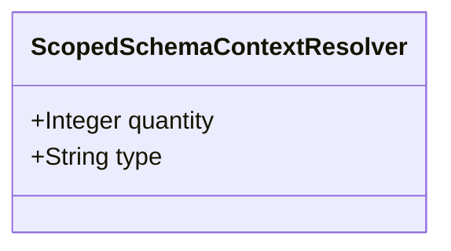

| Attribute | Specification Detail |
| :--- | :--- |
| **Issue ID** | #676 |
| **Title** | Feature 22: [BP 05 Unified AST Safety Docstring Synthesizer and Check 36 Verification Blueprint] ScopedSchemaContextResolver |
| **Type** | feature |
| **Parent Epic** | [EPIC-05-BP_05_Unified_AST_Safety_Docstring_Synthesizer_and_Check_36_Verification_Blueprint](../epics/EPIC-05-BP_05_Unified_AST_Safety_Docstring_Synthesizer_and_Check_36_Verification_Blueprint.md) (#689) |
| **Interface Type** | Physical / Structural / Internal Bus |
| **Schema Containers** | `BP_05_Unified_AST_Safety_Docstring_Synthesizer_and_Check_36_Verification_Blueprint::ScopedSchemaContextResolver` |
| **Generation Mode** | subagent |
| **Specification Source** | [schema/model.sysml](../../schema/model.sysml) |

# Feature 22: [BP 05 Unified AST Safety Docstring Synthesizer and Check 36 Verification Blueprint] ScopedSchemaContextResolver

## UML Class Diagram


```mermaid
classDiagram
    class ScopedSchemaContextResolver {
        +Integer quantity
        +String type
    }
```

## Interface Requirements
### 1. Test Data Shape
```json
{
  "$schema": "https://json-schema.org/draft/2020-12/schema",
  "title": "ScopedSchemaContextResolverPayloadSchema",
  "type": "object",
  "properties": {
    "part": {
      "type": "string",
      "const": "ScopedSchemaContextResolver"
    },
    "status": {
      "type": "string",
      "enum": ["nominal", "degraded", "fault"]
    },
    "quantity": {
      "type": "integer",
      "x-sysml-type": "Integer",
      "description": "Declared attribute quantity (Integer)",
      "default": 1
    },
    "type": {
      "type": "string",
      "x-sysml-type": "String",
      "description": "Declared attribute type (String)",
      "default": "Component"
    }
  },
  "required": [
    "part",
    "status"
  ],
  "additionalProperties": false
}
```

### 2. Validation & Constraints
Declared structural attributes, boundary ports, invariants, and allocated requirements for classifier `ScopedSchemaContextResolver`:

| AST Member Kind | Identifier | Declared Type / Direction | Default / Invariant Contract |
| :--- | :--- | :--- | :--- |
| Attribute | `quantity` | `Integer` | Default `1` |
| Attribute | `type` | `String` | Default `"Component"` |

### 3. Visual Layout & Arrangement
Structural composition and boundary topology for classifier `ScopedSchemaContextResolver` organize recursive AST context resolution across `< 380`-SLOC submodules (`./crates/compile-sysml/src/safety_docstrings/`, `./crates/deap-core/src/rust_cst/`, `./crates/deap-core/src/dart_cst/`).

### 4. Interactive Flow & States
Operational lifecycle events and discrete state transitions for `ScopedSchemaContextResolver` under `BP_05_Unified_AST_Safety_Docstring_Synthesizer_and_Check_36_Verification_Blueprint_LifecycleState`.

### Layer 1: Domain State & Signal Model
Classifier `ScopedSchemaContextResolver` encapsulates typed domain state attributes `quantity : Integer`, `type : String` alongside lossless `deap_core::sysml_cst` (`logos` + `rowan` + `salsa`) AST structures under **Contract A (100% Normative OMG SysML v2.0 + KerML 1.0 Grammar Coverage -- Zero 16-Construct Caps)** spanning 100% of the normative OMG SysML v2.0 + KerML 1.0 textual grammar (`package`/`library package`/`standard library package`, `import`, `part def`/`part`, `item def`/`item`, `attribute def`/`attribute`, `enum def`/`enum`, `port def`/`port`, `connection def`/`connection`, `interface def`/`interface`, `flow def`/`flow`, `allocation def`/`allocation`, `occurrence def`/`occurrence`, `action def`/`action`, `state def`/`state`, `calc def`/`calc`, `constraint def`/`constraint`, `requirement def`/`requirement`, `concern def`/`concern`, `use case def`/`use case`, `analysis def`/`analysis`, `verification def`/`verification`, `test case def`/`test case`, `interaction def`/`interaction`, `view def`/`view`, `viewpoint def`/`viewpoint`, `rendering def`/`rendering`, `variation`/`variant`, `metadata def`/`@Metadata`/`#user_keyword` (`#hazard`, `#risk`, `#capability`, `#rt_loop`, `#dal`, `#fls`), and KerML specialization `:`, `:>`, `:>>`, `::>`, `~`, `ISQ`/`SI`/`ScalarValues`, zero 16-construct caps).

### Layer 2: Logic & Safety State Management
Classifier `ScopedSchemaContextResolver` governs recursive part and namespace traversal (`collect_all_parts` without `.first()` fallback pollution) under **Contract B (Official Rust Compiler & `rust-analyzer` Crate Stack -- Zero Hand-Rolled Scanners)** and the **3-Layer Definition of Done (DoD)** pairing `deap_core::sysml_cst` with `ra_ap_syntax` (`ast::HasDocComments`, `ast::HasAttrs`), `ra_ap_text_edit`, and `ra_ap_line_index` to bind `<= 4`-line Tier-B/C `[REQ-*]`/`[FLS: fls_*]` docstrings and explicit `[DOC-TIER: A]` entrypoints inside `< 380`-SLOC submodules while explicitly deleting legacy hand-rolled lexical scanners (`-800+` SLOC retired).

### Layer 3: Presentation & Actuator Interface Binding
Classifier `ScopedSchemaContextResolver` binds `BP_05_ContextToDocstringGeneratorConnection` (`resolved_context_out` to `SevenSectionDocstringGenerator.schema_context_in`) and emits deterministic `ariadne`/`miette` byte-span diagnostics.

### Associated Use Cases & User Stories

#### Associated Use Cases
- None allocated (structural subsystem component)

#### Associated User Stories
- [ ] #720 - [User Story 31: Run Compile Sysml Inject Safety Docstrings](../user-stories/US-31-RunCompileSysmlInjectSafetyDocstrings.md)
- [ ] #721 - [User Story 32: Parse Source Cst Via Rust And Dart Cst](../user-stories/US-32-ParseSourceCstViaRustAndDartCst.md)
- [ ] #722 - [User Story 33: Resolve Schema Context Via Collect All](../user-stories/US-33-ResolveSchemaContextViaCollectAll.md)
- [ ] #723 - [User Story 34: Run Verify Baseline No Domain](../user-stories/US-34-RunVerifyBaselineNoDomain.md)
- [ ] #724 - [User Story 35: Tokenize Rs And Dart Files Using](../user-stories/US-35-TokenizeRsAndDartFilesUsing.md)
- [ ] #725 - [User Story 36: Run Ingest Sysml Schema Blueprint05](../user-stories/US-36-RunIngestSysmlSchemaBlueprint05.md)

## Acceptance Criteria (BDD)
- [ ] AC-01: Given valid `ScopedSchemaContextResolver` initialization inputs for `quantity` (`Integer`), `type` (`String`) (no additional constraints specified in schema), When `ScopedSchemaContextResolver` commits typed domain state, Then declared state attributes hold verified values.
- [ ] AC-02: Given malformed or out-of-domain input values for `quantity` (`Integer`), `type` (`String`), When `ScopedSchemaContextResolver` validates incoming state updates, Then `ScopedSchemaContextResolver` rejects the invalid state update and emits a diagnostic via deterministic error diagnostic output.
- [ ] AC-03: Given nominal signal arrival across `ScopedSchemaContextResolver` structural boundary, When `ScopedSchemaContextResolver` processes the declared interface transaction, Then output state conforms to the structural classifier contract.
- [ ] AC-04: Given an invalid or unrecognized interface frame across `ScopedSchemaContextResolver` structural boundary, When `ScopedSchemaContextResolver` boundary validation executes, Then `ScopedSchemaContextResolver` refuses the malformed frame via deterministic error diagnostic output and preserves prior verified state.

## Source References
Formal component specifications and normative systems engineering requirements:
- System Architecture Model: `schema/model.sysml`
- Normative Systems Engineering Standard: ISO/IEC/IEEE 15288:2023 §6.4.3 Architecture Definition Process

Component behavior and interface definitions derive from `schema/model.sysml` pursuant to ISO/IEC/IEEE 15288.
