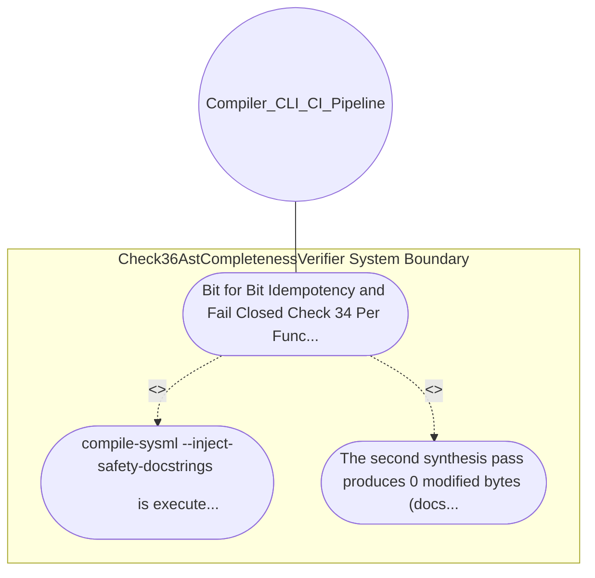

| Attribute | Specification Detail |
| :--- | :--- |
| **Issue ID** | #647 |
| **Title** | Use Case 24: Bit for Bit Idempotency and Fail Closed Check 34 Per Function Normalized Body Uniqueness |
| **Type** | use-case |
| **Primary Actor** | Compiler_CLI_CI_Pipeline |
| **Scope** | Check36AstCompletenessVerifier |
| **Level** | User Goal |
| **Generation Mode** | subagent |
| **Specification Source** | [schema/model.sysml](../../schema/model.sysml) |

# Use Case 24: Bit for Bit Idempotency and Fail Closed Check 34 Per Function Normalized Body Uniqueness

## UML Diagrams

```mermaid
graph TD
    subgraph "Check36AstCompletenessVerifier System Boundary"
        UC_Main(["Bit for Bit Idempotency and Fail Closed Check 34 Per Func..."])
        UC_Step01(["compile-sysml --inject-safety-docstrings <DIR> is execute..."])
        UC_Step02(["The second synthesis pass produces 0 modified bytes (docs..."])
    end
    Compiler_CLI_CI_Pipeline(("Compiler_CLI_CI_Pipeline")) --- UC_Main
    UC_Main -. "<<include>>" .-> UC_Step01
    UC_Main -. "<<include>>" .-> UC_Step02
```

## 1. Actors
- `Compiler_CLI_CI_Pipeline`

## 2. Preconditions
- Any Rust crate or Dart source directory enriched by compile-sysml --inject-safety-docstrings <DIR>, as well as a negative fixture containing duplicate normalized docstring bodies or missing sections.

## 3. Trigger
- compile-sysml --inject-safety-docstrings <DIR> is executed a second time and followed by ./target/release/verify-baseline . --no-domain.

## 4. Main Success Scenario
1. `Compiler_CLI_CI_Pipeline` executes `RunCompileSysmlInjectSafetyDocstrings` (`compile-sysml --inject-safety-docstrings <DIR>`) a first time, where `SevenSectionDocstringGenerator` synthesizes 7-section docstrings bound to `schema_context_in` via `ra_ap_syntax`, `ra_ap_text_edit`, `quote`, and `prettyplease`.
2. `Compiler_CLI_CI_Pipeline` executes `RunCompileSysmlInjectSafetyDocstrings` a second time on the same target directory `<DIR>`.
3. `SevenSectionDocstringGenerator` and `UnifiedSafetyDocstringSynthesizer` verify existing 7-section docblocks and produce 0 modified bytes (`docstring_idempotency_diff_bytes == 0`).
4. `Compiler_CLI_CI_Pipeline` invokes `RunVerifyBaselineNoDomain` (`./target/release/verify-baseline . --no-domain`) on `Check36AstCompletenessVerifier`, which parses all docblocks via `pulldown-cmark` and `deap_core_rust_and_dart_cst`.
5. `Check36AstCompletenessVerifier` confirms 100% 7-section completeness (`## 1. Safety Intent & Regulatory Scope` through `## 7. Realization & Traceability`) and Check 34 `seen_docblocks` per-function normalized body uniqueness, emitting `true` on `docstring_verdict_out` with exit code 0.

## 5. Alternate and Exception Flows
- 3a. Second pass of `RunCompileSysmlInjectSafetyDocstrings` mutates any byte (`docstring_idempotency_diff_bytes > 0`):
  - `UnifiedSafetyDocstringSynthesizer` returns `Result::Err` under `Invariant_REQ_0605_Under_REQ_0605_and_parametric_constraints_C_DOC_01_through_C_DOC_04_lexical_scanning_schema_context_resolution_and_forward_docstring_injection_satisfy_the_following_linear_complexity_and_idempotency_bounds`, emits an `ariadne` / `miette` idempotency diagnostic, and exits fail-closed with code 1.
- 4a. Duplicate normalized docstring body detected across distinct declarations in Check 34 `seen_docblocks`:
  - `Check36AstCompletenessVerifier` flags the copy-pasted boilerplate docblock with file and line coordinates via `miette`, sets `docstring_verdict_out` to `false`, and exits fail-closed with code 1.
- 5a. Missing or empty section among sections 1 through 7 or missing `Realises:` traceability binding:
  - `Check36AstCompletenessVerifier` rejects the declaration via `Result<T, E>`, preserves prior verified state, and terminates fail-closed with exit code 1.

## 6. Postconditions
- The second synthesis pass produces 0 modified bytes (docstring_idempotency_diff_bytes == 0), every synthesized docblock passes Check 36 7-section completeness and Check 34 seen_docblocks uniqueness, and any invalid, missing,.

## 8. Realization Matrix
| Specification Item | Type | Link / Reference |
| :--- | :--- | :--- |
| **#723** | User Story | [User Story 34: Run Verify Baseline No Domain](../user-stories/US-34-RunVerifyBaselineNoDomain.md) |
| **#678** | Feature | [Feature 21: [BP 05 Unified AST Safety Docstring Synthesizer and Check 36 Verification Blueprint] Check36AstCompletenessVerifier](../features/FEAT-21-Check36AstCompletenessVerifier.md) |

## Source References
Use case operational flows and lifecycle activity references:
- System Architecture Model: `schema/model.sysml`
- Normative Systems Engineering Standard: ISO/IEC/IEEE 29148:2018 §6.4.2 Concept of Operations

Operational use case realization and traceability links derive from `schema/model.sysml` pursuant to ISO/IEC/IEEE 29148.
