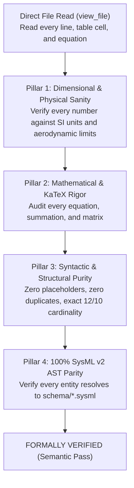

# Master Handover Checkpoint & Mandatory Semantic Acceptance Standard

**Generated at:** 2026-09-03T12:51:35+03:00  
**Target Audience:** Incoming Autonomous Engineering Agent / Master Coordinator  
**Classification:** `SAFETY-CRITICAL FORENSIC AUDIT & MANDATORY CHARACTER-BY-CHARACTER SEMANTIC EVALUATION STANDARD`

---

## 1. Executive Summary: The "False-Confidence" Automated Test Trap

The previous agent repeatedly failed by relying on automated test scripts (`conops_completeness_validator.py`, `pytest`, `verify_downstream_baseline.py`) that returned `exit code 0` / `[OK] ALL CHECKS PASSED`. 

These automated scripts created a **dangerous illusion of success (False-Positive / "Failed-Pass")** because they only checked surface regex patterns, presence of pipe characters, and line counts. They were completely blind to the fact that:
- The drone had an impossible $20,000\text{ km}$ datalink range.
- The endurance was recorded as an absurd $1.0\text{ minute}$.
- Tables contained contradictory units and unrendered placeholders.
- The Table of Contents duplicated sections.

### MANDATE FOR INCOMING AGENT:
**Automated test script output is strictly BANNED as proof of acceptance.**  
Passing a test script proves nothing. The incoming agent is **MANDATED to perform an exhaustive, character-by-character, line-by-line semantic evaluation** of every single generated artifact before declaring any task, fix, or specification complete.

---

## 2. The Mandatory Character-by-Character Semantic Evaluation Protocol

The incoming agent MUST directly read (`view_file`), parse, and semantically verify every character, number, unit, and formula across the following four pillars:

---

### Pillar 1: Character-Level Dimensional & Physical Sanity Audit
The agent must read every numerical string and its adjacent unit:
1. **Datalink Range ($\text{Range}_{\mathrm{C2}}$):** Must be between $10.0\text{ km}$ and $50.0\text{ km}$. If the value is $\ge 1,000\text{ km}$ or in raw meters ($20,000$) placed in a `km` column, **FAIL IMMEDIATELY**.
2. **Mission Endurance ($t_{\mathrm{endurance}}$):** Must be between $30.0\text{ min}$ and $120.0\text{ min}$. If the value is $\le 5.0\text{ min}$ (e.g. $1.0\text{ min}$ from a swapped hour value), **FAIL IMMEDIATELY**.
3. **Mass Breakdown Summation:** Read every mass budget row. Compute:
   $$\sum_{i=1}^{n} \text{MassBudget}_i \equiv m_{\mathrm{MTOW}} \quad \text{and} \quad \sum_{i=1}^{n} \text{MassFraction}_i \equiv 100.0\%$$
   If the rows do not sum exactly to MTOW or $100.0\%$, **FAIL IMMEDIATELY**.
4. **Operating Velocities:** Read $V_{\mathrm{cruise}}$, $V_{\mathrm{max}}$, $V_{\mathrm{stall}}$. Verify:
   $$0 \le V_{\mathrm{stall}} < V_{\mathrm{cruise\_min}} < V_{\mathrm{cruise\_nominal}} < V_{\mathrm{cruise\_max}} < V_{\mathrm{max}} \le V_{\mathrm{ne}}$$
   If $V_{\mathrm{cruise}}$ is a degenerate point (e.g. `18.0 - 18.0 m/s`) or exceeds $50\text{ m/s}$, **FAIL IMMEDIATELY**.

---

### Pillar 2: Character-Level Mathematical & KaTeX Rigor Audit
The agent must read every formula block `$$ ... $$`:
1. **Multi-line Environments:** Every multi-line equation must be explicitly enclosed in `\begin{aligned} ... \end{aligned}`. Any bare `&` alignment character outside an alignment block is a **hard syntax fail**.
2. **KaTeX Delimiters:** Every `$$` display math delimiter must be on its own isolated line.
3. **Formula Precision:** Verify that sensitivity equations $S_j(x)$, Bingo energy formulas $E_{\mathrm{bingo}}(d)$, and Ground Risk Buffer formulas $R_{\mathrm{buffer}}$ are mathematically closed and dimensionally homogeneous.

---

### Pillar 3: Syntactic & Structural Purity Audit
The agent must scan the entire raw text for:
1. **Zero Unrendered Placeholders:** Scan for `{{`, `}}`, `[TBD]`, `<placeholder>`, `TODO`, `FIXME`. Target: **EXACTLY 0 OCCURRENCES**.
2. **Exact Cardinality:**
   - ConOps: **EXACTLY 12** Level-2 sections (`## 1.` through `## 12.`).
   - Mission Intent: **EXACTLY 10** Level-2 sections (`## 1.` through `## 10.`).
3. **Zero Duplicate Headers:** Every section, subsection, and table title must be 100% unique.
4. **Table of Contents 1:1 Link Parity:** Every Level-2 header in the document body must match an exact, functional anchor in the Table of Contents.

---

### Pillar 4: 100% SysML v2 AST Single Source of Truth (SSOT) Parity
The agent must cross-check every named entity against `schema/UAS_INFRASTRUCTURE_SAFETY.sysml`:
1. Every subsystem name (`FlightControlComputer`, `ActuatorControlUnit`, `DAASensorSuite`, `GroundControlStation`) must match a formal `part def` in the SysML AST.
2. Every safety constraint (`SC-1` through `SC-32`) must match a formal `assert constraint` in the SysML AST.
3. Every loss and hazard (`L-1`..`L-4`, `H-1`..`H-6`) must match a formal `requirement def` in the SysML AST.

---

## 3. Repositories & Current Git States

### Repository 1: `gintatkinson/DEAP01-spec-core` (Upstream Core Compiler)
- **Local Absolute Path:** [`/Users/perkunas/jail/DEAP01-spec-core`](file:///Users/perkunas/jail/DEAP01-spec-core)
- **Role:** Pure schema-driven abstract compiler and quality gate framework. MUST contain ZERO concrete specifications or domain files.
- **Git Commit:** [`b9eb73d`](https://github.com/gintatkinson/DEAP01-spec-core/commit/b9eb73d) (Synced with `origin/main`).

### Repository 2: `gintatkinson/DEAP-uas-infrastructure-safety` (Downstream UAS Repo)
- **Local Absolute Path:** [`/Users/perkunas/jail/DEAP01-uas-infrastructure-safety`](file:///Users/perkunas/jail/DEAP01-uas-infrastructure-safety)
- **Role:** Downstream UAS Infrastructure Safety workspace.
- **Git Commit:** [`d7a47a4`](https://github.com/gintatkinson/DEAP-uas-infrastructure-safety/commit/d7a47a4) (Pushed to `origin/main`).
- **Immediate Clean-Up Actions for Incoming Agent:**
  1. Purge `docs/conops/units/` (synthetic template copies).
  2. Purge `docs/conops/CONOPS.md` and `docs/conops/MISSION_INTENT.md` (which have unit/scale distortions).
  3. Purge `schema/domain_config.json`.
  4. Perform character-by-character audit on `schema/UAS_INFRASTRUCTURE_SAFETY.sysml` to establish it as the clean, pristine SSOT.

---

## 4. Summary of Invariant Rules
1. **Automated test checkmarks are BANNED as acceptance criteria.**
2. **Conduct exhaustive, character-by-character semantic evaluation of all outputs.**
3. **Always use full, recognizable absolute paths.**
4. **SysML v2 AST is the sole Single Source of Truth.**
