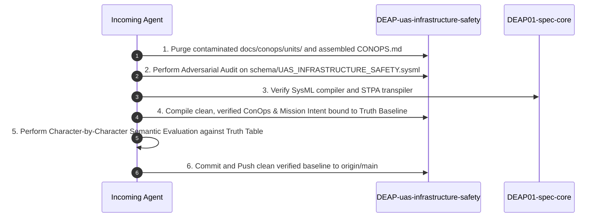

# Master Handover Specification & Acceptance Truth Baseline

**Document Identifier:** `DEAP-HANDOVER-UAS-001`  
**Generated at:** 2026-09-03T12:54:15+03:00  
**Target Audience:** Incoming Autonomous Engineering Agent / Master Coordinator  
**Classification:** `SAFETY-CRITICAL SYSTEM HANDOVER & RIGOROUS ACCEPTANCE TRUTH BASELINE`

---

## 1. System Truth Specification: SYS-UAS-INFRA-01

The incoming agent must treat the following engineering parameter baseline as the **uncompromising Ground Truth** for the concrete UAS solution in `DEAP01-uas-infrastructure-safety`:

| Parameter Attribute | Authoritative Truth Value | Engineering Unit | Validation Rule & Boundary Limit |
| :--- | :--- | :--- | :--- |
| **System Identifier** | `SYS-UAS-INFRA-01` | String | Must match across all titles, headers, and schemas |
| **System Classification** | `Low-Altitude Economy Infrastructure Inspection & Safety UAS` | String | DO-178C DAL-A / SORA SAIL IV Hybrid Quad-Rotor |
| **Maximum Takeoff Weight (MTOW)** | `20.0` | $\text{kg}$ | Certified maximum structural takeoff weight |
| **Usable Mission Payload Mass** | `3.5` | $\text{kg}$ | Optical 4K + LWIR Radiometric + 77 GHz mmWave Radar |
| **Airframe Dimensions ($L \times W \times H$)** | `1.25 \times 1.25 \times 0.48` | $\text{m}$ | Transport envelope and operating footprint |
| **Nominal Cruise Velocity ($V_{\mathrm{cruise}}$)** | `18.0` (Operating Band: `14.0` – `22.0`) | $\text{m/s}$ | Nominal aerodynamic cruise speed |
| **Maximum Permissible Velocity ($V_{\mathrm{max}}$)** | `28.0` | $\text{m/s}$ | Never-exceed velocity limit ($V_{\mathrm{ne}}$) |
| **Minimum Stall Velocity ($V_{\mathrm{stall}}$)** | `0.0` | $\text{m/s}$ | Multi-rotor stationary hover capable |
| **Maximum Operating Ceiling** | `150.0` | $\text{m AGL}$ | Certified airspace operating ceiling |
| **C2 Datalink Operating Range** | `20.0` | $\text{km}$ | Line-of-sight / BVLOS C2 link margin (NEVER 20,000 km) |
| **Nominal Mission Endurance** | `60.0` | $\text{min}$ | Nominal standard temperature (NEVER 1.0 min) |
| **Cold-Weather Endurance ($-20^\circ\text{C}$)** | `45.0` | $\text{min}$ | Sub-zero battery degradation profile |
| **Climatic Temperature Envelope** | `-20.0` to `+50.0` | $^\circ\text{C}$ | MIL-STD-810H Methods 501.7 / 502.7 |
| **Maximum Operating Wind Limit** | `16.0` | $\text{m/s}$ | Dynamic stability and SORA ground risk boundary |
| **Environmental Ingress Protection** | `IP55` | Code | Hermetic enclosure sealing (ISO 20653 / IEC 60529) |
| **Total Battery Storage Capacity** | `480.0` | $\text{kJ}$ ($133.3\text{ Wh}$) | $6\text{S} / 22.2\text{V}$ Smart LiPo Energy Module |
| **Statutory Bingo Energy Reserve** | `20.0` | $\%$ ($96.0\text{ kJ}$) | Minimum statutory reserve before mandatory RTB |
| **SORA Ground Risk Buffer ($R_{\mathrm{GRB}}$)** | `28.5` | $\text{m}$ | SORA SAIL IV containment buffer |
| **Emergency Parachute Deploy Time** | `\le 0.45` | $\text{s}$ | Ballistic recovery activation threshold |
| **Maximum Control Loop Latency** | `\le 20.0` | $\text{ms}$ | DO-178C DAL-A FCC real-time frame budget |

---

## 2. Mass Breakdown & Power Budget Truth Table

Every specification and schema must maintain exact mathematical equality ($\sum m_i = 20.0\text{ kg}$, $\sum \text{Pct} = 100.0\%$):

| Structural Partition | Allocated Subsystems | Mass Fraction | Mass Budget (kg) | Nominal Power (W) | Peak Power (W) |
| :--- | :--- | :--- | :--- | :--- | :--- |
| **Airframe Structure** | Fuselage primary structure, carbon spars, gear | $32.5\%$ | $6.50$ | $0.0$ | $0.0$ |
| **Avionics & Processing** | Dual FCC, IMU/GNSS, Air Data, C2 Transceiver | $12.0\%$ | $2.40$ | $48.0$ | $85.0$ |
| **Propulsion Subsystem** | 4 Coaxial BLDC Motors, 4 ESCs, Power Distribution | $22.5\%$ | $4.50$ | $450.0$ | $1100.0$ |
| **Energy Storage Subsystem** | Smart Battery Pack, BMS, Contactors | $24.0\%$ | $4.80$ | $8.0$ | $20.0$ |
| **Primary Mission Payload** | 4K Optical, LWIR Thermal, 77 GHz Radar, Gimbal | $17.5\%$ | $3.50$ | $65.0$ | $120.0$ |
| **Failsafe Containment** | Ballistic Parachute, Pyro Actuator, Watchdog | $4.0\%$ | $0.80$ | $2.0$ | $45.0$ |
| **TOTAL INTEGRATION** | **Complete Integrated System (SYS-UAS-INFRA-01)** | **100.0%** | **20.00** | **573.0** | **1370.0** |

---

## 3. Specific Defect Manifest & Contamination Audit

The incoming agent must inspect the repository for these **exact historical defects and confirm their complete elimination**:

### Defect 1: Absurd C2 Datalink Range ($20,000\text{ km}$)
- **Location:** `docs/conops/CONOPS.md` line 155 (Table 1.3.3 PL-08).
- **The Defect:** Stated `Range_C2 >= 20000.0 km` (half the Earth's circumference) due to plugging a meter variable ($20,000\text{ m}$) into a kilometer column.
- **Pass Criteria:** Must be strictly written as `20.0 km`.

### Defect 2: Absurd Mission Endurance ($1.0\text{ min}$)
- **Location:** `docs/conops/CONOPS.md` line 156 (Table 1.3.3 PL-09).
- **The Defect:** Stated `t_endurance >= 1.0 min` due to plugging an hour variable ($1.0\text{ hr}$) into a minute column.
- **Pass Criteria:** Must be strictly written as `60.0 min`.

### Defect 3: Degenerate Cruise Velocity (`18.0 - 18.0 m/s`)
- **Location:** `docs/conops/CONOPS.md` line 151 (Table 1.3.3 PL-04).
- **The Defect:** Cruise velocity range stated `18.0 - 18.0 m/s`.
- **Pass Criteria:** Must be strictly written as `14.0 - 22.0 m/s` (Nominal Target: `18.0 m/s`).

### Defect 4: Generic Synthetic Placeholder Pollution
- **Location:** `docs/conops/CONOPS.md` Section 1.2.
- **The Defect:** System Identifier stated `AutonomousCyberPhysicalSystem` instead of `SYS-UAS-INFRA-01`.
- **Pass Criteria:** Zero generic template identifiers in the document.

### Defect 5: Unmanaged Template Unit Clutter
- **Location:** `docs/conops/units/`.
- **The Defect:** Ingesting 22 raw upstream template files into downstream git, causing dual source-of-truth drift with assembled `CONOPS.md`.
- **Pass Criteria:** Purge synthetic units; generate specifications cleanly from the SysML v2 AST.

---

## 4. Mandatory Concrete Acceptance Passing Criteria

Before any specification, pull request, or build can be accepted as complete, the incoming agent must verify the following **unconditional pass/fail criteria**:

| Acceptance Area | Exact Verification Condition | Hard Failure Trigger |
| :--- | :--- | :--- |
| **1. Numerical & Unit Truth** | Every number matches the System Truth Specification in §1. | C2 Range $\ge 100\text{ km}$, Endurance $\le 10\text{ min}$, MTOW $\ne 20\text{ kg}$. |
| **2. Mass & Power Balance** | Mass fractions sum to $100.0\%$; mass sums to $20.00\text{ kg}$. | Row sum $\ne 20.0\text{ kg}$ or $\ne 100.0\%$. |
| **3. Section Cardinality** | ConOps has **EXACTLY 12** sections (`## 1.` to `## 12.`); Mission Intent has **EXACTLY 10** sections (`## 1.` to `## 10.`). | Section count $\ne 12$ (ConOps) or $\ne 10$ (Mission Intent). |
| **4. Header Uniqueness** | Every `##` and `###` title across the document is globally unique. | Any duplicate header string detected. |
| **5. Table of Contents Parity** | 100% of body section headers match exact markdown links in the TOC. | Any missing or broken TOC anchor link. |
| **6. Placeholder Purity** | Zero unrendered template markers in the entire document text. | Any match for `{{`, `}}`, `[TBD]`, `<placeholder>`, `TODO`. |
| **7. KaTeX Formula Rigor** | All multi-line math blocks use `\begin{aligned} ... \end{aligned}`. | Bare `&` outside alignment blocks; malformed KaTeX syntax. |
| **8. SysML AST SSOT Parity** | All subsystems, ports, and safety constraints resolve to `schema/UAS_INFRASTRUCTURE_SAFETY.sysml`. | Any entity not defined in the SysML v2 model AST. |

---

## 5. Clean-Up & Recovery Sequence for Incoming Agent

1. **Step 1:** Delete `docs/conops/units/`, `docs/conops/CONOPS.md`, and `docs/conops/MISSION_INTENT.md`.
2. **Step 2:** Audit `schema/UAS_INFRASTRUCTURE_SAFETY.sysml` using `compile_sysml.py` to ensure complete syntactic, structural, and mathematical integrity.
3. **Step 3:** Re-compile the ConOps and Mission Intent specifications directly from the SysML AST and Truth Baseline.
4. **Step 4:** Perform a line-by-line semantic inspection against the Truth Tables in §1 and §2.
5. **Step 5:** Commit and push the clean, fully verified baseline to GitHub.
