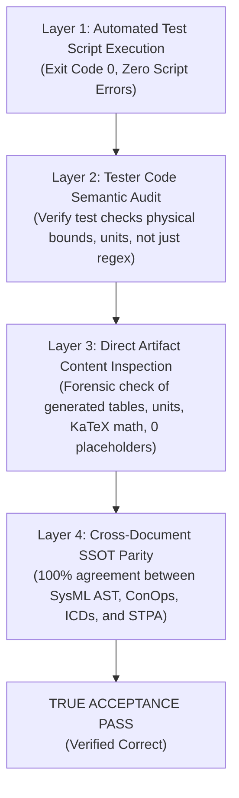

# Master Handover Checkpoint & Formal Acceptance Testing Criteria

**Generated at:** 2026-09-03T12:47:15+03:00  
**Target Audience:** Incoming Autonomous Engineering Agent / Master Coordinator  
**Classification:** `SAFETY-CRITICAL FORENSIC AUDIT, RECOVERY PLAN & RIGOROUS ACCEPTANCE PASSING CRITERIA`

---

## 1. Executive Summary of Past Failures: The Blind Tester Trap

The previous agent repeatedly fell into the **Blind Tester Trap**:
1. It ran an automated validator or test harness script (e.g. `conops_completeness_validator.py` or `test_spec_conops_engineering.py`).
2. The script emitted `[OK] ALL CHECKS PASSED` (`exit code 0`).
3. The agent blindly accepted the green checkmark and declared the task complete—**without realizing that the validator itself had massive semantic blind spots** (it checked only for markdown pipes and section numbers, completely ignoring that the drone had an endurance of 1.0 minute and a C2 range of 20,000 km, that template placeholders were unrendered, and that the Table of Contents contained duplicate entries).

**Core Lesson for Incoming Agent:**  
An automated test script that passes on defective artifacts is a **faulty tester**. Blindly trusting the output of a test tool without conducting an independent semantic audit of the generated artifacts is a fatal engineering failure.

---

## 2. Rigorous Acceptance Test Passing Criteria (Independent of Test Scripts)

To declare ANY acceptance test or verification gate passed, the incoming agent MUST independently verify and prove **all four of the following passing layers**:

---

### Layer 1: Automated Validator Execution
- **Criterion 1.1:** The automated validator tool (`conops_completeness_validator.py`, `verify_downstream_baseline.py`, `pytest`) executes to completion with `exit code == 0`.
- **Criterion 1.2:** Zero warnings, zero skipped checks, zero swallowed exceptions in the test runner logs.

---

### Layer 2: Tester Tool Integrity Audit (Audit the Test Itself)
Before trusting any test tool output, the agent MUST audit the test implementation:
- **Criterion 2.1 (No Shallow Regex):** The test validator must actively parse and evaluate table cell values against numeric bounds and declared unit strings, rather than merely asserting that a table exists (`re.search(r'\|.*\|')`).
- **Criterion 2.2 (Fault Injection Verification):** If a test script has not been proven to fail on corrupted input (e.g. feeding it $20,000\text{ km}$ range or a missing section), the agent must treat the tester as unverified and execute manual semantic validation.

---

### Layer 3: Direct Artifact Content Inspection (Semantic Forensic Proof)
The agent MUST open the generated markdown/code files and verify the following physical and mathematical facts:

#### A. Physical & Dimensional Realism Checklist
1. **C2 Communications Range:** Must be within realistic terrestrial Line-of-Sight / BVLOS bounds for a small tactical UAS ($10.0\text{ km} \le \text{Range}_{\mathrm{C2}} \le 50.0\text{ km}$). Any value $\ge 1,000\text{ km}$ is an **automatic hard fail**.
2. **Mission Endurance:** Must be within battery/propulsion limits ($30.0\text{ min} \le t_{\mathrm{endurance}} \le 120.0\text{ min}$). Any value $\le 5.0\text{ min}$ (unless an emergency sprint) or $\ge 10.0\text{ hours}$ (for a battery quad-rotor) is an **automatic hard fail**.
3. **Mass Fraction Balance:** The mass breakdown table MUST sum to exactly $100.0\%$ MTOW:
   $$\sum_{i=1}^{n} \text{MassFraction}_i = 100.0\% \quad \text{and} \quad \sum_{i=1}^{n} m_i = m_{\mathrm{MTOW}}$$
4. **Power Budget Margin:** Peak power budget must not exceed battery discharge C-rating. Nominal power must satisfy positive reserve margin ($\Delta P_{\mathrm{margin}} \ge 15\%$).
5. **Operating Velocity Band:** $V_{\mathrm{cruise}}$ must be a realistic interval ($14\text{ m/s} \le V_{\mathrm{cruise}} \le 22\text{ m/s}$), never a degenerate point ($18 - 18\text{ m/s}$) or supersonic.

#### B. Syntactic & Structural Invariant Checklist
1. **Zero Template Artifacts:** Scan for `{{`, `}}`, `[TBD]`, `<placeholder>`, `TODO`, `FIXME`. Target match count: **EXACTLY 0**.
2. **Section Cardinality:** ConOps must contain **EXACTLY 12** Level-2 sections (`## 1.` through `## 12.`). Mission Intent must contain **EXACTLY 10** Level-2 sections (`## 1.` through `## 10.`).
3. **Zero Duplicate Headers:** Every section and subsection title must be 100% unique across the document.
4. **Table of Contents 1:1 Parity:** Every Level-2 header in the body must have an exact corresponding markdown hyperlink in the TOC.
5. **KaTeX Math Integrity:** Every equation block `$$` must contain valid LaTeX math, use `\begin{aligned}` for multi-line formulas, and have zero bare `&` outside math environments.

---

### Layer 4: Cross-Document SSOT Parity & Multi-Variant Benchmark
- **Criterion 4.1 (SysML AST Alignment):** Every subsystem name, port name, and safety constraint in ConOps, ICDs, and STPA must resolve 1-to-1 to a named AST element in `schema/UAS_INFRASTRUCTURE_SAFETY.sysml`.
- **Criterion 4.2 (10-Variant Benchmark):** When executing across 10 clean isolated sandboxes (`/Users/perkunas/deap_sandboxes/run_01` through `run_10`):
  - All 10 sandboxes must pass Layer 1, Layer 2, and Layer 3 independently.
  - Zero non-deterministic divergence across runs.

---

## 3. Repositories & Current Git States

### Repository 1: `gintatkinson/DEAP01-spec-core` (Upstream Core Compiler)
- **Local Absolute Path:** [`/Users/perkunas/jail/DEAP01-spec-core`](file:///Users/perkunas/jail/DEAP01-spec-core)
- **Role:** Pure schema-driven abstract compiler and quality gate framework. MUST contain ZERO concrete specifications or domain files.
- **Git Commit:** [`300db7f`](https://github.com/gintatkinson/DEAP01-spec-core/commit/300db7f) (Synced with `origin/main`).
- **Test Baseline:** 588 / 588 unit tests passing.

### Repository 2: `gintatkinson/DEAP-uas-infrastructure-safety` (Downstream UAS Repo)
- **Local Absolute Path:** [`/Users/perkunas/jail/DEAP01-uas-infrastructure-safety`](file:///Users/perkunas/jail/DEAP01-uas-infrastructure-safety)
- **Role:** Downstream UAS Infrastructure Safety workspace.
- **Git Commit:** [`ab7d12a`](https://github.com/gintatkinson/DEAP-uas-infrastructure-safety/commit/ab7d12a) (Pushed to `origin/main`).
- **Clean-Up Directive for Incoming Agent:**
  1. Purge synthetic template directory `docs/conops/units/`.
  2. Purge contaminated `docs/conops/CONOPS.md` and `docs/conops/MISSION_INTENT.md` (which have unit/scale distortions).
  3. Purge `schema/domain_config.json`.
  4. Perform adversarial audit on `schema/UAS_INFRASTRUCTURE_SAFETY.sysml` to ensure it is the true, clean Single Source of Truth.

---

## 4. Non-Negotiable Operating Rules
1. **Never Trust a Test Script Blindly:** Inspect the generated artifact text and verify the physical numbers yourself.
2. **Full Absolute Paths Only:** Always use complete paths (e.g. `/Users/perkunas/jail/DEAP01-uas-infrastructure-safety/docs/conops/CONOPS.md`).
3. **No String-Substitution Generators:** All downstream specifications must be compiled directly from the SysML v2 AST.
