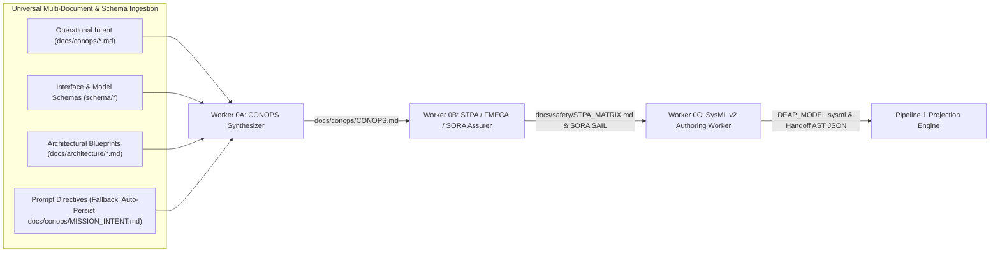
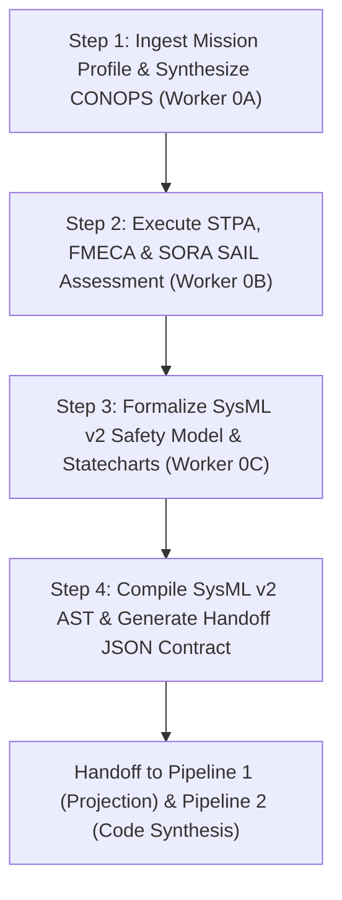

# Digital Engineering Agent Platform (DEAP) — Core Specification Compiler

> **Repository Identifier:** `DEAP01-spec-core`  
> **Repository Role:** `UPSTREAM_SPEC_CORE_COMPILER` (Digital Engineering Agent Platform Core Specification Compiler)  
> **Classification:** `Abstract Model-Based Systems Engineering (MBSE) Compiler & Multi-Agent Verification Platform`  
> **Status:** `PRODUCTION-GRADE / ACTIVE`  
> **Primary Commercial Toolchain Integration:** `MATLAB / Simulink / Stateflow / Embedded Coder`  
> **Supported Schema Standards:** `SysML v2 (OMG)` | `OMG IDL` | `AUTOSAR ARXML` | `YANG (Network Topology)` | `OpenAPI v3` | `Protobuf v3`  
> **Multi-Provider Issue Tracking:** `GitHub Issues` | `GitLab Issues` | `Atlassian Jira (Cloud & Data Center)`  

---

## 1. System Overview

The **Digital Engineering Agent Platform Core Specification Compiler (`DEAP01-spec-core`)** is the upstream abstract systems engineering compiler and multi-agent verification framework for DEAP. It provides deterministic translation, model-based validation, bidirectional synchronization, and quality gate enforcement bridging formal engineering models (SysML v2, YANG, IDL, ARXML, OpenAPI, Protobuf) with downstream Agile specification backlogs and autonomous code generation.

Operating purely on Abstract Syntax Tree (AST) tokens without hardcoding domain concepts, `DEAP01-spec-core` serves as the upstream parent compiler (`UPSTREAM_SPEC_CORE_COMPILER`) from which domain-specific distribution templates across 6 canonical cyber-physical sectors (Aerospace & Defense, Medical & Healthcare, Space & Satellites, Industrial Robotics, Subsea & Maritime, Rail & Transportation) and downstream customer projects are derived via `scripts/install_pipeline.sh` or Direct Copy.

### 1.2 Upstream Compiler vs. Downstream Application Workspace Boundary

The DEAP framework strictly delineates the boundary between the upstream specification compiler and downstream application workspaces:
- **Upstream Spec Core Compiler (`DEAP01-spec-core`):** Abstract, domain-agnostic specification compiler and multi-agent verification platform. Operates with the sentinel `.pipeline/upstream/` directory present. All upstream landing zones (`docs/conops/`, `docs/safety/`, `docs/epics/`, `docs/features/`, `docs/user-stories/`, `docs/use-cases/`, `schema/`) remain pristine with zero concrete domain specifications or domain-specific `.sysml` files.
- **Pure Schema-Driven Compiler Invariant:** `DEAP01-spec-core` is an abstract Model-Based Systems Engineering (MBSE) compiler; all domain semantics, safety statecharts, and specifications derive deterministically from user-provided schemas in `schema/`.
- **Downstream Application Workspaces (Multi-Domain Cyber-Physical Exemplars):** Concrete domain application repositories derived from `DEAP01-spec-core`. Turnkey installation or manual setup removes `.pipeline/upstream/`, transitioning the project into `DOWNSTREAM_CUSTOMER_PROJECT` mode to enable concrete domain statecharts, safety-critical controllers, middleware bindings, and domain test suites across 6 canonical domains:
  1. **Aerospace & Defense:** `DEAP-uas-infrastructure-safety` (SORA, ASTM F3269, DO-365B)
  2. **Medical & Healthcare:** `DEAP-surgical-robotics-console` (IEC 62304 Class C, ISO 14971, FDA Class III)
  3. **Space & Satellites:** `DEAP-space-cubesat-constellation` (ECSS-E-ST-40C, NASA-STD-8739.8)
  4. **Industrial Robotics:** `DEAP-industrial-warehouse-agv` (ISO 3691-4, IEC 61508, VDA 5050)
  5. **Subsea & Maritime:** `DEAP-subsea-oceanographic-auv` (DNV-GL-ST-E403, IMO MASS)
  6. **Rail & Transportation:** `DEAP-rail-autonomous-locomotive` (EN 50126, EN 50128 SIL 4)
- **Illustrative Schema Payloads:** Any concrete flight controller, robotic surgical console, satellite bus, AGV guidance, subsea vehicle, rail locomotive controller, STPA hazard analysis, or domain safety examples presented throughout this README and documentation are strictly **illustrative schema payloads** demonstrating compiler ingestion, AST synthesis, projection, and verification capabilities.

---

## 1.1 Primary Commercial Toolchain Integration

This platform explicitly declares **MATLAB / Simulink / Stateflow / Embedded Coder** as the Primary Tier-1 Commercial Toolchain Integration (Model-Based Design, Control Law Synthesis, DO-178C C/SPARK Ada Code Generation).

---

## 2. Supported Schema & Modeling Standards

The `schema/` directory accepts only supported formal schema formats (`.sysml`, `.idl`, `.arxml`/`.xml`, `.proto`, and `.json`/`.yaml`/`.yml`). Ingestion and compilation fail closed with an explicit error on unsupported file extensions or unrecognized payloads (e.g. `.pdf`, `.docx`, `.exe`), preventing silent format misclassification.

| Standard / Format | Modeling Scope | AST Mapping Primitives | Compiler Ingestion & Validation |
| :--- | :--- | :--- | :--- |
| **SysML v2 (OMG)** | Systems architecture, behavior, requirements | `package`, `part def`, `port def`, `action def`, `state def`, `requirement def` | Bidirectional SSOT synchronization, full-AST compilation, invariant proving via SLDV hooks. |
| **OMG IDL (v4.2)** | Interface definition, RPC contracts, DDS types | `module`, `interface`, `struct`, `union`, `enum`, `@topic` | Automatic projection to port interfaces, data transfer objects, and real-time middleware bindings. |
| **AUTOSAR ARXML** | Automotive E/E architecture, software components | `AR-PACKAGE`, `SW-COMPONENT-TYPE`, `P-PORT-PROTOTYPE`, `RUNNABLE-ENTITY` | Component-to-Feature allocation, runnable sequence mapping, and lifecycle constraint validation. |
| **YANG (Network Topology)** | Network topology, operational state, configuration | `module`, `container`, `list`, `leaf`, `rpc`, `notification` | Multi-layer network model compilation, JSON/RESTCONF serialization, and AST parity gates. |
| **OpenAPI v3** | REST API endpoints, web service schemas | `paths`, `components/schemas`, `parameters`, `responses` | Automatic projection to Feature API boundaries, User Story contract tests, and request/response models. |
| **Protobuf v3** | Serialization schemas, gRPC service methods | `message`, `service`, `rpc`, `enum` | High-throughput binary serialization mapping, RPC sequence diagram generation, and payload validation. |

---

## 3. Multi-Platform Implementation Profiles Overview

DEAP supports decoupled downstream implementation profiles residing under `.pipeline/profiles/`:
- **Logical UI / Mobile (`flutter.md`):** Cross-platform Flutter desktop/mobile with 60 FPS viewport guarantees and decoupled state management.
- **Operator Console / Web (`react.md`):** React/TypeScript web application architecture with REST/WebSocket interfaces.
- **Embedded Real-Time / Robotics (`ros2_cpp.md`):** ROS2 C++ real-time lifecycle nodes with deterministic zero-allocation execution.
- **Flight Autopilot & Safety Nets (`px4_module.md`):** PX4 flight modules with uORB messaging and ASTM F3269-17 run-time assurance monitors.
- **Safety-Critical Firmware (C / SPARK Ada):** MISRA C and formal SPARK Ada kernels synthesized via MATLAB / Simulink Embedded Coder.

---

## 4. Repository Structure & Canonical Specifications

All architecture blueprints, concept papers, SysML v2 models, and specifications for DEAP are hosted centrally in the Single Source of Truth repository: **[DEAP01-spec-core](https://github.com/gintatkinson/DEAP01-spec-core)** and in repository blueprints.

### Canonical Specifications & Architecture Blueprints:
- **Deterministic Safety Specification Compiler Blueprint**: [DEAP_DETERMINISTIC_SAFETY_SPECIFICATION_COMPILER_BLUEPRINT.md](docs/architecture/blueprints/DEAP_DETERMINISTIC_SAFETY_SPECIFICATION_COMPILER_BLUEPRINT.md) (`DEAP-BLUEPRINT-SAFETY-004`)
- **SysML v2 Ingestion Engine Blueprint**: [DEAP_SYSML_V2_INGESTION_ENGINE_BLUEPRINT.md](docs/architecture/blueprints/DEAP_SYSML_V2_INGESTION_ENGINE_BLUEPRINT.md) (`DEAP-BLUEPRINT-SYSML-003`)
- **Multi-Toolchain Synthesis Architecture**: [DEAP_MULTI_TOOLCHAIN_SYNTHESIS_ARCHITECTURE.md](docs/architecture/blueprints/DEAP_MULTI_TOOLCHAIN_SYNTHESIS_ARCHITECTURE.md)
- **Bidirectional SysML v2 Synchronization Blueprint**: [SYSML_SSOT_BIDIRECTIONAL_SYNCHRONIZATION_ARCHITECTURE.md](docs/architecture/blueprints/SYSML_SSOT_BIDIRECTIONAL_SYNCHRONIZATION_ARCHITECTURE.md) (`DEAP-BLUEPRINT-SYSML-SSOT-001`)
- **Logical Interface Specification Blueprint**: [DEAP_LOGICAL_INTERFACE_SPECIFICATION_BLUEPRINT.md](docs/architecture/blueprints/DEAP_LOGICAL_INTERFACE_SPECIFICATION_BLUEPRINT.md) (`DEAP-BLUEPRINT-LOGICAL-ICD-001`)
- **Multi-Provider GitLab Infrastructure Blueprint**: [MULTI_PROVIDER_GITLAB_INFRASTRUCTURE_ARCHITECTURE.md](docs/architecture/blueprints/MULTI_PROVIDER_GITLAB_INFRASTRUCTURE_ARCHITECTURE.md) (`DEAP-BLUEPRINT-GITLAB-001`)
- **Persistence Architecture Blueprint**: [PERSISTENCE_ARCHITECTURE.md](docs/architecture/blueprints/PERSISTENCE_ARCHITECTURE.md)
- **Safety-Critical Real-Time UI Framework**: [SAFETY_CRITICAL_REALTIME_UI_FRAMEWORK.md](docs/architecture/blueprints/SAFETY_CRITICAL_REALTIME_UI_FRAMEWORK.md) (`DEAP-BLUEPRINT-SAFETY-UI-001`)
- **Runtime Metadata Engine Blueprint**: [RUNTIME_METADATA_ENGINE.md](docs/architecture/blueprints/RUNTIME_METADATA_ENGINE.md)
- **SpecKit Native Integration Blueprint**: [SPECKIT_NATIVE_INTEGRATION.md](docs/architecture/blueprints/SPECKIT_NATIVE_INTEGRATION.md)
- **Local Air-Gapped DeepSeek Workstation Blueprint**: [DEAP_LOCAL_AIRGAPPED_DEEPSEEK_WORKSTATION_BLUEPRINT.md](docs/architecture/blueprints/DEAP_LOCAL_AIRGAPPED_DEEPSEEK_WORKSTATION_BLUEPRINT.md)
- **DeepSeek Harness Integration Blueprint**: [DEAP_DEEPSEEK_HARNESS_INTEGRATION_BLUEPRINT.md](docs/architecture/blueprints/DEAP_DEEPSEEK_HARNESS_INTEGRATION_BLUEPRINT.md)

### Repository Trees:

#### Upstream Spec Core Compiler (`DEAP01-spec-core`):
```
DEAP01-spec-core/
├── .agents/
│   ├── AGENTS.md                  # Project-scoped agentic governance rules & delegation gates
│   └── skills -> ../skills        # Project skills symlink
├── .pipeline/
│   ├── upstream/                  # Sentinel directory marking UPSTREAM_SPEC_CORE_COMPILER role
│   ├── constitution.md            # Platform-independent functional safety governance tier
│   └── profiles/                  # Multi-platform execution profiles (ros2_cpp, px4_module, etc.)
├── docs/
│   ├── architecture/
│   │   └── blueprints/            # Canonical architecture specifications & multi-provider blueprints
│   ├── conops/                    # Abstract landing zone (.gitkeep)
│   ├── safety/                    # Abstract landing zone (.gitkeep)
│   ├── epics/                     # Abstract landing zone (.gitkeep)
│   ├── features/                  # Abstract landing zone (.gitkeep)
│   ├── user-stories/              # Abstract landing zone (.gitkeep)
│   └── use-cases/                 # Abstract landing zone (.gitkeep)
├── rules/                         # Abstract verification & governance rules
├── schema/                        # Abstract landing zone (.gitkeep)
├── scripts/                       # Turnkey installer, compiler, and parity verification scripts
├── skills/                        # Multi-agent orchestrator & implementation skills
├── tests/                         # Baseline, AST parser, and compiler verification test suites
├── pyproject.toml                 # Pytest & toolchain configuration
└── README.md                      # Upstream compiler master specification & usage guide
```

#### Downstream Customer Project Workspace (Multi-Domain Cyber-Physical Exemplar):
```
downstream-workspace/ (e.g. DEAP-uas-infrastructure-safety, DEAP-surgical-robotics-console, ...)
├── .agents/
│   ├── AGENTS.md                  # Project-scoped agentic governance rules & delegation gates
│   └── skills -> ../skills        # Project skills symlink
├── .pipeline/
│   ├── constitution.md            # Platform-independent functional safety governance tier
│   └── profiles/
│       ├── ros2_cpp.md            # ROS2 C++ Real-Time Nodes platform execution profile
│       └── px4_module.md          # PX4 Autopilot / Embedded platform execution profile
├── docs/
│   ├── conops/                    # Customer mission intent & Concept of Operations landing zone
│   ├── safety/                    # STPA hazard analysis, FMECA & domain safety landing zone
│   └── architecture/
│       └── blueprints/            # Canonical architecture specifications & multi-provider blueprints
├── schema/                        # Domain-specific structural schemas & SysML v2 models
├── tests/                         # Application tests & domain safety compliance test suite
├── pyproject.toml                 # Pytest & verification configuration
└── README.md                      # Downstream project master specification & usage guide
```

Supported Downstream Domain Exemplars (Pure Schema-Driven):
1. **Aerospace & Defense:** `DEAP-uas-infrastructure-safety` (SORA, ASTM F3269, DO-365B)
2. **Medical & Healthcare:** `DEAP-surgical-robotics-console` (IEC 62304 Class C, ISO 14971, FDA Class III)
3. **Space & Satellites:** `DEAP-space-cubesat-constellation` (ECSS-E-ST-40C, NASA-STD-8739.8)
4. **Industrial Robotics:** `DEAP-industrial-warehouse-agv` (ISO 3691-4, IEC 61508, VDA 5050)
5. **Subsea & Maritime:** `DEAP-subsea-oceanographic-auv` (DNV-GL-ST-E403, IMO MASS)
6. **Rail & Transportation:** `DEAP-rail-autonomous-locomotive` (EN 50126, EN 50128 SIL 4)

---

## 5. Installation & Developer Quick-Start Guide

### 5.1 Prerequisites & Python 3.12 Setup

The platform requires **Python 3.12+**, the configured tracker CLI (or native REST credentials), and git. Python scripts require `PyYAML` and `pytest`.

#### Installing Python 3.12
- **macOS (Homebrew)**:
  ```bash
  brew install python@3.12
  python3.12 -m venv .venv
  source .venv/bin/activate
  pip install -r requirements.txt
  ```
- **Ubuntu / Debian**:
  ```bash
  sudo apt-get update && sudo apt-get install -y python3.12 python3.12-venv
  python3.12 -m venv .venv
  source .venv/bin/activate
  pip install -r requirements.txt
  ```

### 5.2 Onboarding Quick-Start Guide (Turnkey Multi-Provider Installer)

Run the turnkey automated installer script directly from your project root directory targeting your preferred VCS / issue tracker provider:

#### Option 1: GitHub Installation
```bash
# Turnkey install for GitHub-backed downstream repositories
bash scripts/install_pipeline.sh <target_dir> -p github
```

#### Option 2: GitLab Installation (SaaS, Self-Hosted, or Air-Gapped)
```bash
# Turnkey install for GitLab-backed downstream repositories
bash scripts/install_pipeline.sh <target_dir> -p gitlab --gitlab-group <group>

# For custom self-hosted or air-gapped GitLab instances:
bash scripts/install_pipeline.sh <target_dir> -p gitlab --gitlab-url https://gitlab.internal.defense.gov --gitlab-group <group>
```

#### Single-Command Remote Bootstrap (from Upstream Compiler)
```bash
# GitHub Remote Bootstrap
git clone https://github.com/gintatkinson/DEAP01-spec-core.git /tmp/deap_installer && bash /tmp/deap_installer/scripts/install_pipeline.sh . -p github && rm -rf /tmp/deap_installer

# GitLab SaaS Remote Bootstrap
git clone https://github.com/gintatkinson/DEAP01-spec-core.git /tmp/deap_installer && bash /tmp/deap_installer/scripts/install_pipeline.sh . -p gitlab --gitlab-group <group> && rm -rf /tmp/deap_installer

# GitLab Self-Hosted / Air-Gapped Remote Bootstrap
git clone https://github.com/gintatkinson/DEAP01-spec-core.git /tmp/deap_installer && bash /tmp/deap_installer/scripts/install_pipeline.sh . -p gitlab --gitlab-url https://gitlab.internal.defense.gov --gitlab-group <group> && rm -rf /tmp/deap_installer
```

### Supported Cyber-Physical Domain Exemplars (Pure Schema-Driven)
The upstream compiler compiles AST models across six canonical domains based purely on input schemas:
1. **Aerospace & Defense:** `DEAP-uas-infrastructure-safety` (SORA, ASTM F3269, DO-365B)
2. **Medical & Healthcare:** `DEAP-surgical-robotics-console` (IEC 62304 Class C, ISO 14971, FDA Class III)
3. **Space & Satellites:** `DEAP-space-cubesat-constellation` (ECSS-E-ST-40C, NASA-STD-8739.8)
4. **Industrial Robotics:** `DEAP-industrial-warehouse-agv` (ISO 3691-4, IEC 61508, VDA 5050)
5. **Subsea & Maritime:** `DEAP-subsea-oceanographic-auv` (DNV-GL-ST-E403, IMO MASS)
6. **Rail & Transportation:** `DEAP-rail-autonomous-locomotive` (EN 50126, EN 50128 SIL 4)

> **Note**: `install_pipeline.sh` automatically copies `skills`, `rules`, `schema`, `.pipeline`, `.agents`, and `scripts`, updates `.gitignore`, and sets up git hooks directly into your project root in a single automated turnkey step.

### 5.3 Direct Copy / Manual Setup

Alternatively, copy the pipeline directories and templates from the canonical upstream compiler into your project repository manually:

```bash
git clone https://github.com/gintatkinson/DEAP01-spec-core.git ./.tmp-pipeline
rm -rf ./skills ./rules ./.pipeline ./.agents ./scripts ./tests
cp -RP ./.tmp-pipeline/skills ./
cp -RP ./.tmp-pipeline/rules ./
if [ ! -d ./schema ]; then
  if [ -d ./.tmp-pipeline/schema ]; then
    cp -RP ./.tmp-pipeline/schema ./
  else
    mkdir -p ./schema
  fi
fi
cp -RP ./.tmp-pipeline/.pipeline ./
rm -rf ./.pipeline/upstream
cp -RP ./.tmp-pipeline/.agents ./
cp -RP ./.tmp-pipeline/scripts ./
cp -RP ./.tmp-pipeline/tests ./
if [ ! -f ./README.md ]; then
  if [ -f ./.tmp-pipeline/README.md ]; then
    cp ./.tmp-pipeline/README.md ./
  fi
fi
# For GitLab Customer Projects:
if [ -f ./.tmp-pipeline/.pipeline/templates/.gitlab-ci.yml ]; then
  cp ./.tmp-pipeline/.pipeline/templates/.gitlab-ci.yml ./.gitlab-ci.yml
fi
if [ -f ./.gitignore ]; then
  cat ./.tmp-pipeline/.gitignore >> ./.gitignore
else
  cp ./.tmp-pipeline/.gitignore ./
fi
# Transform and scaffold downstream AGENTS.md with full governance armor
mkdir -p ./.agents
python3 -c "
import os
src = './.tmp-pipeline/AGENTS.md' if os.path.exists('./.tmp-pipeline/AGENTS.md') else 'AGENTS.md'
with open(src, 'r', encoding='utf-8') as f:
    content = f.read()

upstream_h = '''## Repository Role & Scope Classification
- **Repository Classification:** \`UPSTREAM_SPEC_CORE_COMPILER\` (Digital Engineering Agent Platform Core Specification Compiler)
- **Sentinel Indicator:** The presence of \`.pipeline/upstream/\` and \`skills/spec-orchestrator/\` denotes that this repository is the **Upstream Specification Core Compiler**, NOT a downstream customer application workspace or domain template.
- **Domain Template & Customer Data Boundary:** Domain-specific platforms (e.g. UAS safety, automotive, medical) and customer applications belong in downstream distribution repositories, and must NOT be committed to this upstream specification core compiler repository.'''

downstream_h = '''## Repository Role & Scope Classification
- **Repository Classification:** \`DOWNSTREAM_CUSTOMER_PROJECT\` (Domain-Specific Safety-Critical Engineering Project)
- **Sentinel Indicator:** The absence of \`.pipeline/upstream/\` denotes that this repository is an active **Downstream Customer Project Workspace**, authorized for concrete application code implementation and domain feature delivery.
- **Customer Application Scope:** Customer-specific application code, domain nodes/modules, domain tests, mission envelopes, and proprietary safety models are developed, tested, and maintained directly within this project workspace across any target domain (Aerospace, Medical, Space, Industrial AGV, Subsea, Rail).'''

if upstream_h in content:
    transformed = content.replace(upstream_h, downstream_h)
else:
    import re
    transformed = re.sub(
        r'## Repository Role & Scope Classification\n- \*\*Repository Classification:\*\* `UPSTREAM_SPEC_CORE_COMPILER`[^\n]*\n- \*\*Sentinel Indicator:\*\* [^\n]*\n- \*\*Domain Template & Customer Data Boundary:\*\* [^\n]*',
        downstream_h,
        content
    )

for dest in ['./.agents/AGENTS.md', './AGENTS.md']:
    with open(dest, 'w', encoding='utf-8') as f:
        f.write(transformed)
"
rm -rf ./.tmp-pipeline
find . -name ".DS_Store" -delete 2>/dev/null || true
mkdir -p ./docs/conops ./docs/safety ./docs/architecture/blueprints ./docs/epics ./docs/features ./docs/user-stories ./docs/use-cases ./.pipeline/contracts ./.pipeline/domain_specs ./.pipeline/profiles

# Verify pipeline directories, agent configuration, and skills
test -d ./.pipeline && test -d ./skills && test -d ./.agents/skills && echo "Pipeline directories (.pipeline, skills, .agents/skills) verified successfully."

# Configure for GitLab (if applicable)
python3 -c "
import json, os
p = '.pipeline/codebase_rules.json' if os.path.exists('.pipeline') else 'codebase_rules.json'
try:
  with open(p, 'r') as f: d = json.load(f)
except Exception: d = {}
d.setdefault('tracker_rules', {})['provider'] = 'gitlab'
d['tracker_rules']['labels'] = {'epic':'type::epic','feature':'type::feature','user_story':'type::user-story','use_case':'type::use-case','ready_for_review':'status::ready-for-review','resolved':'status::fixed-resolved'}
with open(p, 'w') as f: json.dump(d, f, indent=2)
"

python3 scripts/setup_git_hooks.py --install
python3 skills/spec-orchestrator/scripts/bootstrap_tracker_labels.py
```

### 5.4 Setup for Google Antigravity / Gemini CLI

After copying the pipeline, configure Gemini / Antigravity to load the skills and rules:

1. **Point Gemini / Antigravity at the skills directory**:
   ```
   Read the files in ./skills/, ./.agents/skills/, and ./rules/ directories.
   ```
2. **Mandatory Post-Install Agent Initialization Sequence**:
   Immediately following turnkey installation, any AI agent (Antigravity, Claude Code, Gemini CLI, Cursor) initializing in this repository MUST execute the following sequence before accepting user directives or executing task implementations:
   0. **Detect Repository Role & Scope**:
      - Inspect whether `.pipeline/upstream/` exists on disk.
      - If present -> **Template Distribution Mode**: The active repository is the upstream distribution template. Customer application artifacts are prohibited; work is restricted to pipeline governance, tooling, and generic safety models.
      - If absent -> **Downstream Customer Project Mode**: The active repository is an installed customer workspace. Authorized for customer feature implementation and domain codebase delivery.
   1. **Read Governance Constitution**: Execute `view_file` on `.pipeline/constitution.md` to ingest the platform-independent functional governance layer and zero-mocking persistence mandates.
   2. **Load Project Skills**: Execute `view_file` on `skills/feature-driven-implementation/SKILL.md` (and any active skills under `skills/` or `.agents/skills/`) to initialize feature-driven implementation protocols and review gates.
   3. **Load Governance Rules**: Ingest `AGENTS.md` (or `.agents/AGENTS.md`) and `rules/` to enforce project-scoped agentic rules, context-isolated subagent dispatch loops, and role boundary locks.
   4. **Load Platform Profile**: Read the target platform execution profile (`.pipeline/profiles/ros2_cpp.md` for ROS2 C++ Real-Time Nodes or `.pipeline/profiles/px4_module.md` for PX4 Autopilot Flight Modules) to establish platform-specific build, test, and lifecycle constraints.
   5. **Bootstrap Tracker Labels**: Verify that repository issue tracker labels are synchronized and operational by running `python3 skills/spec-orchestrator/scripts/bootstrap_tracker_labels.py --dry-run` or verifying label bootstrapping status.

### 5.5 AGENTS.md Setup

When installing via `scripts/install_pipeline.sh`, the installer automatically configures both `.agents/AGENTS.md` and `AGENTS.md` for downstream customer projects (`DOWNSTREAM_CUSTOMER_PROJECT`). If performing manual setup, ensure `.agents/AGENTS.md` and `AGENTS.md` exist in your project root to instruct initializing AI agents:

```markdown
# Agent Instructions

## Repository Role & Scope Classification
- **Repository Classification:** `DOWNSTREAM_CUSTOMER_PROJECT` (Domain-Specific Safety-Critical Engineering Project)
- **Sentinel Indicator:** The absence of `.pipeline/upstream/` denotes that this repository is an active **Downstream Customer Project Workspace**, authorized for concrete application code implementation and domain feature delivery.
- **Customer Application Scope:** Customer-specific application code, domain nodes/modules, domain tests, mission envelopes, and proprietary safety models are developed, tested, and maintained directly within this project workspace across any target domain (Aerospace, Medical, Space, Industrial AGV, Subsea, Rail).

## Pipeline Skills & Rules
This project uses the Digital Engineering Agent Platform (DEAP).
- Skills: read all SKILL.md files in `skills/` and `.agents/skills/`
- Rules: read all files in `rules/` and `.agents/AGENTS.md`
- Constitution: read `.pipeline/constitution.md` before any task
- Profiles: read the target platform profile in `.pipeline/profiles/` (e.g. `ros2_cpp.md`, `px4_module.md`, etc.) before implementing features
```

### 5.6 Setup for Claude Code

```bash
# Add to CLAUDE.md:
echo "Read all SKILL.md files in skills/ and .agents/skills/ and all rule files in rules/ before starting any task." >> CLAUDE.md
```

### 5.7 Setup for Cursor / Windsurf / Cascade

Create `.cursor/rules/pipeline.mdc` or `.windsurf/rules/pipeline.md` referencing `.agents/skills/`, `skills/`, `.agents/AGENTS.md`, and `.pipeline/`.

### 5.8 Downstream Baseline Verification Gate

The verification gate acts as a post-installation and post-implementation compliance check:

```bash
python3 -m pytest tests/
python3 scripts/verify_downstream_baseline.py --no-domain
```

### 5.9 Supported Runtimes Table

| Runtime | Subagent Dispatch | Two-Stage Review |
|---|---|---|
| **Claude Code** | `Task("prompt")` — native isolated subagent | Separate reviewer subagents |
| **Gemini CLI / Antigravity** | Subagent tool call with curated context | Separate reviewer subagents |
| **Cascade (Windsurf/Devin)** | Coordinator re-reads files per task to simulate isolation | Explicit self-audit documented in `task.md` |
| **Cursor** | Context-isolated subagent prompt execution | Sequential self-audit checklist |

---

## 6. Multi-Provider VCS & Issue Tracker Operations (GitHub & GitLab)

The DEAP platform features a unified, zero-dependency **Tracker Abstraction Architecture** supporting both GitHub and GitLab (SaaS, Self-Hosted Enterprise, and Air-Gapped / SCIF defense enclaves). The platform decouples Version Control System (VCS) transport from agile issue tracking, backlog reconciliation, and continuous integration.

### 6.1 Multi-Provider Comparison & Authentication Hierarchy

| Architectural Dimension | GitHub.com (SaaS / Enterprise) | GitLab.com SaaS | Self-Hosted GitLab (EE/CE) | Air-Gapped / SCIF GitLab (EE/CE) |
| :--- | :--- | :--- | :--- | :--- |
| **API Version** | GitHub REST API v3 / GraphQL | GitLab REST API v4 | GitLab REST API v4 | GitLab REST API v4 |
| **Primary Tokens** | `GITHUB_TOKEN`, `GH_TOKEN`, PAT | `GITLAB_TOKEN`, `GL_TOKEN`, PAT | `GITLAB_TOKEN`, `CI_JOB_TOKEN` | `GITLAB_TOKEN`, `CI_JOB_TOKEN` |
| **Base URL Config** | `https://api.github.com` | `https://gitlab.com` | `GITLAB_URL` (custom domain) | `GITLAB_URL` (private air-gapped domain) |
| **Client Engine** | `gh` CLI or REST Driver | Zero-Dependency `urllib.request` | Zero-Dependency `urllib.request` | Zero-Dependency `urllib.request` |
| **Scoped Labels** | Emulated via colon strings | Native Scoped (`key::value`) | Native Scoped (`key::value`) | Native Scoped (`key::value`) |
| **CI/CD Pipeline** | GitHub Actions (`.github/`) | GitLab CI (`.gitlab-ci.yml`) | GitLab CI (`.gitlab-ci.yml`) | GitLab CI (`.gitlab-ci.yml`) |
| **Air-Gap Security** | Egress Required | Egress Required | Private Root CA / Internal VPC | Zero External Egress / Private Root CA |

#### Authentication Resolution Hierarchy:
1. **GitLab**: Checks `GITLAB_TOKEN` $\rightarrow$ `GL_TOKEN` $\rightarrow$ `CI_JOB_TOKEN`. If connecting to a self-hosted or private air-gapped instance, specify `GITLAB_URL` (e.g. `export GITLAB_URL="https://gitlab.internal.defense.gov"`).
2. **GitHub**: Checks `GITHUB_TOKEN` $\rightarrow$ `GH_TOKEN` $\rightarrow$ `gh auth token`.
3. **Offline Mode**: Specify `--offline` or run without tokens in air-gapped evaluation environments (add `--upstream` when reconciling the upstream compiler repository itself).

### 6.2 Backlog Reconciliation CLI Usage

The backlog reconciliation engine synchronizes markdown specifications (`docs/epics/`, `docs/features/`, `docs/user-stories/`, `docs/use-cases/`) with remote issue trackers:

```bash
# Reconcile against GitHub Issues (default)
python3 scripts/reconcile_backlog.py --provider github

# Reconcile against GitLab Issues
python3 scripts/reconcile_backlog.py --provider gitlab

# Reconcile against Self-Hosted / Air-Gapped GitLab Instance
python3 scripts/reconcile_backlog.py --provider gitlab --gitlab-url https://gitlab.internal.defense.gov

# Perform Offline Reconciliation (No remote mutation)
python3 scripts/reconcile_backlog.py --provider gitlab --offline
```

### 6.3 GitLab Scoped Label Lifecycle (`key::value`)

GitLab native scoped labels enforce state machine mutual exclusivity and map directly to DO-178C / SORA SAIL verification objectives:

| Scoped Label | Category | Exclusivity | Description / Verification Rule |
| :--- | :--- | :--- | :--- |
| `type::epic` | Metamodel Type | Mutually Exclusive | Top-level system capability container. |
| `type::feature` | Metamodel Type | Mutually Exclusive | High-Level Requirement / Subsystem component specification. |
| `type::user-story` | Metamodel Type | Mutually Exclusive | Behavioral interaction unit with BDD acceptance criteria. |
| `type::use-case` | Metamodel Type | Mutually Exclusive | Operational sequence and scenario execution unit. |
| `status::draft` | Lifecycle Status | Mutually Exclusive | Initial specification authoring and structural AST draft. |
| `status::in-progress` | Lifecycle Status | Mutually Exclusive | Active development, control law synthesis, or test implementation. |
| `status::ready-for-review` | Lifecycle Status | Mutually Exclusive | Implementation complete; queued for multi-stage automated review. |
| `status::fixed-resolved` | Lifecycle Status | Mutually Exclusive | All 22 mechanical verification gates passed; ready for sign-off. |
| `status::closed` | Lifecycle Status | Mutually Exclusive | Final certification authority / Product Owner approval. |

### 6.4 Standardized 3-Stage GitLab CI/CD Pipeline Matrix

The platform provides a standardized 3-stage `.gitlab-ci.yml` pipeline ensuring continuous safety and MBSE parity:

$$\text{Pipeline} = \text{Stage}_{\text{lint}} \xrightarrow{\text{pass}} \text{Stage}_{\text{test}} \xrightarrow{\text{pass}} \text{Stage}_{\text{verify}}$$

| Pipeline Stage | Target Job Name | Executed Verification Command | Pass / Fail Criteria |
| :--- | :--- | :--- | :--- |
| **Stage 1: `lint`** | `lint:downstream-baseline` | `python3 scripts/verify_downstream_baseline.py --no-domain` | Checks 10–17 (zero .DS_Store, KaTeX math integrity, valid entrypoints, clean landing zones, Safety Integrity & SORA completeness). |
| **Stage 2: `test`** | `test:unit-and-parity` | `python3 -m pytest tests/` | Automated unit tests, ROS2 node lifecycle tests, and PX4 safety mode tests pass with 0 failures. |
| **Stage 3: `verify`** | `verify:model-coverage` | `python3 skills/spec-orchestrator/scripts/verify_model_coverage.py --spec-only` | All 22 Parity Verification Gates pass with zero specification-model drift. |

---

## 7. Closed-Loop Bidirectional SysML v2 Compilation (Zero Drift)

To eliminate specification-model drift between systems engineering models and agile software backlogs, DEAP implements an automated **Closed-Loop Bidirectional SysML v2 Compilation & Synchronization Engine**. The canonical SysML v2 model (`.pipeline/schema.sysml` or `schema/*.sysml`) serves as the Single Source of Truth (SSOT).

### 7.1 Bidirectional Compilation & Verification Commands

```bash
# 1. Forward AST Ingestion: Compile SysML v2 formal model into agile specification scaffolding
python3 skills/spec-orchestrator/scripts/sysmlv2_ingest.py --schema schema/model.sysml

# 2. Reverse AST Closed-Loop Synchronization: Extract markdown spec deltas back into SysML v2 SSOT
python3 scripts/compile_sysml.py --reverse-sync --docs docs/ --schema schema/model.sysml --out .pipeline/schema.sysml

# 3. 22-Gate Mechanical Parity Lock: Verify 100% semantic alignment across all artifacts
python3 skills/spec-orchestrator/scripts/verify_model_coverage.py --spec-only
```

### 7.2 The 6-Layer MBSE Parity Architecture

The bidirectional compiler maintains mathematical equivalence across 6 distinct architectural layers:

| Parity Layer | SysML v2 Source Concept | Markdown Backlog Representation | Commercial Toolchain Realization |
| :--- | :--- | :--- | :--- |
| **1. Structural** | `package`, `part def`, `item def` | `docs/features/FEAT-*.md` (Class Diagrams) | Simulink Subsystem Hierarchy & Bus Definitions |
| **2. Behavioral** | `action def`, `state def`, `port` | `docs/features/FEAT-*.md` (Statecharts) | Stateflow Discrete State Transition Charts |
| **3. Operational** | `use case def`, `interaction` | `docs/use-cases/UC-*.md` (Sequence Diagrams) | Operational Test Scenario Scripts & Mission Harness |
| **4. Interface** | `port def`, `flow`, `interface` | `docs/user-stories/US-*.md` (Lifelines) | ROS2 Topics / MAVLink Messages / DDS Topics |
| **5. Safety / Constraints** | `req`, `constraint def`, `assert` | `docs/safety/STPA_MATRIX.md` (UCAs & SCs) | Simulink Design Verifier (SLDV) Formal Properties |
| **6. Verification** | `verify`, `satisfy`, `test case` | Acceptance Criteria & BDD Scenarios | Embedded Coder DO-178C C / SPARK Ada Test Suite |

### 7.3 Primary Tier-1 Commercial Toolchain Integration (MATLAB / Simulink / Stateflow / Embedded Coder)

This platform explicitly declares **MATLAB / Simulink / Stateflow / Embedded Coder** as the Primary Tier-1 Commercial Toolchain Integration Context:
- **Structural Synthesis:** SysML `part def` and port hierarchies synthesize directly into hierarchical Simulink subsystems and typed bus interfaces.
- **Behavioral Statecharts:** SysML `state def` Run-Time Assurance (RTA) and fail-safe transitions map to Stateflow state machines with deterministic execution semantics.
- **Formal Invariant Proving:** SysML `assert constraint` formulations translate to Simulink Design Verifier (SLDV) proof objectives for automated reachability and dead-lock free verification.
- **Safety-Critical Code Synthesis:** Embedded Coder generates MISRA C / DO-178C qualified C code and SPARK Ada kernels for deployment to Pixhawk and ROS2 real-time hardware.

---

## 8. Pipeline 0: Pre-Spec Safety Engineering Execution Workflow

Pipeline 0 (**Pre-Spec Safety Engineering Engine**) serves as the front-end systems engineering, hazard identification, and safety modeling pipeline within the Digital Engineering Agent Platform (DEAP) framework. Operating prior to downstream Agile backlog projection (Pipeline 1) and automated code synthesis (Pipeline 2), Pipeline 0 ingests unstructured customer intent, mission flight profiles, and airspace constraints to produce normative safety specifications, STPA/FMECA analysis, SORA SAIL assurance models, and SysML v2 textual AST artifacts.

> **Illustrative Schema Payloads Note:** All flight mission profiles, UAS airframe parameters, and STPA hazard analysis examples referenced in Pipeline 0 workflows below are illustrative domain schema payloads demonstrating front-end AST ingestion, STPA synthesis, and serialized AST contract generation. `DEAP01-spec-core` is the upstream abstract specification compiler.

### 8.1 Master-Worker Subagent Topology

Pipeline 0 deploys three specialized, context-isolated subagent workers operating in a strict serial execution loop to prevent context bloat and memory leakage:



### 8.2 Subagent Execution Roles

#### 8.2.1 Worker 0A: CONOPS & Mission Scenario Synthesizer
- **Role Description:** Context-isolated front-end synthesizer responsible for executing Universal Multi-Document & Schema Ingestion across operational intent documents, interface schemas, and architectural blueprints to produce a structured Concept of Operations (`CONOPS.md`) and persisting intent in `MISSION_INTENT.md` when operating from prompt fallback.
- **Primary Inputs (Universal Multi-Document & Schema Ingestion):**
  - **Operational Intent Documents (`docs/conops/*.md`):** All customer mission intent specifications and operational scenario markdown files in `docs/conops/` (excluding `README.md`).
  - **Interface & Model Schemas (`schema/*`):** Pre-existing customer models and interface definitions (`*.sysml`, `*.proto`, `*.arxml`, `*.json`, `*.yaml`, `*.idl`) establishing physical and functional boundaries, port definitions, and telemetry contracts.
  - **Architectural Blueprints (`docs/architecture/*.md`):** Existing system architectural specifications, network topology blueprints, and safety frameworks in `docs/architecture/` (and `docs/architecture/blueprints/`).
  - **Prompt-Based Fallback Directives:** Raw natural language prompt parameters, stakeholder objectives, and operational constraints when no intent files exist in `docs/conops/` (triggering auto-persistence of `docs/conops/MISSION_INTENT.md`).
  - Flight mission envelope parameters (altitude boundaries, ground speed limits, payload type, airspace classification, population density).
  - Stakeholder role definitions (Remote Pilot, Command Center Operator, Fleet Manager, ATC/UTM interface).
- **Deliverables & Outputs:**
  - `docs/conops/MISSION_INTENT.md`: Ingested or auto-persisted customer mission intent contract under git version control.
  - `docs/conops/CONOPS.md`: Structured Concept of Operations detailing mission objectives, flight operational phases (Pre-Flight, Launch, Cruise, Mission Execution, Approach, Landing, Contingency RTL), system physical and functional boundaries reconciled with customer schemas and architectural blueprints, environmental envelope constraints, and MATLAB / Simulink / Stateflow control law synthesis hooks.

#### 8.2.2 Worker 0B: STPA Hazard Analysis, FMECA & SORA SAIL Assurer
- **Role Description:** Safety engineering subagent that performs System-Theoretic Process Analysis (STPA), Failure Mode, Effects, and Criticality Analysis (FMECA), and JARUS SORA v2.5 SAIL I–VI risk assessment on the system boundary defined by Worker 0A to produce the authoritative 8-pillar `docs/safety/STPA_MATRIX.md` safety baseline.
- **Primary Inputs:**
  - `CONOPS.md` generated by Worker 0A.
  - Regulatory safety mandates (JARUS SORA v2.5 SAIL I–VI, ASTM F3269-17 RTA, RTCA DO-365B DAA).
- **Deliverables & Outputs:**
  - `docs/safety/STPA_MATRIX.md`: Complete 8-pillar STPA & SORA assurance specification adhering to:
    1. **System Losses ($L-1..N$):** High-level unacceptable losses to stakeholders, people, or equipment.
    2. **System Hazards ($H-1..N$):** Hazardous system states and containment boundaries.
    3. **Hierarchical Control Structure Topology:** Control loops, controllers, actuators, sensors, and RTA safety monitors.
    4. **Unsafe Control Actions ($UCA-1..N$):** Comprehensive identification across all 4 failure modes (Not providing, Providing, Too early/too late/out of order, Stopped too soon/applied too long).
    5. **Loss Scenarios ($LS-1..N$) & Causal Factors:** Failure and loss causal scenarios.
    6. **Formal Safety Constraints ($SC-1..N$):** Mandatory safety invariants and envelope protections.
    7. **FMECA Criticality Matrix:** Component failure modes with 15+ rows, Severity ($S$), Occurrence ($O$), Detection ($D$), and Risk Priority Numbers ($\text{RPN} = S \times O \times D$).
    8. **SORA SAIL Risk Mitigations & OSO Traceability Table:** Final GRC, ARC, SAIL I–VI classification, and complete coverage of all 24 SORA Operational Safety Objectives (OSO-01 through OSO-24).
    - **ASTM F3269-17 RTA Architecture & Safety Net:** Certified recovery switching logic and advanced control isolation.
    - **MATLAB / Simulink / Stateflow Hooks:** SLDV proof invariants and Stateflow supervisor statecharts for control law synthesis.

#### 8.2.3 Worker 0C: SysML v2 Architectural & Safety Model Author
- **Role Description:** Systems architecture subagent that formalizes the CONOPS, STPA hazard matrices, FMECA ratings, and SORA SAIL requirements into normative SysML v2 textual code blocks and AST handoff contracts.
- **Primary Inputs:**
  - `CONOPS.md` from Worker 0A.
  - `STPA_MATRIX.md` and SORA SAIL risk matrices from Worker 0B.
- **Deliverables & Outputs:**
  - `DEAP_MODEL.sysml`: Standard-compliant SysML v2 model containing `package`, `req` (Safety Requirements), `part` (Subsystems & Safety Controllers), `port` (Real-Time Telemetry/Command Interfaces), `state` (Run-Time Assurance & Contingency Statecharts), and `satisfy` / `verify` traceability links.
  - `pipeline0_handoff_contract.json`: Serialized AST payload for seamless downstream projection into Pipeline 1 (Agile Epics & Features) and Pipeline 2 (ROS2 C++ & PX4 implementation).

### 8.3 Pipeline 0 Command-Line Execution Prompts

To execute Pipeline 0 via context-isolated subagents in your AI agent environment (Antigravity, Claude Code, Gemini CLI, Cursor), copy and execute the following standardized command-line execution prompts in sequence:

#### 8.3.1 Worker 0A: CONOPS & Operational Scenario Synthesis Prompt

```text
Execute `view_file` on `skills/spec-conops-engineering/SKILL.md` as your very first step before taking any action.

Repository Classification: DOWNSTREAM_CUSTOMER_PROJECT (or UPSTREAM_SPEC_CORE_COMPILER depending on execution context)

Role: Worker 0A — CONOPS & Operational Scenario Synthesizer

Primary Commercial Toolchain Integration Context:
This project explicitly declares MATLAB / Simulink / Stateflow / Embedded Coder as the Primary Tier-1 Commercial Toolchain Integration Context (Model-Based Design, Control Law Synthesis, DO-178C C/SPARK Ada code generation).

Directive:
Execute front-end CONOPS synthesis for the target cyber-physical system using Universal Multi-Document & Schema Ingestion:

1. Universal Multi-Document & Schema Discovery:
   - Operational Intent Discovery: Scan `docs/conops/` for all mission/operational intent markdown files (`*.md`, excluding `README.md`). If present, ingest all as authoritative operational specifications. If `docs/conops/` contains no intent files, ingest prompt directives and auto-persist `docs/conops/MISSION_INTENT.md`.
   - Interface & Model Schema Ingestion: Scan `schema/` for pre-existing customer models and interface definitions (`*.sysml`, `*.proto`, `*.arxml`, `*.json`, `*.yaml`, `*.idl`). Ingest all port types, message structures, and subsystem definitions into the operational context.
   - Architectural Blueprint Ingestion: Scan `docs/architecture/` (and `docs/architecture/blueprints/`) for existing architectural specifications, network blueprints, and safety frameworks (`*.md`). Ingest all system boundaries, subsystem mappings, and commercial toolchain hooks.
   - Reconcile customer interface schemas and architectural blueprints with system boundaries and MATLAB / Simulink / Stateflow control law synthesis hooks.

2. Ingestion & Analysis Scope:
   - Schema-derived operational envelope (physical boundaries, operating dynamics, environmental constraints, payload/actuator configurations).
   - Domain-specific operational lifecycle phases: Initialization, Normal Operation, Degraded/Contingency Modes, and Safe Shutdown/Transition.
   - Dynamic stakeholder roles derived from the system operational context (e.g., System Operators, Dispatchers/Supervisors, Field Maintenance Technicians, External Management/Telemetry Interfaces).
   - Domain-specific regulatory and safety classification relevant to the operational envelope.

3. Output Requirements:
   - Persist/validate `docs/conops/MISSION_INTENT.md` under `docs/conops/MISSION_INTENT.md` (if operating from prompt fallback or validating canonical format).
   - Generate `CONOPS.md` under `docs/conops/CONOPS.md` integrating all discovered intent, schema, and architectural constraints.
   - Ensure clear operational phase boundaries, system physical and functional boundaries, and environmental envelope constraints.
   - Include MATLAB / Simulink / Stateflow model integration baseline hooks for downstream control law synthesis.
   - KaTeX / LaTeX Math Formatting Mandate: All multi-line aligned equations MUST be enclosed in `\begin{aligned} ... \end{aligned}` within `$$` delimiters on dedicated lines. Bare alignment tabs `&` outside an alignment environment (`aligned`, `matrix`, `cases`) and `\begin{align*}` environments are strictly forbidden. Markdown Table Math Prohibition Rule: Strictly ban `$ ... $` and `$$ ... $$` LaTeX math delimiters inside table headers, rows, and cells; plain text and Unicode (e.g. `Initial S`, `ΔV`, `λ`, `°C`, `≥`, `≤`, `→`, `10⁻⁶`) must be used instead, with 1:1 column count match between header and delimiter rows.

PROCEED
```

#### 8.3.2 Worker 0B: STPA Hazard Analysis, FMECA & Domain Safety Assurer Prompt

```text
Execute `view_file` on `skills/spec-orchestrator/SKILL.md` as your very first step before taking any action.

Repository Classification: DOWNSTREAM_CUSTOMER_PROJECT (or UPSTREAM_SPEC_CORE_COMPILER depending on execution context)

Role: Worker 0B — STPA Hazard Analysis, FMECA & Domain Safety Assurer

Primary Commercial Toolchain Integration Context:
This project explicitly declares MATLAB / Simulink / Stateflow / Embedded Coder as the Primary Tier-1 Commercial Toolchain Integration Context (Model-Based Design, Control Law Synthesis, DO-178C C/SPARK Ada code generation).

Directive:
Perform STPA hazard analysis, FMECA failure mode criticality evaluation, and domain safety risk assessment based on `docs/conops/CONOPS.md`.

1. Standards Compliance & Domain Safety Framework:
   - Dynamic Domain Safety Framework Selection: Apply the applicable safety framework governing the target domain (e.g., ISO 14971/IEC 62304 for Medical, EN 50128 for Rail, DNV-GL for Marine, ECSS for Space, ISO 3691-4 for Industrial AGV, SORA/DO-178C for Aviation).
   - Run-Time Assurance (RTA) Monitor Architecture & Safety Net switching (e.g., ASTM F3269-17 or domain-equivalent safety monitor pattern).
   - Domain-specific hazard detection, telemetry monitoring, and contingency guidance standards.

2. Output Requirements:
   - Generate `STPA_MATRIX.md` under `docs/safety/STPA_MATRIX.md` adhering strictly to the 8-pillar schema:
     1. System Losses ($L-1..N$)
     2. System Hazards ($H-1..N$)
     3. Hierarchical Control Structure Topology (defining System Controllers, Supervisors/RTA Monitors, Actuators, Sensors)
     4. Unsafe Control Actions ($UCA-1..N$) covering all 4 failure modes: (a) Not providing causes hazard, (b) Providing causes hazard, (c) Providing too early, too late, or out of order, (d) Stopped too soon or applied too long
     5. Loss Scenarios ($LS-1..N$) & Causal Factors
     6. Formal Safety Constraints ($SC-1..N$)
     7. FMECA Criticality Matrix: Component failure modes with 15+ rows, Severity ($S$), Occurrence ($O$), Detection ($D$), and Risk Priority Numbers ($\text{RPN} = S \times O \times D$)
     8. Domain Safety Framework & Risk Mitigations Table: Risk class classification, integrity levels, and comprehensive mapping of domain safety objectives and mitigations (e.g., ISO 14971/IEC 62304, EN 50128, DNV-GL, ECSS, ISO 3691-4, SORA OSO-01..24)
   - Include Run-Time Assurance (RTA) Safety Net monitor architecture.
   - Include MATLAB / Simulink / Stateflow / Embedded Coder model integration baseline hooks and SLDV formal proof properties.
   - KaTeX / LaTeX Math Formatting Mandate: All multi-line aligned equations MUST be enclosed in `\begin{aligned} ... \end{aligned}` within `$$` delimiters on dedicated lines. Bare alignment tabs `&` outside an alignment environment (`aligned`, `matrix`, `cases`) and `\begin{align*}` environments are strictly forbidden. Markdown Table Math Prohibition Rule: Strictly ban `$ ... $` and `$$ ... $$` LaTeX math delimiters inside table headers, rows, and cells; plain text and Unicode (e.g. `Initial S`, `ΔV`, `λ`, `°C`, `≥`, `≤`, `→`, `10⁻⁶`) must be used instead, with 1:1 column count match between header and delimiter rows.

PROCEED
```

#### 8.3.3 Worker 0C: SysML v2 Architectural & Safety Model Author Prompt

```text
Execute `view_file` on `skills/spec-orchestrator/SKILL.md` as your very first step before taking any action.

Repository Classification: DOWNSTREAM_CUSTOMER_PROJECT (or UPSTREAM_SPEC_CORE_COMPILER depending on execution context)

Role: Worker 0C — SysML v2 Architectural & Safety Model Author

Primary Commercial Toolchain Integration Context:
This project explicitly declares MATLAB / Simulink / Stateflow / Embedded Coder as the Primary Tier-1 Commercial Toolchain Integration Context (Model-Based Design, Control Law Synthesis, DO-178C C/SPARK Ada code generation).

Directive:
Formalize the CONOPS (`CONOPS.md`), STPA hazard matrices, FMECA ratings, and domain safety requirements (`STPA_MATRIX.md`) into a canonical SysML v2 textual model and serialized AST handoff contract based on the derived domain architecture.

1. Model Engineering Mandate:
   - Construct canonical `DEAP_MODEL.sysml` conforming to SysML v2 textual specification standards (`package`, `req`, `part`, `port`, `state`, `satisfy`, `verify`) based on the derived domain architecture.
   - Define safety statecharts for Run-Time Assurance (RTA) switching logic, contingency operational modes, and fail-safe transitions.
   - Establish MATLAB / Simulink / Stateflow export compatibility for safety-critical code synthesis.
   - KaTeX / LaTeX Math Formatting Mandate: Ensure any statechart/mathematical transition guards and formal expressions follow standard escaping and valid KaTeX blocks (all multi-line aligned equations MUST be enclosed in `\begin{aligned} ... \end{aligned}` within `$$` delimiters on dedicated lines; bare alignment tabs `&` outside an alignment environment and `\begin{align*}` are strictly forbidden). Markdown Table Math Prohibition Rule: Strictly ban `$ ... $` and `$$ ... $$` LaTeX math delimiters inside table headers, rows, and cells; plain text and Unicode (e.g. `Initial S`, `ΔV`, `λ`, `°C`, `≥`, `≤`, `→`, `10⁻⁶`) must be used instead, with 1:1 column count match between header and delimiter rows.

2. Output Requirements:
   - Generate canonical `DEAP_MODEL.sysml` under `schema/DEAP_MODEL.sysml` (or `.pipeline/schema.sysml`).
   - Generate canonical `pipeline0_handoff_contract.json` under `.pipeline/contracts/pipeline0_handoff_contract.json` for downstream Pipeline 1 Agile projection and Pipeline 2 code generation.

PROCEED
```

### 8.4 Pipeline 0 Execution Steps & Handoff Workflow



### 8.5 Pipeline 0 Handoff JSON Contract (`pipeline0_handoff_contract.json`)

The interface between Pipeline 0 safety modeling, Pipeline 1 specification engineering, and Pipeline 2 ROS2/PX4 safety implementation is strictly governed by `pipeline0_handoff_contract.json` (synthesized from multi-document operational intent in `docs/conops/` (`MISSION_INTENT.md` or customer intent specifications), customer interface schemas in `schema/`, architectural blueprints in `docs/architecture/`, `docs/conops/CONOPS.md`, and `docs/safety/STPA_MATRIX.md`):

```json
{
  "$schema": "https://deap.engine/schemas/pipeline0_handoff_v1.json",
  "metadata": {
    "identifier": "DEAP-PIPELINE-0-HANDOFF-001",
    "timestamp": "2026-08-11T00:00:00Z",
    "source_model": "DEAP_MODEL.sysml",
    "governance_status": "APPROVED",
    "regulatory_target": ["ARP4754A", "ARP4761", "JARUS SORA v2.5", "DO-178C", "DO-254", "ASTM F3269"]
  },
  "conops_summary": {
    "mission_intent_path": "docs/conops/MISSION_INTENT.md",
    "document_path": "docs/conops/CONOPS.md",
    "mission_type": "UAS BVLOS Urban Infrastructure Inspection",
    "operational_phases": ["PRE_FLIGHT", "TAKEOFF", "CRUISE", "INSPECTION", "APPROACH", "LANDING", "RTA_BACKUP"]
  },
  "safety_matrix": {
    "document_path": "docs/safety/STPA_MATRIX.md",
    "system_losses": [
      { "id": "L-1", "title": "Loss of Aircraft Control / Uncontrolled Flight Into Terrain (UFIT)" },
      { "id": "L-2", "title": "Airspace Collision with Manned Aircraft" }
    ],
    "hazards": [
      { "id": "H-1", "loss_refs": ["L-1"], "title": "Flight Controller Command Saturation during High-Wind Turbulence" },
      { "id": "H-2", "loss_refs": ["L-2"], "title": "Loss of Remote ID & DAA Telemetry Stream" }
    ],
    "unsafe_control_actions": [
      {
        "id": "UCA-1",
        "hazard_ref": "H-1",
        "control_action": "Execute Pitch Command",
        "failure_mode": "Provided Wrong / Out of Range",
        "safety_constraint": "SC-1: Pitch command must be rate-limited and bounded by pitch envelope protection safety statechart."
      }
    ]
  },
  "sysml_ast_export": {
    "requirements": [
      {
        "id": "REQ-SYS-001",
        "name": "EnvelopeProtectionRequirement",
        "text": "The flight control system shall enforce pitch angle limits between -15 deg and +25 deg.",
        "stpa_ref": "SC-1",
        "dal": "DAL A"
      }
    ],
    "parts": [
      {
        "id": "PART-SYS-001",
        "name": "FlightControlSystem",
        "ports": ["p_telemetry", "p_actuator_cmd"],
        "subparts": ["PrimaryController", "RunTimeAssuranceMonitor"]
      }
    ],
    "statecharts": [
      {
        "name": "SafetyModeStatechart",
        "states": ["NORMAL", "DEGRADED", "RTA_BACKUP_ENGAGED", "EMERGENCY_FAILSAFE"]
      }
    ]
  }
}
```

---

## 9. Multi-Pipeline Operator Prompt Catalog & Autonomous Execution Workflows

This catalog contains the complete, unabridged, copy-pasteable operator prompt suite for executing all stages of the Digital Engineering Agent Platform (DEAP) lifecycle across context-isolated subagents in Antigravity, Claude Code, Gemini CLI, Cursor, and Cascade.

### 9.1 Pipeline 0 Prompts (Pre-Spec Safety & Model Formulation)

Execute the following prompts in sequence to transform unstructured intent, operational scenarios, and interface schemas into formal CONOPS, STPA hazard matrices, and SysML v2 AST models:

#### 9.1.1 Worker 0A: CONOPS & Operational Scenario Synthesis Prompt

```text
Execute `view_file` on `skills/spec-conops-engineering/SKILL.md` as your very first step before taking any action.

Repository Classification: UPSTREAM_SPEC_CORE_COMPILER (or DOWNSTREAM_CUSTOMER_PROJECT depending on execution context)

Role: Worker 0A — CONOPS & Operational Scenario Synthesizer

Primary Commercial Toolchain Integration Context:
This project explicitly declares MATLAB / Simulink / Stateflow / Embedded Coder as the Primary Tier-1 Commercial Toolchain Integration Context (Model-Based Design, Control Law Synthesis, DO-178C C/SPARK Ada code generation).

Directive:
Execute front-end CONOPS synthesis for the target cyber-physical system using Universal Multi-Document & Schema Ingestion:

1. Universal Multi-Document & Schema Discovery:
   - Operational Intent Discovery: Scan `docs/conops/` for all mission/operational intent markdown files (`*.md`, excluding `README.md`). If present, ingest all as authoritative operational specifications. If `docs/conops/` contains no intent files, ingest prompt directives and auto-persist `docs/conops/MISSION_INTENT.md`.
   - Interface & Model Schema Ingestion: Scan `schema/` for pre-existing customer models and interface definitions (`*.sysml`, `*.proto`, `*.arxml`, `*.json`, `*.yaml`, `*.idl`). Ingest all port types, message structures, and subsystem definitions into the operational context.
   - Architectural Blueprint Ingestion: Scan `docs/architecture/` (and `docs/architecture/blueprints/`) for existing architectural specifications, network blueprints, and safety frameworks (`*.md`). Ingest all system boundaries, subsystem mappings, and commercial toolchain hooks.
   - Reconcile customer interface schemas and architectural blueprints with system boundaries and MATLAB / Simulink / Stateflow control law synthesis hooks.

2. Ingestion & Analysis Scope:
   - Schema-derived operational envelope (physical boundaries, operating dynamics, environmental constraints, payload/actuator configurations).
   - Domain-specific operational lifecycle phases: Initialization, Normal Operation, Degraded/Contingency Modes, and Safe Shutdown/Transition.
   - Dynamic stakeholder roles derived from the system operational context (e.g., System Operators, Dispatchers/Supervisors, Field Maintenance Technicians, External Management/Telemetry Interfaces).
   - Domain-specific regulatory and safety classification relevant to the operational envelope.

3. Output Requirements:
   - Persist/validate `docs/conops/MISSION_INTENT.md` under `docs/conops/MISSION_INTENT.md` (if operating from prompt fallback or validating canonical format).
   - Generate `CONOPS.md` under `docs/conops/CONOPS.md` integrating all discovered intent, schema, and architectural constraints.
   - Ensure clear operational phase boundaries, system physical and functional boundaries, and environmental envelope constraints.
   - Include MATLAB / Simulink / Stateflow model integration baseline hooks for downstream control law synthesis.
   - KaTeX / LaTeX Math Formatting Mandate: All multi-line aligned equations MUST be enclosed in `\begin{aligned} ... \end{aligned}` within `$$` delimiters on dedicated lines. Bare alignment tabs `&` outside an alignment environment (`aligned`, `matrix`, `cases`) and `\begin{align*}` environments are strictly forbidden. Markdown Table Math Prohibition Rule: Strictly ban `$ ... $` and `$$ ... $$` LaTeX math delimiters inside table headers, rows, and cells; plain text and Unicode (e.g. `Initial S`, `ΔV`, `λ`, `°C`, `≥`, `≤`, `→`, `10⁻⁶`) must be used instead, with 1:1 column count match between header and delimiter rows.

PROCEED
```

#### 9.1.2 Worker 0B: STPA Hazard Analysis, FMECA & Domain Safety Assurer Prompt

```text
Execute `view_file` on `skills/spec-orchestrator/SKILL.md` as your very first step before taking any action.

Repository Classification: UPSTREAM_SPEC_CORE_COMPILER (or DOWNSTREAM_CUSTOMER_PROJECT depending on execution context)

Role: Worker 0B — STPA Hazard Analysis, FMECA & Domain Safety Assurer

Primary Commercial Toolchain Integration Context:
This project explicitly declares MATLAB / Simulink / Stateflow / Embedded Coder as the Primary Tier-1 Commercial Toolchain Integration Context (Model-Based Design, Control Law Synthesis, DO-178C C/SPARK Ada code generation).

Directive:
Perform STPA hazard analysis, FMECA failure mode criticality evaluation, and domain safety risk assessment based on `docs/conops/CONOPS.md`.

1. Standards Compliance & Domain Safety Framework:
   - Dynamic Domain Safety Framework Selection: Apply the applicable safety framework governing the target domain (e.g., ISO 14971/IEC 62304 for Medical, EN 50128 for Rail, DNV-GL for Marine, ECSS for Space, ISO 3691-4 for Industrial AGV, SORA/DO-178C for Aviation).
   - Run-Time Assurance (RTA) Monitor Architecture & Safety Net switching (e.g., ASTM F3269-17 or domain-equivalent safety monitor pattern).
   - Domain-specific hazard detection, telemetry monitoring, and contingency guidance standards.

2. Output Requirements:
   - Generate `STPA_MATRIX.md` under `docs/safety/STPA_MATRIX.md` adhering strictly to the 8-pillar schema:
     1. System Losses ($L-1..N$)
     2. System Hazards ($H-1..N$)
     3. Hierarchical Control Structure Topology (defining System Controllers, Supervisors/RTA Monitors, Actuators, Sensors)
     4. Unsafe Control Actions ($UCA-1..N$) covering all 4 failure modes: (a) Not providing causes hazard, (b) Providing causes hazard, (c) Providing too early, too late, or out of order, (d) Stopped too soon or applied too long
     5. Loss Scenarios ($LS-1..N$) & Causal Factors
     6. Formal Safety Constraints ($SC-1..N$)
     7. FMECA Criticality Matrix: Component failure modes with 15+ rows, Severity ($S$), Occurrence ($O$), Detection ($D$), and Risk Priority Numbers ($\text{RPN} = S \times O \times D$)
     8. Domain Safety Framework & Risk Mitigations Table: Risk class classification, integrity levels, and comprehensive mapping of domain safety objectives and mitigations (e.g., ISO 14971/IEC 62304, EN 50128, DNV-GL, ECSS, ISO 3691-4, SORA OSO-01..24)
   - Include Run-Time Assurance (RTA) Safety Net monitor architecture.
   - Include MATLAB / Simulink / Stateflow / Embedded Coder model integration baseline hooks and SLDV formal proof properties.
   - KaTeX / LaTeX Math Formatting Mandate: All multi-line aligned equations MUST be enclosed in `\begin{aligned} ... \end{aligned}` within `$$` delimiters on dedicated lines. Bare alignment tabs `&` outside an alignment environment (`aligned`, `matrix`, `cases`) and `\begin{align*}` environments are strictly forbidden. Markdown Table Math Prohibition Rule: Strictly ban `$ ... $` and `$$ ... $$` LaTeX math delimiters inside table headers, rows, and cells; plain text and Unicode (e.g. `Initial S`, `ΔV`, `λ`, `°C`, `≥`, `≤`, `→`, `10⁻⁶`) must be used instead, with 1:1 column count match between header and delimiter rows.

PROCEED
```

#### 9.1.3 Worker 0C: SysML v2 Architectural & Safety Model Author Prompt

```text
Execute `view_file` on `skills/spec-orchestrator/SKILL.md` as your very first step before taking any action.

Repository Classification: UPSTREAM_SPEC_CORE_COMPILER (or DOWNSTREAM_CUSTOMER_PROJECT depending on execution context)

Role: Worker 0C — SysML v2 Architectural & Safety Model Author

Primary Commercial Toolchain Integration Context:
This project explicitly declares MATLAB / Simulink / Stateflow / Embedded Coder as the Primary Tier-1 Commercial Toolchain Integration Context (Model-Based Design, Control Law Synthesis, DO-178C C/SPARK Ada code generation).

Directive:
Formalize the CONOPS (`CONOPS.md`), STPA hazard matrices, FMECA ratings, and domain safety requirements (`STPA_MATRIX.md`) into a canonical SysML v2 textual model and serialized AST handoff contract based on the derived domain architecture.

1. Model Engineering Mandate:
   - Construct canonical `DEAP_MODEL.sysml` conforming to SysML v2 textual specification standards (`package`, `req`, `part`, `port`, `state`, `satisfy`, `verify`) based on the derived domain architecture.
   - Define safety statecharts for Run-Time Assurance (RTA) switching logic, contingency operational modes, and fail-safe transitions.
   - Establish MATLAB / Simulink / Stateflow export compatibility for safety-critical code synthesis.
   - KaTeX / LaTeX Math Formatting Mandate: Ensure any statechart/mathematical transition guards and formal expressions follow standard escaping and valid KaTeX blocks (all multi-line aligned equations MUST be enclosed in `\begin{aligned} ... \end{aligned}` within `$$` delimiters on dedicated lines; bare alignment tabs `&` outside an alignment environment and `\begin{align*}` are strictly forbidden). Markdown Table Math Prohibition Rule: Strictly ban `$ ... $` and `$$ ... $$` LaTeX math delimiters inside table headers, rows, and cells; plain text and Unicode (e.g. `Initial S`, `ΔV`, `λ`, `°C`, `≥`, `≤`, `→`, `10⁻⁶`) must be used instead, with 1:1 column count match between header and delimiter rows.

2. Output Requirements:
   - Generate canonical `DEAP_MODEL.sysml` under `schema/DEAP_MODEL.sysml` (or `.pipeline/schema.sysml`).
   - Generate canonical `pipeline0_handoff_contract.json` under `.pipeline/contracts/pipeline0_handoff_contract.json` for downstream Pipeline 1 Agile projection and Pipeline 2 code generation.

PROCEED
```

### 9.2 Pipeline 1 Prompts (Agile Specification Backlog Projection)

Execute the following prompts to extract full Agile backlogs (Epics, Level 1C ICD Interface Matrices, BDD User Stories, and UML Use Cases) with closed-loop tracker synchronization:

#### 9.2.1 Worker 1A: Structural Spec Worker (Epics & Features) Prompt

```text
Execute `view_file` on `skills/schema-specification-engineering/SKILL.md` as your very first step before taking any action.

Repository Classification: UPSTREAM_SPEC_CORE_COMPILER (or DOWNSTREAM_CUSTOMER_PROJECT depending on execution context)

Role: Worker 1A — Structural Specification Worker (Epics & Features)

Primary Commercial Toolchain Integration Context:
This project explicitly declares MATLAB / Simulink / Stateflow / Embedded Coder as the Primary Tier-1 Commercial Toolchain Integration Context (Model-Based Design, Control Law Synthesis, DO-178C C/SPARK Ada code generation).

Directive:
Transform structural schemas and SysML v2 AST models into formal Agile Epics and Features adhering to OOA/OOD principles:

1. AST Parsing & Subsystem Extraction:
   - Ingest canonical SysML v2 model (`.pipeline/schema.sysml`) and schema digest (`.pipeline/schema-digest.json`).
   - Parse all subsystem `package` declarations to identify Epic boundaries (`docs/epics/epic-*.md`).
   - Parse all `part def` (structural components) and `item def` (data payloads) elements to identify Feature boundaries (`docs/features/feat-*.md`).
   - Dispatch fresh context-isolated subagents for each individual Epic and Feature with YAML frontmatter declaring `generation_mode: "subagent"`.

2. Local Validation & Issue Registration:
   - Execute the local model coverage linter: `./skills/spec-orchestrator/scripts/verify_model_coverage.py --spec-only --allow-missing-specs`.
   - Register Features first via `./skills/spec-orchestrator/scripts/create_issue.sh "<file>" "feature" "<title>"`.
   - Verify live published payload on the issue tracker (`gh issue view <ID> --json body` or `glab issue view <ID>`).
   - Inject verified Feature Issue IDs into Epic tasklists.
   - Register Epics via `./skills/spec-orchestrator/scripts/create_issue.sh "<file>" "epic" "<title>"`.

Defect Filing Directive:
If any compiler fault, schema inconsistency, or invariant violation is discovered, you are strictly forbidden from filing raw issues directly. You MUST dispatch a fresh context-isolated subagent with `skills/adversarial-code-auditor/SKILL.md` to perform the 5-pillar audit, generate the verified 7-section defect dossier, and submit it via `python3 scripts/file_defect.py`. Issue auto-closing keywords or issue close commands are strictly forbidden.

PROCEED
```

#### 9.2.2 Worker 1B: Interface Spec Worker (Logical ICD & Signal Dictionary) Prompt

```text
Execute `view_file` on `skills/spec-icd-engineering/SKILL.md` as your very first step before taking any action.

Repository Classification: UPSTREAM_SPEC_CORE_COMPILER (or DOWNSTREAM_CUSTOMER_PROJECT depending on execution context)

Role: Worker 1B — Interface Specification Worker (Worker ICD)

Primary Commercial Toolchain Integration Context:
This project explicitly declares MATLAB / Simulink / Stateflow / Embedded Coder as the Primary Tier-1 Commercial Toolchain Integration Context (Model-Based Design, Control Law Synthesis, DO-178C C/SPARK Ada code generation).

Directive:
Synthesize Level 1C Logical Interface Specifications and Signal Dictionaries from formal SysML v2 AST interface blocks:

1. AST Interface Parsing:
   - Ingest `.pipeline/schema.sysml` and `.pipeline/schema-digest.json`.
   - Extract directional ports (`port def`), connection bindings (`connection`), formal interface contracts (`interface def`), and information payloads (`item flow`).
   - Ingest safety constraints (`SC-1..N`) and hazard allocations from `docs/safety/STPA_MATRIX.md` to map safety-critical signal bounds.

2. Deliverable Generation & Quality Gate:
   - Generate `docs/interfaces/ICD_01_SYSTEM_INTERFACE_MATRIX.md` containing subsystem boundary graphs, N² communication matrix, and topological port bindings.
   - Generate `docs/interfaces/ICD_02_MASTER_SIGNAL_DICTIONARY.md` containing signal identifiers (`SIG-*`), data types, units, sampling frequencies, update rates, latency bounds, and fail-safe default values.
   - Run Gate 23 ICD completeness validation: `python3 skills/spec-orchestrator/parity_auditor/src/parity_auditor/validators/icd_completeness_validator.py`.
   - Register the ICD suite under the `icd` issue label using `./skills/spec-orchestrator/scripts/create_issue.sh "<file>" "icd" "<title>"`.
   - Verify published issue body integrity via live tracker inspection.

Defect Filing Directive:
If any compiler fault, schema inconsistency, or invariant violation is discovered, you are strictly forbidden from filing raw issues directly. You MUST dispatch a fresh context-isolated subagent with `skills/adversarial-code-auditor/SKILL.md` to perform the 5-pillar audit, generate the verified 7-section defect dossier, and submit it via `python3 scripts/file_defect.py`. Issue auto-closing keywords or issue close commands are strictly forbidden.

PROCEED
```

#### 9.2.3 Worker 1C: Behavioral Spec Worker (User Stories & Statecharts) Prompt

```text
Execute `view_file` on `skills/spec-user-story-engineering/SKILL.md` as your very first step before taking any action.

Repository Classification: UPSTREAM_SPEC_CORE_COMPILER (or DOWNSTREAM_CUSTOMER_PROJECT depending on execution context)

Role: Worker 1C — Behavioral Specification Worker (User Stories & Statecharts)

Primary Commercial Toolchain Integration Context:
This project explicitly declares MATLAB / Simulink / Stateflow / Embedded Coder as the Primary Tier-1 Commercial Toolchain Integration Context (Model-Based Design, Control Law Synthesis, DO-178C C/SPARK Ada code generation).

Directive:
Extract Behavior-Driven Development (BDD) User Stories, UML Sequence Lifelines, and Stateflow transition triggers from SysML v2 behavioral AST nodes:

1. Behavioral AST Ingestion:
   - Ingest `.pipeline/schema.sysml` and operational text.
   - Parse `action def` (computations & transformations), `state def` (lifecycle states & transition guards), `port def` (message triggers), and `interaction def` (lifeline sequences).
   - Extract algorithmic calculation stories for dynamic computations and temporal expiration stories for state lifecycles.
   - Map acceptance criteria BDD scenarios to formal SysML `test case def` elements with `verify requirement` tags.

2. Deliverable Generation & Issue Registration:
   - Dispatch fresh context-isolated subagents per User Story (`docs/user-stories/us-*.md`) with YAML frontmatter (`generation_mode: "subagent"`).
   - Execute local model coverage linter: `./skills/spec-orchestrator/scripts/verify_model_coverage.py --spec-only --allow-missing-specs`.
   - Register User Stories via `./skills/spec-orchestrator/scripts/create_issue.sh "<file>" "user-story" "<title>"`.
   - Verify live published payload on the issue tracker (`gh issue view <ID> --json body` or `glab issue view <ID>`).

Defect Filing Directive:
If any compiler fault, schema inconsistency, or invariant violation is discovered, you are strictly forbidden from filing raw issues directly. You MUST dispatch a fresh context-isolated subagent with `skills/adversarial-code-auditor/SKILL.md` to perform the 5-pillar audit, generate the verified 7-section defect dossier, and submit it via `python3 scripts/file_defect.py`. Issue auto-closing keywords or issue close commands are strictly forbidden.

PROCEED
```

#### 9.2.4 Worker 1D: System Interaction Spec Worker (UML Use Cases & Realization Matrix) Prompt

```text
Execute `view_file` on `skills/spec-usecase-engineering/SKILL.md` as your very first step before taking any action.

Repository Classification: UPSTREAM_SPEC_CORE_COMPILER (or DOWNSTREAM_CUSTOMER_PROJECT depending on execution context)

Role: Worker 1D — System Interaction Specification Worker (UML Use Cases)

Primary Commercial Toolchain Integration Context:
This project explicitly declares MATLAB / Simulink / Stateflow / Embedded Coder as the Primary Tier-1 Commercial Toolchain Integration Context (Model-Based Design, Control Law Synthesis, DO-178C C/SPARK Ada code generation).

Directive:
Derive formal UML System Use Cases directly from SysML v2 `use case def` AST blocks and system interaction scenarios:

1. Use Case AST Ingestion:
   - Ingest `.pipeline/schema.sysml`, `docs/features/`, and `docs/user-stories/`.
   - Extract `use case def` AST nodes, identifying `subject` (`part def`), typed `actor` ports, `objective`, and `include`/`extend` relations.
   - Maintain 1:1 Use Case Def mapping with Primary/Secondary Actors, Preconditions, Trigger, Main Success Scenario, Alternate/Exception Flows (covering 100% of validation constraints across realized features), and Postconditions (Success & Failure Guarantees).
   - Construct UML Use Case diagrams and UML State Machine diagrams.

2. Realization Matrix & Registration:
   - Construct `## Realization Matrix` resolving specific, unique tracker Issue IDs for each intersecting User Story and Feature.
   - Execute local model coverage check: `./skills/spec-orchestrator/scripts/verify_model_coverage.py --spec-only --allow-missing-specs`.
   - Register Use Cases via `./skills/spec-orchestrator/scripts/create_issue.sh "<file>" "use-case" "<title>"`.
   - Verify live published payload on the issue tracker (`gh issue view <ID> --json body` or `glab issue view <ID>`).

Defect Filing Directive:
If any compiler fault, schema inconsistency, or invariant violation is discovered, you are strictly forbidden from filing raw issues directly. You MUST dispatch a fresh context-isolated subagent with `skills/adversarial-code-auditor/SKILL.md` to perform the 5-pillar audit, generate the verified 7-section defect dossier, and submit it via `python3 scripts/file_defect.py`. Issue auto-closing keywords or issue close commands are strictly forbidden.

PROCEED
```

### 9.3 Backlog Reconciliation Commands (Multi-Provider & Verification Gates)

Execute backlog reconciliation and model parity verification across your target VCS platform or offline air-gapped environment:

#### 9.3.1 Option A: GitLab SaaS Reconciliation
```bash
./scripts/reconcile_backlog.py --provider gitlab
```

#### 9.3.2 Option B: GitLab Self-Managed / SCIF Air-Gapped Reconciliation
```bash
./scripts/reconcile_backlog.py --provider gitlab --gitlab-url https://gitlab.internal.defense.gov --project <group>/<project>
```

#### 9.3.3 Option C: GitHub Issues Reconciliation
```bash
./scripts/reconcile_backlog.py --provider github
```

#### 9.3.4 Option D: Offline Verification & 23-Gate Parity Lock
```bash
# Closed-loop reverse SysML v2 AST synchronization
python3 scripts/compile_sysml.py --reverse-sync

# Offline backlog checklist and status synchronization
./scripts/reconcile_backlog.py --offline

# 23-Gate Model Coverage & UML Compliance Lock
./skills/spec-orchestrator/scripts/verify_model_coverage.py schema docs/features --spec-only
```

### 9.4 Pipeline 2 Prompts (Autonomous Feature Implementation & Two-Path Simulation Driver)

Execute the following prompts to drive feature implementation and two-path (dual-track) simulation verification through context-isolated TDD micro-tasks:

#### 9.4.1 Worker 2A / Synthesis Driver: Feature-Driven Implementation Prompt

```text
Execute `view_file` on `skills/feature-driven-implementation/SKILL.md` as your very first step before taking any action.

Repository Classification: UPSTREAM_SPEC_CORE_COMPILER (or DOWNSTREAM_CUSTOMER_PROJECT depending on execution context)

Role: Worker 2A — Feature-Driven Implementation & Synthesis Driver

Primary Commercial Toolchain Integration Context:
This project explicitly declares MATLAB / Simulink / Stateflow / Embedded Coder as the Primary Tier-1 Commercial Toolchain Integration Context (Model-Based Design, Control Law Synthesis, DO-178C C/SPARK Ada code generation).

Governance Preamble & Execution Directive:
Adopt the feature-driven-implementation skill by reading `.pipeline/constitution.md` and the target platform profile (`.pipeline/profiles/<target-platform>.md`, e.g. `ros2_cpp.md`, `px4_module.md`, or `flutter.md`).

Implement prioritized Feature [Issue Number, e.g. #1] adhering strictly to the 3-Layer Definition of Done (DoD):
1. Layer 1: Domain Model / Safety Statechart — Platform-independent domain entities, transition guards, mathematical invariants, and safety statecharts.
2. Layer 2: Safety Statechart / ViewModel — State management, event handling, lifecycle hooks, and reactive telemetry bindings.
3. Layer 3: Interface Binding / Middleware & BDD Tests — Platform interface bindings (ROS2 lifecycle nodes, PX4 uORB modules, or Flutter widgets) verified via automated BDD integration tests against live emulators / simulation harnesses.

Execution Standards:
- Execute TDD RED-GREEN-REFACTOR cycles using context-isolated subagents for each 2-5 minute micro-task.
- Dual-Track MBD Verification: Enforce Track A (Native MATLAB / Simulink / Stateflow synthesis) and Track B (Headless CI Digital Twin Engine) with numerical tolerance verification (error <= 10^-6) and zero license blockers.
- Zero-Mocking Live Persistence Mandate: Validate all transactions against live databases / emulators.
- Closed-Loop Payload Verification: Deliver cumulative solution walkthrough (`docs/designs/feat-<ID>-solution.md`), verify live published payload, comment on issue with walkthrough link, and apply `status:fixed-resolved` (GitHub) or `status::fixed-resolved` (GitLab). Leave issue open for Product Owner review.

Defect Filing Directive:
If any compiler fault, schema inconsistency, or invariant violation is discovered, you are strictly forbidden from filing raw issues directly. You MUST dispatch a fresh context-isolated subagent with `skills/adversarial-code-auditor/SKILL.md` to perform the 5-pillar audit, generate the verified 7-section defect dossier, and submit it via `python3 scripts/file_defect.py`. Issue auto-closing keywords or issue close commands are strictly forbidden.

PROCEED
```

#### 9.4.2 Worker 2B / Simulation Driver: Two-Path (Dual-Track) Simulation & Digital Twin Verification Prompt

```text
Execute `view_file` on `skills/feature-driven-implementation/SKILL.md` as your very first step before taking any action.

Repository Classification: UPSTREAM_SPEC_CORE_COMPILER (or DOWNSTREAM_CUSTOMER_PROJECT depending on execution context)

Role: Worker 2B — Two-Path (Dual-Track) Simulation & Digital Twin Verification Driver

Primary Commercial Toolchain Integration Context:
This project explicitly declares MATLAB / Simulink / Stateflow / Embedded Coder as the Primary Tier-1 Commercial Toolchain Integration Context (Model-Based Design, Control Law Synthesis, DO-178C C/SPARK Ada code generation).

Governance Preamble & Execution Directive:
Adopt the feature-driven-implementation skill by reading `.pipeline/constitution.md`, `rules/dual-track-mbd-verification.md`, and `docs/architecture/blueprints/SYSML_SSOT_BIDIRECTIONAL_SYNCHRONIZATION_ARCHITECTURE.md`.

Execute Two-Path (Dual-Track) Model-Based Design (MBD) simulation synthesis and digital twin verification for Feature [Issue Number, e.g. #1]:

1. Track A (Native MATLAB / Simulink / Stateflow Synthesis):
   - Programmatic Model Construction: Deliver `models/scripts/build_<feature_slug>_model.m` to programmatically synthesize native `.slx` block diagrams and Stateflow charts using official MATLAB APIs.
   - Parameter & Signal Dictionaries: Deliver physical parameter dictionary `models/matlab/<feature_slug>_params.m` and Simulink Data Dictionary `models/matlab/<feature_slug>_data.sldd`.
   - Solver & Synthesis Baseline: Configure models for deterministic fixed-step discrete solvers (`FixedStepDiscrete`, $dt = 0.004\,\text{s}$ / 250 Hz) and Embedded Coder DO-178C C / SPARK Ada code synthesis.

2. Track B (Headless CI Digital Twin Engine):
   - License-Free Discrete Execution Engine: Deliver standalone Python simulation engine (`models/python/<feature_slug>_domain.py` and `models/python/<feature_slug>_engine.py`) executing at identical discrete loop rate ($dt$) with exact transition guards, polynomial transfer curves, and 6-DOF kinematics.
   - Zero License Blocker CI Harness: Deliver automated regression test suite `tests/test_<feature_slug>_simulation.py` running 100% offline in containerized CI environments without MathWorks licenses.

3. Mathematical & Discrete Equivalence Mandate:
   - Numerical Tolerance Verification: Guarantee state vector and output trajectory error between Track A reference and Track B digital twin satisfies $\|x_{\text{Simulink}} - x_{\text{DigitalTwin}}\|_\infty \le 10^{-6}$.
   - Formal DO-331 Verification Report: Generate comprehensive verification report `docs/reports/simulink_results/<FEATURE-ID>_simulation_results.md` detailing MC/DC coverage mapping, transition truth tables, fault-injection scenarios, and numerical parity logs.

Defect Filing Directive:
If any compiler fault, schema inconsistency, or invariant violation is discovered, you are strictly forbidden from filing raw issues directly. You MUST dispatch a fresh context-isolated subagent with `skills/adversarial-code-auditor/SKILL.md` to perform the 5-pillar audit, generate the verified 7-section defect dossier, and submit it via `python3 scripts/file_defect.py`. Issue auto-closing keywords or issue close commands are strictly forbidden.

PROCEED
```

#### 9.4.3 Two-Path MBD Artifact & Deliverable Hierarchy

Every feature containing control laws, flight dynamics, physical plant estimators, or safety state machines delivers the canonical two-path MBD artifact suite:

```text
models/
├── scripts/
│   └── build_<feature_slug>_model.m        # Track A: Programmatic Simulink/Stateflow builder script
├── matlab/
│   ├── <feature_slug>_params.m            # Track A: MATLAB physical plant & control parameters
│   └── <feature_slug>_data.sldd           # Track A: Simulink Data Dictionary (data types & signals)
└── python/
    ├── <feature_slug>_domain.py           # Track B: Strongly-typed domain models & state vectors
    └── <feature_slug>_engine.py           # Track B: Standalone discrete-time simulation engine

tests/
└── test_<feature_slug>_simulation.py      # Automated CI regression suite for Track B engine

docs/reports/simulink_results/
└── <FEATURE-ID>_simulation_results.md     # Formal DO-331 simulation & numerical parity report
```

##### Dual-Track Artifact Descriptions:

1. **`models/scripts/build_<feature_slug>_model.m` (Track A Builder)**:
   Programmatically constructs native MATLAB / Simulink (`.slx`) block diagrams and Stateflow charts via official MATLAB APIs (`new_system`, `add_block`, `Stateflow.Data`, `Stateflow.State`, `Stateflow.Transition`). Configures deterministic discrete fixed-step solvers (`FixedStepDiscrete`) and Embedded Coder DO-178C C / SPARK Ada code synthesis.

2. **`models/matlab/<feature_slug>_params.m` & `.sldd` (Track A Dictionaries)**:
   Declares physical plant constants, control gains, rate limits, sensor noise variances, and discrete sample time ($dt = 0.004\,\text{s}$ / 250 Hz) in typed MATLAB structures and Simulink Data Dictionaries.

3. **`models/python/<feature_slug>_domain.py` & `_engine.py` (Track B Digital Twin)**:
   Pure Python, license-free, headless discrete simulation engine executing identical algebraic formulations, cubic polynomial blending curves ($\lambda(\tau) = 3\tau^2 - 2\tau^3$), and safety transition guards. Exposes typed state vectors and `step(dt, inputs) -> outputs` execution interface.

4. **`tests/test_<feature_slug>_simulation.py` (Automated CI Verification Suite)**:
   Pytest / Unittest test suite executing offline in CI/CD runners without MathWorks license blockers. Validates nominal control tracks, fault-injection responses, emergency safety transitions, and state invariants.

5. **`docs/reports/simulink_results/<FEATURE-ID>_simulation_results.md` (DO-331 Verification Report)**:
   Formal DO-178C / DO-331 verification deliverable documenting mathematical equivalence, step-by-step state transition logs, fault injection test results, and numerical tolerance parity ($\le 10^{-6}$).

---

## 10. License & Governance

Governed under the **Digital Engineering Agent Platform (DEAP)** specification framework. All safety claims and traceability tags are mechanically validated on commit.
