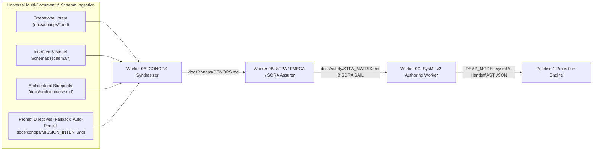
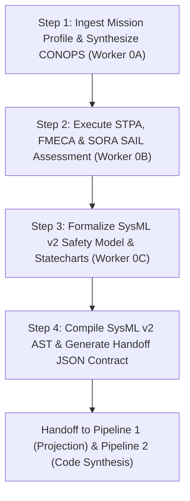

# Digital Engineering Agent Platform (DEAP) — Core Specification Compiler

> **Repository Identifier:** `DEAP-spec-core`  
> **Repository Role:** `UPSTREAM_SPEC_CORE_COMPILER` (Digital Engineering Agent Platform Core Specification Compiler)  
> **Classification:** `Abstract Model-Based Systems Engineering (MBSE) Compiler & Multi-Agent Verification Platform`  
> **Status:** `PRODUCTION-GRADE / ACTIVE`  
> **Primary Commercial Toolchain Integration:** `MATLAB / Simulink / Stateflow / Embedded Coder`  
> **Supported Schema Standards:** `SysML v2 (OMG)` | `OMG IDL` | `AUTOSAR ARXML` | `YANG (Network Topology)` | `OpenAPI v3` | `Protobuf v3`  
> **Multi-Provider Issue Tracking:** `GitHub Issues` | `GitLab Issues` | `Atlassian Jira (Cloud & Data Center)`  

---

## 1. System Overview

The **Digital Engineering Agent Platform Core Specification Compiler (`DEAP-spec-core`)** is the upstream abstract systems engineering compiler and multi-agent verification framework for DEAP. It provides deterministic translation, model-based validation, bidirectional synchronization, and quality gate enforcement bridging formal engineering models (SysML v2, YANG, IDL, ARXML, OpenAPI, Protobuf) with downstream Agile specification backlogs and autonomous code generation.

Operating purely on Abstract Syntax Tree (AST) tokens without hardcoding domain concepts, `DEAP-spec-core` serves as the upstream parent compiler from which domain-specific distribution templates (e.g. `DEAP-uas-infrastructure-safety`, automotive, medical, and telecommunications) and downstream customer projects are derived via `scripts/install_pipeline.sh`.

---

## 1.1 Primary Commercial Toolchain Integration

This platform explicitly declares **MATLAB / Simulink / Stateflow / Embedded Coder** as the Primary Tier-1 Commercial Toolchain Integration (Model-Based Design, Control Law Synthesis, DO-178C C/SPARK Ada Code Generation).

---

## 2. Supported Schema & Modeling Standards

| Standard / Format | Modeling Scope | AST Mapping Primitives | Compiler Ingestion & Validation |
| :--- | :--- | :--- | :--- |
| **SysML v2 (OMG)** | Systems architecture, behavior, requirements | `package`, `part def`, `port def`, `action def`, `state def`, `requirement def` | Bidirectional SSOT synchronization, full-AST compilation, invariant proving via SLDV hooks. |
| **OMG IDL (v4.2)** | Interface definition, RPC contracts, DDS types | `module`, `interface`, `struct`, `union`, `enum`, `@topic` | Automatic projection to port interfaces, data transfer objects, and real-time middleware bindings. |
| **AUTOSAR ARXML** | Automotive E/E architecture, software components | `AR-PACKAGE`, `SW-COMPONENT-TYPE`, `P-PORT-PROTOTYPE`, `RUNNABLE-ENTITY` | Component-to-Feature allocation, runnable sequence mapping, and lifecycle constraint validation. |
| **YANG (Network Topology)** | Network topology, operational state, configuration | `module`, `container`, `list`, `leaf`, `rpc`, `notification` | Multi-layer network model compilation, JSON/RESTCONF serialization, and AST parity gates. |
| **OpenAPI v3** | REST API endpoints, web service schemas | `paths`, `components/schemas`, `parameters`, `responses` | Automatic projection to Feature API boundaries, User Story contract tests, and request/response models. |
| **Protobuf v3** | Serialization schemas, gRPC service methods | `message`, `service`, `rpc`, `enum` | High-throughput binary serialization mapping, RPC sequence diagram generation, and payload validation. |

---

## 3. Multi-Platform Implementation Profiles Overview

DEAP supports decoupled downstream implementation profiles residing under `.pipeline/profiles/`:
- **Logical UI / Mobile (`flutter.md`):** Cross-platform Flutter desktop/mobile with 60 FPS viewport guarantees and decoupled state management.
- **Operator Console / Web (`react.md`):** React/TypeScript web application architecture with REST/WebSocket interfaces.
- **Embedded Real-Time / Robotics (`ros2_cpp.md`):** ROS2 C++ real-time lifecycle nodes with deterministic zero-allocation execution.
- **Flight Autopilot & Safety Nets (`px4_module.md`):** PX4 flight modules with uORB messaging and ASTM F3269-17 run-time assurance monitors.
- **Safety-Critical Firmware (C / SPARK Ada):** MISRA C and formal SPARK Ada kernels synthesized via MATLAB / Simulink Embedded Coder.

---

## 4. Repository Structure & Canonical Specifications

All architecture blueprints, concept papers, SysML v2 models, and specifications for DEAP are hosted centrally in the Single Source of Truth repository: **[DEAP-spec-core](https://github.com/gintatkinson/DEAP-spec-core)** and in repository blueprints.

### Canonical Specifications & Architecture Blueprints:
- **Multi-Provider GitLab Infrastructure Blueprint**: [MULTI_PROVIDER_GITLAB_INFRASTRUCTURE_ARCHITECTURE.md](docs/architecture/blueprints/MULTI_PROVIDER_GITLAB_INFRASTRUCTURE_ARCHITECTURE.md) (`DEAP-BLUEPRINT-GITLAB-001`)
- **Bidirectional SysML v2 Synchronization Blueprint**: [SYSML_SSOT_BIDIRECTIONAL_SYNCHRONIZATION_ARCHITECTURE.md](docs/architecture/blueprints/SYSML_SSOT_BIDIRECTIONAL_SYNCHRONIZATION_ARCHITECTURE.md) (`DEAP-BLUEPRINT-SYSML-SSOT-001`)
- **UAS Infrastructure Safety Concept Paper**: [DEAP_UAS_INFRASTRUCTURE_SAFETY_CONCEPT_PAPER.md](docs/architecture/blueprints/DEAP_UAS_INFRASTRUCTURE_SAFETY_CONCEPT_PAPER.md)
- **SysML v2 Textual Safety Model**: [DEAP_SYSML_V2_SAFETY_MODEL_SPECIFICATION.sysml](https://github.com/gintatkinson/DEAP-spec-core/blob/main/docs/architecture/blueprints/DEAP_SYSML_V2_SAFETY_MODEL_SPECIFICATION.sysml)
- **SysML v2 MATLAB Export Blueprint**: [DEAP_SYSML_V2_SAFETY_MODEL_SPECIFICATION.md](https://github.com/gintatkinson/DEAP-spec-core/blob/main/docs/architecture/blueprints/DEAP_SYSML_V2_SAFETY_MODEL_SPECIFICATION.md)
- **Safety-Critical Real-Time UI Framework**: [SAFETY_CRITICAL_REALTIME_UI_FRAMEWORK.md](https://github.com/gintatkinson/DEAP-spec-core/blob/main/docs/architecture/blueprints/SAFETY_CRITICAL_REALTIME_UI_FRAMEWORK.md)
- **Master Specification Sitemap**: [DEAP_SPECIFICATIONS_SITEMAP.md](https://github.com/gintatkinson/DEAP-spec-core/blob/main/docs/architecture/DEAP_SPECIFICATIONS_SITEMAP.md)
- **Standardized Operator Usage Prompt Catalog**: [OPERATOR_PROMPT_CATALOG.md](docs/OPERATOR_PROMPT_CATALOG.md)

### Repository Tree:
```
DEAP-uas-infrastructure-safety/
├── .agents/
│   └── AGENTS.md                  # Project-scoped agentic governance rules & delegation gates
├── .pipeline/
│   ├── constitution.md            # Platform-independent functional safety governance tier
│   └── profiles/
│       ├── ros2_cpp.md            # ROS2 C++ Real-Time Nodes platform execution profile
│       └── px4_module.md          # PX4 Autopilot Flight Module platform execution profile
├── docs/
│   ├── conops/                    # Customer mission intent & Concept of Operations landing zone
│   ├── safety/                    # STPA hazard analysis, FMECA & SORA SAIL landing zone
│   └── architecture/
│       └── blueprints/            # Canonical architecture specifications & multi-provider blueprints
├── schema/
│   └── README.md                  # Input structural schemas & SysML v2 models guide
├── tests/
│   └── test_uas_safety_governance.py      # Automated UAS safety compliance & MBSE test suite
├── pyproject.toml                 # Pytest & verification configuration
└── README.md                      # Platform master specification & usage guide
```

---

## 5. Installation & Developer Quick-Start Guide

### 5.1 Prerequisites & Python 3.12 Setup

The platform requires **Python 3.12+**, the configured tracker CLI (or native REST credentials), and git. Python scripts require `PyYAML` and `pytest`.

#### Installing Python 3.12
- **macOS (Homebrew)**:
  ```bash
  brew install python@3.12
  python3.12 -m venv .venv
  source .venv/bin/activate
  pip install -r requirements.txt
  ```
- **Ubuntu / Debian**:
  ```bash
  sudo apt-get update && sudo apt-get install -y python3.12 python3.12-venv
  python3.12 -m venv .venv
  source .venv/bin/activate
  pip install -r requirements.txt
  ```

### 5.2 Onboarding Quick-Start Guide (Turnkey Multi-Provider Installer)

Run the turnkey automated installer script directly from your project root directory targeting your preferred VCS / issue tracker provider:

#### Option 1: GitHub Installation
```bash
# Turnkey install for GitHub-backed downstream repositories
bash scripts/install_pipeline.sh <target_dir> -p github
```

#### Option 2: GitLab Installation (SaaS, Self-Hosted, or Air-Gapped)
```bash
# Turnkey install for GitLab-backed downstream repositories
bash scripts/install_pipeline.sh <target_dir> -p gitlab --gitlab-group <group>

# For custom self-hosted or air-gapped GitLab instances:
bash scripts/install_pipeline.sh <target_dir> -p gitlab --gitlab-url https://gitlab.internal.defense.gov --gitlab-group <group>
```

#### Single-Command Remote Bootstrap
```bash
# GitHub Remote Bootstrap
git clone https://github.com/gintatkinson/DEAP-uas-infrastructure-safety.git /tmp/deap_installer && bash /tmp/deap_installer/scripts/install_pipeline.sh . -p github && rm -rf /tmp/deap_installer

# GitLab SaaS Remote Bootstrap
git clone https://github.com/gintatkinson/DEAP-uas-infrastructure-safety.git /tmp/deap_installer && bash /tmp/deap_installer/scripts/install_pipeline.sh . -p gitlab --gitlab-group <group> && rm -rf /tmp/deap_installer

# GitLab Self-Hosted / Air-Gapped Remote Bootstrap
git clone https://github.com/gintatkinson/DEAP-uas-infrastructure-safety.git /tmp/deap_installer && bash /tmp/deap_installer/scripts/install_pipeline.sh . -p gitlab --gitlab-url https://gitlab.internal.defense.gov --gitlab-group <group> && rm -rf /tmp/deap_installer
```

> **Note**: `install_pipeline.sh` automatically copies `skills`, `rules`, `schema`, `.pipeline`, `.agents`, and `scripts`, updates `.gitignore`, and sets up git hooks directly into your project root in a single automated turnkey step.

### 5.3 Direct Copy / Manual Setup

Alternatively, copy the pipeline directories and templates into your project repository manually:

```bash
git clone https://github.com/gintatkinson/DEAP-uas-infrastructure-safety.git ./.tmp-pipeline
rm -rf ./skills ./rules ./.pipeline ./.agents ./scripts ./schema ./tests
cp -RP ./.tmp-pipeline/skills ./
cp -RP ./.tmp-pipeline/rules ./
cp -RP ./.tmp-pipeline/schema ./
cp -RP ./.tmp-pipeline/.pipeline ./
rm -rf ./.pipeline/upstream
cp -RP ./.tmp-pipeline/.agents ./
cp -RP ./.tmp-pipeline/scripts ./
cp -RP ./.tmp-pipeline/tests ./
cp ./.tmp-pipeline/.gitlab-ci.yml ./
if [ -f ./.gitignore ]; then
  cat ./.tmp-pipeline/.gitignore >> ./.gitignore
else
  cp ./.tmp-pipeline/.gitignore ./
fi
rm -rf ./.tmp-pipeline
mkdir -p ./docs/conops ./docs/safety ./docs/architecture/blueprints ./docs/epics ./docs/features ./docs/user-stories ./docs/use-cases ./.pipeline/contracts ./.pipeline/domain_specs ./.pipeline/profiles

# Configure for GitLab (if applicable)
python3 -c "
import json, os
p = '.pipeline/codebase_rules.json' if os.path.exists('.pipeline') else 'codebase_rules.json'
try:
  with open(p, 'r') as f: d = json.load(f)
except Exception: d = {}
d.setdefault('tracker_rules', {})['provider'] = 'gitlab'
d['tracker_rules']['labels'] = {'epic':'type::epic','feature':'type::feature','user_story':'type::user-story','use_case':'type::use-case','ready_for_review':'status::ready-for-review','resolved':'status::fixed-resolved'}
with open(p, 'w') as f: json.dump(d, f, indent=2)
"

python3 scripts/setup_git_hooks.py
python3 skills/spec-orchestrator/scripts/bootstrap_tracker_labels.py
```

### 5.4 Setup for Google Antigravity / Gemini CLI

After copying the pipeline, configure Gemini / Antigravity to load the skills and rules:

1. **Point Gemini / Antigravity at the skills directory**:
   ```
   Read the files in ./skills/, ./.agents/skills/, and ./rules/ directories.
   ```
2. **Mandatory Post-Install Agent Initialization Sequence**:
   Immediately following turnkey installation, any AI agent (Antigravity, Claude Code, Gemini CLI, Cursor) initializing in this repository MUST execute the following sequence before accepting user directives or executing task implementations:
   0. **Detect Repository Role & Scope**:
      - Inspect whether `.pipeline/upstream/` exists on disk.
      - If present -> **Template Distribution Mode**: The active repository is the upstream distribution template. Customer application artifacts are prohibited; work is restricted to pipeline governance, tooling, and generic safety models.
      - If absent -> **Downstream Customer Project Mode**: The active repository is an installed customer workspace. Authorized for customer feature implementation and domain codebase delivery.
   1. **Read Governance Constitution**: Execute `view_file` on `.pipeline/constitution.md` to ingest the platform-independent functional governance layer and zero-mocking persistence mandates.
   2. **Load Project Skills**: Execute `view_file` on `skills/feature-driven-implementation/SKILL.md` (and any active skills under `skills/` or `.agents/skills/`) to initialize feature-driven implementation protocols and review gates.
   3. **Load Governance Rules**: Ingest `AGENTS.md` (or `.agents/AGENTS.md`) and `rules/` to enforce project-scoped agentic rules, context-isolated subagent dispatch loops, and role boundary locks.
   4. **Load Platform Profile**: Read the target platform execution profile (`.pipeline/profiles/ros2_cpp.md` for ROS2 C++ Real-Time Nodes or `.pipeline/profiles/px4_module.md` for PX4 Autopilot Flight Modules) to establish platform-specific build, test, and lifecycle constraints.
   5. **Bootstrap Tracker Labels**: Verify that repository issue tracker labels are synchronized and operational by running `python3 scripts/reconcile_backlog.py` or verifying label bootstrapping status.

### 5.5 AGENTS.md Setup

Ensure `.agents/AGENTS.md` exists in your project root to instruct initializing AI agents:

```markdown
# Agent Instructions

## Repository Role & Scope Classification
- **Repository Classification:** `DOWNSTREAM_CUSTOMER_PROJECT` (UAS Safety-Critical Engineering Project)
- **Sentinel Indicator:** The absence of `.pipeline/upstream/` denotes that this repository is an active **Downstream Customer Project Workspace**, authorized for concrete application code implementation and domain feature delivery.
- **Customer Application Scope:** Customer-specific application code, ROS2 C++ nodes, PX4 flight modules, domain tests, mission flight envelopes, and proprietary safety models are developed, tested, and maintained directly within this project workspace.

## Pipeline Skills & Rules
This project uses the Digital Engineering Agent Platform (DEAP).
- Skills: read all SKILL.md files in `skills/` and `.agents/skills/`
- Rules: read all files in `rules/` and `.agents/AGENTS.md`
- Constitution: read `.pipeline/constitution.md` before any task
- Profiles: read `.pipeline/profiles/ros2_cpp.md` or `.pipeline/profiles/px4_module.md` before implementing features
```

### 5.6 Setup for Claude Code

```bash
# Add to CLAUDE.md:
echo "Read all SKILL.md files in skills/ and .agents/skills/ and all rule files in rules/ before starting any task." >> CLAUDE.md
```

### 5.7 Setup for Cursor / Windsurf / Cascade

Create `.cursor/rules/pipeline.mdc` or `.windsurf/rules/pipeline.md` referencing `.agents/skills/`, `skills/`, `.agents/AGENTS.md`, and `.pipeline/`.

### 5.8 Downstream Baseline Verification Gate

The verification gate acts as a post-installation and post-implementation compliance check:

```bash
python3 -m pytest tests/
python3 scripts/verify_downstream_baseline.py --no-domain
```

### 5.9 Supported Runtimes Table

| Runtime | Subagent Dispatch | Two-Stage Review |
|---|---|---|
| **Claude Code** | `Task("prompt")` — native isolated subagent | Separate reviewer subagents |
| **Gemini CLI / Antigravity** | Subagent tool call with curated context | Separate reviewer subagents |
| **Cascade (Windsurf/Devin)** | Coordinator re-reads files per task to simulate isolation | Explicit self-audit documented in `task.md` |
| **Cursor** | Context-isolated subagent prompt execution | Sequential self-audit checklist |

---

## 6. Multi-Provider VCS & Issue Tracker Operations (GitHub & GitLab)

The DEAP platform features a unified, zero-dependency **Tracker Abstraction Architecture** supporting both GitHub and GitLab (SaaS, Self-Hosted Enterprise, and Air-Gapped / SCIF defense enclaves). The platform decouples Version Control System (VCS) transport from agile issue tracking, backlog reconciliation, and continuous integration.

### 6.1 Multi-Provider Comparison & Authentication Hierarchy

| Architectural Dimension | GitHub.com (SaaS / Enterprise) | GitLab.com SaaS | Self-Hosted GitLab (EE/CE) | Air-Gapped / SCIF GitLab (EE/CE) |
| :--- | :--- | :--- | :--- | :--- |
| **API Version** | GitHub REST API v3 / GraphQL | GitLab REST API v4 | GitLab REST API v4 | GitLab REST API v4 |
| **Primary Tokens** | `GITHUB_TOKEN`, `GH_TOKEN`, PAT | `GITLAB_TOKEN`, `GL_TOKEN`, PAT | `GITLAB_TOKEN`, `CI_JOB_TOKEN` | `GITLAB_TOKEN`, `CI_JOB_TOKEN` |
| **Base URL Config** | `https://api.github.com` | `https://gitlab.com` | `GITLAB_URL` (custom domain) | `GITLAB_URL` (private air-gapped domain) |
| **Client Engine** | `gh` CLI or REST Driver | Zero-Dependency `urllib.request` | Zero-Dependency `urllib.request` | Zero-Dependency `urllib.request` |
| **Scoped Labels** | Emulated via colon strings | Native Scoped (`key::value`) | Native Scoped (`key::value`) | Native Scoped (`key::value`) |
| **CI/CD Pipeline** | GitHub Actions (`.github/`) | GitLab CI (`.gitlab-ci.yml`) | GitLab CI (`.gitlab-ci.yml`) | GitLab CI (`.gitlab-ci.yml`) |
| **Air-Gap Security** | Egress Required | Egress Required | Private Root CA / Internal VPC | Zero External Egress / Private Root CA |

#### Authentication Resolution Hierarchy:
1. **GitLab**: Checks `GITLAB_TOKEN` $\rightarrow$ `GL_TOKEN` $\rightarrow$ `CI_JOB_TOKEN`. If connecting to a self-hosted or private air-gapped instance, specify `GITLAB_URL` (e.g. `export GITLAB_URL="https://gitlab.internal.defense.gov"`).
2. **GitHub**: Checks `GITHUB_TOKEN` $\rightarrow$ `GH_TOKEN` $\rightarrow$ `gh auth token`.
3. **Offline / Mock Mode**: Specify `--mock` or run without tokens in air-gapped evaluation environments.

### 6.2 Backlog Reconciliation CLI Usage

The backlog reconciliation engine synchronizes markdown specifications (`docs/epics/`, `docs/features/`, `docs/user-stories/`, `docs/use-cases/`) with remote issue trackers:

```bash
# Reconcile against GitHub Issues (default)
python3 scripts/reconcile_backlog.py --provider github

# Reconcile against GitLab Issues
python3 scripts/reconcile_backlog.py --provider gitlab

# Reconcile against Self-Hosted / Air-Gapped GitLab Instance
python3 scripts/reconcile_backlog.py --provider gitlab --gitlab-url https://gitlab.internal.defense.gov

# Perform Dry-Run Reconciliation (No remote mutation)
python3 scripts/reconcile_backlog.py --provider gitlab --dry-run
```

### 6.3 GitLab Scoped Label Lifecycle (`key::value`)

GitLab native scoped labels enforce state machine mutual exclusivity and map directly to DO-178C / SORA SAIL verification objectives:

| Scoped Label | Category | Exclusivity | Description / Verification Rule |
| :--- | :--- | :--- | :--- |
| `type::epic` | Metamodel Type | Mutually Exclusive | Top-level system capability container. |
| `type::feature` | Metamodel Type | Mutually Exclusive | High-Level Requirement / Subsystem component specification. |
| `type::user-story` | Metamodel Type | Mutually Exclusive | Behavioral interaction unit with BDD acceptance criteria. |
| `type::use-case` | Metamodel Type | Mutually Exclusive | Operational sequence and scenario execution unit. |
| `status::draft` | Lifecycle Status | Mutually Exclusive | Initial specification authoring and structural AST draft. |
| `status::in-progress` | Lifecycle Status | Mutually Exclusive | Active development, control law synthesis, or test implementation. |
| `status::ready-for-review` | Lifecycle Status | Mutually Exclusive | Implementation complete; queued for multi-stage automated review. |
| `status::fixed-resolved` | Lifecycle Status | Mutually Exclusive | All 22 mechanical verification gates passed; ready for sign-off. |
| `status::closed` | Lifecycle Status | Mutually Exclusive | Final certification authority / Product Owner approval. |

### 6.4 Standardized 3-Stage GitLab CI/CD Pipeline Matrix

The platform provides a standardized 3-stage `.gitlab-ci.yml` pipeline ensuring continuous safety and MBSE parity:

$$\text{Pipeline} = \text{Stage}_{\text{lint}} \xrightarrow{\text{pass}} \text{Stage}_{\text{test}} \xrightarrow{\text{pass}} \text{Stage}_{\text{verify}}$$

| Pipeline Stage | Target Job Name | Executed Verification Command | Pass / Fail Criteria |
| :--- | :--- | :--- | :--- |
| **Stage 1: `lint`** | `lint:downstream-baseline` | `python3 scripts/verify_downstream_baseline.py --no-domain` | Checks 10–17 (zero .DS_Store, KaTeX math integrity, valid entrypoints, clean landing zones, Safety Integrity & SORA completeness). |
| **Stage 2: `test`** | `test:unit-and-parity` | `python3 -m pytest tests/` | Automated unit tests, ROS2 node lifecycle tests, and PX4 safety mode tests pass with 0 failures. |
| **Stage 3: `verify`** | `verify:model-coverage` | `python3 skills/spec-orchestrator/scripts/verify_model_coverage.py --spec-only` | All 22 Parity Verification Gates pass with zero specification-model drift. |

---

## 7. Closed-Loop Bidirectional SysML v2 Compilation (Zero Drift)

To eliminate specification-model drift between systems engineering models and agile software backlogs, DEAP implements an automated **Closed-Loop Bidirectional SysML v2 Compilation & Synchronization Engine**. The canonical SysML v2 model (`docs/architecture/blueprints/DEAP_MODEL.sysml` or `schema/*.sysml`) serves as the Single Source of Truth (SSOT).

### 7.1 Bidirectional Compilation & Verification Commands

```bash
# 1. Forward AST Ingestion: Compile SysML v2 formal model into agile specification scaffolding
python3 skills/spec-orchestrator/scripts/sysmlv2_ingest.py --schema docs/architecture/blueprints/DEAP_MODEL.sysml

# 2. Reverse AST Closed-Loop Synchronization: Extract markdown spec deltas back into SysML v2 SSOT
python3 scripts/compile_sysml.py --reverse-sync --docs docs/ --schema docs/architecture/blueprints/DEAP_MODEL.sysml --out .pipeline/schema.sysml

# 3. 22-Gate Mechanical Parity Lock: Verify 100% semantic alignment across all artifacts
python3 skills/spec-orchestrator/scripts/verify_model_coverage.py --spec-only
```

### 7.2 The 6-Layer MBSE Parity Architecture

The bidirectional compiler maintains mathematical equivalence across 6 distinct architectural layers:

| Parity Layer | SysML v2 Source Concept | Markdown Backlog Representation | Commercial Toolchain Realization |
| :--- | :--- | :--- | :--- |
| **1. Structural** | `package`, `part def`, `item def` | `docs/features/FEAT-*.md` (Class Diagrams) | Simulink Subsystem Hierarchy & Bus Definitions |
| **2. Behavioral** | `action def`, `state def`, `port` | `docs/features/FEAT-*.md` (Statecharts) | Stateflow Discrete State Transition Charts |
| **3. Operational** | `use case def`, `interaction` | `docs/use-cases/UC-*.md` (Sequence Diagrams) | Operational Test Scenario Scripts & Mission Harness |
| **4. Interface** | `port def`, `flow`, `interface` | `docs/user-stories/US-*.md` (Lifelines) | ROS2 Topics / MAVLink Messages / DDS Topics |
| **5. Safety / Constraints** | `req`, `constraint def`, `assert` | `docs/safety/STPA_MATRIX.md` (UCAs & SCs) | Simulink Design Verifier (SLDV) Formal Properties |
| **6. Verification** | `verify`, `satisfy`, `test case` | Acceptance Criteria & BDD Scenarios | Embedded Coder DO-178C C / SPARK Ada Test Suite |

### 7.3 Primary Tier-1 Commercial Toolchain Integration (MATLAB / Simulink / Stateflow / Embedded Coder)

This platform explicitly declares **MATLAB / Simulink / Stateflow / Embedded Coder** as the Primary Tier-1 Commercial Toolchain Integration Context:
- **Structural Synthesis:** SysML `part def` and port hierarchies synthesize directly into hierarchical Simulink subsystems and typed bus interfaces.
- **Behavioral Statecharts:** SysML `state def` Run-Time Assurance (RTA) and fail-safe transitions map to Stateflow state machines with deterministic execution semantics.
- **Formal Invariant Proving:** SysML `assert constraint` formulations translate to Simulink Design Verifier (SLDV) proof objectives for automated reachability and dead-lock free verification.
- **Safety-Critical Code Synthesis:** Embedded Coder generates MISRA C / DO-178C qualified C code and SPARK Ada kernels for deployment to Pixhawk and ROS2 real-time hardware.

---

## 8. Pipeline 0: Pre-Spec Safety Engineering Execution Workflow

Pipeline 0 (**Pre-Spec Safety Engineering Engine**) serves as the front-end systems engineering, hazard identification, and safety modeling pipeline within the Digital Engineering Agent Platform (DEAP) framework. Operating prior to downstream Agile backlog projection (Pipeline 1) and automated code synthesis (Pipeline 2), Pipeline 0 ingests unstructured customer intent, mission flight profiles, and airspace constraints to produce normative safety specifications, STPA/FMECA analysis, SORA SAIL assurance models, and SysML v2 textual AST artifacts.

### 8.1 Master-Worker Subagent Topology

Pipeline 0 deploys three specialized, context-isolated subagent workers operating in a strict serial execution loop to prevent context bloat and memory leakage:



### 8.2 Subagent Execution Roles

#### 8.2.1 Worker 0A: CONOPS & Mission Scenario Synthesizer
- **Role Description:** Context-isolated front-end synthesizer responsible for executing Universal Multi-Document & Schema Ingestion across operational intent documents, interface schemas, and architectural blueprints to produce a structured Concept of Operations (`CONOPS.md`) and persisting intent in `MISSION_INTENT.md` when operating from prompt fallback.
- **Primary Inputs (Universal Multi-Document & Schema Ingestion):**
  - **Operational Intent Documents (`docs/conops/*.md`):** All customer mission intent specifications and operational scenario markdown files in `docs/conops/` (excluding `README.md`).
  - **Interface & Model Schemas (`schema/*`):** Pre-existing customer models and interface definitions (`*.sysml`, `*.proto`, `*.arxml`, `*.json`, `*.yaml`, `*.idl`) establishing physical and functional boundaries, port definitions, and telemetry contracts.
  - **Architectural Blueprints (`docs/architecture/*.md`):** Existing system architectural specifications, network topology blueprints, and safety frameworks in `docs/architecture/` (and `docs/architecture/blueprints/`).
  - **Prompt-Based Fallback Directives:** Raw natural language prompt parameters, stakeholder objectives, and operational constraints when no intent files exist in `docs/conops/` (triggering auto-persistence of `docs/conops/MISSION_INTENT.md`).
  - Flight mission envelope parameters (altitude boundaries, ground speed limits, payload type, airspace classification, population density).
  - Stakeholder role definitions (Remote Pilot, Command Center Operator, Fleet Manager, ATC/UTM interface).
- **Deliverables & Outputs:**
  - `docs/conops/MISSION_INTENT.md`: Ingested or auto-persisted customer mission intent contract under git version control.
  - `docs/conops/CONOPS.md`: Structured Concept of Operations detailing mission objectives, flight operational phases (Pre-Flight, Launch, Cruise, Mission Execution, Approach, Landing, Contingency RTL), system physical and functional boundaries reconciled with customer schemas and architectural blueprints, environmental envelope constraints, and MATLAB / Simulink / Stateflow control law synthesis hooks.

#### 8.2.2 Worker 0B: STPA Hazard Analysis, FMECA & SORA SAIL Assurer
- **Role Description:** Safety engineering subagent that performs System-Theoretic Process Analysis (STPA), Failure Mode, Effects, and Criticality Analysis (FMECA), and JARUS SORA v2.5 SAIL I–VI risk assessment on the system boundary defined by Worker 0A to produce the authoritative 8-pillar `docs/safety/STPA_MATRIX.md` safety baseline.
- **Primary Inputs:**
  - `CONOPS.md` generated by Worker 0A.
  - Regulatory safety mandates (JARUS SORA v2.5 SAIL I–VI, ASTM F3269-17 RTA, RTCA DO-365B DAA).
- **Deliverables & Outputs:**
  - `docs/safety/STPA_MATRIX.md`: Complete 8-pillar STPA & SORA assurance specification adhering to:
    1. **System Losses ($L-1..N$):** High-level unacceptable losses to stakeholders, people, or equipment.
    2. **System Hazards ($H-1..N$):** Hazardous system states and containment boundaries.
    3. **Hierarchical Control Structure Topology:** Control loops, controllers, actuators, sensors, and RTA safety monitors.
    4. **Unsafe Control Actions ($UCA-1..N$):** Comprehensive identification across all 4 failure modes (Not providing, Providing, Too early/too late/out of order, Stopped too soon/applied too long).
    5. **Loss Scenarios ($LS-1..N$) & Causal Factors:** Failure and loss causal scenarios.
    6. **Formal Safety Constraints ($SC-1..N$):** Mandatory safety invariants and envelope protections.
    7. **FMECA Criticality Matrix:** Component failure modes with 15+ rows, Severity ($S$), Occurrence ($O$), Detection ($D$), and Risk Priority Numbers ($\text{RPN} = S \times O \times D$).
    8. **SORA SAIL Risk Mitigations & OSO Traceability Table:** Final GRC, ARC, SAIL I–VI classification, and complete coverage of all 24 SORA Operational Safety Objectives (OSO-01 through OSO-24).
    - **ASTM F3269-17 RTA Architecture & Safety Net:** Certified recovery switching logic and advanced control isolation.
    - **MATLAB / Simulink / Stateflow Hooks:** SLDV proof invariants and Stateflow supervisor statecharts for control law synthesis.

#### 8.2.3 Worker 0C: SysML v2 Architectural & Safety Model Author
- **Role Description:** Systems architecture subagent that formalizes the CONOPS, STPA hazard matrices, FMECA ratings, and SORA SAIL requirements into normative SysML v2 textual code blocks and AST handoff contracts.
- **Primary Inputs:**
  - `CONOPS.md` from Worker 0A.
  - `STPA_MATRIX.md` and SORA SAIL risk matrices from Worker 0B.
- **Deliverables & Outputs:**
  - `DEAP_MODEL.sysml`: Standard-compliant SysML v2 model containing `package`, `req` (Safety Requirements), `part` (Subsystems & Safety Controllers), `port` (Real-Time Telemetry/Command Interfaces), `state` (Run-Time Assurance & Contingency Statecharts), and `satisfy` / `verify` traceability links.
  - `pipeline0_handoff_contract.json`: Serialized AST payload for seamless downstream projection into Pipeline 1 (Agile Epics & Features) and Pipeline 2 (ROS2 C++ & PX4 implementation).

### 8.3 Pipeline 0 Command-Line Execution Prompts

To execute Pipeline 0 via context-isolated subagents in your AI agent environment (Antigravity, Claude Code, Gemini CLI, Cursor), copy and execute the following standardized command-line execution prompts in sequence:

#### 8.3.1 Worker 0A: CONOPS & Mission Scenario Synthesis Prompt

```text
Role: Worker 0A — CONOPS & Mission Scenario Synthesizer

Primary Commercial Toolchain Integration Context:
This project explicitly declares MATLAB / Simulink / Stateflow / Embedded Coder as the Primary Tier-1 Commercial Toolchain Integration Context (Model-Based Design, Control Law Synthesis, DO-178C C/SPARK Ada code generation).

Directive:
Execute front-end CONOPS synthesis for the target UAS flight mission profile using Universal Multi-Document & Schema Ingestion:

1. Universal Multi-Document & Schema Discovery:
   - Operational Intent Discovery: Scan `docs/conops/` for all mission intent markdown files (`*.md`, excluding `README.md`). If present, ingest all as authoritative operational specifications. If `docs/conops/` contains no intent files, ingest prompt directives and auto-persist `docs/conops/MISSION_INTENT.md`.
   - Interface & Model Schema Ingestion: Scan `schema/` for pre-existing customer models and interface definitions (`*.sysml`, `*.proto`, `*.arxml`, `*.json`, `*.yaml`, `*.idl`). Ingest all port types, message structures, and subsystem definitions into the operational context.
   - Architectural Blueprint Ingestion: Scan `docs/architecture/` (and `docs/architecture/blueprints/`) for existing architectural specifications, network blueprints, and safety frameworks (`*.md`). Ingest all system boundaries, subsystem mappings, and commercial toolchain hooks.
   - Reconcile customer interface schemas and architectural blueprints with system boundaries and MATLAB / Simulink / Stateflow control law synthesis hooks.

2. Ingestion & Analysis Scope:
   - Operational mission envelope (flight altitude boundaries, max ground speed, payload configuration, population density, BVLOS vs VLOS flight operations).
   - Operational airspace constraints, regulatory classification (e.g., JARUS SORA, FAA Part 107/135, EASA Specific Category), and geographic boundaries.
   - Stakeholder role definitions (Remote Pilot in Command, Fleet Operations Manager, Command Center Lead, Air Traffic Management / UTM interface).
   - Flight operational phases (Pre-Flight Checkout, Launch/Takeoff, En-Route Cruise, Mission Execution, Approach & Landing, Fail-Safe Contingency RTL).

3. Output Requirements:
   - Persist/validate `docs/conops/MISSION_INTENT.md` under `docs/conops/MISSION_INTENT.md` (if operating from prompt fallback or validating canonical format).
   - Generate `CONOPS.md` under `docs/conops/CONOPS.md` integrating all discovered intent, schema, and architectural constraints.
   - Ensure clear operational phase boundaries, system physical and functional boundaries, and environmental envelope constraints.
   - Include MATLAB / Simulink / Stateflow model integration baseline hooks for downstream control law synthesis.
   - KaTeX / LaTeX Math Formatting Mandate: All multi-line aligned equations MUST be enclosed in `\begin{aligned} ... \end{aligned}` within `$$` delimiters on dedicated lines. Bare alignment tabs `&` outside an alignment environment (`aligned`, `matrix`, `cases`) and `\begin{align*}` environments are strictly forbidden. Markdown Table Math Prohibition Rule: Strictly ban `$ ... $` and `$$ ... $$` LaTeX math delimiters inside table headers, rows, and cells; plain text and Unicode (e.g. `Initial S`, `ΔV`, `λ`, `°C`, `≥`, `≤`, `→`, `10⁻⁶`) must be used instead, with 1:1 column count match between header and delimiter rows.

PROCEED
```

#### 8.3.2 Worker 0B: STPA Hazard Analysis, FMECA & SORA SAIL Assurer Prompt

```text
Role: Worker 0B — STPA Hazard Analysis, FMECA & SORA SAIL Assurer

Primary Commercial Toolchain Integration Context:
This project explicitly declares MATLAB / Simulink / Stateflow / Embedded Coder as the Primary Tier-1 Commercial Toolchain Integration Context (Model-Based Design, Control Law Synthesis, DO-178C C/SPARK Ada code generation).

Directive:
Perform STPA hazard analysis, FMECA failure mode criticality evaluation, and SORA SAIL I–VI risk assessment based on `docs/conops/CONOPS.md`.

1. Standards Compliance:
   - JARUS SORA v2.5 (SAIL I through SAIL VI risk mitigations, Ground Risk Class GRC, Air Risk Class ARC, Operational Safety Objectives OSO-01 through OSO-24).
   - ASTM F3269-17 (Run-Time Assurance Monitor Architecture & Safety Net switching).
   - RTCA DO-365B (Detect and Avoid DAA MOPS & TCAS II / ACAS sUAS alert & guidance).

2. Output Requirements:
   - Generate `STPA_MATRIX.md` under `docs/safety/STPA_MATRIX.md` adhering strictly to the 8-pillar schema:
     1. System Losses ($L-1..N$)
     2. System Hazards ($H-1..N$)
     3. Hierarchical Control Structure Topology (defining RPIC, Autopilot, ASTM F3269-17 RTA Monitor, Actuators, Sensors)
     4. Unsafe Control Actions ($UCA-1..N$) covering all 4 failure modes: (a) Not providing causes hazard, (b) Providing causes hazard, (c) Providing too early, too late, or out of order, (d) Stopped too soon or applied too long
     5. Loss Scenarios ($LS-1..N$) & Causal Factors
     6. Formal Safety Constraints ($SC-1..N$)
     7. FMECA Criticality Matrix: Component failure modes with 15+ rows, Severity ($S$), Occurrence ($O$), Detection ($D$), and Risk Priority Numbers ($\text{RPN} = S \times O \times D$)
     8. SORA SAIL Risk Mitigations & OSO Traceability Table: Final GRC, ARC, SAIL classification (SAIL I–VI), and comprehensive mapping of all 24 SORA OSOs (OSO-01 through OSO-24)
   - Include ASTM F3269-17 Run-Time Assurance (RTA) Safety Net monitor architecture.
   - Include MATLAB / Simulink / Stateflow / Embedded Coder model integration baseline hooks and SLDV formal proof properties.
   - KaTeX / LaTeX Math Formatting Mandate: All multi-line aligned equations MUST be enclosed in `\begin{aligned} ... \end{aligned}` within `$$` delimiters on dedicated lines. Bare alignment tabs `&` outside an alignment environment (`aligned`, `matrix`, `cases`) and `\begin{align*}` environments are strictly forbidden. Markdown Table Math Prohibition Rule: Strictly ban `$ ... $` and `$$ ... $$` LaTeX math delimiters inside table headers, rows, and cells; plain text and Unicode (e.g. `Initial S`, `ΔV`, `λ`, `°C`, `≥`, `≤`, `→`, `10⁻⁶`) must be used instead, with 1:1 column count match between header and delimiter rows.

PROCEED
```

#### 8.3.3 Worker 0C: SysML v2 Architectural & Safety Model Author Prompt

```text
Role: Worker 0C — SysML v2 Architectural & Safety Model Author

Primary Commercial Toolchain Integration Context:
This project explicitly declares MATLAB / Simulink / Stateflow / Embedded Coder as the Primary Tier-1 Commercial Toolchain Integration Context (Model-Based Design, Control Law Synthesis, DO-178C C/SPARK Ada code generation).

Directive:
Formalize the CONOPS (`CONOPS.md`), STPA hazard matrices, FMECA ratings, and SORA SAIL requirements (`STPA_MATRIX.md`) into a normative SysML v2 textual model and serialized AST handoff contract.

1. Model Engineering Mandate:
   - Construct `DEAP_MODEL.sysml` conforming to SysML v2 textual specification standards (`package`, `req`, `part`, `port`, `state`, `satisfy`, `verify`).
   - Define safety statecharts for Run-Time Assurance (RTA) switching logic, contingency flight modes, and fail-safe Return-to-Launch (RTL) transitions.
   - Establish MATLAB / Simulink / Stateflow export compatibility for DO-178C C/SPARK Ada code synthesis.
   - KaTeX / LaTeX Math Formatting Mandate: Ensure any statechart/mathematical transition guards and formal expressions follow standard escaping and valid KaTeX blocks (all multi-line aligned equations MUST be enclosed in `\begin{aligned} ... \end{aligned}` within `$$` delimiters on dedicated lines; bare alignment tabs `&` outside an alignment environment and `\begin{align*}` are strictly forbidden). Markdown Table Math Prohibition Rule: Strictly ban `$ ... $` and `$$ ... $$` LaTeX math delimiters inside table headers, rows, and cells; plain text and Unicode (e.g. `Initial S`, `ΔV`, `λ`, `°C`, `≥`, `≤`, `→`, `10⁻⁶`) must be used instead, with 1:1 column count match between header and delimiter rows.

2. Output Requirements:
   - Generate `DEAP_MODEL.sysml` under `docs/architecture/blueprints/DEAP_MODEL.sysml`.
   - Generate `pipeline0_handoff_contract.json` under `.pipeline/contracts/pipeline0_handoff_contract.json` for downstream Pipeline 1 Agile projection and Pipeline 2 code generation.

PROCEED
```

### 8.4 Pipeline 0 Execution Steps & Handoff Workflow



### 8.5 Pipeline 0 Handoff JSON Contract (`pipeline0_handoff_contract.json`)

The interface between Pipeline 0 safety modeling, Pipeline 1 specification engineering, and Pipeline 2 ROS2/PX4 safety implementation is strictly governed by `pipeline0_handoff_contract.json` (synthesized from multi-document operational intent in `docs/conops/` (`MISSION_INTENT.md` or customer intent specifications), customer interface schemas in `schema/`, architectural blueprints in `docs/architecture/`, `docs/conops/CONOPS.md`, and `docs/safety/STPA_MATRIX.md`):

```json
{
  "$schema": "https://deap.engine/schemas/pipeline0_handoff_v1.json",
  "metadata": {
    "identifier": "DEAP-PIPELINE-0-HANDOFF-001",
    "timestamp": "2026-08-11T00:00:00Z",
    "source_model": "DEAP_MODEL.sysml",
    "governance_status": "APPROVED",
    "regulatory_target": ["ARP4754A", "ARP4761", "JARUS SORA v2.5", "DO-178C", "DO-254", "ASTM F3269"]
  },
  "conops_summary": {
    "mission_intent_path": "docs/conops/MISSION_INTENT.md",
    "document_path": "docs/conops/CONOPS.md",
    "mission_type": "UAS BVLOS Urban Infrastructure Inspection",
    "operational_phases": ["PRE_FLIGHT", "TAKEOFF", "CRUISE", "INSPECTION", "APPROACH", "LANDING", "RTA_BACKUP"]
  },
  "safety_matrix": {
    "document_path": "docs/safety/STPA_MATRIX.md",
    "system_losses": [
      { "id": "L-1", "title": "Loss of Aircraft Control / Uncontrolled Flight Into Terrain (UFIT)" },
      { "id": "L-2", "title": "Airspace Collision with Manned Aircraft" }
    ],
    "hazards": [
      { "id": "H-1", "loss_refs": ["L-1"], "title": "Flight Controller Command Saturation during High-Wind Turbulence" },
      { "id": "H-2", "loss_refs": ["L-2"], "title": "Loss of Remote ID & DAA Telemetry Stream" }
    ],
    "unsafe_control_actions": [
      {
        "id": "UCA-1",
        "hazard_ref": "H-1",
        "control_action": "Execute Pitch Command",
        "failure_mode": "Provided Wrong / Out of Range",
        "safety_constraint": "SC-1: Pitch command must be rate-limited and bounded by pitch envelope protection safety statechart."
      }
    ]
  },
  "sysml_ast_export": {
    "requirements": [
      {
        "id": "REQ-SYS-001",
        "name": "EnvelopeProtectionRequirement",
        "text": "The flight control system shall enforce pitch angle limits between -15 deg and +25 deg.",
        "stpa_ref": "SC-1",
        "dal": "DAL A"
      }
    ],
    "parts": [
      {
        "id": "PART-SYS-001",
        "name": "FlightControlSystem",
        "ports": ["p_telemetry", "p_actuator_cmd"],
        "subparts": ["PrimaryController", "RunTimeAssuranceMonitor"]
      }
    ],
    "statecharts": [
      {
        "name": "SafetyModeStatechart",
        "states": ["NORMAL", "DEGRADED", "RTA_BACKUP_ENGAGED", "EMERGENCY_FAILSAFE"]
      }
    ]
  }
}
```

---

## 9. Next Steps — Developer & Agent Execution Workflows

Once turnkey installation is complete, select your target execution workflow:

### 9.1 Option A: Run Safety Governance Verification
Verify that all SORA SAIL risk mitigations, ROS2 C++ lifecycle parameters, and PX4 flight mode safety constraints are compliant:
```bash
python3 -m pytest tests/
```

### 9.2 Option B: Execute Feature Implementation (Agentic Workflow)
Prompt your AI Agent (Antigravity, Claude Code, Gemini CLI, Cursor) to implement prioritized backlog features targeting `ros2_cpp` or `px4_module`:

> **Feature Implementation Prompt:**
>
> "Adopt the feature-driven-implementation skill by executing view_file on 
> `.agents/skills/feature-driven-implementation/SKILL.md` as step 1.
>
> I want to implement Feature [Issue Number, e.g. #1] targeting platform profile [.pipeline/profiles/ros2_cpp.md | .pipeline/profiles/px4_module.md].
>
> 1. Read `.pipeline/constitution.md` and target profile rules.
> 2. Enforce 3-Layer Definition of Done (Domain Model -> Safety Statechart/ViewModel -> ROS2/PX4 Interface Binding + BDD Test).
> 3. Execute TDD RED-GREEN micro-tasks using context-isolated subagents.
> 4. Verify test suite and deliver walkthrough."

### 9.3 Option C: Verify Downstream Baseline Conformance
Run the post-implementation compliance gate:
```bash
python3 scripts/verify_downstream_baseline.py --no-domain
```

---

## 10. License & Governance

Governed under the **Digital Engineering Agent Platform (DEAP)** specification framework. All safety claims and traceability tags are mechanically validated on commit.
