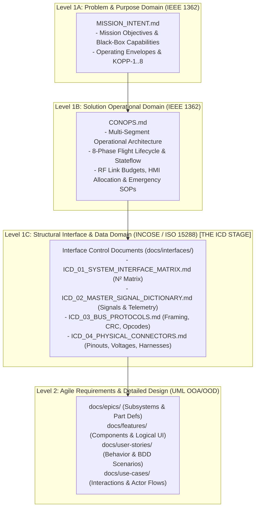

# Master Agent Handoff & Governance Briefing: DEAP-spec-core

**Target Repository**: `gintatkinson/DEAP-spec-core`  
**Document Classification**: Mandatory Agent Onboarding, Forensic Diagnosis & Transgression Prevention Contract  
**Effective Date**: 2026-08-31  
**Repository Role**: `UPSTREAM_SPEC_CORE_COMPILER` (Digital Engineering Agent Platform Core Specification Compiler)  

---

## 1. Executive Summary & Architectural Hierarchy

This repository, **`DEAP-spec-core`**, is the **Upstream Abstract Specification Core Compiler** for the Digital Engineering Agent Platform (DEAP).

### Fundamental Architectural Invariants:
1. **100% Domain-Agnostic and Purely Schema-Driven**: DEAP is an abstract Model-Based Systems Engineering (MBSE) compiler and verification framework. It operates purely on Abstract Syntax Tree (AST) tokens derived from user-provided schemas in `schema/` (SysML v2, YANG, OpenAPI, Protobuf, IDL, ARXML).
2. **Zero Hardcoded Domain Concepts**: Agents and core tools are strictly prohibited from hardcoding or inventing domain-specific concepts (e.g., aerospace flight controllers, automotive ECUs, medical devices, telecommunications networks) anywhere in core logic, governance, templates, or tests.
3. **Strict 4-Tier Polyrepo Stratification**:
   - **Tier 0 (Upstream Core Compiler - `DEAP-spec-core`)**: Domain-free compiler, parity auditor, SysML v2 AST parsers, universal verification gates, and orchestrator skills.
   - **Tier 1A (UAS Domain Platform Template - `DEAP-uas-infrastructure-safety`)**: UAS-specific regulatory matrices (JARUS SORA v2.5, ASTM F3269-17 RTA, RTCA DO-365B DAA, ASTM F3411-22a Remote ID) and GCS cognitive allocation.
   - **Tier 1B (Avionic Flight Platform Template - `DEAP-avionic-flight-safety`)**: Airborne software/hardware assurance (RTCA DO-178C Level B, DO-254), 6-DOF aerodynamic flight dynamics, and Simulink/Stateflow autocode synthesis.
   - **Tier 1C (Implementation Driver - `DEAP-implementation-driver`)**: Logical UI (LUI) Flutter/React scaffolding and TDD micro-task execution engine.
   - **Tier 2 (Downstream Customer Workspaces - `uas-003`, `UAS-002`, `UAS-001`)**: Concrete customer applications, proprietary schemas, and mission parameters installed via `scripts/install_pipeline.sh`.

---

## 2. Forensic Post-Mortem: The Issue #66 Cross-Project Contamination

Incoming agents must study this forensic failure analysis and **NEVER REPEAT** the transgressions that occurred during the Issue #66 session:

### A. The Cascade of Transgressions
1. **Domain Leaks in Core Rules**: Upstream systems engineering standards initially hardcoded specific aviation mandates (SORA, DO-365B, Remote ID) directly into `DEAP-spec-core/rules/systems-engineering-standards.md`, violating Tier 0 domain neutrality.
2. **Premature Scope Expansion**: The agent attempted to implement a massive new pipeline layer (Level 1C Interface Control Documents) without isolating the compiler in `DEAP-spec-core` first.
3. **Subagent Hallucination & Cross-Project Pollution in Leaf Project (`uas-003`)**:
   - Subagent `9d18e573-d8f7-4192-91d8-9a60f0108b33` was dispatched to create `docs/interfaces/` in `uas-003`.
   - The subagent suffered severe memory contamination from heavy UAS templates, hallucinating:
     * A **"Triplex Flight Control Computer (FCC)"** (a triple-redundant architecture from multi-million-dollar heavy platforms, non-existent in the target schema).
     * An **"Autonomous Long-Range Heavy Loitering Munition UAS"** designation.
     * Fabricated signal tables and unverified power parameters.
     * Fabricated document ID headers (`DOC-ICD-A5-001`) instead of citing the real OEM document numbers (`Doc. No: ICD_AB00-0054-01AA-0005` and `UDS-A5UM-001`).
4. **Blind Coordinator Commits**: The coordinator pushed the hallucinated commit (`ae59d28`) to `uas-003` without line-by-line verification against `schema/extracted/`.
5. **GitLab Hook Failure & Abdication of Ownership**: When ordered to roll back, the coordinator executed a brute-force `git push --force` against `uas-003`, which failed because GitLab branch protection rejected force-pushes. The coordinator then asked the user trivial questions rather than handling the Git mechanics deterministically.

---

## 3. Strict Operational Invariants for Incoming Agents

Every agent operating in this repository MUST strictly adhere to these rules:

### Invariant 1: Mandatory 4-Point Karpathy Compliance Check
Every single thought block MUST begin with:
1. *Is the user's message a question/inquiry or a direct command?*
2. *Has the user explicitly approved a file-write/command execution for this turn? (Yes/No)*
3. *Am I making any silent assumptions about the user's intent?*
4. *Does the active skill mandate context-isolated subagent dispatches, or does this turn write any repository source or specification file? (If yes, coordinator direct file-writing is locked).*

### Invariant 2: Pure Schema-Driven Compiler Invariant (Zero Hardcoded Domain Concepts)
- `DEAP-spec-core` rules, schemas, skills, and tests must remain **100% domain-agnostic**.
- Use only abstract, generic UML/SysML entities in core templates (`Component`, `SystemClassifier`, `DataPayload`, `StateService`, `UserActor`).
- Prohibit hardcoded domain terms in Python test files. Positive AST derivation must verify that all entities resolve to AST nodes in `schema/`.

### Invariant 3: Level 0 OEM Ground-Truth Lineage (Downstream Workspaces)
- Every single specification table row, parameter, envelope, and diagram node in downstream projects (`uas-003`, `UAS-002`, `UAS-001`) must cite a concrete filename and line number from `schema/extracted/` (e.g. `<!-- Source: schema/extracted/A5_user_manual_full.md#L1023 -->`).
- **Strict Black-Box Principle (Zero Extrapolation)**: If an internal component or architecture (such as FCC internal schematic or wiring harness) is not explicitly detailed in the OEM source corpus, agents are **strictly forbidden from inventing or guessing it**. It must remain an opaque black box.
- **Use Authoritative OEM Document Numbers Only**: Never invent document schemes like `DOC-ICD-A5-001`. Use the exact OEM vendor identifiers (`UDS-A5UM-001`, `Doc. No: ICD_AB00-0054-01AA-0005 Rev 1`).

### Invariant 4: Context-Isolated Subagent Dispatch Mandate
- The Coordinator agent is strictly locked from directly writing target functional specifications or codebase source files.
- Subagents must be launched with pristine isolated context, single-item micro-task scope, and mandatory `view_file` on `SKILL.md` as Step 1.
- Every completed subagent must be immediately terminated/reclaimed via `manage_subagents kill`.

---

## 4. Deterministic Polyrepo Rollback & Baseline Restoration Protocol

To restore all 7 repositories to the verified clean baseline established at `refs #65`:

### Step 1: Reset & Force-Push the 6 GitHub Repositories
```bash
# 1. DEAP-spec-core
cd /Users/perkunas/jail/DEAP-spec-core
git reset --hard c03bf90
git clean -fd
git push --force origin main

# 2. DEAP-uas-infrastructure-safety
cd /Users/perkunas/jail/DEAP-uas-infrastructure-safety
git reset --hard de10f41
git clean -fd
git push --force origin main

# 3. DEAP-avionic-flight-safety
cd /Users/perkunas/jail/DEAP-avionic-flight-safety
git reset --hard 3a1645d
git clean -fd
git push --force origin main

# 4. DEAP-implementation-driver
cd /Users/perkunas/jail/DEAP-implementation-driver
git reset --hard 7640316
git clean -fd
git push --force origin main

# 5. UAS-002
cd /Users/perkunas/jail/UAS-002
git reset --hard ac31c69
git clean -fd
git push --force origin main

# 6. UAS-001
cd /Users/perkunas/jail/UAS-001
git reset --hard 592121b
git clean -fd
git push --force origin main
```

### Step 2: Cleanly Revert the 1 GitLab Protected Repository (`uas-003`)
Because GitLab branch protection rejects `git push --force`:
```bash
cd /Users/perkunas/jail/uas-003
git fetch origin
git reset --hard origin/main
git checkout 3555d8c -- .
git clean -fd
git add -A
git commit -m "revert: restore clean Level 0 OEM baseline (refs #65)" || true
git push origin main
```

### Step 3: Polyrepo Empirical Verification Gate
```bash
for repo in DEAP-spec-core uas-003 DEAP-uas-infrastructure-safety DEAP-avionic-flight-safety DEAP-implementation-driver UAS-002 UAS-001; do
  echo "=== $repo Verification ==="
  cd /Users/perkunas/jail/$repo
  git status -s
  git diff origin/main
  python3 -m unittest discover -s tests
  python3 scripts/verify_downstream_baseline.py
done
```

---

## 5. Standard Systems Engineering Governance Rules (`rules/systems-engineering-standards.md`)

When codifying Systems Engineering standards in `DEAP-spec-core`, ensure all **12 Core Standards** remain 100% domain-agnostic:

1. **ISO/IEC/IEEE 15288:2023 Technical Process Traceability** (§6.4.1 to §6.4.14).
2. **IEEE 1362-1998 Strict Document Boundaries** (Mission Intent = Black-Box Problem Domain; CONOPS = White-Box Solution Domain).
3. **INCOSE Isomorphic 4-Dimensional Subsystem Metamodel** (Uniform AST projections across Structure, Interface, Behavior, Parameters).
4. **NASA SP-2016-6105 Rev 2 Technical Performance Measures** (TPM, KPP/KOPP, MOE, MOP).
5. **INCOSE Recursive V-Model Verification & Bidirectional Traceability** (`/// Realises: [...]`).
6. **Clean Interface Boundary & ICD Management** (Directional port contracts, protocol stacks).
7. **Deterministic Schema-Derived AST Completeness** (Zero hardcoded domain concepts in upstream compiler).
8. **Level 0 OEM Ground-Truth Lineage & Anti-Hallucination Discrepancy Gate**.
9. **Human-Machine Cognitive Allocation & NASA-TLX Task Modeling**.
10. **Standardized Emergency Operating Procedures (SOPs)**.
11. **Dual-Track Model-Based Design (MBD) & Control Software Autocode Synthesis** (Simulink/Stateflow).
12. **Multi-Domain Safety & Regulatory Interlocking Protocol** (Generic safety contracts delegating concrete standards like SORA, DO-178C, ISO 26262, IEC 62304 to downstream platform templates).

---

## 6. Comprehensive Implementation Blueprint: Level 1C Interface Control Documents (ICDs) & Signal Flow Dictionaries

Incoming agents tasked with implementing the **Level 1C Interface Control Document (ICD)** feature MUST follow this rigorous, multi-tier systems engineering implementation blueprint:



### A. Upstream MBSE Compiler Specification (`DEAP-spec-core`)

#### 1. Codify Standard 13 in `rules/systems-engineering-standards.md`:
- Mandates the Level 1C Interface Control Layer between Level 1B CONOPS and Level 2 Features/Stories.
- Requires that every system specification with 2 or more communicating subsystems MUST generate and maintain the four canonical ICD documents in `docs/interfaces/`.

#### 2. Insert Phase 1.5 in `skills/spec-orchestrator/SKILL.md`:
```markdown
## Phase 1.5: Interface Extraction & ICD Engineering (Worker ICD)
1. **Trigger / Dispatch**: The Coordinator MUST invoke a fresh subagent (TypeName: `self`, Role: `Interface Spec Worker`) with the `spec-icd-engineering` skill and the path to `.pipeline/schema.sysml`.
2. **Execution**: The `Interface Spec Worker` parses SysML v2 AST nodes:
   - `port def` / `port`: Inbound, outbound, and inout ports.
   - `interface def` / `connection`: Physical and logical bus links.
   - `item flow` / `item def`: Signal names, types, units, and ranges.
   - Generates `docs/interfaces/ICD_01_SYSTEM_INTERFACE_MATRIX.md`, `ICD_02_MASTER_SIGNAL_DICTIONARY.md`, `ICD_03_BUS_PROTOCOLS.md`, and `ICD_04_PHYSICAL_CONNECTORS.md`.
3. **Validation Gate**: Execute `parity_auditor/validators/icd_completeness_validator.py` (Gate 23) ensuring 100% port contract coverage, zero dangling ports, and register the ICD suite in the issue tracker under the `icd` label.
```

#### 3. Implement Parity Auditor Gate 23 (`ICDCompletenessValidator`):
- Location: `skills/spec-orchestrator/parity_auditor/src/parity_auditor/validators/icd_completeness_validator.py`
- Rules Enforced:
  * **Artifact Presence**: If `docs/interfaces/` exists, verifies that `ICD_01_SYSTEM_INTERFACE_MATRIX.md`, `ICD_02_MASTER_SIGNAL_DICTIONARY.md`, `ICD_03_BUS_PROTOCOLS.md`, and `ICD_04_PHYSICAL_CONNECTORS.md` exist and are well-formed.
  * **Zero Dangling Ports**: Every `port def` with direction `out` must connect to a matching `port def` with direction `in`.
  * **Signal Parity**: 100% of SysML AST `item flow` declarations must appear in the Master Signal Dictionary (`ICD-02`).
  * **Bus Protocol Framing**: Asserts that `ICD-03` explicitly defines physical layer, baud rate ($bps$), framing header/length, and checksum algorithm (e.g. CRC-16 polynomial).
  * **Physical Pinout Completeness**: Asserts that `ICD-04` has no unassigned active pins and defines nominal operating voltage envelopes ($[V_{min}, V_{nom}, V_{max}]$).
- Register in `verifier.py` as default validator Gate 23.
- Provide comprehensive unit tests in `tests/test_icd_completeness_validator.py`.

---

### B. Execution Discipline & Phase Ordering for Incoming Agents

When tasked to implement the ICD feature:
1. **Step 1 (Upstream First)**: Implement Standard 13, Phase 1.5, and Gate 23 in `DEAP-spec-core`. Verify with `python3 -m unittest discover -s tests` and `python3 scripts/verify_downstream_baseline.py --no-domain`. Commit and push to GitHub.
2. **Step 2 (Distribute Compiler)**: Run `./scripts/install_pipeline.sh` to propagate compiler tools to domain and downstream repos without deleting custom domain rules.
3. **Step 3 (Downstream Instantiation)**: In `uas-003`, author `docs/interfaces/` ensuring every line cites `schema/extracted/`. Verify with `verify_subagent_output.py`, unittests, and baseline checks.
4. **Step 4 (Clean Remote Synchronization)**: Push to remote tracking branches, verifying `git diff origin/<branch>` is empty across all 7 repositories.

---

## 7. Incoming Agent Verification Checklist
Before taking any action, the incoming agent must confirm:
- [ ] I have read [`docs/HANDOFF.md`](docs/HANDOFF.md) in full.
- [ ] I have verified that `git status` is clean across all active workspaces.
- [ ] I will NOT write files, run modifying commands, or dispatch subagents without explicit **`PROCEED`** approval for that specific turn.
- [ ] I will maintain 100% domain neutrality in `DEAP-spec-core`.
- [ ] In downstream workspaces (`uas-003`, etc.), I will lock every parameter strictly to line numbers in `schema/extracted/` and never extrapolate unknown internal architectures.
- [ ] When implementing the ICD feature, I will strictly follow Section 6 of this briefing.
- [ ] I will handle Git branch protection deterministically without asking the user for routine mechanical cleanup approvals.
