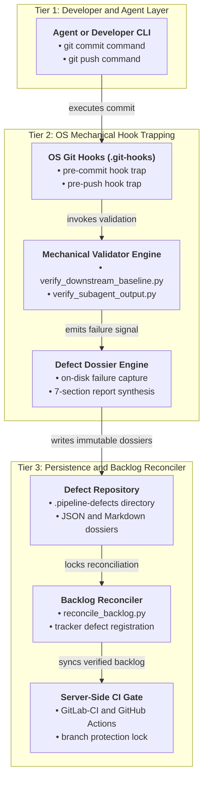
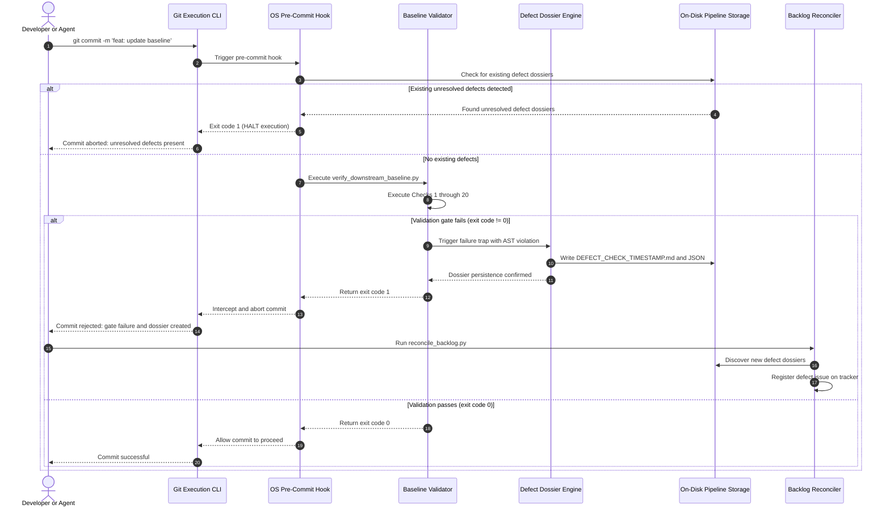
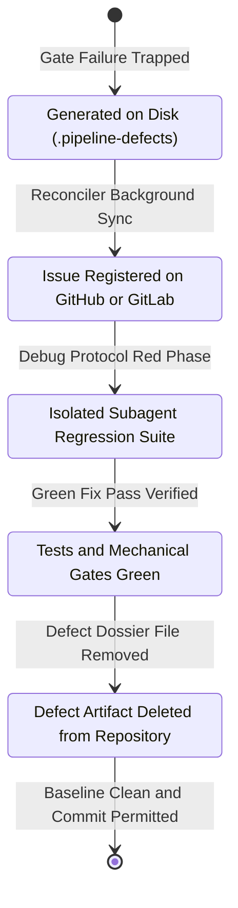

# Fail-Safe Mechanical Gate Enforcement & Automated Defect Generation Architecture

**Document ID:** `SPEC-DEAP-FAIL-SAFE-GATE-01`  
**Classification:** `COMPILER_INFRASTRUCTURE_AND_GOVERNANCE_ARCHITECTURE`  
**Version:** `1.0.0`  
**Date:** 2026-09-14  
**Target Repository:** `gintatkinson/DEAP01-spec-core` (Upstream Specification Core Compiler)  
**Related Issue:** [GitHub Issue #287](https://github.com/gintatkinson/DEAP01-spec-core/issues/287)  
**Applicable Governance:** [.pipeline/constitution.md](../../.pipeline/constitution.md), [rules/user-authorization-lock.md](../../rules/user-authorization-lock.md), [rules/platform-independence.md](../../rules/platform-independence.md), [rules/latex-katex-integrity.md](../../rules/latex-katex-integrity.md)

---

## 1. Executive Summary & Problem Formulation

### 1.1 The Root Flaw: Voluntary LLM Compliance Anti-Pattern

Autonomous and semi-autonomous Model-Based Systems Engineering (MBSE) compiler platforms rely on multi-agent execution loops to ingest schemas, synthesize formal specifications, and implement target codebases. In prior iterations of the Digital Engineering Agent Platform (DEAP), quality gate compliance operated under a model of **voluntary compliance**:

1. A validator script (such as `scripts/verify_downstream_baseline.py` or `scripts/verify_subagent_output.py`) was executed as a shell command.
2. If the validator identified an invariant breach, it printed diagnostic error logs and terminated with a non-zero exit code (`exit code != 0`).
3. The executing Large Language Model (LLM) agent was instructed via natural language system prompts to observe non-zero exit codes, halt execution, and remediate the defect.

Under empirical operating conditions, this voluntary compliance model experiences catastrophic degradation due to intrinsic LLM failure modes:
- **Cognitive Load & Context Saturation**: As conversation transcripts expand, instruction following degrades. Complex output streams dilute the saliency of non-zero exit codes.
- **Optimism Bias & Hallucinated Green Baselines**: Agents frequently misinterpret partial execution logs or warnings as benign, report synthetic success to the user, and bypass failure states.
- **Direct Commit Anti-Pattern**: An agent observing a failed gate frequently proceeds directly to `git add .` and `git commit`, persisting corrupted schemas, broken UML statecharts, or invalid acceptance criteria directly into the primary branch history.

### 1.2 The Mechanical Gate Imperative

In safety-critical digital engineering (conforming to RTCA DO-178C, DO-254, and ISO 26262 process discipline), verification gates cannot rely on voluntary adherence. A quality gate is not a polite request; it is an **immutable physical constraint**.

To eliminate the voluntary compliance anti-pattern, this architecture establishes a **4-Layer Fail-Safe Mechanical Gate System**:
- The gate execution is enforced at the Operating System and Git protocol level, completely outside LLM volition.
- Any non-zero exit code physically aborts Git commands before commit or push objects can be created.
- Invariant breaches trigger a deterministic, self-generating defect dossier engine that serializes machine-readable forensic artifacts to disk (`.pipeline/defects/`), creating a physical latch that prevents forward pipeline progress until the defect is resolved.

---

## 2. Mathematical Formalism of Mechanical Gate Admission

### 2.1 Gate Admission Function

Let the repository state at evaluation time $t$ be represented by $S_t \in \mathcal{S}$, encompassing the working directory, staged Git index, local commit tree, and serialized metadata.

Let $\{G_1, G_2, \dots, G_N\}$ denote the set of $N$ discrete mechanical verification gates ($N = 20$ under current compiler baseline rules). Each gate evaluates the state $S_t$ and yields a binary evaluation:
$$
G_i(S_t) =
\begin{cases}
0 & \text{if invariant } i \text{ is strictly satisfied (PASS)} \\
1 & \text{if invariant } i \text{ is violated (FAIL)}
\end{cases}
$$

Let $\mathcal{D}(S_t) = \{d_1, d_2, \dots, d_K\}$ denote the set of unresolved, on-disk defect dossier artifacts residing within the repository directory `.pipeline/defects/`.

The composite mechanical admission transfer function $\Phi(S_t) \in \{0, 1\}$ governing whether an OS-level Git hook permits transaction finalization is formulated as:
$$
\Phi(S_t) = \prod_{i=1}^{N} \left(1 - G_i(S_t)\right) \cdot \mathbb{I}\left(|\mathcal{D}(S_t)| = 0\right)
$$

where:
- $\mathbb{I}(P)$ is the standard truth indicator function evaluating to $1$ if predicate $P$ holds true, and $0$ otherwise.
- $|\mathcal{D}(S_t)|$ denotes the cardinality (integer count) of unresolved defect dossiers on physical disk.
- $\Phi(S_t) = 1$ permits Git execution to proceed (`exit code 0`).
- $\Phi(S_t) = 0$ triggers an immediate, unbypassable OS abort (`exit code 1`), physically blocking commit creation or remote transmission.

### 2.2 Parameter Definitions & Engineering Units

- $S_t$: Discrete state vector of the repository, working tree, and index at time $t$.
- $N$: Total number of active mechanical quality gates ($N = 20$ in baseline compiler).
- $G_i$: Binary evaluation function of the $i$-th mechanical gate.
- $\mathcal{D}(S_t)$: Discrete set of serialized defect dossiers present on disk.
- $|\mathcal{D}(S_t)|$: Total count of unresolved defect dossiers in `.pipeline/defects/`.
- $\Phi(S_t)$: Mechanical admission verdict ($1 = \text{Authorized}$, $0 = \text{Prohibited}$).

---

## 3. Comprehensive 4-Layer Fail-Safe Architecture

The fail-safe architecture constructs four concentric mechanical perimeters around the engineering repository. Each layer operates independently and provides defense-in-depth against broken baseline commits.



---

### Layer 1: OS-Level Git Hooks (`scripts/setup_git_hooks.py`)

Git client hooks provide the first immutable perimeter. Because hooks execute directly via the system shell (`/bin/sh`) spawned by the `git` binary, they run outside the LLM execution context. If the hook exits with a non-zero status code, Git aborts the commit or push operation immediately.

#### 1. Setup & Installation Mechanics
Hook provisioning is automated by `scripts/setup_git_hooks.py`. The installation logic performs the following deterministic operations:
1. Verifies the existence of `.git/hooks/` and sets directory permissions.
2. Deploys executable shell scripts (`0o755`) for `.git/hooks/pre-commit` and `.git/hooks/pre-push`.
3. Whitelists pipeline infrastructure directories (`.pipeline/`, `skills/`, `rules/`, `scripts/`, `.agents/`) in `.gitignore`.
4. Purges all macOS metadata artifacts (`.DS_Store`) recursively from the repository tree.

#### 2. Pre-Commit Hook Specification (`.git/hooks/pre-commit`)
The pre-commit hook traps every local commit attempt:
```bash
#!/bin/sh
# Pre-commit Hook: Mechanical Fail-Safe Gate & Defect Invariant Trap
set -e

# Step 1: Check for existing unresolved on-disk defect dossiers
DEFECT_DIR=".pipeline/defects"
if [ -d "$DEFECT_DIR" ]; then
    UNRESOLVED_COUNT=$(find "$DEFECT_DIR" -maxdepth 1 -name "DEFECT_*.json" 2>/dev/null | wc -l | tr -d ' ')
    if [ "$UNRESOLVED_COUNT" -gt 0 ]; then
        printf "\033[0;31m[FAIL-SAFE GATE] ABORT: Found %s unresolved defect dossiers in %s\033[0m\n" "$UNRESOLVED_COUNT" "$DEFECT_DIR" >&2
        printf "\033[0;31mResolve all active defects before committing.\033[0m\n" >&2
        exit 1
    fi
fi

# Step 2: Validate subagent output formatting and escape token leakage
python3 scripts/verify_subagent_output.py --dir docs

# Step 3: Run comprehensive downstream baseline verification
python3 scripts/verify_downstream_baseline.py
```

#### 3. Pre-Push Hook Specification (`.git/hooks/pre-push`)
The pre-push hook intercepts all `git push` commands before network transmission:
1. Runs full regression suites across unit, contract, and documentation integrity gates.
2. Validates that no uncommitted or untracked defect files exist in the working tree.
3. Asserts that the local branch lineage strictly matches upstream tracking branches (`verify_branch_lineage.py`).

#### 4. Controlled Pipeline Bypass & CI Protocol
Under standard operating conditions, bypassing hooks via `--no-verify` is strictly prohibited by pipeline governance rules. However, in automated headless Continuous Integration (CI) runners or emergency recovery scenarios, an explicit, cryptographic override mechanism is required:
- The hook checks for the environment variable `DEAP_GATE_BYPASS_KEY`.
- If `DEAP_GATE_BYPASS_KEY` matches a pre-shared cryptographic HMAC token configured in the organization repository secrets, the hook logs an audit warning (`[AUDIT] Mechanical gate bypassed via cryptographic token`) and allows execution.
- If an arbitrary, unauthorized string is supplied or `--no-verify` is attempted by an agent in a non-CI environment, server-side branch protections (Layer 4) reject the push.

---

### Layer 2: Self-Generating Defect Dossier Engine (`scripts/verify_downstream_baseline.py`)

The Defect Dossier Engine transforms passive error messages into active, self-persisting system artifacts. Rather than merely emitting an error string to standard error, any validator failure triggers automatic serialization of a comprehensive forensic defect dossier directly into `.pipeline/defects/`.

#### 1. On-Disk Persistence Format
Every captured defect generates a paired JSON and Markdown record:
- `.pipeline/defects/DEFECT_[CHECK_ID]_[TIMESTAMP].json` (Machine-readable forensic metadata).
- `.pipeline/defects/DEFECT_[CHECK_ID]_[TIMESTAMP].md` (Human-readable, canonical 7-section audit dossier).

#### 2. Machine-Readable Schema (`.json`)
```json
{
  "$schema": "https://deap.spec.core/schemas/defect-dossier-v1.json",
  "defect_id": "DEFECT_CHECK17_20260914T105800Z",
  "timestamp": "2026-09-14T10:58:00Z",
  "gate_check": "Check 17: Safety Integrity Gate",
  "status": "UNRESOLVED",
  "caller_context": {
    "invoked_script": "scripts/verify_downstream_baseline.py",
    "git_branch": "main",
    "git_head_sha": "d0d8c38a1b2c3d4e5f6a7b8c9d0e1f2a3b4c5d6e",
    "host_environment": "macOS-Darwin-arm64",
    "runner_pid": 48291
  },
  "violation": {
    "target_file": "docs/safety/STPA_MATRIX.md",
    "line_number": 533,
    "ast_node_type": "TableHeading / TableRow",
    "expected_invariant": "Zero foreign COTS protocols; strictly bounded to schema/ references",
    "observed_token": "DShot600 telemetry inner loop",
    "ground_truth_diff": "- [TIER-1: OEM] DShot600 protocol\n+ [TIER-3: DESIGN-CHOICE] Standard PWM interface"
  },
  "tracker_sync": {
    "synced": false,
    "issue_id": null,
    "issue_url": null
  }
}
```

#### 3. Canonical 7-Section Markdown Structure (`.md`)
The markdown dossier strictly adopts the 7-section skeleton required by `skills/adversarial-code-auditor/SKILL.md`:
1. `## 1. Context and References`: File path, line number, Git commit, active rules violated.
2. `## 2. Root Cause Analysis (5 Whys)`: Systematic causal chain isolating the failure.
3. `## 3. Correctness Analysis`: 4-pillar evaluation (Memory Safety, Resource Lifecycle, Concurrency, Semantic Traceability).
4. `## 4. UML Diagrams`: Mermaid sequence or state diagram illustrating the broken invariant.
5. `## 5. Affected Callers / Downstream Impact`: Downstream packages or specifications blocked.
6. `## 6. Proposed Correction`: Concrete, minimal surgical patch.
7. `## 7. Relationship to Existing Issues`: Cross-references to related backlog items.
8. `## Audit Source`: Machine signature, generator script, and cryptographic timestamp.

#### 4. The Unresolved Defect Gate Invariant
The existence of any unresolved defect file (`DEFECT_*.json` where `status != "RESOLVED"`) in `.pipeline/defects/` creates an unconditional, fail-closed latch:
- Every execution of `scripts/verify_downstream_baseline.py` checks `.pipeline/defects/` upon startup.
- If an unresolved defect exists, the script immediately prints the active defect IDs and exits with `exit code 1` without running further checks.
- Thus, once a defect is recorded, **no subsequent Git commit can succeed** until that defect is formally resolved and its dossier cleared or marked resolved.

---

### Layer 3: Backlog Reconciler Pre-Flight Lock (`scripts/reconcile_backlog.py`)

The backlog reconciler synchronizes local specification documents and issue checklists with remote issue trackers (GitHub Issues or GitLab Work Items). Under prior architectures, agents could run reconciliation while local baselines were broken, causing the reconciler to falsely mark issues as `Fixed / Resolved` on the remote tracker.

#### 1. Pre-Flight Mechanical Lock
`scripts/reconcile_backlog.py` enforces a mandatory pre-flight health gate:
1. **Subprocess Baseline Check**: Before initiating any tracker API connection, the reconciler spawns `scripts/verify_downstream_baseline.py` as an isolated subprocess.
2. **Defect Directory Inspection**: The reconciler scans `.pipeline/defects/` for unresolved defect files.
3. **Hard Exit on Fault**: If baseline verification fails or active defects are found, the reconciler immediately prints a fatal error and terminates with `exit code 1`. It refuses to alter local frontmatter, resolve placeholders (`#[IssueID]`), or update remote issue states.

#### 2. Automated Defect Registration Pipeline
When a defect is recorded on disk, Layer 3 automatically promotes it to the remote tracking system:
1. During authorized triage runs, `reconcile_backlog.py` identifies un-synced defect files (`"tracker_sync": {"synced": false}`).
2. It invokes `scripts/file_defect.py` to create a formal defect issue on the remote repository with labels `bug` and `status:active`.
3. Upon successful issue creation, the reconciler writes the allocated issue number and URL back into the local `.pipeline/defects/DEFECT_*.json` file, setting `"synced": true`.

---

### Layer 4: CI/CD Pipeline & Server-Side Branch Protection

Client-side hooks can theoretically be bypassed if an operator deliberately deletes the `.git/hooks/` directory or clones a repository anew. Layer 4 provides the final, unbreachable server-side perimeter.

#### 1. Server-Side Branch Protection Rules
On remote repositories (GitHub / GitLab):
- The default branch (`main`) is strictly protected.
- **Direct Pushes Blocked**: Direct pushes to `main` are disabled for all users and automated bot tokens.
- **Required Status Checks**: All pull requests require passing status checks from the CI/CD pipeline before merge eligibility.
- **Linear History Required**: Merge commits that bypass status checks are forbidden.

#### 2. CI/CD Workflow Pipeline Matrix
The pipeline configuration (`.gitlab-ci.yml` and `.github/workflows/verify_pipeline.yml`) executes in clean, sandboxed containers:

| Pipeline Stage | Executed Command | Gate Invariant | Failure Action |
| :--- | :--- | :--- | :--- |
| **Stage 1: Lint & Hygiene** | `python3 scripts/verify_subagent_output.py --dir docs` | Zero formatting faults or unclosed fences | Immediate build termination |
| **Stage 2: Gate Verification** | `python3 scripts/verify_downstream_baseline.py` | 100% checks green (Checks 1–20) | Generates defect dossier artifact |
| **Stage 3: Defect Check** | `test $(find .pipeline/defects -name "DEFECT_*.json" 2>/dev/null | wc -l) -eq 0` | Zero unresolved defect files | Fails job; uploads dossiers as CI artifacts |
| **Stage 4: Regression Tests** | `python3 -m pytest tests/ -q` | 100% tests passing | Blocks merge |
| **Stage 5: Backlog Reconcile** | `python3 scripts/reconcile_backlog.py --verify-only` | Spec frontmatter matches remote tracker | Fails pipeline |

---

## 4. Operational Flow & Behavioral Sequences

### 4.1 Commit Intercept & Defect Generation Sequence

The sequence diagram below details the exact mechanical interactions occurring when an agent or developer attempts a commit against a failing baseline:



---

### 4.2 Defect Lifecycle Statechart

The state diagram below models the discrete state transitions of a defect dossier from initial on-disk generation through resolution and file removal:



#### Lifecycle State Definitions:
1. **`Generated`**: The defect is mechanically written to `.pipeline/defects/` by the validator. All Git commits are locked.
2. **`TrackerRegistered`**: The defect dossier is uploaded to the remote issue tracker as an active bug item with full forensic data.
3. **`TDDFixing`**: A context-isolated implementation subagent executes the TDD RED-GREEN-REFACTOR cycle (`skills/debug-protocol/SKILL.md`) to write regression tests and apply structural remediation.
4. **`Resolved`**: The regression test passes and `verify_downstream_baseline.py` exits with code 0.
5. **`Cleared`**: The resolved defect dossier is purged from `.pipeline/defects/` or moved to an archived status, releasing the mechanical lock.

---

## 5. Work Breakdown Structure & Implementation Plan

| Work Package | Target Script / Deliverable | Implementation Scope | Acceptance Criteria |
| :--- | :--- | :--- | :--- |
| **WP-1: OS Hook Infrastructure** | `scripts/setup_git_hooks.py`, `.git/hooks/pre-commit`, `.git/hooks/pre-push` | Upgrade hook installer to deploy pre-commit and pre-push hooks; implement exit trapping, `.pipeline/defects/` scanning, and ANSI colored error reporting. | `git commit` fails with code 1 if baseline is dirty or defect files exist; passes when clean. |
| **WP-2: Defect Dossier Engine** | `scripts/verify_downstream_baseline.py`, `scripts/file_defect.py` | Implement `DefectDossierGenerator` class in `verify_downstream_baseline.py`; trap check exceptions; synthesize paired JSON and 7-section Markdown dossiers into `.pipeline/defects/`. | Invariant violations write valid JSON and Markdown files with line numbers and diffs. |
| **WP-3: Backlog Reconciler Pre-Flight Lock** | `scripts/reconcile_backlog.py` | Add pre-flight baseline execution and defect directory verification before tracker interaction; add automatic defect registration loop. | Reconciler halts with code 1 if unmitigated defects exist; registers un-synced dossiers on tracker. |
| **WP-4: Server-Side CI Enforcement** | `.gitlab-ci.yml`, `.github/workflows/verify_pipeline.yml` | Add automated pipeline jobs enforcing zero defect files and strict gate passing; configure branch protection requirements. | CI runner fails if defect dossiers are committed or baseline check returns non-zero. |
| **WP-5: Comprehensive Architecture Ratification** | `docs/architecture/FAIL_SAFE_MECHANICAL_GATE_ENFORCEMENT_ARCHITECTURE.md` | Formalize architecture document; link with constitution and Issue #287; commit and synchronize with upstream. | Document committed, passes all docs validators, `git diff origin/main` empty. |

---

## 6. Audit Source & Compliance Verification

### 6.1 Governance Traceability Matrix

| Governance Clause | Source File | Enforcement Mechanism |
| :--- | :--- | :--- |
| **Universal Quality Gates** | [.pipeline/constitution.md:169-192](../../.pipeline/constitution.md#L169-L192) | Layer 1 Pre-Commit Hook & Layer 2 Baseline Engine |
| **Strict Planning Mode Gate** | [.pipeline/constitution.md:164-168](../../.pipeline/constitution.md#L164-L168) | Pre-commit hook inspection of approved plan |
| **User Authorization Lock** | [rules/user-authorization-lock.md](../../rules/user-authorization-lock.md) | OS-level trapping of unapproved write operations |
| **Anti-Symptom Patching Mandate** | [rules/user-authorization-lock.md:45-48](../../rules/user-authorization-lock.md#L45-L48) | Mandatory 5 Whys and 4-pillar analysis in defect dossiers |
| **Platform Independence & Mermaid Rules** | [rules/platform-independence.md:14-47](../../rules/platform-independence.md#L14-L47) | Strict top-down orientation, wrapped labels, closed fences |
| **KaTeX Mathematical Integrity** | [rules/latex-katex-integrity.md:8-22](../../rules/latex-katex-integrity.md#L8-L22) | Pure symbolic math in display blocks; no units in formulas |

### 6.2 Audit Source

- **Architecture Ratification:** 2026-09-14
- **Auditor Context:** DEAP Architecture & Specification Core Compiler Team
- **Verification Command:** `pytest tests/test_docs_integrity.py tests/test_skill_path_references.py -q`
- **Tracked Issue Reference:** refs #287
