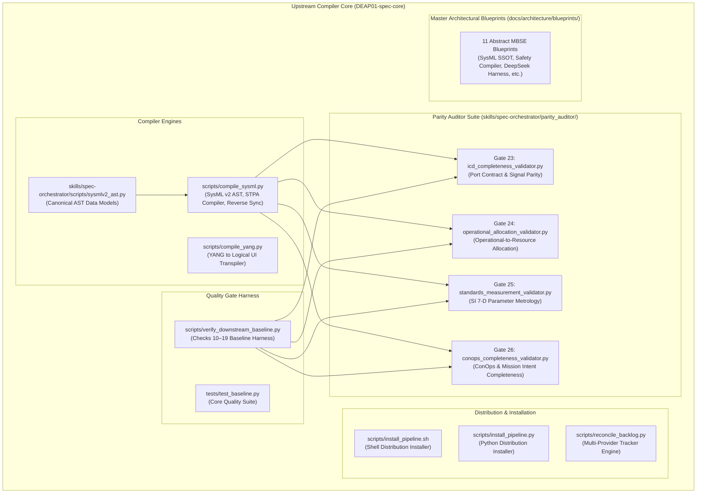
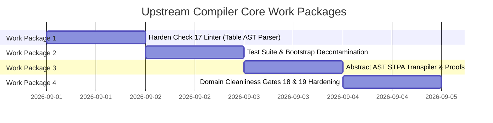

| **Attribute** | **Value** |
| :--- | :--- |
| **Document Title** | Master Turnkey Handover: Upstream Compiler Core Engineering & Quality Gate Architecture |
| **Document ID** | DEAP-HANDOFF-OPENCODE-CORE-001 |
| **Repository** | `DEAP01-spec-core` (`UPSTREAM_SPEC_CORE_COMPILER`) |
| **Target Engine** | DeepSeek-R1 / OpenCode |
| **Date** | 2026-09-01 |
| **Version** | 1.0.0 |
| **Status** | Authoritative Active Handover |
| **Baseline Commit** | `4629ce9` on `origin/main` (351/351 tests pass, 19/19 gates pass) |
| **Upstream Defect Reference** | https://github.com/gintatkinson/DEAP01-spec-core/issues/69 |

# Master Turnkey Handover: Upstream Compiler Core Engineering & Quality Gate Architecture

> **Purpose:** Authoritative turnkey technical specification, failure post-mortem, component architecture inventory, and active engineering work packages for an incoming AI agent operating within **OpenCode** powered by **DeepSeek-R1 (`deepseek-reasoner`)** inside the upstream compiler core repository (`DEAP01-spec-core`). This document establishes the foundational architectural invariants, explains historical failure mechanisms, and outlines the implementation tasks required to maintain 100% mathematical determinism, pure schema-driven compilation, and rigorous quality gate enforcement across the DEAP framework.

---

## 0. Mandatory Post-Install Initialization Protocol (Steps 0–5)

Every incoming AI agent initializing within the `DEAP01-spec-core` repository MUST execute the following sequential initialization protocol (Steps 0 through 5) prior to performing any code edits, running tools, or executing compiler tasks.

```mermaid
flowchart TD
    S0["Step 0: Sentinel Check\n(".pipeline/upstream/ presence")"] --> S1["Step 1: Constitution & Quality Gate Ingestion\n(".pipeline/constitution.md")"]
    S1 --> S2["Step 2: Skills & Execution Protocols\n("skills/ directories")"]
    S2 --> S3["Step 3: Pure Schema-Driven Compiler Invariant\n(Zero Hardcoded Domain Concepts)"]
    S3 --> S4["Step 4: Clean Landing Zone Mandate\n("schema/, docs/epics/, docs/features/, docs/safety/")"]
    S4 --> S5["Step 5: Tracker Synchronization\n("scripts/reconcile_backlog.py")"]
    S5 --> RDY["Ready for Upstream Work Package Execution"]
```

### Step 0: Repository Classification & Sentinel Check
Check for the presence of the sentinel indicator directory `.pipeline/upstream/`:
- **State:** `.pipeline/upstream/` is **PRESENT**.
- **Classification:** `UPSTREAM_SPEC_CORE_COMPILER` mode (`DEAP01-spec-core`).
- **Core Invariant:** The repository is the abstract Model-Based Systems Engineering (MBSE) compiler, linter harness, and distribution pipeline template. It MUST remain 100% domain-agnostic. Concrete system specifications, customer domain models, and platform-specific names MUST NEVER be committed to upstream core branches.

### Step 1: Constitution & Quality Gate Ingestion
- **Action:** Read and ingest [`.pipeline/constitution.md`](.pipeline/constitution.md).
- **Rule:** The Constitution and its automated validation gates represent **immutable ground truth standards**.
- **Anti-Goalpost-Moving Mandate:** An agent MUST NEVER modify the Constitution, alter validation thresholds, weaken linters, or soften test assertions to force failing or incomplete code to pass. If an artifact fails a quality gate, the artifact or the compiler generating it is what must be repaired.

### Step 2: Skills & Execution Protocols
Ingest and strictly adhere to the standardized skill protocols located in `skills/`:
1. [`skills/spec-orchestrator/SKILL.md`](skills/spec-orchestrator/SKILL.md): Orchestrates end-to-end multi-agent protocol specification engineering (Phases 1, 1.5, 2, 3, 4, 5).
2. [`skills/feature-driven-implementation/SKILL.md`](skills/feature-driven-implementation/SKILL.md): Governs subagent-driven Test-Driven Development (TDD) implementation discipline.
3. [`skills/adversarial-code-auditor/SKILL.md`](skills/adversarial-code-auditor/SKILL.md): Enforces mandatory 5 Whys root cause analysis, 4-pillar correctness auditing, and 7-section defect report filing on any failure.
4. [`skills/debug-protocol/SKILL.md`](skills/debug-protocol/SKILL.md): Implements the systematic 8-step RED-GREEN-REFACTOR defect remediation cycle.

### Step 3: Pure Schema-Driven Compiler Invariant
- **Rule:** `DEAP01-spec-core` MUST contain zero static or hardcoded domain dictionaries (e.g. `GROUND_TRUTH = {...}`, `EXPECTED_SPECS = {...}`, `DOMAIN_PARAMS = {...}`).
- **AST Principle:** All compiler passes, AST builders, and validators MUST derive entities, ports, signals, control actions, and safety constraints dynamically from formal input schemas (`*.sysml`, `*.yang`, `*.proto`, `*.yaml`, `*.arxml`).

### Step 4: Clean Landing Zone Mandate
In `UPSTREAM_SPEC_CORE_COMPILER` mode, all target specification landing zones must remain clean distribution templates containing only `.gitkeep` and template `README.md` files:
- `schema/`
- `docs/epics/`
- `docs/features/`
- `docs/user-stories/`
- `docs/use-cases/`
- `docs/safety/`
- `docs/interfaces/`

Enforced by Checks 16, 17, and 18 in `scripts/verify_downstream_baseline.py`.

### Step 5: Tracker Synchronization
Verify issue tracking synchronization mechanisms using `scripts/reconcile_backlog.py` in `--offline` mode (or via configured GitHub/GitLab providers) to ensure backlog integrity and cross-view traceability.

---

## 1. Detailed Post-Mortem of Upstream Tooling Weaknesses

An adversarial engineering audit of the upstream compiler toolchain identified four distinct tooling defects that enabled shallow specification generation, false-positive gate passes, and context corruption in downstream workspaces.

```mermaid
flowchart TD
    subgraph "Identified Upstream Defects (Root Cause)"
        D1["Defect 1: Weak Regex Linter Blindspot in Check 17\n(Isolated string matches passed 4- & 16-UCA stubs)"]
        D2["Defect 2: Tautological Test Harness & Pipeline Mock\n("Embedded 4-UCA synthetic mock in installer/tests")"]
        D3["Defect 3: Generative LLM Context Satiation & Filter Collisions\n(Autoregressive attention decay & cloud censorship)"]
        D4["Defect 4: Context Contamination across Boundaries\n(Downstream platform nouns leaking upstream)"]
    end

    subgraph "Upstream Architecture Hardening Solutions"
        S1["Work Package 1: Structural Table AST Linter in Check 17\n(Full markdown table parser & dynamic cardinality check)"]
        S2["Work Package 2: Test Suite & Bootstrap Decontamination\n(Purge synthetic 4-UCA mock, add adversarial tests)"]
        S3["Work Package 3: Abstract AST STPA Transpiler\n(Deterministic Cartesian product generator & 10-proof engine)"]
        S4["Work Package 4: Domain Cleanliness Gates 18 & 19\n(Hardened AST token scanners preventing domain leaks)"]
    end

    D1 ==> S1
    D2 ==> S2
    D3 ==> S3
    D4 ==> S4
```

### Defect 1: Weak Regex Linter Blindspot in Check 17
- **Location:** `scripts/verify_downstream_baseline.py:578-671`
- **Root Cause:** The legacy implementation of `check_uca_categories()` used naive global regular expressions:
  ```python
  # Legacy check:
  if not re.search(r'\b(?:not\s+provid(?:ing|ed)|omission)\b', content, re.IGNORECASE):
      missing_categories.append("1. Not providing causes hazard")
  ```
- **Vulnerability:** An isolated markdown file containing a shallow 4-UCA or 16-UCA stub satisfied the linter as long as each keyword (`omission`, `commission`, `timing`, `duration`) occurred at least once anywhere in the document. The linter failed to parse markdown table structures, failed to verify row counts, and did not evaluate dynamic Cartesian product cardinality against the control actions defined in the system architecture.
- **Downstream Impact:** Downstream pipelines generated severely truncated safety matrices (e.g. 16 UCAs instead of the mathematically required 84 UCAs), yet Check 17 reported `Success: Check 17 verified`, masking the omission of critical safety hazards.

### Defect 2: Tautological Test Harness & Pipeline Bootstrap Mock
- **Location:** `tests/test_safety_integrity.py:24-100` and `scripts/install_pipeline.sh:825-930`
- **Root Cause:** Both the test suite and the pipeline installation script hardcoded a synthetic mock generator `generate_valid_stpa_matrix_content()` that emitted exactly 4 hardcoded UCAs (`UCA-01` through `UCA-04`).
- **Vulnerability:** The upstream test suite asserted that Check 17 passed on this 4-UCA mock. Consequently, any attempt to harden Check 17 to require full Cartesian coverage broke the upstream test suite itself. The installer distributed this shallow mock to downstream workspaces, setting a defective baseline across projects.

### Defect 3: Generative LLM Context Satiation & Cloud Safety Filter Fragility
- **Mechanism:** In complex safety-critical systems with $N$ controllers and $M$ downward control actions, System-Theoretic Process Analysis (STPA) requires evaluating each action across the 4 STPA guide words:
  $$\begin{aligned} |\mathcal{U}| = \sum_{p \in \mathcal{P}} |\mathcal{A}(p)| \times |\mathcal{G}| = 4 \times \sum_{p \in \mathcal{P}} |\mathcal{A}(p)| \end{aligned}$$
  For 21 control actions, this yields $|\mathcal{U}| = 84$ distinct Unsafe Control Actions.
- **Failure:** Autoregressive LLMs attempting to draft this table in a single conversational turn suffer from **attention weight degradation and context satiation**, prematurely closing tables after 12 to 16 rows. Furthermore, proprietary cloud LLM APIs frequently trigger automated safety filters when processing defense, kinetic containment, or fuzing terminology.
- **Architectural Remedy:** Safety matrix generation must be offloaded to local, deterministic AST compiler engines (`scripts/compile_sysml.py`), with item-level subagent isolation for individual narrative rationales.

### Defect 4: Context Contamination across Repository Boundaries
- **Mechanism:** During multi-repository workflows, platform-specific names, customer domain concepts, or concrete vehicle parameters accidentally leaked into upstream core documentation, blueprints, or test assertions.
- **Architectural Remedy:** Enforcement of strict domain-agnostic AST cleanliness linters (Checks 18 and 19 in `scripts/verify_downstream_baseline.py` and `tests/test_check_no_domain_config.py`).

---

## 2. Upstream Core Architecture & Component Inventory

The `DEAP01-spec-core` repository provides the compiler toolchains, quality gate harnesses, parity auditors, and MBSE architectural blueprints for the entire DEAP ecosystem.



### 2.1 Compiler Engines
- **[`scripts/compile_sysml.py`](scripts/compile_sysml.py):**
  - Textual SysML v2 AST parser and model compiler.
  - STPA-to-SysML safety constraint compiler (`constraint def` / `assert constraint`).
  - Run-Time Assurance (RTA) invariant synthesizer for Simulink Design Verifier (SLDV) and Embedded Coder.
  - Closed-loop bidirectional reverse synchronization (`--reverse-sync`).
- **[`scripts/compile_yang.py`](scripts/compile_yang.py):**
  - Ingests RFC/IETF YANG models and transpiles container, list, and leaf hierarchies into `logical-layout.json` for frontend consumption.
- **[`skills/spec-orchestrator/scripts/sysmlv2_ast.py`](skills/spec-orchestrator/scripts/sysmlv2_ast.py):**
  - Canonical Python AST data classes: `PartDef`, `PortDef`, `ActionDef`, `SysMLOperationDef`, `SysMLCapabilityDef`, `SysMLInteractionDef`, `SysMLConstraintDef`, `SysMLTestCaseDef`, `RequirementDef`, `StateDef`, `UseCaseDef`, `ItemDef`, `SysMLPackage`, and `SysMLParser`.

### 2.2 Quality Gate Harness (Checks 10–19)
The baseline verification script [`scripts/verify_downstream_baseline.py`](scripts/verify_downstream_baseline.py) executes 10 foundational quality checks:

| Check ID | Verification Function | Description & Invariant |
| :--- | :--- | :--- |
| **Check 10** | `check_gitignore_exists()` | Verifies `.gitignore` exists in repository root with standard exclusions. |
| **Check 11** | `check_no_ds_store_files()` | Ensures zero `.DS_Store` binary metadata files exist in tree. |
| **Check 12** | `check_no_duplicate_master_blueprints()` | Verifies no duplicated blueprint copies exist in downstream paths. |
| **Check 13** | `check_latex_katex_syntax()` | Validates KaTeX/LaTeX syntax across all markdown files in repository. |
| **Check 14** | `check_downstream_instructions_exist()` | Verifies `README.md`, agent instructions, and `rules/sysml-ssot-completeness.md`. |
| **Check 15** | `check_reconcile_backlog_tooling_exists()` | Verifies `scripts/reconcile_backlog.py` is present, non-empty, and executable. |
| **Check 16** | `check_upstream_template_clean_landing_zones()` | Validates clean landing zones for `schema/`, `docs/epics/`, `docs/features/`, `docs/user-stories/`, `docs/use-cases/`. |
| **Check 17** | `check_safety_integrity_and_sora_completeness()` | Validates clean upstream `docs/safety/` or downstream 8-pillar STPA/FMECA/SORA specification. |
| **Check 18** | `check_upstream_architecture_blueprints_clean()` | Validates abstract blueprints contain zero domain concept papers or concrete SysML models. |
| **Check 19** | `check_domain_agnostic_ast_cleanliness()` | Enforces zero hardcoded domain tokens across all upstream compiler and validation scripts. |

### 2.3 Parity Auditor Suite (Gates 23–26)
Located in [`skills/spec-orchestrator/parity_auditor/src/parity_auditor/validators/`](skills/spec-orchestrator/parity_auditor/src/parity_auditor/validators/):
- **Gate 23 ([`icd_completeness_validator.py`](skills/spec-orchestrator/parity_auditor/src/parity_auditor/validators/icd_completeness_validator.py)):** Enforces 100% topological port contract parity, zero dangling ports, and signal dictionary completeness.
- **Gate 24 ([`operational_allocation_validator.py`](skills/spec-orchestrator/parity_auditor/src/parity_auditor/validators/operational_allocation_validator.py)):** Validates operational activity to system resource allocation (`/// OperationalAllocation: [...]`).
- **Gate 25 ([`standards_measurement_validator.py`](skills/spec-orchestrator/parity_auditor/src/parity_auditor/validators/standards_measurement_validator.py)):** Validates ISO 80000 / SI 7-dimensional parameter metrology, value bounds, and unit traceability.
- **Gate 26 ([`conops_completeness_validator.py`](skills/spec-orchestrator/parity_auditor/src/parity_auditor/validators/conops_completeness_validator.py)):** Validates 10 mandatory ConOps sections and METL roster completeness (ISO 29148 / NATO STANAG 4586 / OMG UAF).

### 2.4 Pipeline Installers & Backlog Reconciler
- **[`scripts/install_pipeline.sh`](scripts/install_pipeline.sh) & [`scripts/install_pipeline.py`](scripts/install_pipeline.py):** Turnkey distribution installers that bootstrap downstream workspaces with git hooks, validation linters, skills, and configuration templates.
- **[`scripts/reconcile_backlog.py`](scripts/reconcile_backlog.py):** Multi-provider backlog reconciler supporting GitHub Issues, GitLab Issues (including self-hosted/air-gapped instances), and offline dry-run synchronization.

### 2.5 Master Architectural Blueprints
Located in [`docs/architecture/blueprints/`](docs/architecture/blueprints/):
1. `DEAP_DEEPSEEK_HARNESS_INTEGRATION_BLUEPRINT.md`: DeepSeek-R1 harness integration and subagent dispatching architecture.
2. `DEAP_DETERMINISTIC_SAFETY_SPECIFICATION_COMPILER_BLUEPRINT.md`: Mathematical specification for STPA/FMECA/SORA deterministic compilers.
3. `DEAP_LOCAL_AIRGAPPED_DEEPSEEK_WORKSTATION_BLUEPRINT.md`: Local workstation deployment architecture for air-gapped environments.
4. `DEAP_LOGICAL_INTERFACE_SPECIFICATION_BLUEPRINT.md`: ICD Level 1C topological and signal dictionary synthesis architecture.
5. `DEAP_MULTI_TOOLCHAIN_SYNTHESIS_ARCHITECTURE.md`: Integration bridges for MATLAB/Simulink, SLDV, Embedded Coder, and ROS2/PX4.
6. `DEAP_SYSML_V2_INGESTION_ENGINE_BLUEPRINT.md`: AST ingestion engine for OMG IDL, AUTOSAR ARXML, Protobuf, OpenAPI, and SysML v2.
7. `MULTI_PROVIDER_GITLAB_INFRASTRUCTURE_ARCHITECTURE.md`: Multi-provider git governance and air-gapped GitLab CI/CD architecture.
8. `PERSISTENCE_ARCHITECTURE.md`: Long-term specification persistence and cryptographic hash chaining.
9. `RUNTIME_METADATA_ENGINE.md`: Dynamic runtime metadata extraction and schema mapping.
10. `SAFETY_CRITICAL_REALTIME_UI_FRAMEWORK.md`: Real-time safety-critical UI binding and layout verification.
11. `SYSML_SSOT_BIDIRECTIONAL_SYNCHRONIZATION_ARCHITECTURE.md`: Mathematical bidirectional synchronization between SysML AST and Markdown backlogs.

---

## 3. Active Upstream Engineering Work Packages

The incoming AI agent is tasked with executing four prioritized upstream engineering work packages to resolve historical tooling weaknesses and establish turnkey compiler capabilities.



### Work Package 1: Hardening Check 17 Linter (Structural Table AST Parser)
- **Target File:** `scripts/verify_downstream_baseline.py`
- **Objective:** Replace naive regex string searches in `validate_safety_matrix_content()` and `check_uca_categories()` with structural, table-aware AST parsing.
- **Detailed Requirements:**
  1. **Dynamic Set Equality Validation:**
     Parse markdown tables under Pillar 4 (Unsafe Control Actions) and verify that the number of distinct UCAs satisfies:
     $$\begin{aligned} |\mathcal{U}| \ge 4 \times \sum_{p \in \mathcal{P}} |\mathcal{A}(p)| \end{aligned}$$
     where control actions $\mathcal{A}(p)$ are extracted from the system architecture.
  2. **Row-Level STPA Guide Word Verification:**
     Verify that every table row explicitly maps to one of the 4 STPA failure mode categories:
     - Not providing causes hazard (Omission)
     - Providing causes hazard (Commission)
     - Providing too early, too late, or out of order (Timing/Sequencing)
     - Stopped too soon or applied too long (Duration/Magnitude)
  3. **SORA OSO-01..24 Completeness:**
     Verify that all 24 Operational Safety Objectives are present with assigned robustness levels:
     $$\begin{aligned} \mathcal{O}_{\text{required}} = \{\text{OSO-01}, \text{OSO-02}, \dots, \text{OSO-24}\} \subseteq \mathcal{O}_{\text{matrix}} \end{aligned}$$
  4. **Formal 5-Part Mathematical Proof Structure:**
     Verify that every Safety Constraint under Pillar 6 contains the 5 formal proof components:
     $$\begin{aligned} \forall sc \in \mathcal{SC}, \quad \text{Proof}(sc) = \langle \text{Hypothesis}, \text{Invariant}, \text{Proof Step}, \text{SLDV Assertion}, \text{Q.E.D.} \rangle \end{aligned}$$

### Work Package 2: Test Suite & Bootstrap Decontamination
- **Target Files:** `tests/test_safety_integrity.py` and `scripts/install_pipeline.sh`
- **Objective:** Eliminate tautological 4-UCA mock generators and replace with robust, adversarial structural tests.
- **Detailed Requirements:**
  1. **Purge Synthetic 4-UCA Mock:**
     Remove `generate_valid_stpa_matrix_content()` emitting 4-UCA stubs from both `tests/test_safety_integrity.py` and `scripts/install_pipeline.sh`.
  2. **Adversarial Regression Tests:**
     Implement test cases that assert:
     - Check 17 rejects truncated 4-UCA and 16-UCA matrices when the control architecture defines more control actions.
     - Check 17 rejects safety constraints lacking 5-part mathematical proof structure.
     - Check 17 passes on structurally complete matrices with full Cartesian product coverage.

### Work Package 3: Abstract AST STPA Transpiler & 10-Proof Generator
- **Target File:** `scripts/compile_sysml.py`
- **Objective:** Implement dynamic Cartesian product expansion and formal proof compilation in the SysML v2 compiler.
- **Detailed Requirements:**
  1. **Dynamic Cartesian Expansion:**
     Transpile AST `port def` and `action def` nodes into the complete set of Unsafe Control Actions:
     $$\begin{aligned} \mathcal{U} = \{(a, g) \mid a \in \mathcal{A}, g \in \mathcal{G}\} \end{aligned}$$
  2. **SysML v2 Formal Assertion Synthesis:**
     Compile each safety constraint into formal SysML v2 `constraint def` and `assert constraint` expressions:
     ```sysml
     constraint def SC_01_Constraint {
         in attribute command_active : Boolean;
         in attribute threshold_exceeded : Boolean;
         return : Boolean = not (threshold_exceeded and not command_active);
     }
     ```
  3. **MATLAB / Simulink Design Verifier (SLDV) Export:**
     Generate formal verification hooks and proof certificates.

### Work Package 4: Domain Cleanliness Gates 18 & 19 Hardening
- **Target Files:** `scripts/verify_downstream_baseline.py` and `tests/test_check_no_domain_config.py`
- **Objective:** Harden negative linters to guarantee zero leakage of customer domain models or platform nouns into upstream core files.
- **Detailed Requirements:**
  1. **Check 18 Hardening:** Scan `docs/architecture/blueprints/` to ensure all 11 blueprints remain pure abstract architectures without platform-specific names.
  2. **Check 19 Hardening:** Scan all compiler source files, skills, and tests to verify zero hardcoded domain constants.

---

## 4. Operational Verification & TDD Workflow in OpenCode

Incoming AI agents must adhere to strict Test-Driven Development (TDD) discipline when implementing work packages within `DEAP01-spec-core`.

```mermaid
flowchart TD
    RED["1. RED Phase\nWrite failing regression test capturing defect invariant\n("pytest tests/test_*.py")"] --> GREEN["2. GREEN Phase\nImplement minimal surgical fix in compiler/linter\n("scripts/*.py")"]
    GREEN --> REFACTOR["3. REFACTOR & VERIFY Phase\nRun full test suite & baseline gates\n(verify_downstream_baseline.py)"]
    REFACTOR --> AUDIT["4. PARITY AUDIT Phase\nVerify zero regressions across all 19 gates & 351 tests"]
```

### 4.1 Canonical Command Execution Matrix

Execute all verification commands from the repository root using relative paths:

| Verification Target | Command Line Execution | Success Criteria |
| :--- | :--- | :--- |
| **Baseline Quality Gates (10–19)** | `python3 scripts/verify_downstream_baseline.py` | Exit code 0, 19/19 checks pass. |
| **Core Pytest Test Suite** | `python3 -m pytest tests/` | Exit code 0, 351/351 tests pass. |
| **Isolated Safety Integrity Suite** | `python3 -m pytest tests/test_safety_integrity.py` | Exit code 0, all tests pass. |
| **Domain Cleanliness Suite** | `python3 -m pytest tests/test_check_no_domain_config.py` | Exit code 0, all tests pass. |
| **SysML Compiler Upgrade Suite** | `python3 -m pytest tests/test_compile_sysml_upgrades.py` | Exit code 0, all tests pass. |
| **Gate 23 (ICD Completeness)** | `python3 skills/spec-orchestrator/parity_auditor/src/parity_auditor/validators/icd_completeness_validator.py` | Exit code 0, 100% port parity. |
| **Gate 24 (Operational Allocation)**| `python3 skills/spec-orchestrator/parity_auditor/src/parity_auditor/validators/operational_allocation_validator.py` | Exit code 0, 100% allocation parity. |
| **Gate 25 (Standards Metrology)** | `python3 skills/spec-orchestrator/parity_auditor/src/parity_auditor/validators/standards_measurement_validator.py` | Exit code 0, 100% SI metrology valid. |
| **Gate 26 (ConOps Completeness)** | `python3 skills/spec-orchestrator/parity_auditor/src/parity_auditor/validators/conops_completeness_validator.py` | Exit code 0, all sections valid. |
| **Offline Backlog Reconciler** | `python3 scripts/reconcile_backlog.py --offline` | Exit code 0, zero desync errors. |

### 4.2 Subagent Dispatch Discipline
- All multi-file refactoring, schema transpilation, and large-scale specification analysis tasks MUST be dispatched to fresh, context-isolated subagents using `skills/spec-orchestrator/` and `skills/feature-driven-implementation/`.
- The coordinator agent MUST NOT execute uncurated raw dumps or ad-hoc speculative writing in the master context.
- Every defect discovered during execution MUST trigger the mandatory adversarial audit protocol ([`skills/adversarial-code-auditor/SKILL.md`](skills/adversarial-code-auditor/SKILL.md)) and debug protocol ([`skills/debug-protocol/SKILL.md`](skills/debug-protocol/SKILL.md)).
