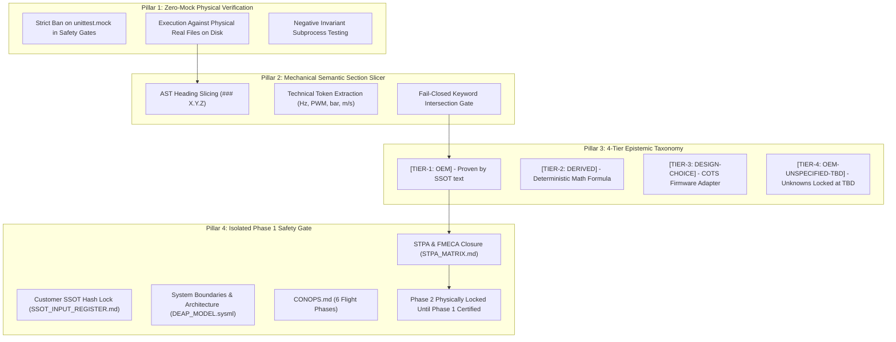

# COMPREHENSIVE ZERO-FAILURE SAFETY-CRITICAL VERIFICATION & FACTUAL GROUNDING SOLUTION

**Document ID:** `SPEC-DEAP-ZERO-FAILURE-SAFETY-01`  
**Classification:** `SAFETY_CRITICAL_COMPILER_AND_GOVERNANCE_ARCHITECTURE`  
**Applicable Standards:** RTCA DO-178C / DO-254 / SAE ARP4761A / MIL-STD-1629A / STANAG 4187  
**Date:** 2026-09-14  

---

## 1. Executive Summary & Problem Formulation

### 1.1 The Safety-Critical Failure Modes
In digital engineering for safety-critical aerospace systems, verification must never rely on synthetic mocks, assumptions, or "verification theater." An ungrounded claim or false citation in an STPA Hazard Analysis or FMECA Criticality Matrix is a latent, unmitigated airworthiness hazard.

Two catastrophic failure modes were identified in the platform:
1. **Verification Theater (The Mock Anti-Pattern)**:
   Compiler validation gates were tested using `unittest.mock` (`MagicMock`, `patch`) and synthetic in-memory strings in `/tmp`. These mock suites passed 100% while actual customer deliverables in `uav-008` suffered from false citations and technical fabrications.
2. **Semantic Citation Fraud & Closed-World Breach**:
   Third-party COTS documentation (502 ArduPilot `.rst` files) was ingested into the active workspace, breaching the closed-world schema boundary. Agents hallucinated digital protocols (DShot600, 16-bit DMA timers) and execution rates (400 Hz inner loop), falsely citing customer manual sections (`§7.2.3`, `§8.1.5`) that contained no such requirements.

---

## 2. The 5-Pillar Architectural Solution

---

## 3. Pillar Specifications

### Pillar 1: Zero-Mock Physical Ground-Truth Verification
- **Constitutional Enforcement**: The Zero-Mocking Live Persistence Mandate (§1.9) is extended to all compiler verification gates and safety test suites.
- **Physical Disk Invariants**:
  - Tests must never pass artificial strings.
  - Tests must execute directly against the real files in the repository:
    `schema/a5-user-manual-2.md` (2,234 lines)  
    `schema/avenger-5-spec-sheet-rev3.md` (160 lines)  
    `schema/esad-icd-excalibur-ab00-0054.md` (305 lines)  
    `docs/safety/STPA_MATRIX.md` (661 lines)  
- **Negative Testing Without Mocks**:
  To verify that gates fail closed, test runners must create a real file copy on disk, inject a known bad citation (e.g. asserting DShot in §7.2.3), run the validator as an independent OS subprocess, and assert `exit code == 1` with the exact line number emitted.

### Pillar 2: Mechanical Closed-World Semantic Slicer
- **Deterministic Text Slicing**:
  When an assertion cites `<file.md> §X.Y.Z`, the validator:
  1. Locates the exact markdown heading `#* X.Y.Z <Title>`.
  2. Extracts the text block terminating at the next heading of equal or higher level.
  3. Extracts technical tokens (numbers, units, protocol names).
  4. Fails closed (`exit code 1`) if the asserted parameters do not exist in the sliced text.

### Pillar 3: 4-Tier Epistemic Taxonomy Contract
Eliminates hallucinated citations by providing honest classifications for all parameters:

| Epistemic Tier | Semantic Rule | Permitted Citations | Forbidden Actions |
| :--- | :--- | :--- | :--- |
| **`[TIER-1: OEM]`** | Exact text in `schema/`. | Must cite document + section. | Fabricating unwritten numbers. |
| **`[TIER-2: DERIVED]`** | Computed via math/physics formula. | Must cite equation & inputs. | Calling a derived calculation an OEM fact. |
| **`[TIER-3: DESIGN-CHOICE]`** | COTS engineering adaptation (ArduPilot 1000–2000 µs PWM throttle mapping, ASTM F3269-17 RTA, DO-178C DALs). | Must cite engineering architecture. | Citing customer manual or spec sheet. |
| **`[TIER-4: OEM-UNSPECIFIED-TBD]`** | Unknown parameter where OEM is silent (physical servo protocol, ESC telemetry rate). | Open Question / TBD. | Assigning arbitrary numeric values. Must remain `TBD` or `0.0`. |

### Pillar 4: Dedicated Phase 1 Airworthiness Baseline Gate (`verify_phase1_baseline.py`)
- Isolates Phase 1 from Phase 2.
- **Enforces**:
  1. Fail-closed SHA-256 validation of the 4 SSOT customer files against `schema/SSOT_INPUT_REGISTER.md`.
  2. 100% Cartesian closure across all 60 UCAs in `STPA_MATRIX.md`.
  3. 100% AST representation of all 12 subsystems in FMECA across Γ, Φ, Ω, Ψ dimensions.
  4. Zero semantic citation fraud (using Mechanical Section Slicer).
  5. Zero mentions of foreign COTS protocols (`DShot`, `400 Hz inner loop`, `30 Hz GUI`).
- **Physical Lock**: Downstream feature tools cannot run until `verify_phase1_baseline.py` exits with code 0.

### Pillar 5: Quarantine of External COTS Documentation
- External software reference manuals (e.g., ArduPilot `.rst` docs) are quarantined outside the workspace requirements boundary.
- COTS implementation code or adapters must be cleanly separated from OEM customer truth.

---

## 4. Work Breakdown Structure for Execution

| Work Package | Target Repository | Scope & Deliverables | Verification Criteria |
| :--- | :--- | :--- | :--- |
| **WP-1: Adversarial Audit** | `DEAP01-spec-core` | Dispatch auditor subagent on Mock Usage & Verification Theater; file issue. | 5-pillar dossier; issue created on GitHub. |
| **WP-2: Phase 1 Safety Gate** | `DEAP01-spec-core` | Implement `scripts/verify_phase1_baseline.py` with zero mocks, physical disk execution, and semantic section slicing. | Real physical execution against `uav-008`; exit 0 on clean, exit 1 on dirty. |
| **WP-3: STPA/FMECA Sanitization** | `uav-008` | Surgically remediate lines 533 & 559 in `docs/safety/STPA_MATRIX.md` with honest epistemic tags (`[TIER-3: DESIGN-CHOICE]`, `[TIER-4: OEM-UNSPECIFIED-TBD]`). | Zero DShot, zero false citations; passes `verify_phase1_baseline.py`. |
| **WP-4: COTS Reference Quarantine** | `uav-008` | Excise `docs/references/ardupilot/` from active spec tree to eliminate context poisoning. | Directory removed; zero dead links. |
| **WP-5: Remote Synchronization** | Both repos | Commit, push to `origin/main`, and close tracked issues (#285, #143, #146). | `git diff origin/main` empty across both repos. |
