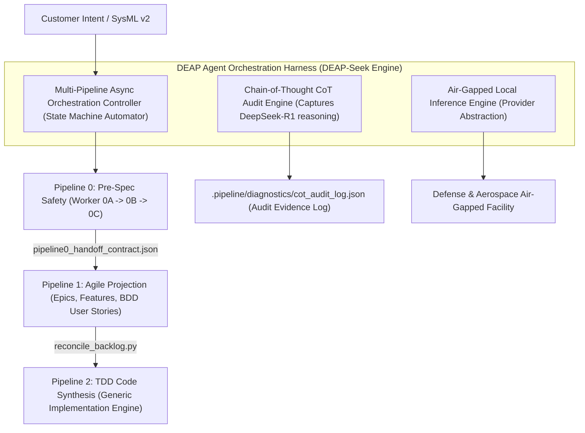
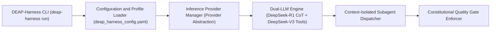
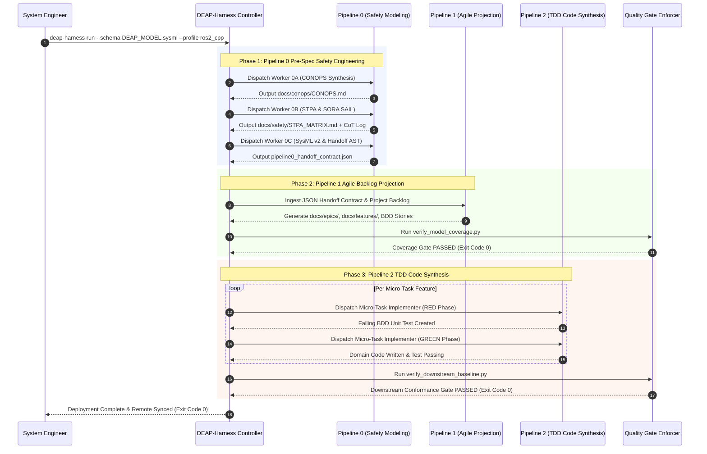

# DEAP Agent Orchestration Harness (DEAP-Harness) — DeepSeek Engine Integration Blueprint

> **Document Identifier:** `DEAP-BLUEPRINT-HARNESS-001`  
> **Status:** `APPROVED / PRODUCTION-GRADE`  
> **Classification:** `DeepSeek Engine Architectural Integration & Multi-Pipeline Orchestration`  
> **Target Frameworks:** `JARUS SORA v2.5` | `ASTM F3269-17 RTA` | `RTCA DO-178C` | `RTCA DO-365B DAA`  
> **Primary Technology Profile:** `DEAP-Harness (DeepSeek-R1 / DeepSeek-V3 Open-Source Engine)`

---

## 1. Executive Summary & Product Branding

The **DEAP Agent Orchestration Harness (`DEAP-Harness`)**, powered by the **DEAP-Seek Agent Engine**, establishes a unified, open-source, air-gapped agentic orchestration framework for the Digital Engineering Agent Platform (DEAP). 

By deeply embedding DeepSeek’s open-source reasoning models (DeepSeek-R1 for long Chain-of-Thought reasoning and DeepSeek-V3/Coder for tool invocation and code generation) into DEAP, `DEAP-Harness` ties **Pipeline 0 (Pre-Spec Safety Engineering)**, **Pipeline 1 (Agile Backlog Projection)**, and **Pipeline 2 (TDD Code Synthesis)** into an end-to-end, autonomous, self-hosted engineering pipeline.



---

## 2. Core Architectural Objectives

1. **Air-Gapped & Off-Grid Defense Operations**:
   Enable aerospace, defense, and urban air mobility (UAM) organizations operating under DO-178C / DO-254 or SORA SAIL High-Risk categories to execute complete DEAP pipelines in 100% air-gapped, classified labs without transmitting proprietary flight control laws, CONOPS, or safety statecharts to cloud LLM endpoints.

2. **Deterministic Chain-of-Thought (CoT) Safety Audit Evidence**:
   Automatically capture and archive raw DeepSeek-R1 reasoning traces (`<think>...</think>`) into `.pipeline/diagnostics/cot_audit_log.json`. Every safety constraint ($SC-1..N$), System-Theoretic Process Analysis (STPA) Unsafe Control Action ($UCA-1..N$), and Run-Time Assurance (RTA) switching threshold is backed by immutable, traceable LLM reasoning evidence for FAA/EASA regulatory reviews.

3. **Autonomous End-to-End Pipeline State Machine**:
   Eliminate manual human context-switching between pipeline stages. `DEAP-Harness` orchestrates the handoff from Pipeline 0 (SysML v2 textual model and `pipeline0_handoff_contract.json`) to Pipeline 1 (Agile backlog generation) and Pipeline 2 (serial subagent RED-GREEN TDD code synthesis) with automated quality gate enforcement (`verify_model_coverage.py`, `verify_downstream_baseline.py`).

---

## 3. System Architecture & Component Topology

`DEAP-Harness` is structured into four primary subsystem modules:



### 3.1 Dual-LLM Inference Pattern (DeepSeek-R1 + DeepSeek-V3)

`DEAP-Harness` employs a **Dual-LLM Orchestration Pattern** to maximize reasoning depth while maintaining high-speed tool calling and JSON generation:

* **Reasoning Phase (DeepSeek-R1)**:
  For complex safety engineering tasks (STPA hazard identification, SORA SAIL risk classification, SysML v2 statechart formalization), the harness routes the prompt to DeepSeek-R1. The engine extracts and logs the `<think>...</think>` block to the regulatory audit store.
* **Execution & Tool Invocation Phase (DeepSeek-V3 / Coder)**:
  The harness feeds the finalized reasoning state into DeepSeek-V3/Coder to generate valid AST JSON contracts, format Mermaid class diagrams, write clean Python/C++ code, and execute shell tools cleanly.

---

## 4. End-to-End Multi-Pipeline Orchestration Workflow

The sequence diagram below illustrates how `DEAP-Harness` drives an autonomous multi-pipeline run:



---

## 5. Regulatory Chain-of-Thought (CoT) Audit Log Specification

Every invocation managed by `DEAP-Harness` automatically generates a structured audit record stored at `.pipeline/diagnostics/cot_audit_log.json`:

```json
{
  "$schema": "https://deap.engine/schemas/cot_audit_v1.json",
  "audit_metadata": {
    "execution_id": "EXEC-20260816-DEAPSEEK-001",
    "timestamp": "2026-08-16T22:14:00Z",
    "model_reasoning_engine": "DeepSeek-R1-671B",
    "tool_execution_engine": "DeepSeek-V3-671B",
    "air_gapped_mode": true,
    "inference_provider": "vllm_local_cluster"
  },
  "pipeline_stage": "PIPELINE_0_STPA_HAZARD_ANALYSIS",
  "target_artifact": "docs/safety/STPA_MATRIX.md",
  "reasoning_trace": {
    "raw_think_block": "Analyzing pitch command saturation under high-wind urban gusts (CONOPS Phase: Cruise/Inspection). STPA UCA-1 identifies provided-wrong-or-out-of-range pitch commands leading to Loss L-1 (UFIT). To enforce RTA safety net switching under ASTM F3269-17, pitch rate must be clamped between -15 deg and +25 deg before sending commands to PX4 actuator uORB topics.",
    "extracted_safety_constraints": [
      {
        "id": "SC-1",
        "stpa_uca_ref": "UCA-1",
        "hazard_ref": "H-1",
        "derived_boundary": "pitch_deg >= -15.0 && pitch_deg <= 25.0",
        "assurance_level": "DAL A / SAIL IV"
      }
    ]
  },
  "verification_status": {
    "syntax_valid": true,
    "gate_exit_code": 0
  }
}
```

---

## 6. DEAP-Harness Configuration & Execution Interface

### 6.1 Configuration File (`deap_harness_config.yaml`)

```yaml
version: "1.0"
harness_branding: "DEAP-Harness / DEAP-Seek Engine"

provider:
  type: "vllm" # Options: vllm, sglang, ollama, custom_openai_compatible
  base_url: "http://localhost:8000/v1"
  api_key: "DEAP_LOCAL_AIRGAPPED_TOKEN"

models:
  reasoning: "deepseek-r1-671b"
  execution: "deepseek-v3-671b"

pipeline_settings:
  pipeline0:
    auto_ingest_sysml: true
    default_schema_path: "docs/architecture/blueprints/DEAP_MODEL.sysml"
  pipeline1:
    reconcile_backlog_on_completion: true
  pipeline2:
    enforce_tdd_red_green: true
    target_profile: "ros2_cpp" # Options: ros2_cpp, px4_module, python

audit_logging:
  enabled: true
  output_path: ".pipeline/diagnostics/cot_audit_log.json"
```

### 6.2 CLI Usage Commands

```bash
# 1. Execute full turnkey pipeline run (Pipeline 0 -> 1 -> 2)
deap-harness run --schema docs/architecture/blueprints/DEAP_MODEL.sysml --profile ros2_cpp

# 2. Execute Pipeline 0 pre-spec safety engineering only
deap-harness pipeline0 --sysml docs/architecture/blueprints/DEAP_MODEL.sysml

# 3. Export DO-178C / SORA SAIL regulatory CoT audit evidence package
deap-harness export-audit --output-dir docs/safety/audit_evidence/
```

### 6.3 Web GUI Dashboard & Interactive Command Center

`DEAP-Harness` ships with an integrated, local Web GUI Dashboard (`http://localhost:3000`) for interactive pipeline monitoring, visual safety auditing, and human-in-the-loop governance:

#### 6.3.1 Key Web GUI Subsystem Modules:
1. **Live Chain-of-Thought (CoT) Streamer**:
   Real-time WebSocket rendering of DeepSeek-R1 reasoning steps (`<think>...</think>`) side-by-side with generated artifacts (`CONOPS.md`, `STPA_MATRIX.md`, `DEAP_MODEL.sysml`).
2. **Interactive Multi-Pipeline DAG Visualizer**:
   Visual node graph tracking real-time progress across Pipeline 0 (Worker 0A → 0B → 0C) → Pipeline 1 (Agile Backlog Projection) → Pipeline 2 (TDD Micro-tasks).
3. **STPA Hazard & SORA SAIL Audit Explorer**:
   Searchable grid mapping System Hazards ($H-1..N$), Unsafe Control Actions ($UCA-1..N$), Safety Constraints ($SC-1..N$), and Operational Safety Objectives (OSOs) directly to CoT reasoning logs.
4. **Human-in-the-Loop Review & Approval Gates**:
   Interactive modal gates allowing Product Owners and Safety Officers to review and approve generated AST handoff contracts (`pipeline0_handoff_contract.json`) before downstream TDD code synthesis begins.

#### 6.3.2 Web GUI Launch Commands:

```bash
# 1. Launch DEAP-Harness Web GUI Dashboard
deap-harness ui --port 3000

# 2. Launch Web GUI in air-gapped local mode with real-time CoT streaming
deap-harness ui --local --stream-cot --air-gapped
```

### 6.4 VS Code & IDE Native Integration Architecture

`DEAP-Harness` CLI and Web GUI are 100% usable directly inside **Visual Studio Code (VS Code)** through four native integration modes:

#### 6.4.1 Integrated Terminal Execution (Zero Setup)
Run all `deap-harness` CLI commands directly within VS Code's integrated terminal (`Cmd+\`` / `Ctrl+\``):
```bash
deap-harness run --schema docs/architecture/blueprints/DEAP_MODEL.sysml --profile ros2_cpp
```

#### 6.4.2 VS Code Build & Task Automation (`.vscode/tasks.json`)
Bind `deap-harness` commands directly to VS Code build tasks (`Cmd+Shift+B` / `Ctrl+Shift+B`):
```json
{
  "version": "2.0.0",
  "tasks": [
    {
      "label": "DEAP: Run Full Safety & Synthesis Pipeline",
      "type": "shell",
      "command": "deap-harness run --schema ${workspaceFolder}/docs/architecture/blueprints/DEAP_MODEL.sysml --profile ros2_cpp",
      "group": { "kind": "build", "isDefault": true },
      "presentation": { "reveal": "always", "panel": "new" }
    },
    {
      "label": "DEAP: Launch CoT Web GUI Dashboard",
      "type": "shell",
      "command": "deap-harness ui --port 3000 --stream-cot",
      "isBackground": true
    }
  ]
}
```

#### 6.4.3 Embedded VS Code Webview Panel
Embed the interactive Web GUI directly inside a VS Code editor tab alongside your code using Simple Browser or the `DEAP-Harness VS Code Extension`:
```bash
deap-harness ui --vscode
```

#### 6.4.4 AI Agent Sidecar Protocol (Antigravity / Claude Code / Cursor / Gemini CLI)
The `deap-harness` CLI exposes a local REST/WebSocket sidecar daemon (`http://localhost:8000`) that AI agent extensions inside VS Code call via standard process hooks to ingest `.pipeline/diagnostics/cot_audit_log.json` and execute subagent dispatches natively.

---

## 7. Downstream Integration & Maintenance Plan

1. **Repository Target**: Hosted centrally under `docs/architecture/blueprints/DEAP_DEEPSEEK_HARNESS_INTEGRATION_BLUEPRINT.md` in [`DEAP-spec-core`](https://github.com/gintatkinson/DEAP-spec-core).
2. **Backlog Reconciliation**: Integrated into `DEAP_SPECIFICATIONS_SITEMAP.md` as a Tier-1 architecture blueprint.
3. **Execution Script**: Implementation entry point provided via `scripts/deap_harness.py` for downstream project installation.
