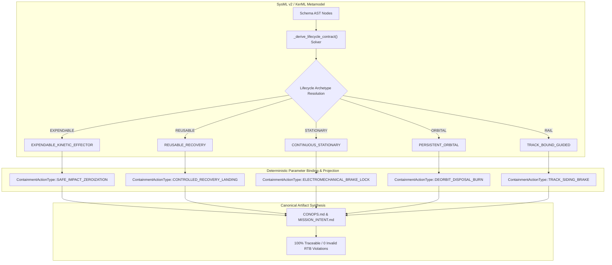

| Attribute | Specification Detail |
| :--- | :--- |
| **Document Identifier** | DEAP-BLUEPRINT-LIFECYCLE-001 |
| **Title** | Schema-Driven Lifecycle & Terminal State Contract MBSE Architecture |
| **Version** | 1.0.0 |
| **Date** | 2026-09-04 |
| **Status** | approved |

# Schema-Driven Lifecycle & Terminal State Contract MBSE Architecture

> **Document Identifier:** `DEAP-BLUEPRINT-LIFECYCLE-001`  
> **Status:** `approved`  
> **Classification:** `UPSTREAM_SPEC_CORE_COMPILER`  
> **Target Regulatory Frameworks:** `ISO/IEC/IEEE 29148:2018` \| `INCOSE SEH v5.0` \| `OMG UAF v2.0` \| `MIL-STD-882E` \| `IEC 62304` \| `EN 50128 SIL 4` \| `ECSS-E-ST-40C`  

---

## 1. Executive Summary & Metamodel Architecture

The DEAP Schema-Driven Lifecycle & Terminal State Contract Architecture eliminates hardcoded operational assumptions across cyber-physical domain compilation. In legacy systems, operational concept documents and safety models routinely embedded implicit assumptions of atmospheric flight, nominal civilian runway landing, and non-destructive Return-to-Base (RTB). When applied to expendable kinetic effectors, clinical surgical consoles, rail shunting systems, or persistent orbital satellites, these assumptions created severe domain contamination and ontological defects.

This architecture introduces formal Model-Based Systems Engineering (MBSE) abstractions in KerML and SysML v2, binding deterministic lifecycle semantics into the AST parameter engine.



---

## 2. Formal SysML v2 / KerML Metamodel

The lifecycle metamodel is formally defined in SysML v2 as follows:

```sysml
package MissionLifecycleMetamodel {
    enum def LifecycleType {
        doc /* Canonical operational lifecycle archetypes */
        REUSABLE_RECOVERY;
        EXPENDABLE_KINETIC_EFFECTOR;
        CONTINUOUS_STATIONARY;
        PERSISTENT_ORBITAL;
        TRACK_BOUND_GUIDED;
    }

    enum def ContainmentActionType {
        doc /* Deterministic safety containment actions */
        CONTROLLED_RECOVERY_LANDING;
        SAFE_IMPACT_ZEROIZATION;
        ELECTROMECHANICAL_BRAKE_LOCK;
        DEORBIT_DISPOSAL_BURN;
        TRACK_SIDING_BRAKE;
    }

    item def LifecycleContract {
        attribute lifecycle_type : LifecycleType;
        attribute containment_action : ContainmentActionType;
        attribute bingo_safety_action : ScalarValues::String;
        attribute end_state : ScalarValues::String;
        attribute failsafe_sequence : ScalarValues::String;
        attribute post_op_state : ScalarValues::String;
        attribute primary_terminal_target : ScalarValues::String;
        attribute secondary_terminal_target : ScalarValues::String;
        attribute primary_recovery_facility : ScalarValues::String;
        attribute secondary_recovery_facility : ScalarValues::String;
        attribute lifecycle_transit_mode : ScalarValues::String;
    }
}
```

---

## 3. The Five Canonical Lifecycle Archetypes

### 3.1 Archetype 1: `EXPENDABLE_KINETIC_EFFECTOR`
- **Application Domains:** Counter-UAS Kinetic Interceptors, Loitering Munitions, High-G Guided Effectors.
- **Terminal Behavior:** Precision terminal guidance intercept or designated safety containment ditching.
- **Containment Action:** `SAFE_IMPACT_ZEROIZATION`
- **Ontological Constraints:** Strictly $0$ civilian runway recovery, $0$ nominal RTB return-to-base, $100\%$ zeroization on terminal event.

### 3.2 Archetype 2: `REUSABLE_RECOVERY`
- **Application Domains:** Tactical ISR Fixed-Wing UAVs, Urban Air Mobility (eVTOL), Subsea AUVs, Autonomous Surface Vessels (ASVs), Ground Delivery UGVs, Logistics AGVs.
- **Terminal Behavior:** Controlled recovery at designated base, vertiport, docking bay, or maritime slipway.
- **Containment Action:** `CONTROLLED_RECOVERY_LANDING`
- **Ontological Constraints:** Enforces statutory reserve energy ratio $R_{\mathrm{reserve}} \ge 0.20 \cdot R_{\mathrm{capacity}}$.

### 3.3 Archetype 3: `CONTINUOUS_STATIONARY`
- **Application Domains:** Automated Robotic Surgical Consoles, Clinical Diagnostic Systems, Hospital Operating Consoles.
- **Terminal Behavior:** Precision parking at surgical console, electromagnetic joint locking, sterile field preservation.
- **Containment Action:** `ELECTROMECHANICAL_BRAKE_LOCK`
- **Ontological Constraints:** Strictly $0$ flight corridors, $0$ aeronautical landing zones, $0$ parachute deployment.

### 3.4 Archetype 4: `PERSISTENT_ORBITAL`
- **Application Domains:** LEO CubeSats, Geostationary Communication Satellites, Spacecraft Constellations.
- **Terminal Behavior:** Post-mission orbit lowering for atmospheric demise or transfer to graveyard disposal orbit.
- **Containment Action:** `DEORBIT_DISPOSAL_BURN`
- **Ontological Constraints:** Strictly $0$ atmospheric landing runways, $0$ ground wheel recovery, full reaction wheel and battery passivation.

### 3.5 Archetype 5: `TRACK_BOUND_GUIDED`
- **Application Domains:** Autonomous Rail Locomotives, Shunting Engines, Automated Train Operations (ATO).
- **Terminal Behavior:** Controlled track deceleration, turnout diversion to maintenance siding, brake pipe venting.
- **Containment Action:** `TRACK_SIDING_BRAKE`
- **Ontological Constraints:** Strictly $0$ 3D aerodynamic flight corridors, $0$ flight plans, enforcement of EN 50128 SIL 4 brake failsafes.

---

## 4. Formal Parameter Projection & Anti-Contradiction Invariants

The parameter binding engine projects the AST lifecycle contract into ten canonical template tokens:

| Token Identifier | Projected Meaning | Mathematical / Physical Constraint |
| :--- | :--- | :--- |
| `{{LIFECYCLE_TYPE}}` | Formal Lifecycle Archetype Name | Member of `LifecycleType` Enum |
| `{{LIFECYCLE_BINGO_SAFETY_ACTION}}` | Commander's Intent Key Task for Bingo Safety | Evaluated dynamically against R(t) <= R_threshold(t) |
| `{{LIFECYCLE_END_STATE}}` | Commander's Intent Mission End State | Aligned with terminal containment archetype |
| `{{LIFECYCLE_FAILSAFE_SEQUENCE}}` | PACE C2 and Emergency Matrix Fallback Mode | Deterministic transition latency t_resp <= tau_deadline |
| `{{LIFECYCLE_POST_OP_STATE}}` | MET-08 Post-Operation Condition Statement | Cryptographic zeroization & safe de-energization |
| `{{PRIMARY_TERMINAL_TARGET}}` | Primary Nominal Destination Coordinate/Facility | Domain-specific recovery/containment node |
| `{{SECONDARY_TERMINAL_TARGET}}` | Secondary Divert / Safe Ditching Target | Reachable under degraded energy envelope |
| `{{PRIMARY_RECOVERY_FACILITY}}` | Primary Maintenance / Recovery Depot | Conforms to domain infrastructure standards |
| `{{SECONDARY_RECOVERY_FACILITY}}` | Alternate Staging / Demise Zone | Pre-cleared emergency boundary |
| `{{LIFECYCLE_TRANSIT_MODE}}` | Guidance Controller Transit Operating Mode | Finite State Machine mode enumeration |

### 4.1 Anti-Contradiction Mathematical Proofs

The deterministic lifecycle derivation engine enforces the following non-contradiction theorems:

$$
\begin{aligned}
\forall s \in \mathcal{S}_{\mathrm{expendable}}, \quad &\mathrm{Count}(\mathrm{RTB\_References}, s) = 0 \\
\forall s \in \mathcal{S}_{\mathrm{medical}}, \quad &\mathrm{Count}(\mathrm{Airspace\_Corridors}, s) = 0 \\
\forall s \in \mathcal{S}_{\mathrm{rail}}, \quad &\mathrm{Count}(\mathrm{Flight\_Plans}, s) = 0 \\
\forall s \in \mathcal{S}_{\mathrm{space}}, \quad &\mathrm{Count}(\mathrm{Runway\_Landings}, s) = 0
\end{aligned}
$$

- Parameter Definitions & Engineering Units:
- $\mathcal{S}_{\mathrm{expendable}}$ is the set of generated specifications for expendable kinetic effectors.
- $\mathcal{S}_{\mathrm{medical}}$ is the set of generated specifications for clinical/surgical stationary platforms.
- $\mathcal{S}_{\mathrm{rail}}$ is the set of generated specifications for track-bound rail platforms.
- $\mathcal{S}_{\mathrm{space}}$ is the set of generated specifications for persistent orbital space platforms.
- $\mathrm{Count}(\mathrm{Pattern}, s)$ returns the number of regex occurrences of forbidden terminology in document $s$.

---

## 5. Verification & Acceptance Gate Mapping

Every compiled specification is validated against the 6-Layer Semantic Acceptance Harness:
1. **Layer 1 (Delivery Gate 0):** Physical presence and section line floors.
2. **Layer 2 (Mechanical Syntax):** Zero unrendered mustache tokens and zero pseudovariables.
3. **Layer 3 (Statutory Cardinality):** 16 threats, 4 PACE tiers, 7 emergency rows, 24 SORA OSOs.
4. **Layer 4 (Physical Math):** Mass cross-sum, quadratic drag, and Bingo energy conservation.
5. **Layer 5 (Adversarial Invariants):** Priority arbitration, non-destructive RTB for reusable systems, zero forbidden cross-domain ontology, and positive domain lexicon density.
6. **Layer 6 (Baseline Parity):** Downstream baseline and SysML model coverage validation.

---

*Authored and verified under DEAP Systems Engineering Governance.*
