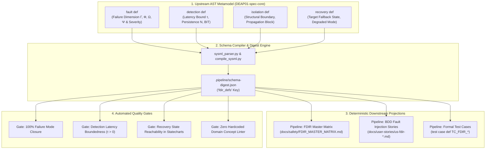
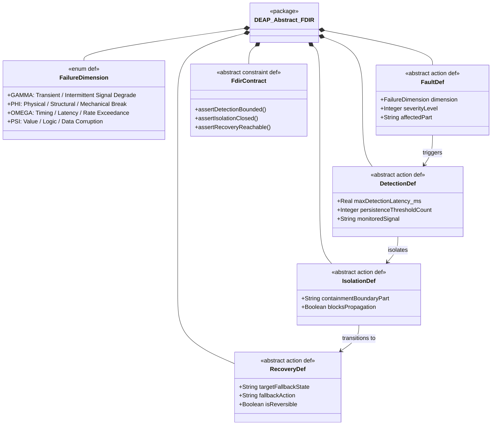
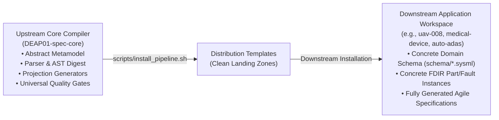

# Architectural Blueprint: Pure Domain-Independent FDIR Framework for DEAP

**Classification:** Upstream Specification Core Compiler (`DEAP01-spec-core`) & Downstream Templates  
**Architecture Paradigm:** Model-Based Systems Engineering (MBSE) Pure Schema-Driven Compiler  
**Invariants:** Zero Hardcoded Domain Concepts | Deterministic AST Derivation | Clean Landing Zones  
**Standards:** ISO/IEC/IEEE 15288 | STPA | MIL-STD-1629A | KerML / SysML v2 ISO Standard  

---

## 1. Executive Summary & Problem Statement

In mission-critical autonomous and physical systems, safety is not merely passive hazard documentation (FMECA/STPA); it requires **active, deterministic runtime control reconfiguration**. 

The **Digital Engineering Agent Platform (DEAP)** integrates **FDIR (Fault Detection, Isolation, and Recovery)** as a first-class, **purely domain-independent compiler capability**. Rather than hardcoding domain concepts (e.g. aircraft wings, medical pumps, vehicle brakes), DEAP formalizes FDIR through abstract mathematical primitives parameterized by:
1. **Universal Failure Dimensions ($\Gamma, \Phi, \Omega, \Psi$)**
2. **Detection Bounds ($\tau_{\text{detect}}, N_{\text{persist}}$)**
3. **Containment & Isolation Boundaries**
4. **Target Statechart Fallback Transitions & Containment Actions**



---

## 2. Universal Domain-Independent FDIR Metamodel



### 2.1 Formal KerML / SysML v2 Concrete Syntax

```sysml
// Abstract Domain-Independent FDIR Package in SysML v2 / KerML
package DEAP_Abstract_FDIR {
    private import ScalarValues::*;

    // 1. Universal Failure Dimensions
    enum def FailureDimension {
        enum Gamma; // Transient / Intermittent Signal or Hardware Degrade
        enum Phi;   // Physical / Structural / Mechanical Failure
        enum Omega; // Timing / Performance / Latency / Rate Exceedance
        enum Psi;   // Value / Logic / Protocol / Corruption Anomaly
    }

    // 2. Abstract Fault Definition
    abstract action def AbstractFault {
        attribute dimension : FailureDimension;
        attribute severityLevel : Integer; // 1 (Minor) to 4 (Catastrophic)
        attribute faultSourcePart : String;
    }

    // 3. Abstract Detection Mechanism
    abstract action def AbstractDetection {
        attribute maxDetectionLatency_ms : Real;
        attribute persistenceThresholdCount : Integer;
        attribute monitoredSignalName : String;
    }

    // 4. Abstract Isolation Boundary
    abstract action def AbstractIsolation {
        attribute containmentBoundaryPart : String;
        attribute isolatesPropagation : Boolean;
    }

    // 5. Abstract Recovery Action
    abstract action def AbstractRecovery {
        attribute targetFallbackState : String;
        attribute containmentAction : String;
        attribute isReversible : Boolean;
    }

    // 6. Universal FDIR Contract (Formal Mathematical Invariant)
    abstract constraint def AbstractFdirContract {
        doc /* Asserts deterministic closure across Fault -> Detection -> Isolation -> Recovery */
    }
}
```

---

## 3. Upstream Compiler Pipeline Architecture (`DEAP01-spec-core`)

The compiler enhancements reside entirely within the abstract toolchain:

### 3.1 AST Parser Extensions (`scripts/sysml_parser.py`)
- Recognizes `fault def`, `detection def`, `isolation def`, `recovery def`, and `fdir contract def` AST nodes.
- Extracts attributes into clean dictionary AST representations:
  ```json
  {
    "fdir_defs": [
      {
        "name": "Fault_TelemetryDropout",
        "dimension": "Omega",
        "severity": 3,
        "detection": {
          "name": "Detect_HeartbeatTimeout",
          "latency_ms": 200.0,
          "persistence": 3
        },
        "isolation": {
          "boundary": "CommsSubsystem",
          "blocks_propagation": true
        },
        "recovery": {
          "target_state": "State_DegradedMode",
          "action": "SwitchToFallbackChannel",
          "is_reversible": true
        }
      }
    ]
  }
  ```

### 3.2 Schema Digest Integration (`scripts/compile_sysml.py`)
- Ingests user-provided `.sysml` schema files in downstream repositories.
- Emits `.pipeline/schema-digest.json` including the `"fdir_defs"` collection.

### 3.3 Abstract Matrix & BDD Projection Engine
- Translates `schema-digest.json` into markdown specifications:
  - **`docs/safety/FDIR_MASTER_MATRIX.md`**: Authoritative matrix mapping every failure mode to detection, isolation, recovery, and test case.
  - **`docs/user-stories/us-fdir-*.md`**: Behavior-Driven Development (BDD) User Stories with executable Gherkin scenarios for hardware/software fault injection.

---

## 4. Downstream Distribution & Lifecycle Model



---

## 5. Domain Independence Verification & Quality Gates

The compiler enforces strict gates ensuring zero domain coupling:

1. **Gate 1: AST Extraction Gate (`test_fdir_parser.py`)**:
   - Asserts that generic models (`Node1`, `Node2`, `SigA`, `FaultB`) parse with 100% fidelity.
2. **Gate 2: Zero Domain String Linter (`test_domain_independence.py`)**:
   - Scans all upstream parser scripts for forbidden domain words (e.g. `wing`, `airframe`, `rudder`, `patient`, `infusion`, `brake`, `vehicle`) to guarantee pure abstract semantics.
3. **Gate 3: Statechart Reachability Gate**:
   - Proves mathematically that all declared `targetFallbackState` strings correspond to actual `state def` nodes in the schema.
4. **Gate 4: Bounded Detection Gate**:
   - Asserts that every critical fault has $\tau_{\text{detect}} > 0$ and a non-empty isolation boundary.
