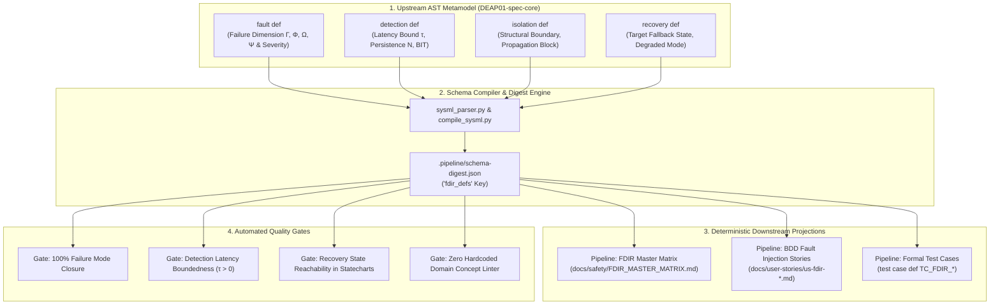
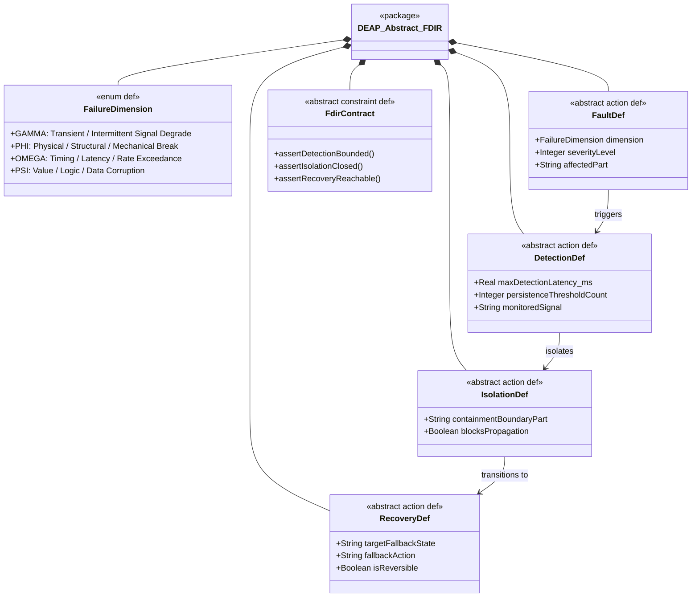
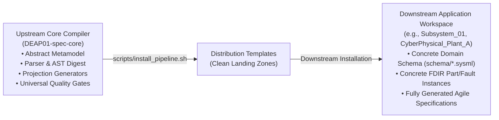

| Attribute | Specification Detail |
| :--- | :--- |
| **Document Identifier** | DEAP-BLUEPRINT-FDIR-001 |
| **Title** | Architectural Blueprint: Pure Domain-Independent FDIR Framework for DEAP |
| **Version** | 2.0.0 |
| **Date** | 2026-10-04 |
| **Status** | APPROVED / PRODUCTION-GRADE |

# Architectural Blueprint: Pure Domain-Independent FDIR Framework for DEAP

> **Document Identifier:** `DEAP-BLUEPRINT-FDIR-001`  
> **Status:** `APPROVED / PRODUCTION-GRADE`  
> **Classification:** `UPSTREAM_SPEC_CORE_COMPILER`  
> **Architecture Paradigm:** Model-Based Systems Engineering (MBSE) Pure Schema-Driven Compiler  
> **Invariants:** Zero Hardcoded Domain Concepts | Deterministic AST Derivation | Clean Landing Zones  
> **Target Regulatory Frameworks:** `ISO/IEC/IEEE 15288:2023` | `ISO/IEC/IEEE 29148:2018` | `STPA` | `Formal FMECA` | `AssuranceLevel::Tier1..5` | `Formal Bipartite Verification Graphs G = (V_req, V_test, E)`  

---

## 1. Executive Summary & Problem Statement

In mission-critical autonomous and physical systems, safety is not merely passive hazard documentation (FMECA/STPA); it requires **active, deterministic runtime control reconfiguration**. 

The **Digital Engineering Agent Platform (DEAP)** integrates **FDIR (Fault Detection, Isolation, and Recovery)** as a first-class, **purely domain-independent compiler capability**. Rather than hardcoding domain-specific concepts (such as physical plant structures, fluid dispensers, or friction brakes), DEAP formalizes FDIR through abstract mathematical primitives parameterized by:
1. **Universal Failure Dimensions ($\Gamma, \Phi, \Omega, \Psi$)**
2. **Detection Bounds ($\tau_{\text{detect}}, N_{\text{persist}}$)**
3. **Containment & Isolation Boundaries**
4. **Target Statechart Fallback Transitions & Containment Actions**


```mermaid
flowchart TD
    subgraph "1. Upstream AST Metamodel (DEAP01-spec-core)"
        F_DEF["fault def<br/>(Failure Dimension Γ, Φ, Ω, Ψ & Severity)"]
        D_DEF["detection def<br/>(Latency Bound τ, Persistence N, BIT)"]
        I_DEF["isolation def<br/>(Structural Boundary, Propagation Block)"]
        R_DEF["recovery def<br/>(Target Fallback State, Degraded Mode)"]
    end

    subgraph "2. Schema Compiler & Digest Engine"
        F_DEF & D_DEF & I_DEF & R_DEF --> PARSER["sysml_parser.py & compile_sysml.py"]
        PARSER --> DIGEST[".pipeline/schema-digest.json<br/>('fdir_defs' Key)"]
    end

    subgraph "3. Deterministic Downstream Projections"
        DIGEST --> MAT_PROJ["Pipeline: FDIR Master Matrix<br/>(docs/safety/FDIR_MASTER_MATRIX.md)"]
        DIGEST --> BDD_PROJ["Pipeline: BDD Fault Injection Stories<br/>(docs/user-stories/us-fdir-*.md)"]
        DIGEST --> REQ_PROJ["Pipeline: Formal Test Cases<br/>(test case def TC_FDIR_*)"]
    end

    subgraph "4. Automated Quality Gates"
        DIGEST --> G1["Gate: 100% Failure Mode Closure"]
        DIGEST --> G2["Gate: Detection Latency Boundedness (τ > 0)"]
        DIGEST --> G3["Gate: Recovery State Reachability in Statecharts"]
        DIGEST --> G4["Gate: Zero Hardcoded Domain Concept Linter"]
    end
```

---

## 2. Universal Domain-Independent FDIR Metamodel


```mermaid
classDiagram
    class DEAP_Abstract_FDIR {
        <<package>>
    }
    class FailureDimension {
        <<enum def>>
        +GAMMA: Transient / Intermittent Signal Degrade
        +PHI: Physical / Structural / Mechanical Break
        +OMEGA: Timing / Latency / Rate Exceedance
        +PSI: Value / Logic / Data Corruption
    }
    class FaultDef {
        <<abstract action def>>
        +FailureDimension dimension
        +Integer severityLevel
        +String affectedPart
    }
    class DetectionDef {
        <<abstract action def>>
        +Real maxDetectionLatency_ms
        +Integer persistenceThresholdCount
        +String monitoredSignal
    }
    class IsolationDef {
        <<abstract action def>>
        +String containmentBoundaryPart
        +Boolean blocksPropagation
    }
    class RecoveryDef {
        <<abstract action def>>
        +String targetFallbackState
        +String fallbackAction
        +Boolean isReversible
    }
    class FdirContract {
        <<abstract constraint def>>
        +assertDetectionBounded()
        +assertIsolationClosed()
        +assertRecoveryReachable()
    }

    DEAP_Abstract_FDIR *-- FailureDimension
    DEAP_Abstract_FDIR *-- FaultDef
    DEAP_Abstract_FDIR *-- DetectionDef
    DEAP_Abstract_FDIR *-- IsolationDef
    DEAP_Abstract_FDIR *-- RecoveryDef
    DEAP_Abstract_FDIR *-- FdirContract
    FaultDef --> DetectionDef : triggers
    DetectionDef --> IsolationDef : isolates
    IsolationDef --> RecoveryDef : transitions to
```

### 2.1 Formal KerML / SysML v2 Concrete Syntax

```sysml
// Abstract Domain-Independent FDIR Package in SysML v2 / KerML
package DEAP_Abstract_FDIR {
    private import ScalarValues::*;

    // 1. Universal Failure Dimensions
    enum def FailureDimension {
        enum Gamma; // Transient / Intermittent Signal or Hardware Degrade
        enum Phi;   // Physical / Structural / Mechanical Failure
        enum Omega; // Timing / Performance / Latency / Rate Exceedance
        enum Psi;   // Value / Logic / Protocol / Corruption Anomaly
    }

    // 2. Abstract Fault Definition
    abstract action def AbstractFault {
        attribute dimension : FailureDimension;
        attribute severityLevel : Integer; // 1 (Minor) to 4 (Catastrophic)
        attribute faultSourcePart : String;
    }

    // 3. Abstract Detection Mechanism
    abstract action def AbstractDetection {
        attribute maxDetectionLatency_ms : Real;
        attribute persistenceThresholdCount : Integer;
        attribute monitoredSignalName : String;
    }

    // 4. Abstract Isolation Boundary
    abstract action def AbstractIsolation {
        attribute containmentBoundaryPart : String;
        attribute isolatesPropagation : Boolean;
    }

    // 5. Abstract Recovery Action
    abstract action def AbstractRecovery {
        attribute targetFallbackState : String;
        attribute containmentAction : String;
        attribute isReversible : Boolean;
    }

    // 6. Universal FDIR Contract (Formal Mathematical Invariant)
    abstract constraint def AbstractFdirContract {
        doc /* Asserts deterministic closure across Fault -> Detection -> Isolation -> Recovery */
    }
}
```

---

## 3. Upstream Compiler Pipeline Architecture (`DEAP01-spec-core`)

The compiler enhancements reside entirely within the abstract toolchain:

### 3.1 AST Parser Extensions (`scripts/sysml_parser.py`)
- Recognizes `fault def`, `detection def`, `isolation def`, `recovery def`, and `fdir contract def` AST nodes.
- Extracts attributes into clean dictionary AST representations:
  ```json
  {
    "fdir_defs": [
      {
        "name": "Fault_TelemetryDropout",
        "dimension": "Omega",
        "severity": 3,
        "detection": {
          "name": "Detect_HeartbeatTimeout",
          "latency_ms": 200.0,
          "persistence": 3
        },
        "isolation": {
          "boundary": "CommsSubsystem",
          "blocks_propagation": true
        },
        "recovery": {
          "target_state": "State_DegradedMode",
          "action": "SwitchToFallbackChannel",
          "is_reversible": true
        }
      }
    ]
  }
  ```

### 3.2 Schema Digest Integration (`scripts/compile_sysml.py`)
- Ingests user-provided `.sysml` schema files in downstream repositories.
- Emits `.pipeline/schema-digest.json` including the `"fdir_defs"` collection.

### 3.3 Abstract Matrix & BDD Projection Engine
- Translates `schema-digest.json` into markdown specifications:
  - **`docs/safety/FDIR_MASTER_MATRIX.md`**: Authoritative matrix mapping every failure mode to detection, isolation, recovery, and test case.
  - **`docs/user-stories/us-fdir-*.md`**: Behavior-Driven Development (BDD) User Stories with executable Gherkin scenarios for hardware/software fault injection.

---

## 4. Downstream Distribution & Lifecycle Model


```mermaid
flowchart LR
    UPSTREAM["Upstream Core Compiler<br/>(DEAP01-spec-core)<br/>• Abstract Metamodel<br/>• Parser & AST Digest<br/>• Projection Generators<br/>• Universal Quality Gates"] -->|"scripts/install_pipeline.sh"| TEMPLATES["Distribution Templates<br/>(Clean Landing Zones)"]
    TEMPLATES -->|"Downstream Installation"| WORKSPACE["Downstream Application Workspace<br/>(e.g., Subsystem_01, CyberPhysical_Plant_A)<br/>• Concrete Domain Schema (schema/*.sysml)<br/>• Concrete FDIR Part/Fault Instances<br/>• Fully Generated Agile Specifications"]
```

---

## 5. Domain Independence Verification & Quality Gates

The compiler enforces strict gates ensuring zero domain coupling:

1. **Gate 1: AST Extraction Gate (`test_fdir_parser.py`)**:
   - Asserts that generic models (`Node1`, `Node2`, `SigA`, `FaultB`) parse with 100% fidelity.
2. **Gate 2: Zero Domain String Linter (`test_domain_independence.py`)**:
   - Scans all upstream parser scripts for forbidden concrete domain words and vehicle primitives to guarantee pure abstract semantics.
3. **Gate 3: Statechart Reachability Gate**:
   - Proves mathematically that all declared `targetFallbackState` strings correspond to actual `state def` nodes in the schema.
4. **Gate 4: Bounded Detection Gate**:
   - Asserts that every critical fault has $\tau_{\text{detect}} > 0$ and a non-empty isolation boundary.

---

## 6. Modular Cargo Workspace Architecture & Air-Gapped Verification

The deterministic FDIR engine is implemented within the modular Rust workspace architecture:

### 6.1 Modular Cargo Workspace Crate Decomposition

| Crate Identifier | Architecture & Responsibilities | Key Dependencies | Quality Gate Contract |
| :--- | :--- | :--- | :--- |
| **`deap-core`** | Fundamental FDIR metamodel types (`FailureDimension`, `FaultDef`, `DetectionDef`, `IsolationDef`, `RecoveryDef`), formal contract assertions, and mathematical invariant solvers. | `serde`, `petgraph`, `thiserror` | Pure deterministic domain-independent core with zero runtime I/O dependencies. |
| **`deap-ast`** | Strongly-typed SysML v2 / KerML AST parser, token-bounded AST slicing engine, and visitor traversals. | `deap-core`, `serde`, `rkyv`, `logos` | Partition AST representations into strongly-typed context slices with strict size bounds (<= 4,096 tokens). |
| **`deap-codegen`** | Deterministic code synthesis translating validated FDIR contracts into Stateflow statecharts, Simulink fault monitors, and target platform interfaces. | `deap-core`, `deap-ast`, `tera` | Generates 100% compliant Stateflow transition structures with zero semantic drift. |
| **`deap-harness`** | Closed-loop semantic acceptance test harnesses, fault injection simulators, and property-based verification oracles. | `deap-core`, `deap-ast`, `proptest` | Proves bounded detection latency and recovery state reachability under formal fault injections. |
| **`deap-cli`** | Developer CLI coordinating end-to-end AST compilation, FDIR master matrix generation, and quality gate enforcement. | `deap-core`, `deap-ast`, `deap-codegen`, `clap` | Single binary entrypoint returning deterministic exit codes (0 on full compliance, non-zero on violation). |

### 6.2 Strongly-Typed AST Slicing Mechanics (<= 4,096 Tokens)

To guarantee that language model inference and formal constraint solvers remain immune to attention decay, context loss, and truncation, `deap-ast` implements deterministic AST slicing:
- **Structural Partitioning**: Every structural subsystem graph $\mathcal{G}_{\mathrm{sub}} = (V, E)$ is traversed and partitioned along subsystem containment boundaries into self-contained AST slices.
- **Strict Token Floor & Ceiling**: Every AST slice $\mathcal{S}_k$ is strictly bounded to $\le 4,096$ tokens:
$$
\begin{aligned}
\forall \mathcal{S}_k \in \mathcal{P}(\mathcal{G}), \quad \mathrm{TokenCount}(\mathcal{S}_k) \le 4096
\end{aligned}
$$
- **Closed Dependency Context**: Each slice embeds all referenced upstream type definitions, interface port contracts, and failure dimensions, eliminating unresolved external identifier references.

### 6.3 Dual-LLM Air-Gapped Agent Dispatch Protocol

To guarantee mathematical determinism, total intellectual property containment, and complete immunity to cloud rate-limiting or content censorship, DEAP utilizes a dual-LLM air-gapped agent dispatch architecture:
1. **Reasoning Slot (DeepSeek-R1)**:
   - Dedicated Chain-of-Thought (CoT) reasoning model executing on air-gapped workstation hardware.
   - Streams formal mathematical proofs, reachability derivations, and safety invariant checks directly into `.pipeline/diagnostics/cot_audit_log.json`.
   - Never generates raw code directly; outputs verified formal derivations and boundary assertions.
2. **Execution Slot (Qwen-2.5-Coder)**:
   - High-throughput deterministic code and specification synthesis model.
   - Ingests verified reasoning derivations from the CoT audit log along with the strongly-typed AST slice (<= 4,096 tokens).
   - Generates verified SysML v2 FDIR contracts, BDD test scenarios, and Stateflow integration hooks.
