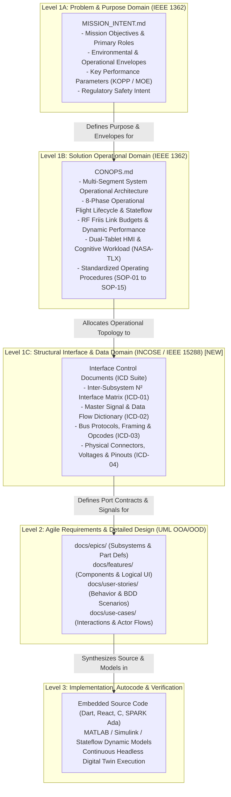
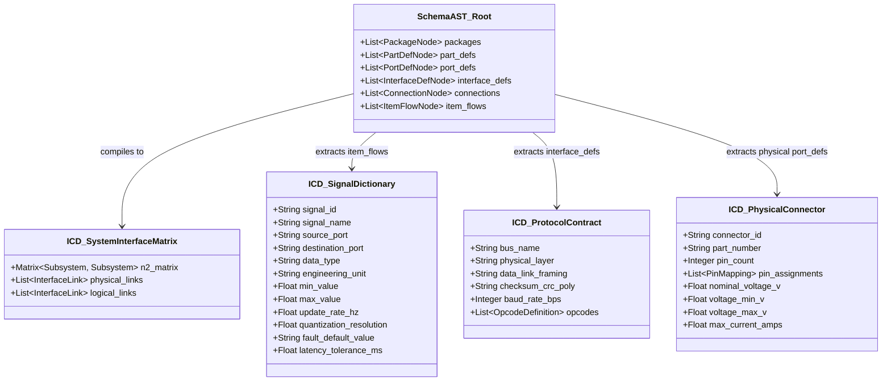
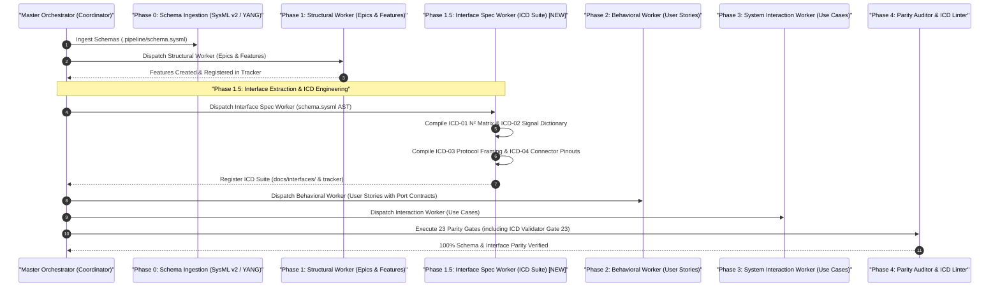

# Solution Blueprint: Level 1C Interface Control Documents (ICD) & Signal Flow Dictionaries in the DEAP MBSE Compiler

---

## 1. Executive Summary & Systems Engineering Rationale

In classical and digital Model-Based Systems Engineering (MBSE) governed by **ISO/IEC/IEEE 15288:2023** (§6.4.4 *Architecture Definition*, §6.4.5 *Design Definition*, and §6.4.8 *Integration Process*), **IEEE 1362-1998 (R2007)**, and the **INCOSE Systems Engineering Handbook v5**, system specification requires an unbroken digital thread spanning three distinct conceptual layers before decomposing into low-level Agile software artifacts:



### The Architectural Problem Solved
Currently, the DEAP pipeline jumps directly from Level 1B (`docs/conops/CONOPS.md`) to Level 2 (`docs/epics/`, `docs/features/`). This omission causes:
1. **Architectural Contamination & Boundary Breaches**: Low-level hardware pinouts, baud rates, CRC polynomials, and cable routing leak into high-level concept documents (`MISSION_INTENT.md` or `CONOPS.md`).
2. **Fragmented Interface Contracts**: Port names, signal rates, and data dictionaries are scattered across dozens of individual Feature files (`docs/features/feat-XXX.md`) without a single authoritative system-level interface contract.
3. **Implicit Dataflow & Timing**: Signal update rates ($f$ Hz), quantization/resolution, fault values, and latency tolerances ($\tau_{max}$ ms) are buried inside code or ASTs without a formal ICD contract.

---

## 2. Abstract Schema AST to ICD Metamodel Mapping

In strict adherence to the **Pure Schema-Driven Compiler Invariant (Zero Hardcoded Domain Concepts)**, the DEAP compiler ingests input schemas (`*.sysml`, `*.yang`, `*.proto`, `*.arxml`, `*.idl`) and maps abstract AST nodes into the formal ICD metamodel:



### Transformation Rules:
1. **Subsystems ($S_1, \dots, S_k$)**: Derived from top-level `package` or `part def` nodes representing major architectural segments.
2. **Ports & Directionality**: Derived from `port def` declarations with `in`, `out`, or `inout` flow properties.
3. **Connections & Topologies**: Derived from `connection` and `interface def` blocks linking `port_A` to `port_B`.
4. **Signals & Data Types**: Derived from `item flow` and `item def` declarations, capturing structured payloads, numeric ranges, and update frequencies.
5. **Protocol & Electrical Invariants**: Derived from typed port properties, attributes, and constraints (`baudRate`, `crcPolynomial`, `voltageNominal`).

---

## 3. Standardized Level 1C ICD Suite Specification (`docs/interfaces/`)

The generated ICD suite resides in `docs/interfaces/` (or `docs/icd/`) and consists of four standard specification documents:

```
docs/interfaces/
├── ICD_01_SYSTEM_INTERFACE_MATRIX.md   # Platform N² Matrix & Inter-Subsystem Topology
├── ICD_02_MASTER_SIGNAL_DICTIONARY.md  # Master Signal & Telemetry Data Dictionary
├── ICD_03_BUS_PROTOCOLS.md             # Framing, CRC, Opcode & Timing Contracts
└── ICD_04_PHYSICAL_CONNECTORS.md       # Pinouts, Voltages, Grounding & Wire Harnesses
```

### 3.1 ICD-01: System Interface & $N^2$ Matrix Specification
- **System Connectivity Graph**: Mermaid `flowchart` or `graph TD` representing all physical and logical inter-subsystem interfaces.
- **Subsystem $N^2$ Matrix**: The canonical systems engineering square matrix where diagonal elements represent subsystems $S_1..S_k$, and off-diagonal cells $(i, j)$ define the unidirectional interface from $S_i$ to $S_j$.
- **Interface Categorization**: Physical Energy Links (High Voltage, 24V DC, 5V Logic), Discrete Signal Lines (PWM, Interlocks, IRQ), Digital Buses (RS-485, CAN, Ethernet, SPI, I2C), and Wireless RF Datalinks (FHSS, Remote ID, ADS-B).

### 3.2 ICD-02: Master Signal & Data Flow Dictionary
Every signal traversing an inter-subsystem boundary is cataloged in a standardized, machine-verifiable table:

| Signal ID | Signal Name | Source Subsystem | Destination Subsystem | Data Type | Engineering Units | Valid Range [min, max] | Update Rate (f Hz) | Resolution | Fault / Safe Value | Latency Ceiling (tau_max) | Source Citation |
| :--- | :--- | :--- | :--- | :--- | :--- | :--- | :--- | :--- | :--- | :--- | :--- |
| `SIG-SYS-001` | `SystemState` | Subsystem_Alpha | Subsystem_Beta | `uint8` | enum (`0x00`..`0x05`) | `[0, 5]` | 100 Hz | 1 state | `0x00` (SAFE) | 10 ms | `schema/system_model.sysml#L120` |
| `SIG-PWR-002` | `BusVoltage`  | Power_Subsystem | Subsystem_Beta | `float32` | Volts (V) | `[14.0, 32.0]` | 50 Hz | 0.01 V | 0.0 V | 20 ms | `schema/power_model.sysml#L45` |
| `SIG-SNS-003` | `SensorMetric`| Sensor_Payload | Subsystem_Beta | `float32` | Standard Units | `[0.0, 100.0]` | 50 Hz | 0.05 units | 0.0 units | 20 ms | `schema/sensor_model.sysml#L88` |

### 3.3 ICD-03: Bus Protocols, Framing & Opcodes
- **Physical & Data Link Layers**: Baud rates, bit timing, line termination ($\Omega$), differential signaling levels, and half/full-duplex topology.
- **Packet Structure & Framing**: Header delimiters, Message Length field, Opcode/Command field, Payload bytes, and Error Detection (e.g. CRC-16 XModem: polynomial $0x1021$, initial value $0x0000$).
- **Opcode & Command Catalog**: Complete enumeration of command numbers, request payloads, response payloads, execution timeouts, and error response codes.
- **Bus Timing & Arbitration**: Polling periods, master/slave query-response windows, collision avoidance, and bus timeout watchdog behavior.

### 3.4 ICD-04: Physical Connectors & Electrical Boundaries
- **Connector Allocation Matrix**: Standardized hardware connectors (e.g. Standard Circular, Micro-D, D-Sub, Ethernet RJ45, Terminal Block), mating part numbers, backshell shielding, and retention mechanisms (e.g. zero-retention detent $< 15.0\text{ N}$).
- **Pin Assignment Tables**: Pin number, signal name, wire gauge (AWG), signal type (Power, Ground, RS-485 A/B, Discrete In, Shield).
- **Electrical Envelope Invariants**: Nominal voltage, minimum voltage, maximum overvoltage clamp, continuous current rating, peak transient current, and ESD protection rating (e.g. applicable EMC/ESD baseline standards (e.g. IEC 61000-4-2)).

---

## 4. Pipeline Integration & Orchestrator Lifecycle

We incorporate the ICD Engineering phase cleanly into the **Autonomous Specification Orchestrator (`skills/spec-orchestrator/SKILL.md`)**:



### New Phase 1.5 Specification:
- **Phase 1.5: Interface & ICD Extraction (Worker ICD)**:
  1. **Trigger**: Invoked following Phase 1 completion with `spec-icd-engineering` skill and path to `.pipeline/schema.sysml`.
  2. **Execution**: Parses `port def`, `interface def`, `connection`, and `item flow` AST nodes. Generates `docs/interfaces/ICD_01_SYSTEM_INTERFACE_MATRIX.md`, `ICD_02_MASTER_SIGNAL_DICTIONARY.md`, `ICD_03_BUS_PROTOCOLS.md`, and `ICD_04_PHYSICAL_CONNECTORS.md`.
  3. **Verification**: Executes `parity_auditor/validators/icd_validator.py` asserting:
     - *Zero Dangling Ports*: Every output port connects to a valid input port.
     - *Signal Parity*: 100% of `item flow` types in SysML AST are cataloged in the Master Signal Dictionary.
     - *Type & Rate Safety*: Port data types and update rates match between connected components.
     - *Tracker Synchronization*: Registers the ICD suite under the `icd` issue label.

---

## 5. Parity Auditor Gate 23: ICD & Signal Flow Completeness Validator

A new automated verification gate (`Gate 23`) is added to `skills/spec-orchestrator/parity_auditor/`:

```python
class ICDCompletenessValidator(BaseValidator):
    """Mechanically verifies that all subsystem interfaces, ports, and signal flows
    in the SysML v2 AST are 100% reflected in docs/interfaces/ ICD suite."""
    
    def validate(self, repo: Path) -> List[Finding]:
        findings = []
        # 1. Verify docs/interfaces/ suite exists and contains ICD-01..04
        # 2. Extract all 'port def' and 'connection' nodes from schema AST
        # 3. Assert every AST connection is represented in ICD-01 N² matrix
        # 4. Assert every AST item flow is defined in ICD-02 Signal Dictionary
        # 5. Assert bus protocols in ICD-03 define physical layer, baud, and CRC
        # 6. Assert connector pinouts in ICD-04 have zero unassigned active pins
        return findings
```

---

## 6. Polyrepo Rollout & Roadmap

1. **Step 1: Codify Abstract ICD Governance in `DEAP-spec-core`**:
   - Add Standard 16 (*Interface Control Documents & Signal Flow Dictionaries*) to `rules/domain-engineering-standards.md`.
   - Update `skills/spec-orchestrator/SKILL.md` with Phase 1.5.
   - Implement `ICDCompletenessValidator` (Gate 23) in Parity Auditor.
2. **Step 2: Distribute Abstract Compiler to Domain Platform Templates**:
   - Propagate compiler tools via `./scripts/install_pipeline.sh`.
3. **Step 3: Verify All Upstream Unit Test Suites**:
   - Run `python3 -m unittest discover -s tests`.
