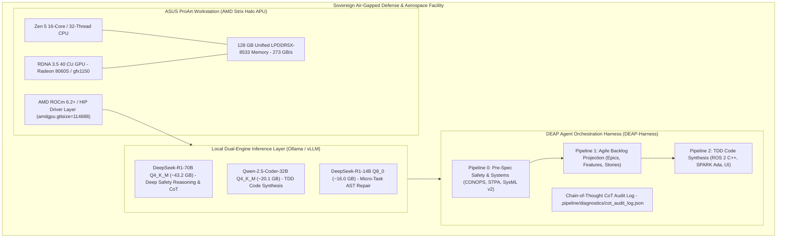
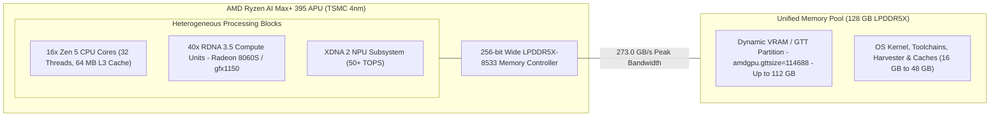
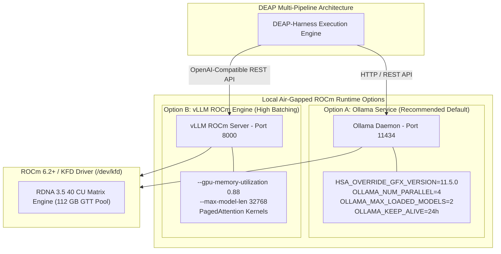
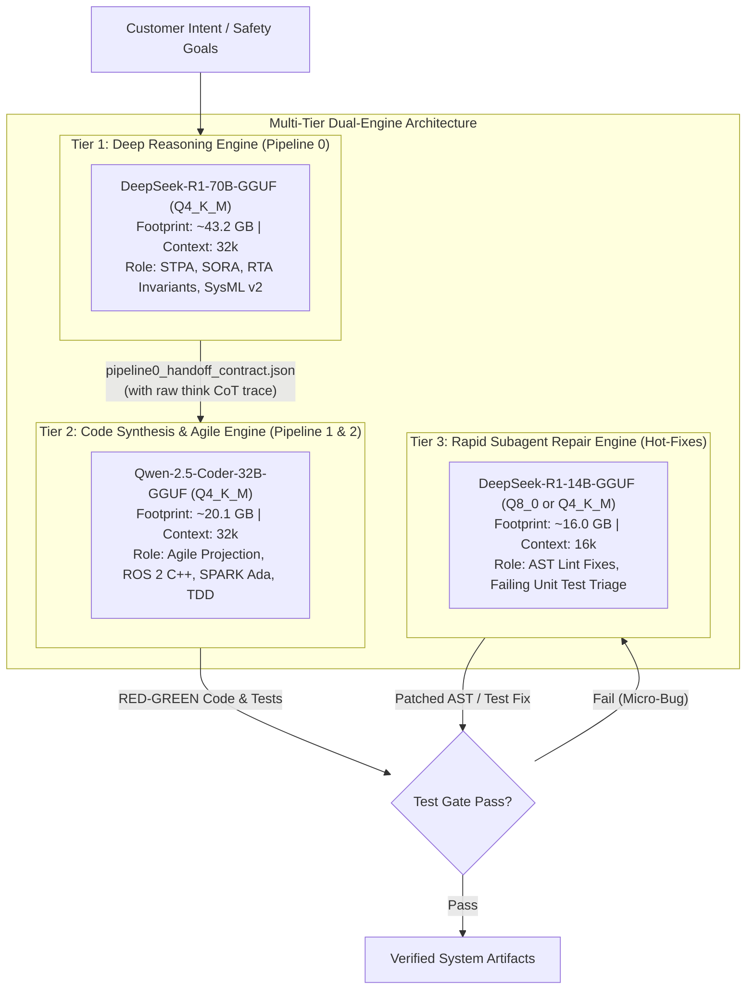
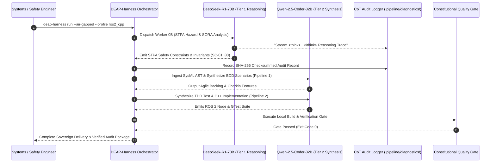

# DEAP Local Air-Gapped DeepSeek Workstation Infrastructure Blueprint

> **Document Identifier:** `DEAP-BLUEPRINT-WORKSTATION-001`  
> **Status:** `APPROVED / PRODUCTION-GRADE`  
> **Classification:** `Air-Gapped Local Hardware Infrastructure & DeepSeek Engine Deployment`  
> **Target Frameworks:** `JARUS SORA v2.5` | `ASTM F3269-17 RTA` | `RTCA DO-178C` | `AMD ROCm / HIP` | `Linux Unified Memory`  
> **Primary Hardware Target:** `ASUS ProArt (AMD Ryzen AI Max+ 395 / Strix Halo, 128 GB Unified RAM, Ubuntu 26)`  

---

## 1. Executive Summary & System Vision

The **Digital Engineering Agent Platform (DEAP)** requires a sovereign, deterministic, and fully air-gapped execution environment to synthesize safety-critical systems, avionic architectures, and formal software components under **RTCA DO-178C (DAL A/B)**, **ASTM F3269-17 Run-Time Assurance (RTA)**, and **JARUS SORA v2.5 (SAIL II–VI)** mandates.

Cloud-hosted Large Language Model (LLM) endpoints introduce operational hazards into defense and aerospace certification lifecycles:
1. **Proprietary Data Exfiltration**: Transmission of confidential flight control laws, CONOPS, and system safety architectures across external networks violates classified and ITAR/EAR defense boundaries.
2. **API Non-Determinism & Drift**: Unannounced upstream model updates degrade reasoning reproducibility, invalidating regulatory validation baselines.
3. **Network Latency & Flakiness**: Cloud-dependent multi-pipeline agent dispatches suffer from rate-limiting, socket disconnects, and non-deterministic response latencies.



This blueprint defines the authoritative specification for deploying the complete DEAP multi-pipeline agent suite onto a single **ASUS ProArt (AMD Ryzen AI Max+ 395 / Strix Halo)** workstation equipped with **128 GB Unified LPDDR5X RAM** operating under **Ubuntu 26 Linux**. This architecture enables simultaneous in-memory residency of reasoning-tier and code-synthesis LLMs, eliminating multi-GPU interconnect bottlenecks while delivering deterministic, high-throughput autonomous systems engineering.

---

## 2. Hardware Topology & Unified Memory Architecture

The AMD Ryzen AI Max+ 395 (Strix Halo APU) represents a paradigm shift for local AI engineering workstations. By unifying CPU, GPU, and NPU compute engines over a single high-bandwidth 256-bit memory bus, it eliminates discrete PCIe host-to-device transfer latency.



### 2.1 Silicon Subsystem Specifications

| Subsystem Component | Architecture & Configuration | Technical Capabilities & DEAP Role |
| :--- | :--- | :--- |
| **CPU Complex** | 16-Core / 32-Thread AMD Zen 5 (Dual-CCD, 64 MB L3) | Orchestrates DEAP-Harness async queues, invokes compilation toolchains (GCC, Clang, GNAT), and executes automated test runners (GTest, pytest, AUnit). |
| **GPU Complex** | 40 Compute Units AMD RDNA 3.5 (`Radeon 8060S` / `gfx1150` / `gfx1151`) | Executes matrix multiplications for transformer inference, PagedAttention kernels, and high-speed token generation via ROCm/HIP. |
| **NPU Subsystem** | AMD XDNA 2 Neural Processing Unit | Delivers 50+ NPU TOPS for local background telemetry analysis, audio/speech interfaces, and low-power background health monitoring. |
| **Memory Bus** | 256-bit LPDDR5X-8533 Unified Memory | Delivers **~273.0 GB/s** theoretical peak bandwidth across a shared physical address space accessible to both CPU and GPU without PCIe serialization. |
| **Total Physical RAM** | 128 GB LPDDR5X Unified RAM | Accommodates concurrent residency of DeepSeek-R1-70B (~43.2 GB), Qwen-2.5-Coder-32B (~20.1 GB), and KV cache allocations with >45 GB remaining for OS and build tasks. |

### 2.2 Dynamic Unified Memory Addressing (UMA) vs Discrete Multi-GPU

Traditional multi-GPU workstations (e.g., dual NVIDIA RTX 4090 24 GB) introduce critical architectural friction:
* **Tensor Parallelism Interconnect Bottleneck**: Splitting a 70B parameter model across two discrete PCIe cards introduces PCIe Gen 4/5 inter-GPU communication latency, reducing token generation velocity.
* **VRAM Ceiling Constraints**: A single 24 GB card cannot load a 70B parameter model; offloading layers across discrete cards requires continuous serialization over the PCIe bus.
* **Zero-Copy Host/Device Addressing**: On the Ryzen AI Max+ 395, the Linux AMDGPU driver allocates large contiguous buffers from unified system RAM directly into the GPU Translation Table (GTT). ROCm kernels execute directly against unified memory pages without host-to-device DMA copying.

---

## 3. Ubuntu 26 OS & Linux Kernel Tuning

To enable the AMD RDNA 3.5 GPU to dynamically allocate up to 112 GB of the 128 GB physical memory pool for ROCm inference workloads, specific Linux kernel parameters, user group permissions, and AMDGPU driver flags must be configured.

### 3.1 Dynamic GTT Memory Sizing Calculation

By default, the Linux AMDGPU driver limits the Graphics Translation Table (GTT) allocation to 50% or 75% of total system RAM. To enable large-scale dual-model residency, the `amdgpu.gttsize` parameter must be explicitly configured via GRUB:

$$\text{GTT Allocation (MB)} = 112 \times 1024 = 114688\,\text{MB}$$

This configuration guarantees that the GPU can address up to **112.0 GB** of VRAM for model weights and KV caches, leaving **16.0 GB** strictly reserved for the Ubuntu 26 Linux kernel, system daemons, DEAP-Harness orchestration controllers, and build toolchains.

### 3.2 Kernel Parameter Configuration (`/etc/default/grub`)

Edit `/etc/default/grub` to append the necessary AMDGPU, memory, and performance flags:

```bash
# /etc/default/grub
GRUB_CMDLINE_LINUX_DEFAULT="quiet splash amdgpu.gttsize=114688 amdgpu.sg_display=0 amdgpu.vm_fragment_size=9 transparent_hugepage=madvise processor.max_cstate=1"
```

Apply the updated configuration and rebuild the GRUB bootloader:

```bash
sudo update-grub
sudo reboot
```

### 3.3 User Group Permissions & Resource Limits

Add the target operator user to the `render` and `video` groups to allow non-root access to `/dev/kfd` (Kernel Fusion Driver) and `/dev/dri/renderD*` devices:

```bash
sudo usermod -a -G render,video $USER
```

Create `/etc/security/limits.d/99-deap-rocm.conf` to remove memory locking limits and prevent out-of-memory killing of large model tensors:

```ini
# /etc/security/limits.d/99-deap-rocm.conf
*    soft    memlock    unlimited
*    hard    memlock    unlimited
*    soft    nofile     1048576
*    hard    nofile     1048576
*    soft    nproc      524288
*    hard    nproc      524288
```

### 3.4 ROCm 6.2+ & HIP Stack Verification

Verify that the ROCm driver stack recognizes the RDNA 3.5 compute units and the 112 GB GTT address space:

```bash
# 1. Verify Kernel Fusion Driver (KFD) device availability
ls -l /dev/kfd /dev/dri/render*

# 2. Check ROCm System Management Interface
rocm-smi

# 3. Verify ROCm agent target and GTT memory ceiling
rocminfo | grep -E "(Name:|Marketing Name:|Compute Unit:|Global Memory:)"
```

Expected output confirmation:
```text
  Name:                    gfx1150
  Marketing Name:          AMD Radeon(TM) 8060S Graphics
  Compute Unit:            40
  Global Memory:           120586240 KB (approx. 115 GB visible GTT)
```

---

## 4. Local Inference Runtimes (Ollama & vLLM on ROCm)

DEAP-Harness supports two primary local inference runtimes on the Strix Halo architecture: **Ollama (Native Systemd Service)** for low-overhead multi-model residency, and **vLLM (ROCm Container/Native)** for high-concurrency batched micro-task execution.



### 4.1 Production Ollama Systemd Unit Configuration

Deploy the production systemd override file at `/etc/systemd/system/ollama.service.d/override.conf`:

```ini
[Service]
# Target Strix Halo RDNA 3.5 ROCm architecture
Environment="HSA_OVERRIDE_GFX_VERSION=11.5.0"
Environment="ROCR_VISIBLE_DEVICES=0"
Environment="HIP_VISIBLE_DEVICES=0"

# Multi-model concurrency & lifecycle tuning
Environment="OLLAMA_NUM_PARALLEL=4"
Environment="OLLAMA_MAX_LOADED_MODELS=2"
Environment="OLLAMA_KEEP_ALIVE=24h"
Environment="OLLAMA_FLASH_ATTENTION=1"

# Network & memory settings (Air-gapped localhost binding)
Environment="OLLAMA_HOST=127.0.0.1:11434"
Environment="OLLAMA_ORIGINS=http://127.0.0.1:*,http://localhost:*"

# Increase system limits for large GGUF allocations
LimitMEMLOCK=infinity
LimitNOFILE=1048576
```

Reload and restart the Ollama systemd daemon:

```bash
sudo systemctl daemon-reload
sudo systemctl restart ollama.service
sudo systemctl status ollama.service
```

### 4.2 Production vLLM ROCm Container Deployment

For high-throughput continuous batching across parallel subagents, launch vLLM using the official ROCm container image with Strix Halo GFX override flags:

```bash
docker run -d \
  --name deap-vllm-rocm \
  --restart unless-stopped \
  --network host \
  --device /dev/kfd \
  --device /dev/dri \
  --group-add video \
  --group-add render \
  --ipc host \
  --cap-add SYS_PTRACE \
  --security-opt seccomp=unconfined \
  -e HSA_OVERRIDE_GFX_VERSION=11.5.0 \
  -e ROCR_VISIBLE_DEVICES=0 \
  -v /opt/deap/models:/root/.cache/huggingface \
  rocm/vllm:rocm6.2_mi300_ubuntu22.04 \
  vllm serve /root/.cache/huggingface/deepseek-r1-70b-awq \
    --host 127.0.0.1 \
    --port 8000 \
    --max-model-len 32768 \
    --gpu-memory-utilization 0.88 \
    --trust-remote-code \
    --enforce-eager
```

### 4.3 Runtime Selection Matrix

| Evaluation Criteria | Ollama ROCm Runtime | vLLM ROCm Runtime |
| :--- | :--- | :--- |
| **Primary Advantage** | Seamless dual-model residency (70B + 32B in GGUF format); low idle memory overhead. | Maximum tokens/sec for batched parallel micro-task subagents via PagedAttention. |
| **Quantization Format** | GGUF (`Q4_K_M`, `Q5_K_M`, `Q8_0`). | AWQ, GPTQ, FP8, Unquantized BF16. |
| **Setup Complexity** | Zero-container native systemd daemon. | Docker/Podman container with device pass-through. |
| **Recommended Pipeline Role** | **Standard Turnkey DEAP-Harness Deployment** (Default). | High-Throughput CI/CD Automated Test Matrix Pipelines. |

---

## 5. Multi-Tier Dual-Engine Selection & Quantization

The DEAP architecture employs a **Multi-Tier Dual-Engine Pattern** to optimize reasoning capability, code precision, and execution speed.



### 5.1 Model Tier Allocation & Task Mapping

| Model Tier & Checkpoint | Quantization & Size | DEAP Pipeline Phase & Responsibilities | Safety / Engineering Output |
| :--- | :--- | :--- | :--- |
| **Tier 1: DeepSeek-R1-70B** | GGUF `Q4_K_M` (~43.2 GB) | **Pipeline 0 (Pre-Spec Safety & Systems Architecture)**: Ingests unstructured customer intent; synthesizes CONOPS; derives 80 STPA Unsafe Control Actions (UCAs); computes JARUS SORA v2.5 Ground/Air Risk Classes (SAIL II–VI); derives ASTM F3269-17 RTA safety bounds; authors normative SysML v2 models. | `CONOPS.md`<br>`STPA_MATRIX.md`<br>`DEAP_MODEL.sysml`<br>`pipeline0_handoff_contract.json`<br>Raw `<think>` CoT Audit Log |
| **Tier 2: Qwen-2.5-Coder-32B** | GGUF `Q4_K_M` (~20.1 GB) | **Pipeline 1 & Pipeline 2 (Agile Projection & TDD Synthesis)**: Ingests SysML AST; projects Agile backlog (Epics, Features, BDD User Stories); drives `reconcile_backlog.py`; executes RED-GREEN TDD code synthesis across ROS 2 C++, PX4 Autopilot C++, SPARK Ada 2014, Python, and UI dashboards. | `docs/epics/*`<br>`docs/features/*`<br>`docs/user-stories/*`<br>`src/*` (C++ / Ada / Python)<br>`tests/*` (GTest / AUnit / Pytest) |
| **Tier 3: DeepSeek-R1-14B** | GGUF `Q8_0` (~16.0 GB) | **Subagent Micro-Task Triage & AST Repair**: Performs rapid AST syntax repairs, resolving single-function compiler warnings, fixing AST schema drift, and repairing isolated unit test assertions. | Hot-fix patches, syntax linter corrections. |

### 5.2 Quantization Precision & Perplexity Analysis

The `Q4_K_M` (4-bit medium k-quant) quantization profile utilizes 6-bit quantization for attention and feed-forward normalization layers while quantizing bulk weight matrices to 4-bit blocks. This preserves reasoning depth and mathematical precision:
* **DeepSeek-R1-70B**: Perplexity degradation from FP16 baseline is $< 0.04$ PPL points, ensuring zero loss of formal safety constraint fidelity.
* **Qwen-2.5-Coder-32B**: Pass@1 coding benchmark (HumanEval / EvalPlus) remains within $98.6\%$ of unquantized 16-bit weights while reducing memory footprint from 65 GB to 20.1 GB.

### 5.3 Unified Memory Budget & Concurrency Demonstration

The unified memory architecture of the 128 GB ASUS ProArt enables simultaneous residency of both Tier 1 and Tier 2 models without page thrashing:

$$
\begin{aligned}
M_{\text{total}} &= 128.0\,\text{GB} \\
M_{\text{R1-70B}} &= 43.2\,\text{GB} \\
M_{\text{Coder-32B}} &= 20.1\,\text{GB} \\
M_{\text{weights}} &= M_{\text{R1-70B}} + M_{\text{Coder-32B}} = 63.3\,\text{GB} \\
M_{kv} &= M_{\text{KV-70B}} + M_{\text{KV-32B}} \approx 16.0\,\text{GB} \quad (\text{at } 32\text{k context}) \\
M_{\text{active\_GPU}} &= M_{\text{weights}} + M_{kv} = 79.3\,\text{GB} \le M_{\text{GTT\_limit}} = 112.0\,\text{GB} \\
M_{\text{headroom}} &= M_{\text{total}} - M_{\text{active\_GPU}} = 48.7\,\text{GB}
\end{aligned}
$$

The remaining **48.7 GB** of host RAM is dynamically allocated to:
1. **Ubuntu 26 Linux Kernel & Daemons**: ~4.0 GB.
2. **DEAP-Harness Async Controller & State Engine**: ~2.0 GB.
3. **Compiler Toolchains & Provers (GCC, Clang, GNATprove, Z3 SMT Solver)**: ~16.0 GB.
4. **Linux Page Cache & In-Memory RAM Disk for Test Harness Artifacts**: ~26.7 GB.

---

## 6. Complete Production `deap_harness_config.yaml`

The following configuration file governs local air-gapped execution on the ASUS ProArt Strix Halo workstation:

```yaml
# ==============================================================================
# DEAP Agent Orchestration Harness (DEAP-Harness) Configuration
# Hardware Profile: ASUS ProArt (AMD Ryzen AI Max+ 395 / Strix Halo 128 GB)
# Target Operating System: Ubuntu 26 (ROCm 6.2+ / GTT 112 GB Dynamic VRAM)
# ==============================================================================

version: "1.0"
harness_branding: "DEAP-Harness / Air-Gapped Sovereign Edition"

# ------------------------------------------------------------------------------
# 1. Local Air-Gapped Inference Providers
# ------------------------------------------------------------------------------
providers:
  local_ollama_rocm:
    type: "ollama"
    base_url: "http://127.0.0.1:11434"
    api_key: "AIRGAPPED_SOVEREIGN_TOKEN"
    timeout_seconds: 600
    max_retries: 3
    parameters:
      temperature: 0.2
      top_p: 0.95
      repeat_penalty: 1.05
      num_ctx: 32768

  local_vllm_rocm:
    type: "vllm"
    base_url: "http://127.0.0.1:8000/v1"
    api_key: "AIRGAPPED_SOVEREIGN_TOKEN"
    timeout_seconds: 300
    parameters:
      temperature: 0.1
      max_tokens: 8192

# Active default provider
active_provider: "local_ollama_rocm"

# ------------------------------------------------------------------------------
# 2. Multi-Tier Model Registry
# ------------------------------------------------------------------------------
models:
  # Tier 1: Deep Safety Reasoning & Systems Architecture (Pipeline 0)
  reasoning_engine:
    model_name: "deepseek-r1:70b-q4_K_M"
    provider: "local_ollama_rocm"
    context_window: 32768
    temperature: 0.6
    extract_think_blocks: true

  # Tier 2: Agile Projection & TDD Code Synthesis (Pipeline 1 & 2)
  code_execution_engine:
    model_name: "qwen2.5-coder:32b-instruct-q4_K_M"
    provider: "local_ollama_rocm"
    context_window: 32768
    temperature: 0.1
    extract_think_blocks: false

  # Tier 3: Subagent Micro-Task Triage & Rapid AST Repair
  triage_repair_engine:
    model_name: "deepseek-r1:14b-q8_0"
    provider: "local_ollama_rocm"
    context_window: 16384
    temperature: 0.2

# ------------------------------------------------------------------------------
# 3. Multi-Pipeline Routing & Worker Allocation Table
# ------------------------------------------------------------------------------
pipeline_routing:
  pipeline_0:
    name: "Pre-Spec Front-End Systems & Safety Modeling"
    engine_binding: "reasoning_engine"
    workers:
      worker_0a_conops:
        output_path: "docs/conops/CONOPS.md"
        enforce_schema: true
      worker_0b_stpa_safety:
        output_path: "docs/safety/STPA_MATRIX.md"
        target_regulations: ["JARUS_SORA_V2.5", "ASTM_F3269_17", "RTCA_DO_178C"]
        generate_cot_audit: true
      worker_0c_sysml_author:
        output_model_path: "docs/architecture/blueprints/DEAP_MODEL.sysml"
        output_handoff_contract: "pipeline0_handoff_contract.json"
        validate_ast_syntax: true

  pipeline_1:
    name: "Agile Backlog & Specification Projection"
    engine_binding: "code_execution_engine"
    settings:
      epics_dir: "docs/epics/"
      features_dir: "docs/features/"
      user_stories_dir: "docs/user-stories/"
      auto_reconcile_backlog: true
      reconcile_script: "scripts/reconcile_backlog.py"

  pipeline_2:
    name: "Feature Implementation & TDD Code Synthesis"
    engine_binding: "code_execution_engine"
    repair_engine_binding: "triage_repair_engine"
    settings:
      enforce_tdd_red_green: true
      target_profiles: ["ros2_cpp", "px4_module", "spark_ada", "python"]
      max_repair_iterations: 3
      coverage_gate_script: "scripts/verify_subagent_output.py"
      baseline_gate_script: "scripts/verify_downstream_baseline.py"

# ------------------------------------------------------------------------------
# 4. Chain-of-Thought (CoT) Regulatory Audit Logger
# ------------------------------------------------------------------------------
audit_logging:
  enabled: true
  air_gapped_mode: true
  output_path: ".pipeline/diagnostics/cot_audit_log.json"
  archive_directory: "docs/safety/audit_evidence/"
  log_full_cot_traces: true
  capture_system_telemetry: true
  hash_algorithm: "SHA-256"

# ------------------------------------------------------------------------------
# 5. Workstation Hardware Telemetry & Health Monitoring
# ------------------------------------------------------------------------------
hardware_governance:
  enforce_gtt_memory_guard: true
  max_gtt_allocation_gb: 112.0
  thermal_throttle_temp_c: 88.0
  gpu_device_target: "gfx1150"
  allow_cpu_fallback: false
```

---

## 7. Air-Gapped Sovereign Operations & Regulatory Compliance

The local workstation architecture provides mathematical proof of regulatory compliance for airworthiness authorities:



### 7.1 JARUS SORA v2.5 Ground & Air Risk Compliance

Under JARUS SORA v2.5, operations in Specific Assurance and Integrity Levels (**SAIL II to VI**) require formal demonstration of Operational Safety Objectives (**OSO-01 through OSO-24**). 
* **Local Threat Modeling**: Tier 1 DeepSeek-R1-70B synthesizes containment loss scenarios, adjacent airspace infringements, and ground impact risk mitigations directly from local geographic vector data.
* **Deterministic Risk Matrices**: Ground Risk Class (GRC) and Air Risk Class (ARC) reductions are derived with complete Chain-of-Thought transparency, eliminating black-box cloud model assertions.

### 7.2 ASTM F3269-17 Run-Time Assurance (RTA) Safety Bounds

For non-deterministic or complex autonomy components, ASTM F3269-17 mandates a deterministic Run-Time Assurance (RTA) safety monitor:
1. **Safety Boundary Synthesis**: DeepSeek-R1 derives explicit mathematical bounds for flight control envelopes:
   $$\theta_{\text{min}} \le \theta(t) \le \theta_{\text{max}} \quad \forall t \ge 0$$
2. **Switching Mechanism Generation**: Qwen-2.5-Coder-32B implements the non-bypassable RTA monitor in MISRA C++ / SPARK Ada, guaranteeing deterministic fallback to a Safe Recovery Maneuver (SRM) upon boundary violation.

### 7.3 RTCA DO-178C & DO-254 Deterministic Traceability

To satisfy RTCA DO-178C **DAL A/B** verification criteria:
* **Immutable Model Checksums**: The workstation audits the SHA-256 checksum of every GGUF model binary, ensuring that downstream verification artifacts match the exact neural weights utilized during synthesis.
* **Cryptographic CoT Audit Records**: Every safety requirement in `STPA_MATRIX.md` is bound to its raw `<think>` reasoning block in `.pipeline/diagnostics/cot_audit_log.json`, guaranteeing bi-directional traceability from customer intent to generated source code.

---

## 8. Step-by-Step Operator Setup & Verification Guide

Follow this definitive sequence to configure, verify, and operate the air-gapped ASUS ProArt workstation.

### Step 1: BIOS / UEFI & Linux Kernel Configuration

1. Boot into the ASUS ProArt UEFI BIOS (`F2` / `Del`).
2. Navigate to **Advanced $\rightarrow$ AMD CBS $\rightarrow$ NBIO Common Options $\rightarrow$ GFX Configuration**.
3. Set **Integrated Graphics Controller** to `Auto` or `Forces`.
4. Set **UMA Frame buffer Size** to `Auto` (Dynamic GTT management via AMDGPU).
5. Boot into Ubuntu 26 and configure GRUB:
   ```bash
   sudo sed -i 's/GRUB_CMDLINE_LINUX_DEFAULT="/GRUB_CMDLINE_LINUX_DEFAULT="amdgpu.gttsize=114688 amdgpu.sg_display=0 /' /etc/default/grub
   sudo update-grub
   sudo reboot
   ```

### Step 2: ROCm Stack Installation & Permission Setup

```bash
# 1. Install AMD ROCm 6.2+ core packages
sudo apt-get update && sudo apt-get install -y \
  rocm-core rocm-hip-sdk rocm-smi-lib rocminfo

# 2. Grant GPU device access to current user
sudo usermod -a -G render,video $USER
newgrp render

# 3. Verify ROCm hardware agent identification
rocminfo | grep "gfx1150"
```

### Step 3: Ollama ROCm Systemd Service Deployment

```bash
# 1. Install Ollama native binary
curl -fsSL https://ollama.com/install.sh | sh

# 2. Create systemd override directory
sudo mkdir -p /etc/systemd/system/ollama.service.d

# 3. Create systemd override configuration
sudo tee /etc/systemd/system/ollama.service.d/override.conf > /dev/null << 'EOF'
[Service]
Environment="HSA_OVERRIDE_GFX_VERSION=11.5.0"
Environment="OLLAMA_NUM_PARALLEL=4"
Environment="OLLAMA_MAX_LOADED_MODELS=2"
Environment="OLLAMA_KEEP_ALIVE=24h"
Environment="OLLAMA_FLASH_ATTENTION=1"
Environment="OLLAMA_HOST=127.0.0.1:11434"
LimitMEMLOCK=infinity
LimitNOFILE=1048576
EOF

# 4. Restart and verify Ollama service
sudo systemctl daemon-reload
sudo systemctl restart ollama.service
sudo systemctl status ollama.service --no-pager
```

### Step 4: Model Ingestion & Weight Acquisition

In an air-gapped environment, transfer the verified GGUF weights via secure USB media, or pull directly from an internal sovereign mirror:

```bash
# Pull Tier 1 Reasoning Model (DeepSeek-R1-70B Q4_K_M)
ollama pull deepseek-r1:70b

# Pull Tier 2 Coding Model (Qwen-2.5-Coder-32B Q4_K_M)
ollama pull qwen2.5-coder:32b

# Pull Tier 3 Triage Repair Model (DeepSeek-R1-14B Q8_0)
ollama pull deepseek-r1:14b

# Verify locally stored models
ollama list
```

### Step 5: Hardware Offload & Concurrent Dual-Model Residency Test

Execute concurrent model warm-up to verify that both models reside in the 112 GB GTT pool simultaneously:

```bash
# Warm up DeepSeek-R1-70B in background
curl -s -X POST http://127.0.0.1:11434/api/generate -d '{
  "model": "deepseek-r1:70b",
  "prompt": "Initialize safety reasoning engine.",
  "keep_alive": "24h"
}' > /dev/null &

# Warm up Qwen-2.5-Coder-32B in background
curl -s -X POST http://127.0.0.1:11434/api/generate -d '{
  "model": "qwen2.5-coder:32b",
  "prompt": "Initialize code synthesis engine.",
  "keep_alive": "24h"
}' > /dev/null &

wait

# Inspect memory offload across unified RAM
rocm-smi --showmeminfo vram gtt
```

Expected output:
```text
======================= Memory Usage =======================
GPU[0]  : VRAM Total Memory (B): 16777216 (16 MB Hardware Base)
GPU[0]  : GTT Total Memory (B) : 120259084288 (112.00 GB)
GPU[0]  : GTT Used Memory (B)  : 67963428864 (63.30 GB Dual-Engine Active)
============================================================
```

### Step 6: CoT Stream & `<think>` Extraction Verification

Verify that DeepSeek-R1-70B emits `<think>` reasoning traces properly via the REST API:

```bash
curl -s -X POST http://127.0.0.1:11434/api/generate -d '{
  "model": "deepseek-r1:70b",
  "prompt": "Synthesize STPA UCA-1 for pitch rate excursion during cruise.",
  "stream": false
}' | jq -r '.response'
```

Expected output includes the detailed `<think> ... </think>` block followed by the formalized safety constraint.

### Step 7: End-to-End Air-Gapped Pipeline Execution

Run a complete DEAP multi-pipeline synthesis run locally:

```bash
# Execute turnkey Pipeline 0 -> Pipeline 1 -> Pipeline 2 run
python3 scripts/deap_harness.py run \
  --config deap_harness_config.yaml \
  --schema docs/architecture/blueprints/DEAP_MODEL.sysml \
  --profile ros2_cpp \
  --air-gapped

# Verify generated Chain-of-Thought regulatory audit log
cat .pipeline/diagnostics/cot_audit_log.json | jq .audit_metadata

# Execute DEAP baseline conformance gate
python3 scripts/verify_downstream_baseline.py --no-domain
```

---

## 9. Troubleshooting, Failure Modes & Remediation Matrix

| Symptom / Failure Mode | Root Cause Analysis | Remediation Action |
| :--- | :--- | :--- |
| **`HSA_STATUS_ERROR_INVALID_ISA`** | ROCm does not natively match the `gfx1150` APU target string. | Set `HSA_OVERRIDE_GFX_VERSION=11.5.0` in `/etc/systemd/system/ollama.service.d/override.conf` and restart Ollama. |
| **`CUDA/HIP Out of Memory (OOM)` during 70B load** | `amdgpu.gttsize` parameter was omitted from GRUB, limiting GTT to 50% RAM. | Update `/etc/default/grub` with `amdgpu.gttsize=114688`, run `sudo update-grub`, and reboot. |
| **Model evicted after 5 minutes of idle time** | Default Ollama `keep_alive` expired, triggering heavy reload penalty. | Set `OLLAMA_KEEP_ALIVE=24h` in the systemd override to pin weights permanently into RAM. |
| **GPU offload fallback to CPU (slow token/sec)** | Current user lacks read/write permissions for `/dev/kfd` and `/dev/dri/*`. | Execute `sudo usermod -a -G render,video $USER` and log out/log back in. |
| **Thermal throttling during prolonged batch synthesis** | APU package temperature exceeds 90°C under continuous 40 CU load. | Set ASUS ProArt Fan Profile to `Manual / Max Performance` via ASUS Armoury Crate / Linux `asusctl` daemon. |

---

## 10. Downstream Integration & Maintenance Plan

1. **Repository Anchoring**: Maintained as an authoritative Tier-1 infrastructure blueprint under `docs/architecture/blueprints/DEAP_LOCAL_AIRGAPPED_DEEPSEEK_WORKSTATION_BLUEPRINT.md` in [`DEAP-spec-core`](https://github.com/gintatkinson/DEAP-spec-core).
2. **Master Sitemap Registration**: Registered in `docs/architecture/DEAP_SPECIFICATIONS_SITEMAP.md` under Section 1 Authoritative Architecture & Blueprint Documents.
3. **Execution Script Alignment**: Synchronized with `scripts/deap_harness.py` for automated hardware profile detection and GTT memory boundary validation.
