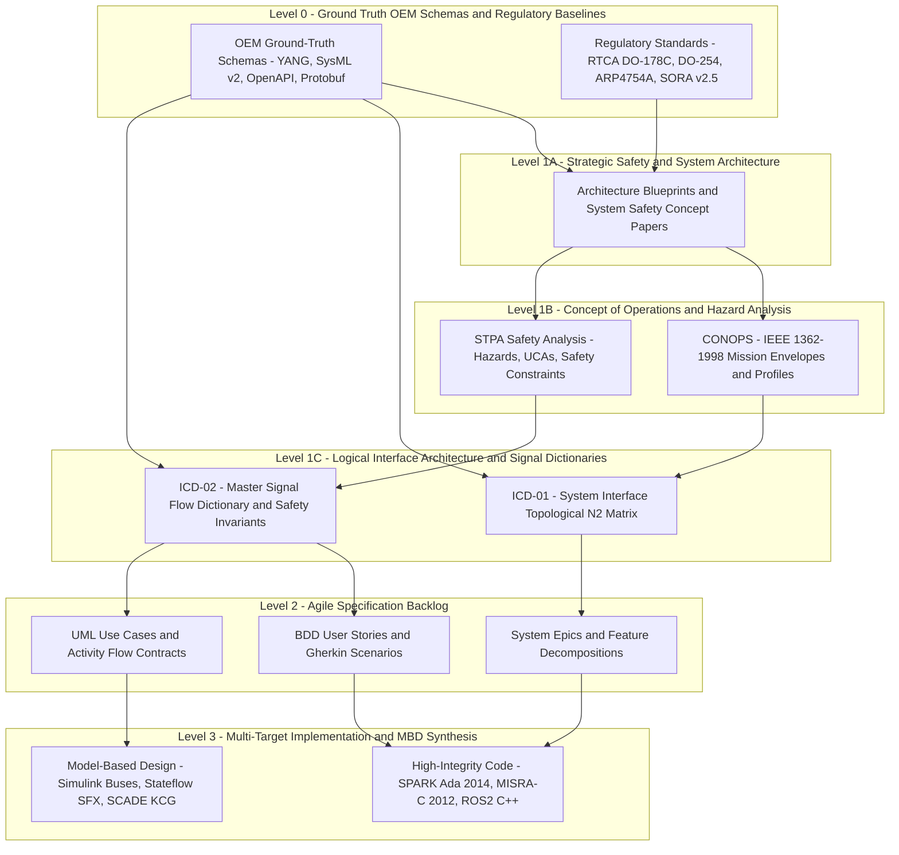
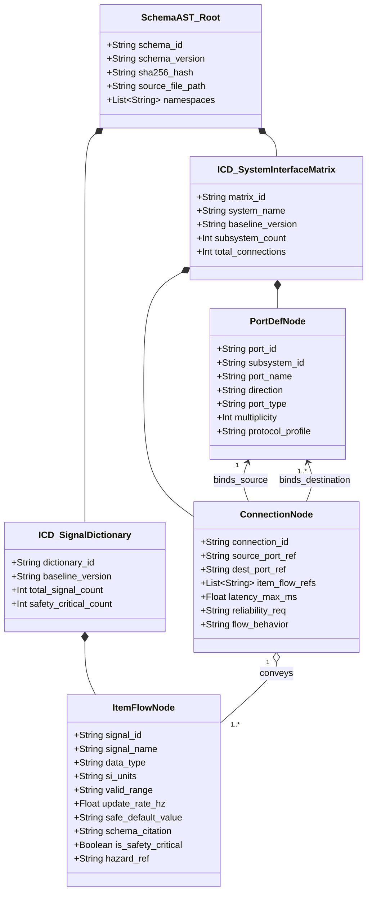
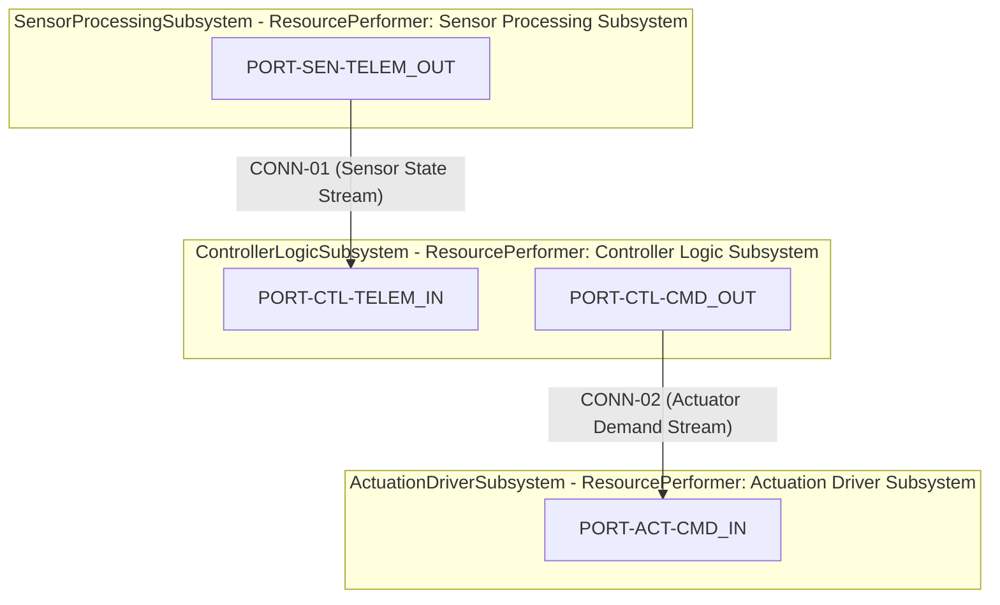
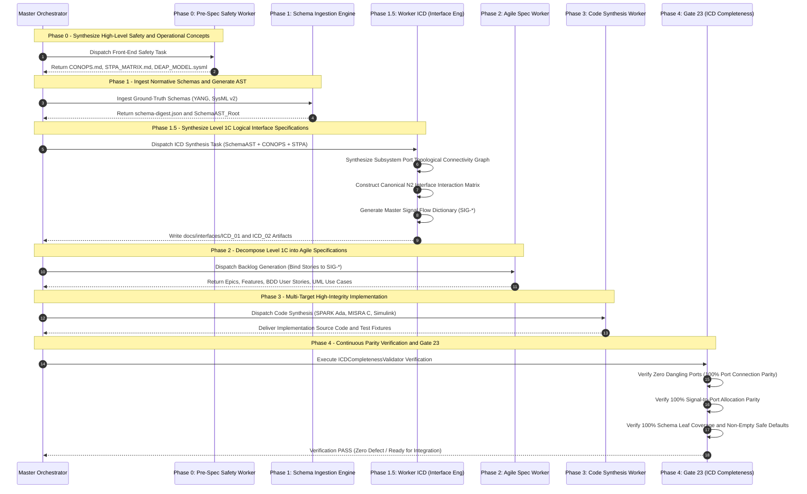
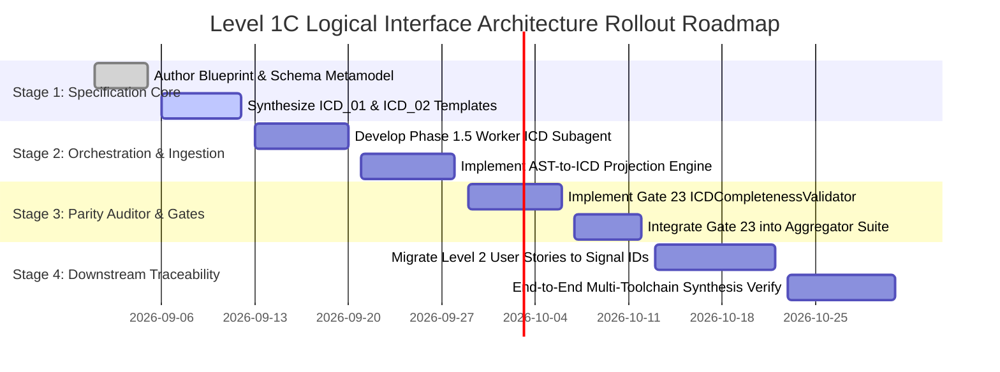

| Attribute | Specification Detail |
| :--- | :--- |
| **Document ID** | DEAP-BLUEPRINT-LOGICAL-ICD-001 |
| **Title** | Solution Blueprint: Level 1C Logical Interface Specification & Signal Flow Dictionaries |
| **Status** | APPROVED / ARCHITECTURE SSOT |
| **Classification** | Enterprise Systems Engineering Interface Architecture Specification |
| **Version** | 1.0.0 |
| **Date** | 2026-09-01 |
| **Target Standards** | ISO/IEC/IEEE 15288:2023 \| IEEE 1362-1998 \| INCOSE SE Handbook v5 \| RTCA DO-178C / DO-331 |

# Level 1C Logical Interface Specification & Signal Flow Dictionaries Blueprint

## Section 1: Executive Summary & Systems Engineering Rationale

### 1.1 Executive Summary & Architectural Vision

In safety-critical enterprise systems engineering and high-integrity cyber-physical system architectures (such as autonomous flight control, unmanned aircraft systems, and mission avionics), a fundamental architectural chasm exists between high-level operational concepts and downstream software implementation artifacts. Traditional systems engineering methodologies often transition abruptly from unstructured operational descriptions (Level 1B Concept of Operations) directly to low-level agile task backlogs or granular source code (Level 2 Specifications and Level 3 Implementation). This gap introduces severe risks: undefined port boundaries, inconsistent data types, ambiguous physical units, missing safe default states, and untracked interface coupling.

The **Digital Engineering Agentic Pipeline (DEAP)** solves this structural deficiency by introducing **Level 1C: Logical Interface Specifications & Signal Flow Dictionaries**. Level 1C operates as an immutable architectural layer that formalizes all logical subsystem boundaries, data item flows, functional ports, update rates, valid operational ranges, and deterministic fail-safe default values prior to agile backlog decomposition and software code synthesis.



### 1.2 Systems Engineering Standards Alignment

The Level 1C Logical Interface Specification directly satisfies the lifecycle process requirements codified in international systems engineering and safety standards:

1. **ISO/IEC/IEEE 15288:2023 §6.4.4 (Architecture Definition Process):** Mandates the formal identification of system elements, logical structural boundaries, and interface interactions. Level 1C provides the complete topological graph and interaction matrix required to demonstrate architectural completeness and partitioning integrity.
2. **ISO/IEC/IEEE 15288:2023 §6.4.5 (Design Definition Process):** Requires the exhaustive specification of interface characteristics, including data types, valid value bounds, physical engineering units, timing properties, and operational exception behaviors. Level 1C captures these parameters inside the Master Signal Dictionary.
3. **ISO/IEC/IEEE 15288:2023 §6.4.8 (Implementation Process):** Establishes unambiguous, verified technical data packages and interface contracts that govern software construction and subsystem assembly without semantic ambiguity.
4. **IEEE 1362-1998 (Guide for System Definition - Concept of Operations):** Bridges high-level operational user needs and operational scenarios to precise logical system capabilities and inter-subsystem data exchanges.
5. **INCOSE Systems Engineering Handbook v5 (Section 3.3.4 & Section 9.2):** Enforces Model-Based Systems Engineering (MBSE) formalisms for logical architecture definition, N-squared (N²) interface matrices, and bidirectional traceability.
6. **RTCA DO-178C / DO-331 (Model-Based Development & Verification):** Enforces strict definition of software architecture inputs and outputs, ensuring data coupling and control coupling integrity (DO-178C Table A-3 Objective 4 and Table A-7 Objective 8).

### 1.3 Mathematical Foundation of Logical Subsystem Decomposition

Let the overall system $\mathcal{S}$ be partitioned into a finite set of $N$ discrete logical subsystems:

$$ \begin{aligned}
\mathcal{S} &= \{ s_1, s_2, \dots, s_N \}
\end{aligned} $$

Each subsystem $s_i \in \mathcal{S}$ is formally defined as a tuple containing its internal state space $\mathcal{X}_i$, its set of input ports $\mathcal{P}_i^{\mathrm{in}}$, and its set of output ports $\mathcal{P}_i^{\mathrm{out}}$:

$$ \begin{aligned}
s_i &= \langle \mathcal{X}_i, \mathcal{P}_i^{\mathrm{in}}, \mathcal{P}_i^{\mathrm{out}} \rangle
\end{aligned} $$

The total set of logical ports across the system is the disjoint union:

$$ \begin{aligned}
\mathcal{P} &= \bigcup_{i=1}^N \left( \mathcal{P}_i^{\mathrm{in}} \cup \mathcal{P}_i^{\mathrm{out}} \right), \quad \text{where } \mathcal{P}_i^{\mathrm{in}} \cap \mathcal{P}_i^{\mathrm{out}} = \emptyset
\end{aligned} $$

A logical connection $c \in \mathcal{C}$ establishes an information flow from an output port $p_{\mathrm{src}} \in \mathcal{P}_i^{\mathrm{out}}$ of subsystem $s_i$ to an input port $p_{\mathrm{dst}} \in \mathcal{P}_j^{\mathrm{in}}$ of subsystem $s_j$ ($i \neq j$):

$$ \begin{aligned}
c &= \langle p_{\mathrm{src}}, p_{\mathrm{dst}}, \Sigma_{i \to j}, \tau_{\mathrm{latency}} \rangle
\end{aligned} $$

where $\Sigma_{i \to j}$ is the ordered tuple of discrete logical signals conveyed over the connection, and $\tau_{\mathrm{latency}}$ defines the maximum permissible transport and processing latency bound.

---

## Section 2: Abstract Schema AST to Logical Interface Metamodel Mapping

### 2.1 Metamodel Definition & AST Hierarchy

The Level 1C Logical Interface Metamodel formalizes the semantic bridge between the raw parsed schema Abstract Syntax Tree (AST) generated from normative domain sources (YANG models, SysML v2 text, OpenAPI definitions, or Protobuf files) and downstream specification models.

The metamodel consists of six primary entities:
1. **`SchemaAST_Root`**: The immutable, root-level abstract syntax tree parsed from Level 0 normative schemas. It encapsulates namespace metadata, type declarations, container hierarchies, and structural leaves.
2. **`ICD_SystemInterfaceMatrix`**: The system-level container that maintains the topological connectivity graph, subsystem registry, and canonical N² interaction matrix.
3. **`ICD_SignalDictionary`**: The master registry containing the exhaustive set of all logical signals, telemetry channels, command parameters, and safety-critical state variables.
4. **`PortDefNode`**: A discrete logical port situated on a subsystem boundary. It defines directional flow (IN, OUT, INOUT), port classification (Data, Command, Telemetry, Event), and structural multiplicity.
5. **`ItemFlowNode`**: A typed logical payload entity representing a distinct signal or record transferred across ports. It enforces SI unit normalization, numeric bounds, quantization resolution, update rate, and fail-safe defaults.
6. **`ConnectionNode`**: A directed topological link binding a source `PortDefNode` to one or more destination `PortDefNode` instances, with explicit latency and transmission constraints.



### 2.2 Formal AST Transformation Functions

The automated synthesis of Level 1C interface artifacts from the Level 0 `SchemaAST_Root` is governed by deterministic projection functions:

Let $\mathcal{T}_{\mathrm{ast}}$ represent the schema AST node set. The projection function $\Pi_{\mathrm{port}}: \mathcal{T}_{\mathrm{ast}} \to \mathcal{P}$ extracts port definitions:

$$ \begin{aligned}
\Pi_{\mathrm{port}}(n) &= \begin{cases}
\mathrm{PortDefNode}(n.\mathrm{id}, n.\mathrm{subsys}, n.\mathrm{dir}, n.\mathrm{type}) & \text{if } n \text{ is port-like} \\
\emptyset & \text{otherwise}
\end{cases}
\end{aligned} $$

Similarly, the signal extraction function $\Pi_{\mathrm{signal}}: \mathcal{T}_{\mathrm{ast}} \to \mathcal{S}_{\mathrm{dict}}$ projects terminal leaf and attribute nodes into canonical `ItemFlowNode` records:

$$ \begin{aligned}
\Pi_{\mathrm{signal}}(l) &= \left\langle \mathrm{ID}(l), \mathrm{Name}(l), \mathrm{Type}(l), \mathrm{Unit}(l), \mathrm{Range}(l), f_{\mathrm{rate}}(l), v_{\mathrm{default}}(l), \mathrm{Cite}(l) \right\rangle
\end{aligned} $$

### 2.3 Strict Logical Abstraction Invariants

To prevent premature hardware coupling and preserve platform independence, Level 1C strictly enforces the following architectural invariants:

1. **Zero Physical Connectors:** No references to physical plug types (e.g., MIL-DTL-38999, RJ45, USB-C, DB9) are permitted in Level 1C models.
2. **Zero ECAD Pinouts:** No references to printed circuit board (PCB) pin numbers, FPGA ball grid array (BGA) mappings, or microcontroller GPIO pin configurations are permitted.
3. **Zero Wire Harness Drawings:** No references to wire gauges, shielding topologies, harness bundle identifiers, or terminal lug specifications are permitted.
4. **Zero Transport Byte Framing:** No transport-layer serialization details (e.g., CAN 2.0B 11-bit/29-bit identifiers, ARINC 429 32-bit word label encodings, Ethernet MAC headers, UART start/stop bit framings) are permitted. All signals must remain purely logical data entities defined by typed values, physical SI units, valid ranges, update rates, and safe default states.

---

## Section 3: Standardized Level 1C Interface Artifacts in `docs/interfaces/`

All Level 1C logical interface specifications are maintained in the standardized repository directory `docs/interfaces/`. Level 1C comprises two canonical, human-readable, and machine-verifiable CommonMark artifacts:
- `docs/interfaces/ICD_01_SYSTEM_INTERFACE_MATRIX.md`
- `docs/interfaces/ICD_02_MASTER_SIGNAL_DICTIONARY.md`

### 3.1 `ICD_01_SYSTEM_INTERFACE_MATRIX.md` Specification

`ICD_01_SYSTEM_INTERFACE_MATRIX.md` captures the global subsystem topological connectivity graph, port rosters, connection bindings, and canonical N² interaction matrix.

#### 3.1.1 Subsystem Topological Connectivity Graph
The connectivity graph visualizes all directional data and command flows between subsystems.



#### 3.1.2 Canonical N² Subsystem Interface Matrix
The N² matrix provides a rigorous, compact representation of all inter-subsystem data flows. Subsystems are placed along the main diagonal. Transmitting subsystems output along rows; receiving subsystems input along columns. Off-diagonal cells contain the exact connection identifiers and transmitted signal counts.

| Subsystem | 1. SEN | 2. CTL | 3. ACT |
| :--- | :--- | :--- | :--- |
| **1. SEN** | **[ Sensor Processing ]** | CONN-01 (3 Signals) | — |
| **2. CTL** | — | **[ Controller Logic ]** | CONN-02 (3 Signals) |
| **3. ACT** | — | — | **[ Actuation Driver ]** |

#### 3.1.3 Port Definition Roster Table Structure
The port roster defines every logical port across all system boundaries:

| Port ID | Subsystem | Port Name | Direction | Port Type | Multiplicity | Protocol Profile |
| :--- | :--- | :--- | :--- | :--- | :--- | :--- |
| `PORT-SEN-TELEM_OUT` | SensorProcessingSubsystem | SensorTelemetryOut | OUT | TelemetryPort | 1 | PeriodicStream |
| `PORT-CTL-TELEM_IN` | ControllerLogicSubsystem | SensorTelemetryIn | IN | TelemetryPort | 1 | PeriodicStream |
| `PORT-CTL-CMD_OUT` | ControllerLogicSubsystem | ActuatorCommandOut | OUT | CommandPort | 1 | RealTimeSync |
| `PORT-ACT-CMD_IN` | ActuationDriverSubsystem | ActuatorCommandIn | IN | CommandPort | 1 | RealTimeSync |

### 3.2 `ICD_02_MASTER_SIGNAL_DICTIONARY.md` Specification

`ICD_02_MASTER_SIGNAL_DICTIONARY.md` establishes the single source of truth for every logical signal exchanged in the system.

#### 3.2.1 Master Signal Table Column Schema

Every signal entry in the Master Signal Dictionary must strictly adhere to the ten canonical columns:

1. **Signal ID:** Unique, hierarchical identifier format `SIG-<SRC_SUBSYS>-<DST_SUBSYS>-<NNN>`.
2. **Signal Name:** UpperCamelCase canonical name describing semantic intent.
3. **Source Port:** Foreign key reference to a declared `PORT-*` in `ICD_01_SYSTEM_INTERFACE_MATRIX.md`.
4. **Dest Port:** Foreign key reference to a declared `PORT-*` in `ICD_01_SYSTEM_INTERFACE_MATRIX.md`.
5. **Data Type:** Standardized primitive or composite data type (`Float64`, `Float32`, `Int32`, `UInt32`, `Bool`, `Enum`, `Record`).
6. **SI Units:** Normalized base or derived SI unit (e.g., `m`, `m/s`, `m/s^2`, `rad`, `rad/s`, `Pa`, `K`, `V`, `A`, `W`, `Hz`, `dimensionless`).
7. **Valid Range:** Precise mathematical domain interval `[min, max]` or discrete enumeration literal set.
8. **Update Rate:** Periodic frequency in plain text `f Hz` (e.g., `50 Hz`, `100 Hz`) or aperiodic timing bound `Aperiodic [tau_min, tau_max] ms`.
9. **Safe Default Value:** Deterministic value assigned during cold initialization, link interruption, sensor fault, or emergency failsafe state.
10. **Schema Citation:** Exact normative provenance pointer to Level 0 source schema (`schema/extracted/filename.yang#Lnn` or `models/system.sysml#Lnn`).

#### 3.2.2 Canonical Signal Flow Table Example

| Signal ID | Signal Name | Source Port | Dest Port | Data Type | SI Units | Valid Range | Update Rate | Safe Default Value | Schema Citation |
| :--- | :--- | :--- | :--- | :--- | :--- | :--- | :--- | :--- | :--- |
| `SIG-SEN-CTL-001` | PrimarySensorState | `PORT-SEN-TELEM_OUT` | `PORT-CTL-TELEM_IN` | Float32 | V | [0.0, 100.0] | 100 Hz | 0.0 | `schema/extracted/sensor.yang#L45` |
| `SIG-SEN-CTL-002` | OperationalRateSignal | `PORT-SEN-TELEM_OUT` | `PORT-CTL-TELEM_IN` | Float32 | rad/s | [-50.0, 50.0] | 100 Hz | 0.0 | `schema/extracted/sensor.yang#L58` |
| `SIG-SEN-CTL-003` | EnvironmentalMetric | `PORT-SEN-TELEM_OUT` | `PORT-CTL-TELEM_IN` | Float32 | Pa | [0.0, 1000.0] | 50 Hz | 0.0 | `schema/extracted/sensor.yang#L72` |
| `SIG-CTL-ACT-001` | PrimaryActuatorDemand | `PORT-CTL-CMD_OUT` | `PORT-ACT-CMD_IN` | Float32 | dimensionless | [-1.0, 1.0] | 200 Hz | 0.0 | `schema/extracted/controller.yang#L110` |
| `SIG-CTL-ACT-002` | AuxiliaryActuatorDemand | `PORT-CTL-CMD_OUT` | `PORT-ACT-CMD_IN` | Float32 | dimensionless | [-1.0, 1.0] | 200 Hz | 0.0 | `schema/extracted/controller.yang#L124` |
| `SIG-CTL-ACT-003` | PowerEnableDemand | `PORT-CTL-CMD_OUT` | `PORT-ACT-CMD_IN` | Float32 | dimensionless | [0.0, 1.0] | 100 Hz | 0.0 | `schema/extracted/controller.yang#L138` |

#### 3.2.3 Safety-Critical Signal Allocation & STPA Hazard Mapping Example

| Signal ID | Safety Criticality | Hazard Ref | Safety Constraint | Failsafe Action |
| :--- | :--- | :--- | :--- | :--- |
| `SIG-SEN-CTL-001` | DAL-A / SIL-3 | **H-1** | Loss of System Control & Boundary Violation | Clamp to safe default (0.0 V) and transition controller to safe state |
| `SIG-SEN-CTL-002` | DAL-A / SIL-3 | **H-2** | Sensor Invalidation & Slew Saturation | Revert to safe default (0.0 rad/s) and engage rate dampening fallback |
| `SIG-SEN-CTL-003` | DAL-B / SIL-2 | **H-4** | Environmental Monitoring Failure | Assert safe default (0.0 Pa) and raise environmental advisory flag |
| `SIG-CTL-ACT-001` | DAL-A / SIL-3 | **H-3** | Actuator Command Saturation | Limit command within [-1.0, 1.0] and clamp to safe neutral default (0.0) |
| `SIG-CTL-ACT-002` | DAL-A / SIL-3 | **H-3** | Actuator Command Saturation | Limit command within [-1.0, 1.0] and clamp to safe neutral default (0.0) |
| `SIG-CTL-ACT-003` | DAL-A / SIL-3 | **H-1** | Loss of System Control & Boundary Violation | Disable power output and clamp safe default (0.0) on link failure |

---

## Section 4: Master Orchestrator Pipeline Integration & Sequence Diagram

### 4.1 Multi-Phase Agentic Execution Pipeline

Level 1C is integrated directly into the DEAP Orchestration lifecycle via a dedicated intermediate synthesis stage: **Phase 1.5 (Worker ICD - Logical Interface Engineer)**.

The orchestrator enforces strict serialization and artifact immutability across five successive execution phases:
- **Phase 0 (Front-End Systems & Safety Modeling):** Worker 0A, 0B, and 0C author `CONOPS.md`, `STPA_MATRIX.md`, and `DEAP_MODEL.sysml`.
- **Phase 1 (Pre-Dispatch Schema Ingestion):** Computes cryptographic hash `schema-digest.json` and extracts `SchemaAST_Root`.
- **Phase 1.5 (Worker ICD - Logical Interface Synthesis):** Ingests `SchemaAST_Root` and Phase 0 safety/operational models to generate `docs/interfaces/ICD_01_SYSTEM_INTERFACE_MATRIX.md` and `docs/interfaces/ICD_02_MASTER_SIGNAL_DICTIONARY.md`.
- **Phase 2 (Agile Specification Backlog Generation):** Downstream Worker 2A, 2B, and 2C project Level 1C signals into Epics, Features, BDD User Stories, and UML Use Cases.
- **Phase 3 (Feature-Driven Implementation):** Sub-implementers synthesize SPARK Ada, MISRA C, ROS2 C++, and Simulink models.
- **Phase 4 (AST Parity Auditor & Verification Gates):** Executes **Gate 23 (ICDCompletenessValidator)** alongside Gates 1–22.



---

## Section 5: Parity Auditor Gate 23 (ICDCompletenessValidator Specification)

### 5.1 Formal Gate Requirements & Defect Taxonomy

**Gate 23 (`ICDCompletenessValidator`)** is implemented as a deterministic, offline static verification engine within the DEAP Parity Auditor suite (`skills/spec-orchestrator/parity_auditor/`).

Gate 23 enforces five mandatory verification rules:

1. **Rule 1 (`icd-dangling-port-detected`):** Asserts that every logical port $p \in \mathcal{P}_{\mathrm{internal}}$ declared in `ICD_01_SYSTEM_INTERFACE_MATRIX.md` is bound to at least one active connection $c \in \mathcal{C}$ or is formally marked as an external boundary port.
2. **Rule 2 (`icd-unmapped-signal-detected`):** Asserts that every signal $\sigma \in \mathcal{S}_{\mathrm{dict}}$ in `ICD_02_MASTER_SIGNAL_DICTIONARY.md` maps to a declared connection $c$ and matching ports $(p_{\mathrm{src}}, p_{\mathrm{dst}})$ in `ICD_01_SYSTEM_INTERFACE_MATRIX.md`.
3. **Rule 3 (`icd-schema-orphan-leaf-detected`):** Asserts that 100% of inter-subsystem data leaves in `SchemaAST_Root` are allocated to a corresponding `SIG-*` entry.
4. **Rule 4 (`icd-invalid-field-contract`):** Asserts that every signal contains non-empty, valid SI units, a bounded valid range `[min, max]`, a positive update rate $f > 0$, an unambiguous safe default value, and a valid schema citation.
5. **Rule 5 (`icd-downstream-citation-missing`):** Asserts that all downstream Level 2 BDD User Stories and UML Use Cases referencing inter-subsystem data exchanges cite valid, registered `SIG-*` identifiers from `ICD_02_MASTER_SIGNAL_DICTIONARY.md`.

### 5.2 Mathematical Completeness Formulation

Let $\mathcal{P}_{\mathrm{declared}}$ be the set of declared subsystem ports and $\mathcal{P}_{\mathrm{bound}}$ be the set of ports referenced by connections:

$$ \begin{aligned}
\mathcal{P}_{\mathrm{bound}} &= \bigcup_{c \in \mathcal{C}} \{ c.p_{\mathrm{src}}, c.p_{\mathrm{dst}} \}
\end{aligned} $$

The dangling port set $\mathcal{D}_{\mathrm{port}}$ must evaluate to the empty set:

$$ \begin{aligned}
\mathcal{D}_{\mathrm{port}} &= \mathcal{P}_{\mathrm{declared}} \setminus (\mathcal{P}_{\mathrm{bound}} \cup \mathcal{P}_{\mathrm{external}}) = \emptyset
\end{aligned} $$

The signal dictionary coverage metric $\Omega_{\mathrm{coverage}}$ over all schema interface leaves $\mathcal{L}_{\mathrm{schema}}$ must strictly equal 1.0 (100%):

$$ \begin{aligned}
\Omega_{\mathrm{coverage}} &= \frac{|\mathcal{S}_{\mathrm{dict}} \cap \mathcal{L}_{\mathrm{schema}}|}{|\mathcal{L}_{\mathrm{schema}}|} = 1.0
\end{aligned} $$

### 5.3 Validator Implementation Architecture

The `ICDCompletenessValidator` class adheres to the `IValidator` interface:

```python
"""
ICD Completeness & Signal Flow Parity Validator (Gate 23).
"""

import os
import re
from typing import Dict, List, Set, Tuple
from parity_auditor.validators.base import IValidator
from parity_auditor.core.findings import Finding
from parity_auditor.core.workspace import WorkspaceRepository

class ICDCompletenessValidator(IValidator):
    """
    Gate 23: Enforces 100% topological port binding, zero dangling ports,
    and complete signal dictionary coverage for Level 1C ICD artifacts.
    """

    PORT_ROSTER_RE = re.compile(r"^\|\s*`?(PORT-[A-Z0-9_-]+)`?\s*\|\s*([A-Z0-9_-]+)\s*\|\s*([A-Za-z0-9_-]+)\s*\|\s*(IN|OUT|INOUT)\s*\|", re.MULTILINE)
    CONN_ROW_RE = re.compile(r"^\|\s*`?(CONN-[A-Z0-9_-]+)`?\s*\|\s*`?(PORT-[A-Z0-9_-]+)`?\s*\|\s*`?(PORT-[A-Z0-9_-]+)`?\s*\|", re.MULTILINE)
    SIGNAL_ROW_RE = re.compile(r"^\|\s*`?(SIG-[A-Z0-9_-]+)`?\s*\|\s*([A-Za-z0-9_]+)\s*\|\s*`?(PORT-[A-Z0-9_-]+)`?\s*\|\s*`?(PORT-[A-Z0-9_-]+)`?\s*\|\s*([A-Za-z0-9_]+)\s*\|\s*([^|]+)\|\s*([^|]+)\|\s*([^|]+)\|\s*([^|]+)\|\s*`?([^|`]+)`?\s*\|", re.MULTILINE)

    def validate(self, repo: WorkspaceRepository, **kwargs) -> List[Finding]:
        findings: List[Finding] = []
        icd01_path = os.path.join(repo.workspace_dir, "docs", "interfaces", "ICD_01_SYSTEM_INTERFACE_MATRIX.md")
        icd02_path = os.path.join(repo.workspace_dir, "docs", "interfaces", "ICD_02_MASTER_SIGNAL_DICTIONARY.md")

        if not os.path.exists(icd01_path):
            findings.append(Finding("icd-file-missing", "Missing required Level 1C artifact: docs/interfaces/ICD_01_SYSTEM_INTERFACE_MATRIX.md", location="docs/interfaces/ICD_01_SYSTEM_INTERFACE_MATRIX.md"))
            return findings

        if not os.path.exists(icd02_path):
            findings.append(Finding("icd-file-missing", "Missing required Level 1C artifact: docs/interfaces/ICD_02_MASTER_SIGNAL_DICTIONARY.md", location="docs/interfaces/ICD_02_MASTER_SIGNAL_DICTIONARY.md"))
            return findings

        with open(icd01_path, "r", encoding="utf-8") as f:
            icd01_text = f.read()
        with open(icd02_path, "r", encoding="utf-8") as f:
            icd02_text = f.read()

        # Parse ports and connections
        declared_ports: Set[str] = set(m.group(1) for m in self.PORT_ROSTER_RE.finditer(icd01_text))
        bound_ports: Set[str] = set()
        for m in self.CONN_ROW_RE.finditer(icd01_text):
            bound_ports.add(m.group(2))
            bound_ports.add(m.group(3))

        # Check for dangling ports
        dangling = declared_ports - bound_ports
        for port in sorted(dangling):
            findings.append(Finding(
                "icd-dangling-port-detected",
                f"Declared port '{port}' in ICD_01 is not bound to any active ConnectionNode.",
                location="docs/interfaces/ICD_01_SYSTEM_INTERFACE_MATRIX.md",
                detail={"port_id": port}
            ))

        # Parse signals and validate signal integrity
        signal_ids: Set[str] = set()
        for m in self.SIGNAL_ROW_RE.finditer(icd02_text):
            sig_id, sig_name, src_p, dst_p, d_type, units, v_range, rate, default_v, schema_ref = [m.group(i).strip() for i in range(1, 11)]
            signal_ids.add(sig_id)

            if src_p not in declared_ports:
                findings.append(Finding("icd-invalid-port-ref", f"Signal '{sig_id}' cites undeclared Source Port '{src_p}'.", location="docs/interfaces/ICD_02_MASTER_SIGNAL_DICTIONARY.md"))
            if dst_p not in declared_ports:
                findings.append(Finding("icd-invalid-port-ref", f"Signal '{sig_id}' cites undeclared Dest Port '{dst_p}'.", location="docs/interfaces/ICD_02_MASTER_SIGNAL_DICTIONARY.md"))

            if not units or units == "TBD":
                findings.append(Finding("icd-missing-units", f"Signal '{sig_id}' has missing or TBD SI units.", location="docs/interfaces/ICD_02_MASTER_SIGNAL_DICTIONARY.md"))
            if not default_v or default_v == "TBD":
                findings.append(Finding("icd-missing-safe-default", f"Signal '{sig_id}' has missing or TBD safe default value.", location="docs/interfaces/ICD_02_MASTER_SIGNAL_DICTIONARY.md"))

        return findings
```

---

## Section 6: Rollout & Verification Roadmap

### 6.1 Phased Implementation Milestones

The deployment of the Level 1C Logical Interface Specification architecture across the DEAP platform follows a structured four-stage rollout:



### 6.2 Verification Matrix & Acceptance Criteria

To ensure production readiness and certification compliance, each rollout phase must satisfy formal acceptance criteria:

| Phase / Milestone | Verification Method | Acceptance Criteria | Target Tool / Authority |
| :--- | :--- | :--- | :--- |
| **Milestone 1: Metamodel Synthesis** | Automated Schema AST Inspection | 100% extraction of subsystem ports, item flows, and connections from Level 0 schemas without data loss. | `scripts/compile_sysml_v2.py` |
| **Milestone 2: Artifact Structure** | Markdown AST & Table Validator | Strict conformance to 10-column schema in `ICD_02` and complete N² matrix in `ICD_01`. | `parity_auditor` Markdown Engine |
| **Milestone 3: Gate 23 Parity** | Pytest Test Suite Execution | Zero dangling ports, 100% port binding parity, and zero missing safe defaults across all test suites. | `tests/test_icd_completeness.py` |
| **Milestone 4: L2 Backlog Traceability** | Bidirectional Cross-Reference Check | 100% of Level 2 BDD User Story data parameters cite valid `SIG-*` dictionary identifiers. | `parity_auditor` Spec Validator |
| **Milestone 5: Multi-Target Code Synthesis** | Code Generation & Static Analysis | Synthesized SPARK Ada packages, C structs, and Simulink Bus objects match Level 1C types and ranges. | GNATprove / Polyspace / SCADE |

---
