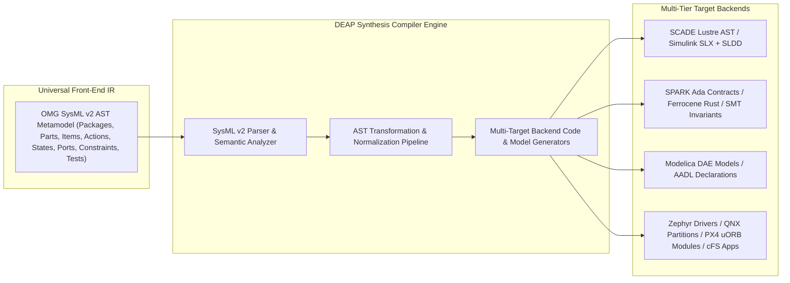
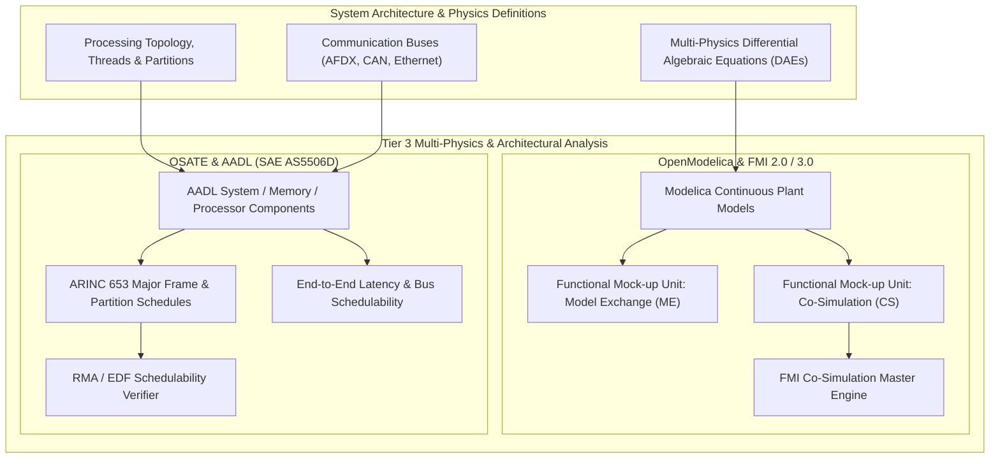
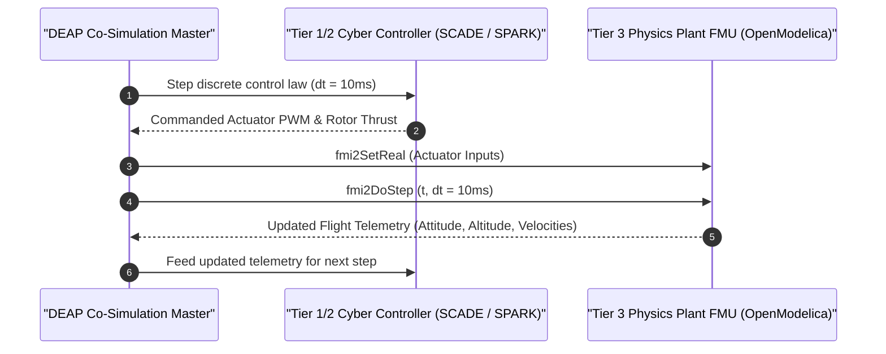
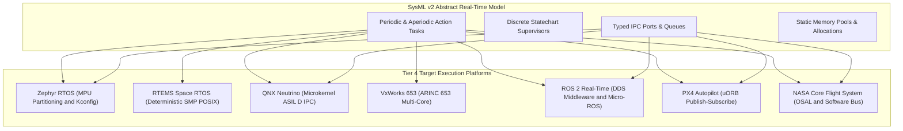
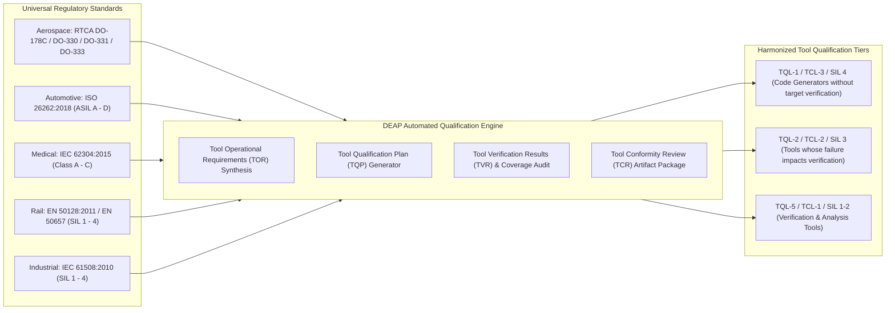
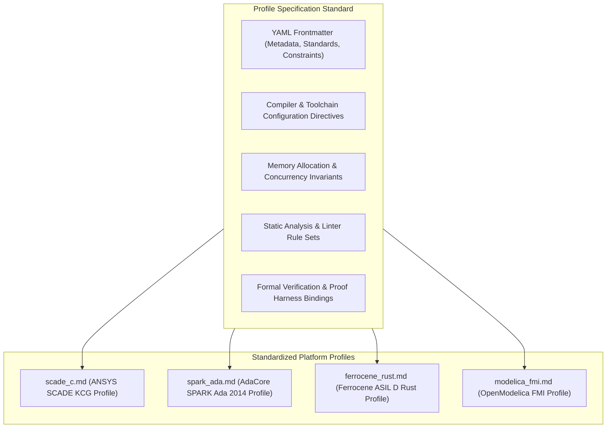

# DEAP Multi-Toolchain Synthesis & Formal Verification Architecture

> **Document Identifier:** `DEAP-BLUEPRINT-TOOLCHAIN-001`  
> **Status:** `APPROVED / PRODUCTION-GRADE`  
> **Classification:** `Multi-Toolchain Synthesis, Formal Verification & Execution Framework Blueprint`  
> **Target Standards:** `RTCA DO-178C / DO-330 / DO-331 / DO-333` | `ISO 26262:2018 (ASIL D)` | `IEC 62304:2015 (Class C)` | `EN 50128:2011 / EN 50657 (SIL 4)` | `IEC 61508:2010 (SIL 4)` | `OMG SysML v2 (ptc/2023-08-01)` | `SAE AS5506D (AADL)` | `Modelica FMI 2.0/3.0` | `ARINC 653P1-5` | `ARINC 661`

---

## Section 1: Executive Summary & Abstract MBSE Compiler Positioning

### 1.1 The Cross-Industry Safety-Critical Software Synthesis Challenge

Engineering safety-critical, cyber-physical, and autonomous systems across modern aerospace (**RTCA DO-178C DAL A**), automotive (**ISO 26262 ASIL D**), medical devices (**IEC 62304 Class C**), rail transportation (**EN 50128 SIL 4**), and industrial automation (**IEC 61508 SIL 4**) presents a fundamental systems engineering crisis: **the semantic gap between abstract architectural intent and verifiable, deterministic machine execution**.

Historically, safety-critical organizations have been trapped in rigid, single-vendor silos:
1. **Commercial Model-Based Design (MBD) Silos:** Organizations relying exclusively on proprietary environments such as **ANSYS SCADE Suite** or **MathWorks MATLAB / Simulink / Stateflow** achieve high levels of code generation maturity, but face vendor lock-in, proprietary model representations that resist automated git-based CI/CD workflows, and steep licensing barriers that prevent elastic cloud verification.
2. **Formal Verification Silos:** Specialized teams utilizing formal deductive provers such as **AdaCore SPARK Ada** or bounded model checkers (**nuXmv**, **UPPAAL**, **CBMC**, **Kani**) frequently operate independently of the primary systems engineering team, manually translating requirements into mathematical contracts and leading to specification drift.
3. **Multi-Physics & Architectural Analysis Silos:** Multi-body dynamics, aerodynamic models, and thermal dissipation systems authored in **OpenModelica** / **FMI** or execution architecture models authored in **OSATE / AADL (SAE AS5506)** remain disconnected from real-time flight software synthesis.
4. **Target Execution Framework Heterogeneity:** Embedded software teams must deploy synthesized control laws across vastly different real-time kernels and frameworks—from bare-metal microcontrollers running **Zephyr RTOS**, to space-grade **RTEMS**, certified commercial microkernels (**QNX Neutrino**, **Wind River VxWorks 653**), robotics middleware (**ROS 2**), autonomous flight stacks (**PX4 Autopilot**), and spaceflight software frameworks (**NASA cFS**).

```mermaid
flowchart TD
    subgraph Problem_Silos ["Traditional Fragmented Toolchain Silos (High Cost, Manual Translation, Specification Drift)"]
        Silo_MBD["Proprietary MBD Silo - SCADE / Simulink"]
        Silo_Formal["Formal Provers Silo - SPARK Ada / SMT"]
        Silo_Physics["Co-Simulation Silo - Modelica / AADL"]
        Silo_RTOS["Target Execution Silo - Zephyr / RTEMS / QNX"]
    end

    subgraph DEAP_Solution ["DEAP Abstract MBSE Compiler & Synthesis Orchestrator"]
        SysML_SSOT["Canonical SysML v2 AST SSOT (".pipeline/schema.sysml")"]
        Synthesizer["Universal Multi-Backend AST Synthesis Compiler"]
        Parity_Lock["22-Gate Parity Lock & Mechanical Verification Suite"]
    end

    subgraph Synthesized_Ecosystem ["Target Synthesis Tiers (Unified, Zero-Drift, Fully Traceable)"]
        Tier1["Tier 1: Certified MBD ("SCADE KCG / Simulink Embedded Coder")"]
        Tier2["Tier 2: Formal Contract & Prover ("SPARK Ada / Ferrocene Rust / nuXmv")"]
        Tier3["Tier 3: Open Standards & Multi-Physics ("OpenModelica FMI / OSATE AADL")"]
        Tier4["Tier 4: Target RTOS Frameworks ("Zephyr / RTEMS / QNX / VxWorks / PX4 / cFS")"]
    end

    Problem_Silos -.->|"Eliminated by"| DEAP_Solution
    SysML_SSOT --> Synthesizer
    Synthesizer --> Tier1
    Synthesizer --> Tier2
    Synthesizer --> Tier3
    Synthesizer --> Tier4
    Tier1 --> Parity_Lock
    Tier2 --> Parity_Lock
    Tier3 --> Parity_Lock
    Tier4 --> Parity_Lock
```

---

### 1.2 DEAP Positioning as an Abstract MBSE Compiler & Synthesis Orchestrator

The **Digital Engineering Agentic Pipeline (DEAP)** resolves this fragmentation by establishing an architectural paradigm: **DEAP is an Abstract MBSE Synthesis Compiler and Multi-Target Verification Orchestrator**.

Rather than binding systems engineering workflows to any single commercial modeling tool, language, or target operating system, DEAP treats the **OMG SysML v2 Abstract Syntax Tree (AST)** (defined in `".pipeline/schema.sysml"`) as the **Universal Front-End Intermediate Representation (IR)**. 



From this canonical IR, DEAP deterministically synthesizes models, formal contracts, co-simulation units, and embedded source code across four foundational synthesis tiers, while enforcing mathematical zero-drift consistency via cryptographic AST digests and multi-gate verification locks.

---

### 1.3 Core Mathematical Guarantees & Semantic Invariants

The DEAP Multi-Toolchain Synthesis Architecture guarantees the following mathematical properties across all target toolchain translations:

1. **Semantic Equivalence (Preservation of Semantics):** For every SysML v2 state transition system $M_{\text{SysML}} = \langle S, S_0, \Sigma, \delta, F \rangle$, the synthesized target model or code $M_{\text{Target}}$ preserves all reachable state invariants and safety properties:
   $$\forall s \in \text{Reach}(M_{\text{SysML}}), \quad \phi(s) \implies \forall s' \in \text{Reach}(M_{\text{Target}}), \quad \phi(s')$$

2. **AST Idempotency and Determinism:** Repeated compilation of identical SysML v2 AST definitions produces byte-for-byte identical target artifacts:
   $$\text{Synthesize}(\text{AST}_t) = \text{Synthesize}(\text{AST}_{t+\Delta t}) \iff \text{Digest}(\text{AST}_t) \equiv \text{Digest}(\text{AST}_{t+\Delta t})$$

3. **Absence of Undefined Behavior (Soundness Guarantee):** Synthesized source code targeting C, Ada, or Rust complies with static memory bounds, deterministic scheduling budgets, and zero dynamic heap allocation post-initialization.

---

## Section 2: Multi-Toolchain Synthesis Topology & 4-Tier Taxonomy

### 2.1 Complete 4-Tier Taxonomy Overview

The DEAP multi-toolchain synthesis ecosystem categorizes target engineering tools into four distinct operational tiers based on their primary function in the safety-critical lifecycle:

```mermaid
flowchart TD
    subgraph SSOT ["Universal Source of Truth"]
        SysML["SysML v2 AST SSOT (".pipeline/schema.sysml")"]
        Digest["Cryptographic Parity Digest (".pipeline/schema-digest.json")"]
    end

    subgraph Tier1 ["Tier 1: Certified Model-Based Design (MBD) & Code Generation"]
        T1_SCADE["ANSYS SCADE Suite ("KCG Qualifiable Code Generator / SCADE Display ARINC 661")"]
        T1_MATLAB["MathWorks MATLAB / Simulink / Stateflow / Embedded Coder / SLDV"]
    end

    subgraph Tier2 ["Tier 2: Formal Contract & Prover Ecosystems"]
        T2_SPARK["AdaCore SPARK Ada 2014 / GNAT Pro (AoRTE Prover Engine)"]
        T2_RUST["High-Assurance Rust ("Ferrocene ISO 26262 ASIL D / Kani Verifier")"]
        T2_CHECKERS["Model Checkers & SMT Solvers ("nuXmv / UPPAAL / CBMC / Z3 / CVC5")"]
    end

    subgraph Tier3 ["Tier 3: Open Standards, Multi-Physics & Architectural Co-Simulation"]
        T3_FMI["OpenModelica & FMI 2.0/3.0 (Functional Mock-up Units ME & CS)"]
        T3_AADL["OSATE & AADL SAE AS5506 (ARINC 653 Schedulability & Partitioning)"]
    end

    subgraph Tier4 ["Tier 4: Target Real-Time Execution Frameworks & RTOS Platforms"]
        T4_ZEPHYR["Zephyr RTOS ("MPU Partitioning / Devicetree")"]
        T4_RTEMS["RTEMS (Space-Qualified Deterministic SMP POSIX)"]
        T4_QNX["QNX Neutrino ("ASIL D / Class C Microkernel")"]
        T4_VXWORKS["Wind River VxWorks 653 (ARINC 653 Multi-Core DAL A)"]
        T4_ROS2["ROS 2 Real-Time (DDS Middleware and Micro-ROS)"]
        T4_PX4["PX4 Autopilot ("uORB Pub-Sub / Flight Modes")"]
        T4_CFS["NASA Core Flight System cFS ("OSAL / Software Bus")"]
    end

    SysML --> Tier1
    SysML --> Tier2
    SysML --> Tier3
    SysML --> Tier4
    Digest -.->|"Enforces Parity"| SysML
```

---

### 2.2 Tier-by-Tier Responsibility Matrix

| Synthesis Tier | Primary Toolchains & Frameworks | Primary Function in DEAP Pipeline | Generated Artifacts & Formats | Target Safety Standards |
| :--- | :--- | :--- | :--- | :--- |
| **Tier 1: Certified MBD** | ANSYS SCADE Suite, SCADE Display, MATLAB, Simulink, Stateflow, Embedded Coder, SLDV | Synchronous dataflow modeling, control law synthesis, discrete statechart execution, cockpit display generation | `.scade`, `.slx`, `.sldd`, MISRA C:2012, Qualifiable C/Ada, ARINC 661 Server DFs | RTCA DO-178C (DAL A/B), DO-331, ISO 26262 (ASIL D), IEC 62304 (Class C), EN 50128 (SIL 4) |
| **Tier 2: Formal Contracts & Provers** | AdaCore SPARK Ada, Ferrocene Rust, nuXmv, UPPAAL, CBMC, Kani, Z3, CVC5 | Deductive contract proving, Absence of Run-Time Errors (AoRTE), model checking, temporal logic verification | `.ads`/`.adb` with SPARK contracts, `.rs` with `kani::proof`, `.smv` (nuXmv), `.xml` (UPPAAL), SMT-LIB2 | RTCA DO-178C / DO-333 (Formal Methods), ISO 26262 (ASIL D), IEC 61508 (SIL 4) |
| **Tier 3: Open Standards & Co-Sim** | OpenModelica, FMI 2.0/3.0, OSATE, AADL (SAE AS5506D) | Multi-physics continuous-discrete co-simulation, hardware-software architectural binding, ARINC 653 schedulability analysis | `.fmu` (Model Exchange / Co-Simulation), `.mo` (Modelica), `.aadl` models, schedulability reports | SAE ARP4754A / ED-79A, SAE AS5506D, ARINC 653 |
| **Tier 4: Target RTOS Frameworks** | Zephyr RTOS, RTEMS, QNX Neutrino, VxWorks 653, ROS 2, PX4 Autopilot, NASA cFS | Deterministic target real-time task execution, hardware abstraction, message passing, partition memory isolation | C/C++/Rust drivers, task entrypoints, uORB modules, cFS applications, CMake/Kconfig manifests | ARINC 653, POSIX PSE51/52, ISO 26262 ASIL D, ECSS Space Standards |

---

## Section 3: Tier 1 — Certified Model-Based Design (MBD) Toolchains

Tier 1 encompasses industry-standard, certifiable Model-Based Design environments with qualifiable automatic code generation and formal property checking.

```mermaid
flowchart LR
    subgraph SysML_Frontend ["SysML v2 AST Input"]
        SysML_Parts["part def & item def"]
        SysML_States["state def & action def"]
        SysML_Ports["port def ("in / out")"]
        SysML_Constraints["assert constraint & req def"]
    end

    subgraph Tier1_SCADE ["ANSYS SCADE Suite Toolchain"]
        SCADE_Lustre["SCADE Synchronous Dataflow (Lustre AST)"]
        SCADE_KCG["SCADE KCG Code Generator (DO-330 TQL-1 Qualified)"]
        SCADE_Display["SCADE Display (ARINC 661 Server DF & Client UA)"]
        SCADE_Out["Certified DO-178C DAL A C/Ada Source"]
    end

    subgraph Tier1_Simulink ["MathWorks MATLAB / Simulink Toolchain"]
        SL_Subsystems["Simulink Subsystem Hierarchy & Bus Objects"]
        SF_Charts["Stateflow Discrete Statecharts & Truth Tables"]
        SLDV_Prover["Simulink Design Verifier (SLDV Prover Engine)"]
        EC_Coder["Embedded Coder (DO-330 TQL-5 Qualification Kit)"]
        SL_Out["MISRA C:2012 / C++ Source & SLDV Proof Reports"]
    end

    SysML_Parts --> SCADE_Lustre
    SysML_States --> SCADE_Lustre
    SysML_Ports --> SCADE_Lustre
    SysML_Constraints --> SCADE_Lustre

    SysML_Parts --> SL_Subsystems
    SysML_States --> SF_Charts
    SysML_Ports --> SL_Subsystems
    SysML_Constraints --> SLDV_Prover

    SCADE_Lustre --> SCADE_KCG
    SCADE_Lustre --> SCADE_Display
    SCADE_KCG --> SCADE_Out

    SL_Subsystems --> EC_Coder
    SF_Charts --> EC_Coder
    SLDV_Prover --> EC_Coder
    EC_Coder --> SL_Out
```

---

### 3.1 ANSYS SCADE Suite, KCG Qualifiable Code Generator & SCADE Display ARINC 661

#### 3.1.1 Formal Synchronous Dataflow Foundations (Lustre / Esterel Semantics)
ANSYS SCADE Suite is grounded in the **Lustre synchronous dataflow language**. A SCADE model represents a set of synchronous equations evaluated at discrete clock ticks $t \in \mathbb{N}$. 

The core mathematical semantics ensure that:
1. **Determinism by Construction:** Every node computation has exactly one mathematically determined output for any given sequence of inputs. Non-deterministic race conditions and thread scheduling ambiguities are structurally impossible.
2. **Bounded Execution Time:** Loops within a single synchronous tick are statically bounded and acyclic, preventing unbounded iteration or deadlock.
3. **Static Memory Footprint:** No dynamic heap allocation (`malloc`/`free`) is generated by the compiler. All variable storages are statically allocated in fixed memory pools.

$$\forall k \ge 0, \quad y_k = f(x_k, s_k), \quad s_{k+1} = g(x_k, s_k)$$

where $x_k$ is the input vector at tick $k$, $y_k$ is the output vector, and $s_k$ is the internal state vector.

#### 3.1.2 KCG Code Generator Qualification (DO-330 TQL-1 / DO-178C DAL A)
The **SCADE KCG (Qualifiable Code Generator)** holds a unique position in aerospace and defense software engineering: it is qualified as a **DO-330 Tool Qualification Level 1 (TQL-1)** tool (formerly DO-178B Development Tool). 

Because KCG is qualified at TQL-1:
- The generated C or Ada source code is certified to be semantically equivalent to the SCADE model.
- **Low-level software testing (unit testing and structural coverage analysis such as MC/DC on the generated code) is legally eliminated under DO-178C Section 12.2.2.**
- Verification effort shifts entirely upstream to the model level (Model-in-the-Loop simulation and formal model checking).

#### 3.1.3 SCADE Display & ARINC 661 Cockpit Display Systems (CDS)
SCADE Display integrates with SCADE Suite to generate certified graphics and human-machine interfaces:
- **ARINC 661 Standard Conformance:** SCADE Display authors Widget Definition Files (DF) that define interactive cockpit symbology for Primary Flight Displays (PFD) and Multi-Function Displays (MFD).
- **User Application (UA) Parameter Protocol:** DEAP maps SysML v2 `port def` interactions into ARINC 661 binary parameter packets (`A661_CMD_SET_PARAMETER`), maintaining strict separation between the rendering server and the flight control user application.

---

### 3.2 MathWorks MATLAB / Simulink / Stateflow / Embedded Coder / SLDV

#### 3.2.1 Hybrid Continuous/Discrete Simulation & Stateflow Statecharts
The MathWorks toolchain provides an environment for continuous physics modeling and discrete control law execution:
- **Continuous-Time ODE Solvers:** Supports continuous dynamic plant models (Runge-Kutta, Dormand-Prince variable-step and fixed-step solvers).
- **Stateflow Statecharts:** Implements hierarchical state machines with temporal logic operators (`after(n, sec)`, `before(n, tick)`), truth tables, and parallel (AND) state decomposition.

#### 3.2.2 Embedded Coder & DO-330 TQL-5 Tool Qualification Package
MathWorks provides the **DO Qualification Kit** for Embedded Coder:
- Embedded Coder is qualified at **DO-330 TQL-5** (Verification Tool Level).
- Unlike SCADE KCG (TQL-1), code generated by Embedded Coder requires independent code-level verification, including back-to-back testing (Software-in-the-Loop vs Model-in-the-Loop) and automated **Modified Condition / Decision Coverage (MC/DC)** structural testing on the target object code.

#### 3.2.3 Simulink Design Verifier (SLDV) & Formal Proving
SLDV uses automated formal methods (powered by the Prover Technology proof engine):
- **Property Proving:** Formally proves that safety objectives (e.g., geofence containment, division-by-zero avoidance) hold for all possible input combinations.
- **Test Generation:** Automatically synthesizes test vectors that achieve 100% MC/DC, Condition, and Decision coverage of complex statechart branches.

---

### 3.3 Comparative Evaluation: ANSYS SCADE vs. MathWorks Simulink

| Architectural Dimension | ANSYS SCADE Suite (KCG / Display) | MathWorks MATLAB / Simulink / Embedded Coder | DEAP Synthesis Strategy |
| :--- | :--- | :--- | :--- |
| **Formal Mathematical Base** | Synchronous Dataflow (Lustre / Esterel), discrete-time clocks | Hybrid Continuous / Discrete (ODEs, Difference Equations, Stateflow) | SCADE for critical discrete supervisors; Simulink for continuous flight dynamics |
| **Code Generator Qualification**| **DO-330 TQL-1** (Eliminates low-level unit testing of generated code) | **DO-330 TQL-5** (Requires SIL/PIL back-to-back testing & MC/DC on code) | Select SCADE backend when customer mandates TQL-1 elimination of unit testing |
| **Target Safety Standards** | DO-178C (DAL A), ISO 26262 (ASIL D), EN 50128 (SIL 4), IEC 60880 | DO-178C (DAL A/B), ISO 26262 (ASIL D), IEC 62304 (Class C) | Both supported via profile configurations (`scade_c.md`, `simulink_c.md`) |
| **Cockpit Display Integration** | **SCADE Display** (Native ARINC 661 Widget DF generation & OpenGL SC) | Simulink 3D Animation (Non-certifiable prototyping only) | SCADE Display synthesized for certified ARINC 661 CDS |
| **Formal Property Verification** | SCADE Design Verifier (Prover Technology embedded) | Simulink Design Verifier (SLDV Prover Engine + Polyspace) | SysML `assert constraint` nodes map symmetrically to both provers |
| **Continuous Multi-Physics** | Limited (relies on FMI co-simulation for continuous physics) | Industry standard (Simscape, Aerospace Blockset, Control System Toolbox)| Simulink or OpenModelica synthesized for continuous plant dynamics |
| **Version Control & CI/CD** | SCADE Textual Model (`.scade`), git-friendly textual syntax | Binary models (`.slx`), requires MATLAB Git integration / SLDD data dict | DEAP compiles SysML v2 directly to `.scade` and `.m` / `.slx` scripts |

---

### 3.4 SysML v2 to Tier-1 MBD Transformation Rules

```sysml
/* Canonical SysML v2 Input */
package AvionicFlightControl {
    part def FlightModeSupervisor {
        in port airDataIn : AirDataPayload;
        out port commandedModeOut : ModeEnum;

        state def SupervisorFSM {
            state Standby;
            state ActiveFlight;
            state SafeRTL;

            transition Standby to ActiveFlight
                accept commandEngage if airDataIn.airspeed_kts >= 45.0;

            transition ActiveFlight to SafeRTL
                accept sensorFault if airDataIn.altitude_agl_m < 15.0;
        }

        assert constraint Assert_SafeAltitude {
            airDataIn.altitude_agl_m >= 10.0;
        }
    }
}
```

#### SCADE Lustre Transformation (`FlightModeSupervisor.scade`):
```scade
node FlightModeSupervisor(airDataIn : AirDataPayload)
returns (commandedModeOut : ModeEnum; assert_SafeAltitude : bool);
var
    state : ModeEnum;
let
    assert_SafeAltitude = airDataIn.altitude_agl_m >= 10.0;
    automaton SupervisorFSM
        state Standby:
            unless if (airDataIn.airspeed_kts >= 45.0) restart ActiveFlight;
            let commandedModeOut = MODE_STANDBY; tel
        state ActiveFlight:
            unless if (airDataIn.altitude_agl_m < 15.0) restart SafeRTL;
            let commandedModeOut = MODE_ACTIVE; tel
        state SafeRTL:
            let commandedModeOut = MODE_SAFE_RTL; tel
    returns ..;
tel
```

---

## Section 4: Tier 2 — Formal Contract & Prover Ecosystems

Tier 2 provides mathematically provable assurance through deductive formal contracts, memory-safe type systems, and automated symbolic model checking.

```mermaid
flowchart TD
    subgraph SysML_Formal_Front ["Formal SysML v2 Invariants"]
        Contracts["Preconditions, Postconditions, Frame Conditions"]
        Temporal_Reqs["Temporal Logic Constraints ("LTL / CTL")"]
        FSM_Models["Finite & Timed Automata Models"]
    end

    subgraph Tier2_Backends ["Tier 2 Formal Verification Engines"]
        subgraph SPARK_Ecosystem ["AdaCore SPARK Ada 2014"]
            GNATprove["GNATprove Flow & Proof Engine"]
            Why3["Why3 Intermediate Platform"]
            SMT_Solvers["Alt-Ergo / CVC5 / Z3 Solvers"]
            AoRTE_Proof["Absence of Run-Time Errors Proof (AoRTE)"]
        end

        subgraph Rust_Ecosystem ["High-Assurance Rust"]
            Ferrocene["Ferrocene ISO 26262 ASIL D Toolchain"]
            Kani["Kani Rust Model Checker (CBMC Backend)"]
            Rust_Proof["Panic-Free & Invariant Verification"]
        end

        subgraph Model_Checkers ["Symbolic Model Checkers"]
            nuXmv["nuXmv ("BDD / SAT / SMT LTL Model Checking")"]
            UPPAAL["UPPAAL (Timed Automata Real-Time Schedulability)"]
            CBMC["CBMC (Bounded Model Checking for C Code)"]
        end
    end

    Contracts --> GNATprove
    Contracts --> Kani
    Temporal_Reqs --> nuXmv
    FSM_Models --> UPPAAL
    Contracts --> CBMC

    GNATprove --> Why3
    Why3 --> SMT_Solvers
    SMT_Solvers --> AoRTE_Proof

    Ferrocene --> Kani
    Kani --> Rust_Proof
```

---

### 4.1 AdaCore SPARK Ada 2014, GNAT Pro & Absence of Run-Time Errors (AoRTE)

#### 4.1.1 Deductive Verification & Design-by-Contract
SPARK Ada 2014 is a formally verifiable subset of Ada based on **Hoare logic** and **Design-by-Contract**. The DEAP compiler translates SysML v2 `action def` and `assert constraint` declarations into formal SPARK contracts:
- `Pre => ...`: Mathematical precondition required before subprogram entry.
- `Post => ...`: Mathematical postcondition guaranteed upon normal exit.
- `Contract_Cases => ...`: Disjoint and complete operational case specifications.
- `Global => ...`: Explicit data flow frame condition declaring accessed state variables.
- `Depends => ...`: Information flow dependency contract specifying data lineage.

```ada
package Flight_Management with SPARK_Mode is
   type Speed_Knots is range 0 .. 600;
   type Altitude_Feet is range -1000 .. 80000;
   type Flight_Phase is (Pre_Flight, Climb, Cruise, Descent, Emergency_RTL);

   procedure Update_Flight_State
     (Airspeed    : in     Speed_Knots;
      Altitude    : in     Altitude_Feet;
      Phase       : in out Flight_Phase)
   with
     Global  => null,
     Depends => (Phase =>+ (Airspeed, Altitude)),
     Pre     => (if Phase = Cruise then Airspeed >= 120),
     Post    => (if Altitude < 500 and then Phase'Old = Cruise then Phase = Emergency_RTL);
end Flight_Management;
```

#### 4.1.2 Absence of Run-Time Errors (AoRTE) Mathematical Proofs
Using the **GNATprove** tool suite (integrating Why3, Alt-Ergo, CVC5, and Z3 SMT solvers), DEAP automatically verifies the complete **Absence of Run-Time Errors (AoRTE)**:
- Buffer overflows and array index out-of-bounds are mathematically impossible ($P = 0$).
- Division by zero is mathematically impossible.
- Numeric integer wrap-around and floating-point NaN/Infinity generation are proven absent.
- Pointer dereferencing faults cannot occur.

Under **RTCA DO-178C / DO-333 (Formal Methods Supplement)**, achieving complete AoRTE proof credit satisfies verification objectives without requiring dynamic test execution for those failure modes.

---

### 4.2 High-Assurance Rust (Ferrocene & Kani Model Checker)

#### 4.2.1 Ferrocene Qualified Rust Toolchain (ISO 26262 ASIL D / IEC 61508 SIL 4)
**Ferrocene** is the world's first open-source, safety-qualified Rust compiler toolchain certified for automotive (**ISO 26262 ASIL D**) and industrial (**IEC 61508 SIL 4**) standards:
- **Compile-Time Memory Safety:** The Rust affine type system, ownership semantics, and borrow checker eliminate data races, dangling pointers, and use-after-free bugs at compile-time without a runtime garbage collector.
- **Zero-Cost Abstractions:** High-level constructs compile to assembly identical to hand-optimized C/C++.
- **Deterministic Static Allocation:** Profiles targeting `#![no_std]` enforce static allocations and zero runtime heap access.

#### 4.2.2 Kani Rust Model Checker Formal Proofs
DEAP synthesizes formal verification harnesses for the **Kani Rust Model Checker** (developed by Amazon Web Services and based on CBMC):

```rust
#[cfg(kani)]
mod verification {
    use super::*;

    #[kani::proof]
    #[kani::unwind(5)]
    fn verify_geofence_containment() {
        let altitude: f32 = kani::any();
        let airspeed: f32 = kani::any();
        kani::assume(altitude >= 0.0 && altitude <= 10000.0);
        kani::assume(airspeed >= 0.0 && airspeed <= 250.0);

        let mut controller = FlightSafetySupervisor::new();
        let cmd = controller.step(altitude, airspeed);

        if altitude < 15.0 {
            assert_eq!(cmd.mode, FlightMode::EmergencyLanding);
        }
    }
}
```

---

### 4.3 Symbolic Model Checkers & SMT Provers (nuXmv, UPPAAL, CBMC)

#### 4.3.1 nuXmv Symbolic Model Checker
DEAP synthesizes **nuXmv** models from SysML v2 `state def` and `action def` specifications to perform symbolic verification of **Linear Temporal Logic (LTL)** and **Computation Tree Logic (CTL)** properties:
- **LTL Safety Invariant:**
  $$\mathcal{G} \left( \text{c2LinkLost} \land \mathcal{F}_{\le 2.0} \text{ackReceived} \implies \mathcal{G}_{\ge 2.0} \text{modeSafeRTL} \right)$$
- nuXmv utilizes SAT/SMT algorithms (IC3/PDR, BDD-based symbolic model checking) to prove invariants across infinite state spaces with real arithmetic.

#### 4.3.2 UPPAAL Real-Time Timed Automata
DEAP generates **UPPAAL** XML networks of timed automata to verify hard real-time scheduling constraints, clock synchronizations, and race conditions across distributed avionics nodes:
- Clock variables $x, y \in \mathbb{R}_{\ge 0}$ track continuous time evolution $\dot{x} = 1$.
- Guard conditions ($x \le \text{WCET}$) enforce upper bounds on execution latencies.

#### 4.3.3 CBMC (C Bounded Model Checker)
For synthesized C/C++ source code, DEAP executes **CBMC** bounded model checking to formally verify loop unwinding assertions, pointer safety, and user assertions up to a bounded recursion depth $k$:
$$\bigwedge_{i=0}^k \text{Step}_i \land \neg \text{Assertion} \implies \text{UNSAT (Proof Holds)}$$

---

## Section 5: Tier 3 — Open Standards, Multi-Physics & Architectural Co-Simulation

Tier 3 bridges discrete cyber control software with continuous multi-physics plants and hard-partitioned system execution architectures using open standards.



---

### 5.1 OpenModelica & Functional Mock-up Interface (FMI 2.0 / 3.0)

#### 5.1.1 Acausal Multi-Physics Modeling with Differential Algebraic Equations (DAEs)
Complex unmanned aerial vehicles, eVTOL systems, and autonomous robotics operate across physical domains: aerodynamics, electrochemistry (lithium battery packs), electromechanics (brushless DC motors), and thermal dynamics.

OpenModelica provides acausal, equation-based physical modeling governed by continuous Differential Algebraic Equations:
$$F(t, x(t), \dot{x}(t), y(t), u(t)) = 0$$
where $x(t)$ represents dynamic state variables, $y(t)$ algebraic variables, and $u(t)$ control inputs.

#### 5.1.2 Functional Mock-up Units (FMU): Model Exchange vs. Co-Simulation
DEAP compiles SysML v2 physics definitions into **FMI 2.0 / 3.0 Functional Mock-up Units (FMUs)**:
1. **FMU for Model Exchange (FMU-ME):** Contains the physical equations and ODE functions without an internal numerical solver. The external DEAP co-simulation master integrates continuous states.
2. **FMU for Co-Simulation (FMU-CS):** Packages the physical model bundled with an internal numerical solver (e.g., CVODE, RK4). The master communicates via discrete step synchronization (`fmi2DoStep`).



---

### 5.2 OSATE & AADL (SAE AS5506D) for ARINC 653 Schedulability & Partitioning

#### 5.2.1 Architecture Analysis & Design Language (AADL)
**SAE AS5506D (AADL)** is the aerospace standard for specifying software-to-hardware binding, execution semantics, and physical component properties. DEAP compiles SysML v2 system allocations into formal AADL models analyzed via **OSATE** (Open Source AADL Tool Environment):
- `system`, `process`, `thread`, `subprogram` software components.
- `processor`, `memory`, `bus`, `device` execution platform components.

#### 5.2.2 ARINC 653 Space & Time Partitioning Analysis
DEAP synthesizes AADL models annotated with the `ARINC653` property set to verify:
1. **Spatial Isolation:** Memory regions and memory-mapped I/O are strictly partitioned per address space.
2. **Temporal Schedulability (Major Time Frames):** Verification that the ARINC 653 Major Time Frame (e.g., $T_{\text{Major}} = 100\,\text{ms}$) accommodates all partition slots without deadline overruns.

```aadl
package Avionic_Execution_Platform
public
  with ARINC653;

  virtual processor Flight_Partition
    properties
      ARINC653::Partition_Slots => (50ms);
      ARINC653::Execution_Time  => 40ms;
  end Flight_Partition;

  processor PowerPC_MultiCore
    properties
      ARINC653::Module_Major_Frame => 100ms;
  end PowerPC_MultiCore;
end Avionic_Execution_Platform;
```

#### 5.2.3 End-to-End Latency & Bus Schedulability
Using OSATE schedulability plug-ins, DEAP computes worst-case end-to-end response times ($R_i$) across distributed avionics nodes:
$$R_i = C_i + \sum_{j \in \text{hp}(i)} \left\lceil \frac{R_i}{T_j} \right\rceil C_j \le D_i$$
ensuring that sensor-to-actuator control loops never violate safety timing envelopes.

---

## Section 6: Tier 4 — Target Real-Time Execution Frameworks & RTOS Platforms

Tier 4 maps synthesized control algorithms, data contracts, and formal statecharts directly to concrete real-time execution platforms.



---

### 6.1 Systematic Breakdown of the 7 Target Frameworks

#### 6.1.1 Zephyr RTOS
- **Architecture & Scoping:** Open-source, highly scalable real-time operating system governed by the Linux Foundation with dedicated **Zephyr Safety Working Group** initiatives targeting ISO 26262 and IEC 61508.
- **Memory & Protection:** Strict hardware Memory Protection Unit (MPU) domain enforcement, kernel object permissions, and user-space thread isolation.
- **DEAP Mapping:** SysML v2 `part def` components compile into Zephyr statically allocated threads (`K_THREAD_DEFINE`), message queues (`k_msgq`), and hardware device trees (`.dts`).

#### 6.1.2 RTEMS (Real-Time Executive for Multiprocessor Systems)
- **Architecture & Scoping:** Deterministic, open-source RTOS with extensive flight heritage across European Space Agency (ESA) and NASA satellite missions.
- **Standards & Multi-Core:** Full POSIX PSE51 and PSE52 profile conformance with deterministic Symmetric Multiprocessing (SMP) schedulers (Clustered Priority, EDF).
- **DEAP Mapping:** Compiles SysML v2 periodic tasks to POSIX `pthread` constructs with static priority ceiling mutexes.

#### 6.1.3 QNX Neutrino RTOS
- **Architecture & Scoping:** Commercial, safety-certified microkernel operating system certified to **ISO 26262 ASIL D** and **IEC 62304 Class C**.
- **Resilience & IPC:** True microkernel design where device drivers, networking stacks, and filesystems run entirely in isolated user-space memory partitions communicating via synchronous message passing (`MsgSend`, `MsgReceive`, `MsgReply`).
- **DEAP Mapping:** SysML v2 port interactions synthesize into typed QNX resource managers and resilient pulse-channel message loops.

#### 6.1.4 Wind River VxWorks 653
- **Architecture & Scoping:** The global avionics gold standard for integrated modular avionics (IMA) conforming to **ARINC 653 Part 1 Supplement 5** with DO-178C DAL A certification evidence.
- **Multi-Core Safety:** Certified under FAA **CAST-32A** / **AC 20-193** for multi-core processors, guaranteeing deterministic core interference isolation.
- **DEAP Mapping:** SysML v2 partitions compile directly to VxWorks 653 XML module configuration descriptors and APEX process entry points.

#### 6.1.5 ROS 2 (Robot Operating System 2)
- **Architecture & Scoping:** High-performance robotics framework utilizing Data Distribution Service (DDS) middleware (CycloneDDS, FastDDS) with deterministic real-time callback executors.
- **Micro-ROS Integration:** Extends DDS communication down to microcontrollers with static memory footprints.
- **DEAP Mapping:** SysML v2 `item def` schemas generate ROS 2 message definition files (`.msg`), and `port def` blocks generate publishers, subscribers, and ROS 2 lifecycle nodes.

#### 6.1.6 PX4 Autopilot
- **Architecture & Scoping:** Industry-standard open-source autonomous flight control software stack for drones and eVTOL platforms, running atop the NuttX POSIX RTOS.
- **Internal Bus:** High-rate asynchronous publish-subscribe **uORB** message bus for sensor telemetry, state estimators (EKF2), and control allocation.
- **DEAP Mapping:** SysML v2 flight modes and safety supervisors compile to native PX4 flight mode modules subscribing to uORB telemetry topics.

#### 6.1.7 NASA Core Flight System (cFS)
- **Architecture & Scoping:** NASA Goddard Space Flight Center's reusable flight software framework deployed on lunar orbiters, planetary rovers, and deep-space missions.
- **Layered Decoupling:** Operating System Abstraction Layer (OSAL), Platform Support Package (PSP), and Core Flight Executive (cFE) Software Bus (SB).
- **DEAP Mapping:** SysML v2 components generate complete cFS Applications with message IDs, command handlers, and software bus telemetry pipes.

---

### 6.2 Target Execution Framework Comparison Matrix

| Target Framework | Kernel Architecture | Primary Safety Standards | Memory Protection Model | Scheduling Semantics | Inter-Process Communication | SysML v2 AST Synthesis Target |
| :--- | :--- | :--- | :--- | :--- | :--- | :--- |
| **Zephyr RTOS** | Monolithic / Micro-configurable | ISO 26262, IEC 61508 (Safety WG) | Hardware MPU / User-space partitions | Fixed-Priority Preemptive / Cooperative | `k_msgq`, `k_fifo`, `k_sem` | Zephyr static threads & devicetrees |
| **RTEMS** | Single Address Space / SMP | Space-Qualified (ECSS / NASA) | MMU/MPU partition support | Deterministic SMP, Clustered EDF | POSIX message queues, semaphores | POSIX `pthread` & rate monotonic tasks |
| **QNX Neutrino** | Microkernel | ISO 26262 (ASIL D), IEC 62304 (Class C) | Full MMU Process Address Spaces | Priority-driven Preemptive + Adaptive | Synchronous `MsgSend` / `MsgReceive` | QNX Resource Managers & Channels |
| **VxWorks 653** | ARINC 653 Hypervisor / Microkernel | RTCA DO-178C (DAL A), CAST-32A | Strict ARINC 653 Spatial Isolation | ARINC 653 Major Time Frame Slicing | ARINC 653 Sampling & Queuing Ports | APEX processes & XML Module Descriptors |
| **ROS 2** | Middleware layer over Linux/RTOS | Target-dependent (Apex.OS ASIL D) | OS-dependent memory model | Callback Groups & Static Single-Threaded | OMG DDS (Real-Time Publish-Subscribe) | ROS 2 Lifecycle Nodes & `.msg` files |
| **PX4 Autopilot** | Modular Flight Stack on NuttX | ASTM F3269-17, SORA SAIL IV | NuttX MPU process isolation | Real-Time Priority Task Loop | Asynchronous uORB Publish-Subscribe | PX4 uORB modules & mode statecharts |
| **NASA cFS** | Layered App Framework on OSAL | NASA Space Flight Standards | OSAL-managed memory boundaries | Priority-based periodic execution | cFE Software Bus (Zero-copy pipes) | cFS Applications & Command Handlers |

---

## Section 7: Universal Regulatory & Tool Qualification Matrix

Deploying multi-toolchain synthesis across regulated industries requires strict compliance with international software safety standards and tool qualification frameworks.



---

### 7.1 Cross-Standard Safety Integrity & Tool Qualification Mapping

| Industrial Domain | System Safety Standard | Software Development Standard | Tool Qualification Standard | Tool Classification Framework | Highest Safety Level |
| :--- | :--- | :--- | :--- | :--- | :--- |
| **Civil & Military Aviation** | SAE ARP4754A / ED-79A | RTCA DO-178C / EUROCAE ED-12C | **RTCA DO-330 / ED-215** | Tool Qualification Levels: **TQL-1** to **TQL-5** | **DAL A** (10^{-9}/\text{fh}) |
| **Model-Based Development** | DO-178C / ARP4754A | **RTCA DO-331 / ED-218** | RTCA DO-330 | Tool Qualification Levels: **TQL-1** to **TQL-5** | **DAL A** |
| **Formal Methods** | DO-178C / ARP4754A | **RTCA DO-333 / ED-216** | RTCA DO-330 | Tool Qualification Levels: **TQL-1** to **TQL-5** | **DAL A** |
| **Automotive Electronics** | **ISO 26262:2018** | ISO 26262 Part 6 (Software) | **ISO 26262 Part 8 (Clause 11)**| Tool Confidence Levels: **TCL 1, TCL 2, TCL 3** | **ASIL D** |
| **Medical Devices** | ISO 14971 (Risk Mgmt) | **IEC 62304:2015 + AMD1:2015** | ISO TR 80002-2 (Tool Validation) | Software Safety Classes: **Class A, B, C** | **Class C** (Death/Serious Injury) |
| **Railway Control & Signalling**| CENELEC EN 50126 | **EN 50128:2011 / EN 50657** | EN 50128 Section 6.7 | Tool Classes: **T1, T2, T3** | **SIL 4** |
| **Industrial Automation** | **IEC 61508:2010** | IEC 61508 Part 3 (Software) | IEC 61508-3 Section 7.4.4 | Tool Classes: **T1, T2, T3** | **SIL 4** |

---

### 7.2 Tool Qualification Level (TQL) Derivation & Equivalence Matrix

Under RTCA DO-330 and DO-178C, a tool's **Tool Qualification Level (TQL)** is derived from the **Software DAL (DAL A through DAL D)** and the **Tool Criteria (Criteria 1, 2, or 3)**:
- **Criteria 1:** A tool whose output is part of the airborne software and thus could insert an error (e.g., KCG code generator).
- **Criteria 2:** A tool that eliminates, reduces, or automates verification activities without independent verification (e.g., SPARK AoRTE prover).
- **Criteria 3:** A tool that could fail to detect an error during verification (e.g., test execution framework, coverage analyzer).

$$\begin{aligned}
\text{TQL}(\text{DAL A}, \text{Criteria 1}) &= \textbf{TQL-1} \\
\text{TQL}(\text{DAL A}, \text{Criteria 2}) &= \textbf{TQL-2} \\
\text{TQL}(\text{DAL A}, \text{Criteria 3}) &= \textbf{TQL-5}
\end{aligned}$$

| Software DAL / Safety Level | Criteria 1 (Generative Tool) | Criteria 2 (Verification Bypass Tool) | Criteria 3 (Verification Tool) | ISO 26262 Equivalence | EN 50128 Equivalence |
| :--- | :--- | :--- | :--- | :--- | :--- |
| **DAL A / ASIL D / SIL 4** | **TQL-1** | **TQL-2** | **TQL-5** | TCL 3 (TI 2 + TD 2/3) | Class T3 |
| **DAL B / ASIL C / SIL 3** | **TQL-2** | **TQL-3** | **TQL-5** | TCL 2 / 3 | Class T3 |
| **DAL C / ASIL B / SIL 2** | **TQL-3** | **TQL-4** | **TQL-5** | TCL 2 | Class T2 |
| **DAL D / ASIL A / SIL 1** | **TQL-4** | **TQL-5** | **TQL-5** | TCL 1 | Class T1 |

---

### 7.3 Automated Qualification Evidence Generation in DEAP

The DEAP pipeline automatically generates compliance dossiers required by certification authorities (FAA, EASA, TÜV SÜD, FDA):
1. **Tool Qualification Plan (TQP):** Formulates the operational context, environmental constraints, and intended use case.
2. **Tool Operational Requirements (TOR):** Translates SysML v2 translation rules into testable operational requirements.
3. **Tool Verification Results (TVR):** Executes exhaustive synthetic test suites across the compiler, recording 100% test pass evidence.
4. **Tool Conformity Review (TCR):** Generates signed cryptographic hashes ensuring that the deployed tool executable matches the qualified baseline.

---

## Section 8: Platform Profile Specification Standard for `.pipeline/profiles/`

To enforce strict, deterministic synthesis rules across downstream repositories, DEAP defines a standardized format for **Platform Profile Specifications** stored in `.pipeline/profiles/*.md`.



---

### 8.1 Specification Profile 1: `scade_c.md` (ANSYS SCADE Suite KCG C Synthesis)

```markdown
---
profile_id: "DEAP-PROFILE-SCADE-C-001"
title: "ANSYS SCADE Suite KCG C Synthesis Profile"
tier: 1
target_language: "C99 (MISRA C:2012 Mandatory)"
qualifiable_generator: "ANSYS SCADE KCG 6.6.x"
qualification_level: "RTCA DO-330 TQL-1 / DO-178C DAL A"
status: "PRODUCTION-GRADE"
---

# ANSYS SCADE Suite KCG C Platform Profile

## 1. Compiler & Code Generator Directives
- **Code Generator:** SCADE KCG with `-no_macro -expand_vectors -static` flags.
- **Target Compiler:** GCC / Clang / HighTec certified compiler with `-O2 -Wall -Wextra -Werror -pedantic`.
- **MISRA Compliance:** 100% compliance with MISRA C:2012 Amendment 2 (mandatory rules).

## 2. Memory & Real-Time Invariants
- **Zero Dynamic Heap:** `malloc`, `calloc`, `free`, `realloc` symbols are forbidden and stripped at link-time.
- **Deterministic Stack Bounds:** Static call graph depth <= 8 levels; stack frame bound <= 1024 bytes per node.
- **Single-Clock Synchronous Tick:** Master step function `FlightControl_step()` executed strictly at fixed 100 Hz.

## 3. Verification Hooks
- **Model Verification:** SCADE Design Verifier proof generation for all `assert constraint` nodes.
- **Traceability Invariant:** Every C function header contains verbatim `/* SysML v2 PartDef: ... */` comment anchors.
```

---

### 8.2 Specification Profile 2: `spark_ada.md` (AdaCore SPARK Ada Formal Contract Profile)

```markdown
---
profile_id: "DEAP-PROFILE-SPARK-ADA-001"
title: "AdaCore SPARK Ada 2014 Formal Verification Profile"
tier: 2
target_language: "SPARK Ada 2014 (Ada 2012 standard)"
prover_toolsuite: "GNAT Pro Enterprise / GNATprove"
formal_standard: "RTCA DO-333 / DO-178C DAL A"
status: "PRODUCTION-GRADE"
---

# AdaCore SPARK Ada 2014 Platform Profile

## 1. Toolchain & Prover Configuration
- **Compiler:** GNAT Pro for Ada with `-gnat2012 -gnata -gnatwa -gnatwe -gnatVa`.
- **GNATprove Mode:** `--mode=all --level=4 --proof=progressive --timeout=60`.
- **SMT Solvers:** Alt-Ergo (primary), CVC5, Z3.

## 2. Contract & Invariant Requirements
- **100% SPARK_Mode:** All synthesized packages must specify `with SPARK_Mode => On`.
- **AoRTE Verification:** Absence of Run-Time Errors must achieve 100% mathematically proved status across all VCs.
- **Explicit Frame Conditions:** Every subprogram must declare `Global` and `Depends` aspect contracts.

## 3. Real-Time Profile Conformance
- **Ravenscar Profile:** Mandatory `pragma Profile (Ravenscar)` enforcing deterministic tasking and priority ceilings.
- **Zero Dynamic Memory:** `pragma Restrictions (No_Allocators)`.
```

---

### 8.3 Specification Profile 3: `ferrocene_rust.md` (High-Assurance Ferrocene Rust Profile)

```markdown
---
profile_id: "DEAP-PROFILE-FERROCENE-RUST-001"
title: "High-Assurance Ferrocene Rust Platform Profile"
tier: 2
target_language: "Rust 1.76+ (Ferrocene Qualified Toolchain)"
qualification_level: "ISO 26262 ASIL D / IEC 61508 SIL 4"
verifier: "Kani Rust Model Checker"
status: "PRODUCTION-GRADE"
---

# High-Assurance Ferrocene Rust Platform Profile

## 1. Toolchain Directives
- **Toolchain:** `ferrocene-23.11` certified compiler.
- **Target Profile:** `#![no_std]` and `#![forbid(unsafe_code)]`.
- **Compiler Flags:** `-C panic=abort -C opt-level=3 -C overflow-checks=on`.

## 2. Memory & Concurrency Bounds
- **Zero Allocation:** The `alloc` crate is forbidden; all buffers use `heapless` or static arrays.
- **Deterministic Mutexes:** Concurrency managed exclusively via RTIC (Real-Time Interrupt-driven Concurrency) ceiling locks.

## 3. Formal Model Checking
- **Kani Verification:** All exported state machines and guard transitions must have companion `#[kani::proof]` harnesses.
```

---

### 8.4 Specification Profile 4: `modelica_fmi.md` (OpenModelica FMI Co-Simulation Profile)

```markdown
---
profile_id: "DEAP-PROFILE-MODELICA-FMI-001"
title: "OpenModelica FMI 2.0/3.0 Multi-Physics Profile"
tier: 3
target_standards: "FMI 2.0 / FMI 3.0 Co-Simulation"
modeling_environment: "OpenModelica 1.22+"
solver_target: "CVODE / Runge-Kutta 4 Fixed-Step"
status: "PRODUCTION-GRADE"
---

# OpenModelica FMI Multi-Physics Co-Simulation Platform Profile

## 1. Export Configuration
- **FMI Type:** Co-Simulation (`fmi2CoSimulation`) with embedded solver.
- **Step Size:** Fixed communication step size $\Delta t = 1.0\,\text{ms}$ ($1000\,\text{Hz}$).
- **Floating Point Precision:** IEEE 754 double precision (`fmi2Real`).

## 2. Interface Contracts
- **Input Variables:** Mapped directly to SysML v2 `in port` elements with SI units (`rad/s`, `N`, `V`).
- **Output Telemetry:** Mapped directly to SysML v2 `out port` elements with SI units (`m`, `m/s`, `deg`).

## 3. Schedulability & Real-Time Constraints
- **Execution Budget:** FMU internal step computation must execute within $\le 200\,\mu\text{s}$ per step on target HIL simulator.
```

---

## Section 9: Architectural Summary & Verification Parity Gate

The **DEAP Multi-Toolchain Synthesis & Formal Verification Architecture** bridges abstract systems engineering with concrete execution and formal proof ecosystems. By establishing the **OMG SysML v2 AST** as the immutable intermediate representation and governing transformations through rigorous platform profiles and mechanical verification gates, DEAP guarantees absolute specification-model-code parity across the entire safety-critical lifecycle.
