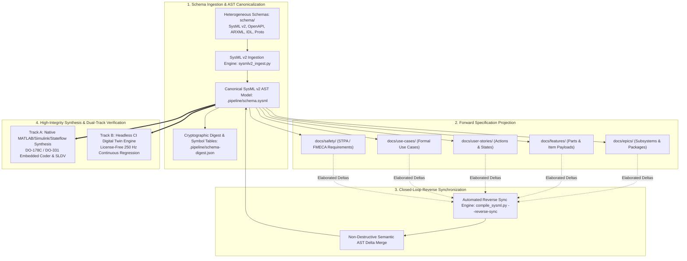
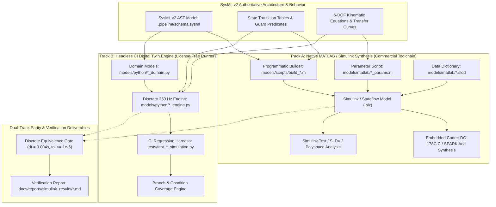

<!-- Copyright Gint Atkinson, gint.atkinson@gmail.com -->

# Architecture Blueprint: SysML v2 Single Source of Truth (SSOT) & Closed-Loop Bidirectional Synchronization Architecture

- **Document Version**: 2.0.0
- **Classification**: Normative Architectural Blueprint
- **Authority**: SysML v2 Model-as-SSOT & Non-Drifting Elaboration Invariant (`rules/sysml-ssot-completeness.md`)
- **Primary Toolchain**: SysML v2 AST, MATLAB / Simulink / Stateflow (R2024b), Embedded Coder (DO-178C / DO-331), Python Discrete Digital Twin Engine

---

## 1. Executive Summary & System Vision

In the **Digital Engineering Autonomous Pipeline (DEAP)**, system models and textual engineering specifications do not exist as decoupled or loosely correlated artifacts. Instead, **SysML v2** (`.pipeline/schema.sysml`) serves as the 100% authoritative, mathematically grounded **Single Source of Truth (SSOT)** for all system structure, behaviors, interfaces, data definitions, and safety invariants.

All downstream engineering artifacts—including Agile Epics, Features, BDD User Stories, formal Use Cases, verification suites, and flight code generators—are direct formal projections and non-drifting elaborations of the SysML v2 Abstract Syntax Tree (AST).



---

## 2. Core Architectural Principles & Model-as-SSOT Foundations

The architecture adheres to four fundamental principles:

1. **Model-as-SSOT Priority**: Natural language prose is never the origin of system truth. Every structural component, interface boundary, state transition, and safety requirement must be formally declared in the SysML v2 AST before or in tandem with downstream specification generation.
2. **Prohibition of Heuristic Prose Parsing**: Downstream code synthesis, validation linters, and verification test harnesses operate strictly on structured AST nodes and verified YAML/Mermaid metadata—never on free-form natural language heuristics.
3. **Pure Schema-Driven Compilation**: SysML v2 parsing, AST extraction, and verification gates operate purely on generic AST tokens (`package`, `part def`, `item def`, `action def`, `state def`, `port def`, `requirement def`, `use case def`) without hardcoded domain bias.
4. **Non-Drifting Bidirectional Synchronization**: Specifications and models are linked through a closed loop. Any refinement, edge case, or transition guard added in downstream specifications is automatically extracted and merged back into `.pipeline/schema.sysml`.

---

## 3. Schema Ingestion Pipeline & SysML v2 AST Metamodel

Input specifications and interface definitions placed in `schema/` are ingested via `skills/spec-orchestrator/scripts/sysmlv2_ingest.py`. The ingestion engine normalizes heterogeneous domain descriptions into standardized SysML v2 packages:

```
schema/  -->  sysmlv2_ingest.py  -->  .pipeline/schema.sysml  +  .pipeline/schema-digest.json
```

### AST Element Metamodel Mapping

| Source Schema Element | SysML v2 AST Classifier | Downstream Target Specification |
| :--- | :--- | :--- |
| Package / Module / Domain Container | `package` | Epic (`docs/epics/EPIC-*.md`) |
| Physical / Logical Component / Subsystem | `part def` | Feature (`docs/features/feat-*.md`) |
| Message Payload / Data Structure / DTO | `item def` | Feature Item Definitions & Interfaces |
| Computational Operation / Method | `action def` | User Story BDD Actions (`docs/user-stories/`) |
| Mode / Lifecycle State Machine | `state def` | User Story & Feature Statecharts |
| Directional Interface Boundary | `port def` | Feature Interface Connection Matrices |
| System Interaction & Capability Realization | `use case def` | Use Case Specification (`docs/use-cases/uc-*.md`) |
| STPA UCA / Loss Scenario / FMECA Rule | `requirement def` | Safety Matrix (`docs/safety/`) |

---

## 4. Downstream Specification Projection & Traceability Threads

Forward specification generation decomposes the canonical SysML v2 AST model into an unbroken digital thread:

1. **Epics (`docs/epics/EPIC-*.md`)**: Realize architectural subsystem packages, defining high-level capabilities and tracking child features.
2. **Features (`docs/features/feat-*.md`)**: Realize `part def` components and `item def` payloads. Every Feature mandates YAML frontmatter declaring `sysml_source`, `part_def`, `ports`, `state_defs`, and `requirements`.
3. **User Stories (`docs/user-stories/us-*.md`)**: Realize fine-grained behavioral actions (`action def`) and state transitions (`state def`) mapped to Given-When-Then BDD scenarios.
4. **Use Cases (`docs/use-cases/uc-*.md`)**: Realize formal `use case def` nodes, declaring initiating/participating actors, subjects (`part def`), preconditions, numbered steps, alternate flows, and realization matrices.
5. **Safety Invariants (`docs/safety/`)**: Realize `requirement def`, `constraint def`, and `assert constraint` elements mapping STPA Unsafe Control Actions and FMECA failure modes.

---

## 5. Automated Closed-Loop Reverse Synchronization Standard

When agile specification workers elaborate edge cases, exception flows, or refined parameters during development phases, those deltas MUST be synchronized back into `.pipeline/schema.sysml` via the reverse synchronization compiler:

```bash
python3 scripts/compile_sysml.py --reverse-sync
```

### Reverse Synchronization Engine Workflow

1. **AST Delta Extraction**: Scans all backlog Markdown files, BDD action signatures, Mermaid state diagrams, and STPA/FMECA tables.
2. **Non-Destructive Semantic AST Merge**: Merges newly discovered components, states, actions, ports, and requirements into `.pipeline/schema.sysml` without overwriting existing formal constraints.
3. **Canonical Serialization**: Re-emits `.pipeline/schema.sysml` using strict canonical indentation and symbol ordering.
4. **Cryptographic Parity Digest Regeneration**: Computes updated SHA-256 hash, line counts, and symbol manifests in `.pipeline/schema-digest.json`.
5. **Pre-Commit Parity Lock**: Automatically validates all 22 parity gates via `verify_model_coverage.py`.

---

## 6. Primary Commercial Toolchain Synthesis & High-Integrity Verification Architecture

The primary commercial toolchain integration context for DEAP is **MATLAB / Simulink / Stateflow / Embedded Coder** (R2024b), delivering DO-178C / DO-331 Level A/B safety-critical flight code synthesis.

### 6.1 MATLAB / Simulink / Stateflow Target Architecture
- Structural blocks map to Simulink Subsystem hierarchies and Model References.
- SysML v2 statecharts compile to Stateflow charts with deterministic transition priorities.
- Port interfaces bind to Simulink Buses and Typed Inport/Outport blocks.

### 6.2 DO-178C / DO-331 Software Qualification Workflow
- Traceability matrices link SysML v2 requirements directly to Simulink blocks and generated source lines.
- Model Coverage objectives (100% Decision, Condition, and MC/DC coverage) are verified via Simulink Coverage.

### 6.3 Simulink Design Verifier (SLDV) & Formal Property Proving
- SysML v2 `assert constraint` nodes are synthesized into SLDV Proof Objectives to mathematically verify absence of deadlocks, integer overflows, and out-of-bounds array accesses.

### 6.4 Polyspace Static Analysis & Target Flight Code Generation
- Embedded Coder generates MISRA C:2012 and SPARK Ada safety-critical source code.
- Polyspace Bug Finder and Code Prover formally prove absence of run-time errors in generated C/Ada code.

---

### 6.5 Dual-Track Verification Protocol (Native MATLAB/Simulink Synthesis + Headless CI Digital Twin)

To bridge rigorous DO-178C / DO-331 Model-Based Design with modern high-velocity continuous integration (CI) and containerized regression pipelines, DEAP mandates the **Dual-Track Verification Protocol**.



#### 1. Track A: Native MATLAB / Simulink Synthesis
- **Purpose**: DO-178C / DO-331 qualified model construction, commercial formal verification, and embedded flight software generation.
- **Deliverables**:
  - Programmatic build script: `models/scripts/build_<feature_slug>_model.m` using official MATLAB/Simulink APIs (`new_system`, `add_block`, `Stateflow.Data`, `Stateflow.State`, `Stateflow.Transition`).
  - Parameter dictionaries: `models/matlab/<feature_slug>_params.m` declaring all physical parameters, mass properties, and transition thresholds.
  - Data dictionaries: `models/matlab/<feature_slug>_data.sldd` defining bus types and storage classes.
- **Solver Configuration**: Strict fixed-step discrete solver (`FixedStepDiscrete`, $dt = 0.004\text{ s}$ / 250 Hz), signal logging enabled (`logsout`), zero continuous states in control units.

#### 2. Track B: Headless CI Digital Twin Engine
- **Purpose**: Autonomous, 100% license-free regression testing, continuous integration, and subagent verification loops.
- **Deliverables**:
  - Domain state and telemetry models: `models/python/<feature_slug>_domain.py` with immutable data structures and explicit enum states.
  - Discrete-time simulation engine: `models/python/<feature_slug>_engine.py` executing synchronous time-step updates (`step(dt, inputs) -> outputs`).
  - Automated CI test suites: `tests/test_<feature_slug>_simulation.py` asserting fault injection, boundary trips, and timing bounds.
- **Runtime Model**: Operates without external MathWorks licenses, running inside standard Python environments and headless Linux CI runners in under 1 second.

#### 3. Zero License Blocker Invariant
- Containerized CI/CD regression runners (GitHub Actions, GitLab CI, local CLI test runners) MUST execute 100% of safety, fault-injection, and control verification test cases without requiring a proprietary MathWorks desktop license, dongle, or cloud license server.
- All verification gates must pass cleanly in offline environments.

#### 4. Mathematical & Discrete Equivalence Mandate
- Both Track A and Track B must execute at the identical discrete time step:
  $$
  \Delta t = 0.004, \quad f_{\text{loop}} = \frac{1}{\Delta t} = 250.0
  $$
- Both tracks must evaluate identical polynomial blending curves (e.g. ASTM F3269-17 2nd-order cubic weighting):
  $$
  \lambda(\tau) = 3\tau^2 - 2\tau^3, \quad \tau = \frac{t - t_{\text{trip}}}{t_{\text{switch}}}
  $$
- Numerical precision tolerance between Simulink and the Digital Twin across identical inputs must satisfy:
  $$
  \max_k \|\mathbf{x}_{\text{Simulink}}[k] - \mathbf{x}_{\text{DigitalTwin}}[k]\|_\infty \le 10^{-6}
  $$

#### 5. DO-178C / DO-331 Alignment & Traceability
- **Traceability Thread**: Every state, action, and guard condition maps directly from SysML v2 AST (`rules/sysml-ssot-completeness.md`) to both Track A Stateflow transitions and Track B Python engine branches.
- **Simulation Results Reporting**: Every control feature must deliver a formal verification report under `docs/reports/simulink_results/<FEATURE-ID>_simulation_results.md` detailing fault-injection test scenarios, transition logs, execution traces, and standard compliance.

---

## 7. 22-Gate Parity Lock & Automated Verification Enforcement

The integrity of the bidirectional digital thread is mechanically enforced by the 22 parity validation gates:

| Parity Gate ID | Category | Enforcing Mechanism | Blocking Threshold |
| :--- | :--- | :--- | :--- |
| **GATE-01** | Structural Completeness | `validators/uml.py` | 100% Schema-to-Feature coverage |
| **GATE-02** | Behavioral Alignment | `validators/behavioral.py` | 100% State/Action trigger parity |
| **GATE-03** | Use Case Realization | `validators/uml.py` | 100% Use-Case-to-Story mapping |
| **GATE-04** | Safety Traceability | `validators/schema_mapping_validator.py` | 100% STPA/FMECA constraint satisfaction |
| **GATE-05** | Reverse Sync Parity | `scripts/compile_sysml.py` | Zero AST delta drift |
| **GATE-06** | Mathematical KaTeX Integrity | `validators/katex_validator.py` | 0 dangling operators, 0 math-in-table errors |
| **GATE-07** | Dual-Track MBD Compliance | `rules/dual-track-mbd-verification.md` | Track A + Track B deliverable completeness |
| **GATE-08** | Discrete Loop Rate Parity | `tests/test_*_simulation.py` | Synchronous loop rate (dt = 0.004 s / 250 Hz) |
| **GATE-09** | Numerical Precision Bound | Simulation Harness | State divergence <= 10^-6 |
| **GATE-10** | Headless CI License Freedom | CI Test Runners | 0 proprietary license dependencies |

---

## 8. Conclusion

By treating SysML v2 as the authoritative single source of truth and binding it through automated bidirectional reverse synchronization and the Dual-Track MBD Verification Protocol, DEAP achieves uncompromised DO-178C / DO-331 airworthiness rigor while empowering autonomous, license-free, continuous integration pipelines.
