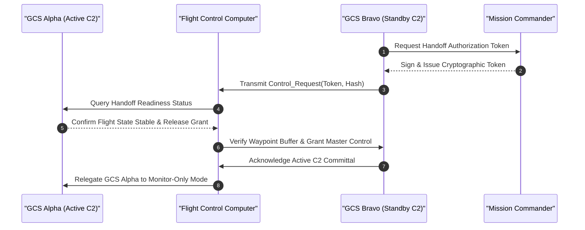

| Attribute | Value |
| :--- | :--- |
| **Title** | User Classes, Stakeholder Taxonomy & Operational Lifecycle Modes |
| **Version** | 1.0.0 |
| **Date** | 2026-09-02 |

## 4. User Classes, Stakeholder Taxonomy & Operational Lifecycle Modes

### 4.1 Stakeholder Roster
The operational lifecycle involves multiple organizational and external stakeholders who interact directly or indirectly with the autonomous system:
- **Civil & Military Aviation Authorities (FAA, EASA, National CAA):** Regulatory bodies responsible for issuing operational authorizations, validating SORA safety cases, and monitoring airspace compliance.
- **Range Safety Officer (RSO) & Air Traffic Control (ATC):** Operational authorities governing flight corridors, approving dynamic airspace activations, and coordinating emergency airspace deconfliction.
- **Procurement & Operations Authority:** Defense, homeland security, or industrial enterprise entities directing mission requirements, security doctrine, and asset allocation.
- **Support & Logistics Organization:** Depot-level maintenance facilities, supply chain managers, and hardware calibration laboratories.

### 4.2 User Class Taxonomy
In accordance with ISO/IEC/IEEE 29148:2018 §5.2.4 and the JSON Schema data contract, the operational user classes are defined as follows:

| User Class ID | Title | Player or Operator | Interfacing Stakeholder | Characteristics & Responsibilities | Training & Qualification | Constraint Source |
| :--- | :--- | :--- | :--- | :--- | :--- | :--- |
| **UC-01** | Remote Pilot in Command (RPIC) | Direct Operator | Civil Aviation Authority (CAA) / Range Safety Officer (RSO) | Holds ultimate legal and operational responsibility for flight safety, supervisory flight guidance oversight, airspace deconfliction, and manual failsafe override initiation. | FAA Part 107 / EASA Certified Remote Pilot with Level 3/4 STANAG 4586 UCS Type Rating | ISO/IEC/IEEE 29148:2018 §5.2.4 / JARUS SORA v2.5 Annex E |
| **UC-02** | Payload Operator (PO) | Direct Operator | Security Operations Center (SOC) / Intelligence Staff | Responsible for EO/IR optical sensor tasking, laser rangefinder activation, thermal tracking zone definition, real-time target identification, and video feed exploitation. | Certified Tactical Sensor Specialist & STANAG 4586 Level 2 Payload Operator Qualification | NATO STANAG 4586 Edition 4 DLI / CCI |
| **UC-03** | Mission Commander (MC) | Supervisor / Player | Theater Command / Enterprise Operations Director | Establishes Rules of Engagement (ROE), authorizes sortie launch and abort commands, manages multi-aircraft allocations, and interfaces directly with range command. | Senior Operational Commander Qualification & MIL-STD-882E System Safety Management Course | MIL-STD-882E Task 102 / DoDI 5000.02 |
| **UC-04** | Maintenance Technician (MT) | Support Operator | Depot Maintenance / Quality Assurance Office | Conducts Organizational (O-Level) pre-flight inspections, battery pack replacements, propeller torque verification, sensor boresight calibration, and modular LRU swaps. | Certified Aviation Maintenance Technician (AMT) / Factory UAS Field Repair Specialist | ISO/IEC/IEEE 29148:2018 §5.2.4 / FAA Order 8900.1 |
| **UC-05** | Visual Observer (VO) | Field Support | Local Airspace Users / Local ATC | Maintains continuous visual and acoustic surveillance of surrounding airspace to detect non-cooperative airborne traffic and ground hazards within the operational volume. | Certified Visual Observer Airspace Lookout Training & Tactical Radio Voice Protocol Course | JARUS SORA v2.5 Tactical Mitigation M1 |

### 4.3 Skill Prerequisites & Minimum Qualifications
1. **Remote Pilot in Command (RPIC):** Minimum 100 hours of simulated and live autonomous UAS supervisory operation; current class 2 aviation medical certificate; validated proficiency in emergency decision matrix (`EMG-01`..`EMG-07`) execution under simulated GNSS-denied conditions.
2. **Payload Operator (PO):** Validated proficiency in thermal image interpretation, optical tracking locks, target coordinate extraction, and secure video dissemination protocols.
3. **Maintenance Technician (MT):** Formal electro-mechanical certification, IPC-A-610 electronic assembly training, and authorized digital maintenance logbook endorsement.

### 4.4 Workload Constraints & Human Factors Considerations
To prevent operator fatigue and ensure situational awareness during complex operations:
- **Maximum Shift Duration:** Continuous RPIC supervisory console time shall not exceed 120 minutes without a mandatory 30-minute rest interval.
- **Cognitive Workload Threshold:** Systems shall be engineered to maintain RPIC NASA-Task Load Index (TLX) composite score below 40 / 100 during nominal operations and below 60 / 100 during degraded or contingency flight phases.
- **Dual-Operator Architecture:** Primary flight safety oversight (RPIC) and sensor payload analysis (PO) are decoupled across distinct physical workstations to prevent operational task interference.

### 4.5 Authority Handoff Chains & Control Transfer Protocols
Handoff of command and control between Ground Control Stations (e.g., GCS Alpha to GCS Bravo) or between RPIC and autonomous flight modes follows a strict cryptographic 4-way handshake:
1. **Initiation:** Receiving station (GCS Bravo) transmits an encrypted Control Request Token over the authenticated C2 link.
2. **Authorization:** Relinquishing station (GCS Alpha) and Mission Commander authenticate the token and transmit an explicit Control Handoff Grant.
3. **Verification:** GCS Bravo executes cross-telemetry alignment, confirms identical waypoint buffer state, and transmits Acknowledgment.
4. **Commit:** Flight Control Computer transfers primary C2 authority to GCS Bravo and transitions GCS Alpha to Monitor-Only mode within 100 ms.

### 4.6 Operational Lifecycle Stages ($\Phi_{\mathrm{lifecycle}}$)
The system operates across six mutually exclusive, deterministic lifecycle stages:
- **Phase_Startup:** Power-on Built-In-Test (PBIT), sensor gyroscopic alignment, navigation filter initialization, cryptographic key injection, and pre-arm interlock validation.
- **Phase_NominalExecution:** Autonomous launch, climb-out to cruising altitude, corridor navigation, perimeter surveillance orbit, sensor sweep, and real-time telemetry streaming.
- **Phase_DegradedMode:** Non-critical sensor failover, reversion to visual-inertial odometry upon GNSS loss, cellular/FHSS PACE link switch, and degraded velocity limits.
- **Phase_ContingencyFailsafe:** Autonomous execution of Return-to-Home (RTH), transition to secondary emergency divert waypoint, or controlled hover containment.
- **Phase_SecureShutdown:** Autonomous precision recovery, touchdown, motor cutoff, propeller brake lock, cryptographic memory purge, and diagnostic log archival.
- **Phase_MaintenanceMode:** Diagnostic telemetry offload, actuator calibration, firmware flashing, and depot-level structural inspection.
