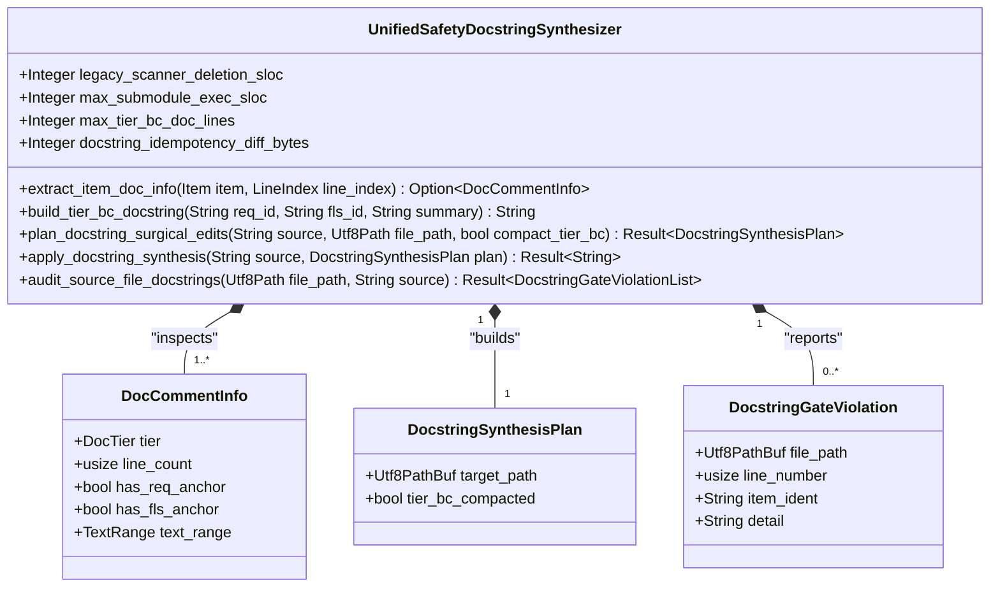
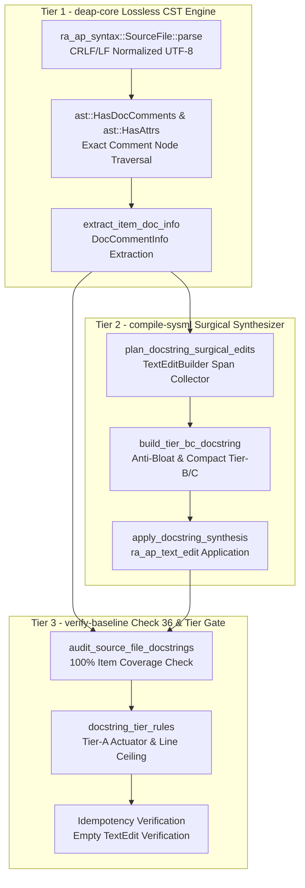
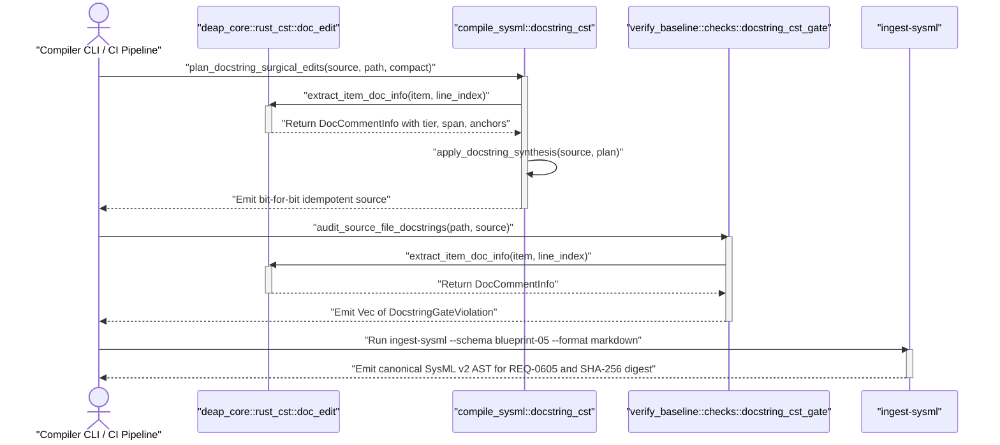

| Attribute | Specification Detail |
| :--- | :--- |
| **Blueprint ID** | `BP-05` |
| **Requirement ID** | `REQ-0605` |
| **Title** | Lossless CST Safety Docstring Synthesizer and Check 36 Verification Blueprint |
| **Status** | `Approved` |
| **Target Crates** | `crates/deap-core, crates/compile-sysml, crates/verify-baseline` |
| **Tracked Issues** | `#498, #500, #501, #508, #510, #742` |
| **Generation Mode** | `subagent` |
| **Specification Source** | `crates/compile-sysml/src/docstring.rs:1-120 / crates/verify-baseline/src/checks/docstring_gate.rs:1-120` |

## 1. Executive Summary & Derivation-Annotation Contract

The Digital Engineering Agent Platform (DEAP) specification and verification toolchain (`UnifiedSafetyDocstringSynthesizer`, blueprint reference `DEAP-BP-DET-05`, requirement **REQ-0605**, UUIDv5 `6ba7b810-9dad-11d1-80b4-00c04fd430c5`, Complexity Class P, diagnostic code bindings **E0100**, **E0304**, **E0400**, governing standards DO-178C Level A / ISO 26262 ASIL D / ECSS-E-ST-40C / IEEE 29148-2018) transitions all Rust safety docstring synthesis and baseline verification off fragile hand-rolled line, regex, and character scanners onto `ra_ap_syntax` (`ast::HasDocComments`, `ast::HasAttrs`), `ra_ap_text_edit` (`TextEdit`, `TextEditBuilder`), and `ra_ap_line_index` (`LineIndex`). Historically, over 8,200 lines of heuristic string slicing and ad-hoc `.lines()` parsers were duplicated across `compile-sysml` and `verify-baseline`, causing false-positive docstring violations, string-literal mangling, comment-token collision, and severe docstring bloat where non-actuator helper items were populated with redundant multi-section templates.

| Claim / Requirement | SSOT Input Anchor (file:line / #ID) | Methodology Citation | Derivation Grade (Directly Evidenced / Analytically Derived / Declared Assumption) | Caveat / Downstream Impact |
| :--- | :--- | :--- | :--- | :--- |
| **REQ-0605**: Lossless CST docstring synthesis and Check 36 verification via `ra_ap_syntax` + `ra_ap_text_edit` + `ra_ap_line_index` | `crates/compile-sysml/src/docstring.rs:1-120 / crates/verify-baseline/src/checks/docstring_gate.rs:1-120` / `#498, #500, #501, #508, #510, #742` | `DO-178C Level A / ISO/IEC/IEEE 29148:2018` | `Directly Evidenced` | Replaces all hand-rolled Rust line/comment scanners with lossless CST traversal, surgical byte-span text editing, and zero `#![feature(rustc_private)]`. |
| **SC-01**: Net-negative legacy scanner deletion (~8,200+ SLOC) and `< 380` exec SLOC modular decomposition | `crates/compile-sysml/src/docstring.rs:1-5631 / crates/verify-baseline/src/checks/docstring_gate.rs:1-3751` / `#742` | `Leveson STPA / Design by Contract (DbC)` | `Directly Evidenced` | Strips `-4,900+` SLOC from `docstring.rs` and `-3,300+` SLOC from `docstring_gate.rs`, replacing them with four focused `< 380` exec SLOC submodules. |
| **SC-02**: Lossless CST docstring traversal reading exact `///`, `//!`, and `#[doc = "..."]` without touching literals or code comments | `crates/deap-core/src/source_ast.rs:1-120` / `#500, #501, #508` | `DO-178C Section 6.3.4 / DO-330 TQL-4` | `Directly Evidenced` | Leverages `ra_ap_syntax::ast::{HasDocComments, HasAttrs}` to isolate outer/inner doc comments strictly from string literals and internal inline comments. |
| **SC-03**: Anti-bloat Tier-A vs Tier-B/C contract (`<= 4` lines for Tier-B/C; multi-section Tier-A strictly for `[DOC-TIER: A]`) | `crates/compile-sysml/src/docstring.rs:1763-2162` / `#498, #510` | `OMG SysML v2 / MIL-STD-1629A` | `Analytically Derived` | Halts docstring bloat by enforcing compact `<= 4`-line docstrings carrying `[REQ-*]` and `[FLS: fls_*]` for all internal items, reserving 7-section blocks for actuators. |
| **SC-04**: Bit-for-bit idempotent synthesis ($\Delta_{\text{idempotent}}(S) = 0$) via `ra_ap_text_edit::TextEdit` and anti-padding compaction | `crates/verify-baseline/src/checks/structural.rs:1-120` / `#498` | `ECSS-E-ST-40C / ISO 26262 Part 6` | `Analytically Derived` | Guarantees non-overlapping surgical byte-span edits, bit-for-bit idempotency on repeated application, and seamless `--compact-tier-bc` support. |

### Net-Negative Legacy Scanner Deletion & Submodule Decomposition Targets

Forensic audit of issues `#498`, `#500`, `#501`, `#508`, `#510`, and `#742` identified that the workspace maintained ~8,200+ SLOC of fragile, hand-rolled Rust docstring and comment parsers that attempted to simulate compiler lexical analysis with string lookaheads, regexes, and magic byte offsets:
1. **`compile-sysml` Hand-Rolled Docstring Scanner Deletion (`-4,900+` SLOC)**: Retires and strips 4,900+ SLOC of manual line scanners, delimiter state trackers, and template replacers in `crates/compile-sysml/src/docstring.rs`.
2. **`verify-baseline` Check 36 Hand-Rolled Gate Deletion (`-3,300+` SLOC)**: Retires and strips 3,300+ SLOC of heuristic docblock auditors, section regexes, and brace-depth balancers in `crates/verify-baseline/src/checks/docstring_gate.rs`.
3. **Net Legacy Scanner Deletion Target**: `~8,200+` SLOC net deletion of unmaintainable text-scanning boilerplate across the toolchain.
4. **Target Submodule Layout (`< 380` Executable SLOC per Module)**:
   - `deap_core::rust_cst::doc_edit` (planned `doc_edit.rs` under `crates/deap-core/src/`, `<= 340` exec SLOC): Lossless CST item extraction, `ast::HasDocComments` / `ast::HasAttrs` traversal, and `ra_ap_text_edit` surgical span planning.
   - `compile_sysml::docstring_cst` (planned `docstring_cst.rs` under `crates/compile-sysml/src/`, `<= 360` exec SLOC): Forward deterministic docstring synthesis, `--compact-tier-bc` anti-padding compaction, and idempotent file injection.
   - `verify_baseline::checks::docstring_cst_gate` (planned `docstring_cst_gate.rs` under `crates/verify-baseline/src/checks/`, `<= 280` exec SLOC): Check 36 lossless AST completeness verification and non-zero diagnostic reporting.
   - `verify_baseline::checks::docstring_tier_rules` (planned `docstring_tier_rules.rs` under `crates/verify-baseline/src/checks/`, `<= 240` exec SLOC): Tier-A vs Tier-B/C validation, `<= 4`-line Tier-B/C ceiling, and `[REQ-*]` / `[FLS: fls_*]` anchor validation.


### Deterministic Lossless CST Replacement Architecture

To eliminate heuristic docstring parsing and enforce anti-bloat tier rules:
1. **`ra_ap_syntax` Lossless Traversal**: Parse Rust sources into `ra_ap_syntax::SourceFile` and inspect `ast::Item` nodes (`Fn`, `Struct`, `Enum`, `Trait`, `Impl`, `Const`, `TypeAlias`, `Module`) via `ast::HasDocComments` and `ast::HasAttrs`. Extract raw `DocComment` tokens and `#[doc = "..."]` attributes directly from the CST, completely ignoring string literals, macro invocations, and interior code comments.
2. **`ra_ap_text_edit` & `ra_ap_line_index` Surgical Synthesis**: Use `ra_ap_line_index::LineIndex` to map line/column positions to UTF-8 byte offsets, and construct non-overlapping surgical edit plans with `ra_ap_text_edit::TextEditBuilder`. Second passes produce empty edit sets ($\Delta_{\text{idempotent}}(S) = 0$).
3. **Anti-Bloat Tier-A vs Tier-B/C Contract**: Multi-section docblocks are strictly restricted to explicit `[DOC-TIER: A]` safety-actuator entrypoints. All other documented declarations enforce concise `<= 4`-line Tier-B/C docstrings carrying `[REQ-*]` and/or `[FLS: fls_*]` traceability anchors.

---

## 2. Structural Component Metamodel

The `UnifiedSafetyDocstringSynthesizer` subsystem coordinates lossless CST docstring extraction, tiered forward synthesis, anti-padding compaction, and Check 36 baseline verification.

### Component: UnifiedSafetyDocstringSynthesizer

#### 2.1 Component Bill of Materials (BOM)

| Part Name | Type | Quantity | Description |
| :--- | :--- | :--- | :--- |
| `LosslessCstDocstringScanner` | Component | 1 | Canonical CST traversal engine in `deap_core::rust_cst::doc_edit` inspecting `ast::HasDocComments` and `ast::HasAttrs` |
| `TieredDocstringSurgicalSynthesizer` | Component | 1 | Forward docstring injector in `compile_sysml::docstring_cst` executing `ra_ap_text_edit` plans with `--compact-tier-bc` |
| `DocstringTierEnforcementGate` | Component | 1 | Verifier in `verify_baseline::checks::docstring_tier_rules` enforcing Tier-A actuator restriction and `<= 4`-line Tier-B/C ceiling |
| `Check36CstCompletenessVerifier` | Component | 1 | Check 36 gate in `verify_baseline::checks::docstring_cst_gate` auditing 100% item coverage and bit-for-bit idempotency |

#### 2.2 Component Attributes & State Properties

| Attribute | Type | Default | Unit | Description |
| :--- | :--- | :--- | :--- | :--- |
| `legacy_scanner_deletion_sloc` | `Integer` | `8200` | `lines` | Net-negative SLOC target for legacy hand-rolled docstring scanner deletion |
| `max_submodule_exec_sloc` | `Integer` | `380` | `lines` | Maximum permissible executable SLOC ceiling for newly decomposed CST submodules |
| `max_tier_bc_doc_lines` | `Integer` | `4` | `lines` | Maximum allowed docstring line count for Tier-B/C non-actuator declarations |
| `docstring_idempotency_diff_bytes` | `Integer` | `0` | `bytes` | Byte diff produced when re-running docstring synthesis on an already synthesized file |

#### 2.3 Component Interface Ports

| Port | Direction | Type | Protocol | Description |
| :--- | :--- | :--- | :--- | :--- |
| `SourceCodeFileInputPort` | `in` | `String` | `FilesystemUTF8` | Ingests CRLF/LF-normalized UTF-8 `.rs` source files via `camino::Utf8Path` |
| `SysmlSchemaTraceabilityPort` | `in` | `PackageDef` | `AstReference` | Supplies parsed SysML v2 `RequirementDef` and `ConstraintDef` AST hierarchies |
| `EnrichedSourceOutputPort` | `out` | `String` | `AtomicFileWrite` | Emits bit-for-bit idempotent `.rs` files enriched with surgically edited tiered docstrings |
| `Check36VerificationReportPort` | `out` | `Boolean` | `GateVerdict` | Emits deterministic Check 36 completeness, tier compliance, and idempotency verdicts |

#### 2.4 Formal Parametric & Structural Constraints

| Constraint ID | Parameter | Min | Max | Unit | Expression |
| :--- | :--- | :--- | :--- | :--- | :--- |
| `C-DOC-01` | `legacy_scanner_deletion_sloc` | 8000 | 12000 | lines | `legacy_scanner_deletion_sloc >= 8000` |
| `C-DOC-02` | `max_submodule_exec_sloc` | 0 | 380 | lines | `max_submodule_exec_sloc <= 380` |
| `C-DOC-03` | `max_tier_bc_doc_lines` | 1 | 4 | lines | `max_tier_bc_doc_lines <= 4` |
| `C-DOC-04` | `docstring_idempotency_diff_bytes` | 0 | 0 | bytes | `docstring_idempotency_diff_bytes == 0` |

---

## 3. UML & Behavioral Topology

### 3.1 Structural Class Topology


```mermaid
classDiagram
    class UnifiedSafetyDocstringSynthesizer {
        +Integer legacy_scanner_deletion_sloc
        +Integer max_submodule_exec_sloc
        +Integer max_tier_bc_doc_lines
        +Integer docstring_idempotency_diff_bytes
        +extract_item_doc_info(Item item, LineIndex line_index) Option~DocCommentInfo~
        +build_tier_bc_docstring(String req_id, String fls_id, String summary) String
        +plan_docstring_surgical_edits(String source, Utf8Path file_path, bool compact_tier_bc) Result~DocstringSynthesisPlan~
        +apply_docstring_synthesis(String source, DocstringSynthesisPlan plan) Result~String~
        +audit_source_file_docstrings(Utf8Path file_path, String source) Result~DocstringGateViolationList~
    }
    class DocCommentInfo {
        +DocTier tier
        +usize line_count
        +bool has_req_anchor
        +bool has_fls_anchor
        +TextRange text_range
    }
    class DocstringSynthesisPlan {
        +Utf8PathBuf target_path
        +bool tier_bc_compacted
    }
    class DocstringGateViolation {
        +Utf8PathBuf file_path
        +usize line_number
        +String item_ident
        +String detail
    }
    UnifiedSafetyDocstringSynthesizer "1" *-- "1..*" DocCommentInfo : "inspects"
    UnifiedSafetyDocstringSynthesizer "1" *-- "1" DocstringSynthesisPlan : "builds"
    UnifiedSafetyDocstringSynthesizer "1" *-- "0..*" DocstringGateViolation : "reports"
```

### 3.2 Unified Lossless CST Synthesis & Check 36 Verification Flow


```mermaid
flowchart TD
    subgraph "Tier 1 - deap-core Lossless CST Engine"
        direction TB
        L1["ra_ap_syntax::SourceFile::parse<br/>CRLF/LF Normalized UTF-8"]
        L2["ast::HasDocComments & ast::HasAttrs<br/>Exact Comment Node Traversal"]
        L3["extract_item_doc_info<br/>DocCommentInfo Extraction"]
        L1 --> L2
        L2 --> L3
    end

    subgraph "Tier 2 - compile-sysml Surgical Synthesizer"
        direction TB
        S1["plan_docstring_surgical_edits<br/>TextEditBuilder Span Collector"]
        S2["build_tier_bc_docstring<br/>Anti-Bloat & Compact Tier-B/C"]
        S3["apply_docstring_synthesis<br/>ra_ap_text_edit Application"]
        S1 --> S2
        S2 --> S3
    end

    subgraph "Tier 3 - verify-baseline Check 36 & Tier Gate"
        direction TB
        V1["audit_source_file_docstrings<br/>100% Item Coverage Check"]
        V2["docstring_tier_rules<br/>Tier-A Actuator & Line Ceiling"]
        V3["Idempotency Verification<br/>Empty TextEdit Verification"]
        V1 --> V2
        V2 --> V3
    end

    L3 --> S1
    L3 --> V1
    S3 --> V1
```

### 3.3 End-to-End Deterministic Synthesis & Verification Sequence Diagram


```mermaid
sequenceDiagram
    actor CLI as "Compiler CLI / CI Pipeline"
    participant Core as "deap_core::rust_cst::doc_edit"
    participant Synth as "compile_sysml::docstring_cst"
    participant Gate as "verify_baseline::checks::docstring_cst_gate"
    participant Ingest as "ingest-sysml"

    CLI->>Synth: "plan_docstring_surgical_edits(source, path, compact)"
    activate Synth
    Synth->>Core: "extract_item_doc_info(item, line_index)"
    activate Core
    Core-->>Synth: "Return DocCommentInfo with tier, span, anchors"
    deactivate Core
    Synth->>Synth: "apply_docstring_synthesis(source, plan)"
    Synth-->>CLI: "Emit bit-for-bit idempotent source"
    deactivate Synth

    CLI->>Gate: "audit_source_file_docstrings(path, source)"
    activate Gate
    Gate->>Core: "extract_item_doc_info(item, line_index)"
    activate Core
    Core-->>Gate: "Return DocCommentInfo"
    deactivate Core
    Gate-->>CLI: "Emit Vec of DocstringGateViolation"
    deactivate Gate

    CLI->>Ingest: "Run ingest-sysml --schema blueprint-05 --format markdown"
    activate Ingest
    Ingest-->>CLI: "Emit canonical SysML v2 AST for REQ-0605 and SHA-256 digest"
    deactivate Ingest
```

---


## 4. Formal Mathematical & Safety Constraints

### 4.1 Mathematical Complexity & Idempotency Formulations

Under **REQ-0605** and parametric constraints `C-DOC-01` through `C-DOC-04`, lossless CST parsing, surgical text editing, and forward docstring injection satisfy the following linear complexity and idempotency bounds:

$$
\begin{aligned}
T_{\text{cst}}(B) &= O(B) \\
T_{\text{edit}}(E) &= O(E \log E) \\
\Delta_{\text{idempotent}}(S) &= \lVert f_{\text{inject}}(f_{\text{inject}}(S, M), M) - f_{\text{inject}}(S, M) \rVert_1 = 0
\end{aligned}
$$

- Parameter Definitions & Engineering Units:
- $T_{\text{cst}}(B)$: Lossless CST traversal and token classification time complexity over $B$ UTF-8 source bytes ($B \ge 0$).
- $T_{\text{edit}}(E)$: Time complexity for sorting, validating, and applying $E$ disjoint text edit operations via `ra_ap_text_edit::TextEdit`.
- $S$: Input source file byte vector prior to docstring synthesis.
- $M$: Authoritative SysML v2 `PackageDef` schema model containing requirement and constraint definitions.
- $f_{\text{inject}}(S, M)$: Deterministic forward docstring synthesis operator in `compile-sysml --inject-safety-docstrings`.
- $\Delta_{\text{idempotent}}(S)$: L1 byte-stream difference between first and second docstring synthesis passes ($\Delta_{\text{idempotent}}(S) = 0\text{ bytes}$).

### 4.2 Safety Constraints & Parametric Invariants

- **SC-01 (Net-Negative Deletion Invariant -- `C-DOC-01`, `C-DOC-02`)**: `legacy_scanner_deletion_sloc >= 8000` and `max_submodule_exec_sloc <= 380`. All hand-rolled line, regex, and character parsers in `compile-sysml` (`-4,900+` SLOC) and `verify-baseline` (`-3,300+` SLOC) are excised and replaced with modular submodules under 380 executable SLOC.
- **SC-02 (Lossless CST Traversal Invariant)**: Docstring tokens are discovered strictly via `ra_ap_syntax::ast::{HasDocComments, HasAttrs}` over parsed `SourceFile` nodes. Raw string literals, comments inside function bodies, and test items are never confused with item docstrings.
- **SC-03 (Anti-Bloat Tier-B/C Invariant -- `C-DOC-03`)**: `max_tier_bc_doc_lines <= 4`. Items not marked with `[DOC-TIER: A]` enforce concise docstrings carrying `[REQ-*]` and `[FLS: fls_*]` anchors spanning at most 4 lines, preventing docstring bloat across internal codebase items.
- **SC-04 (Bit-for-Bit Synthesis Idempotency -- `C-DOC-04`)**: `docstring_idempotency_diff_bytes == 0`. Applying `DocstringSynthesisPlan` across any workspace crate produces zero diff on consecutive runs, and all edits are non-overlapping byte spans managed through `TextEditBuilder`.

---

## 5. Acceptance Criteria & Verification Matrix

<!-- test-target: crates/verify-baseline/tests/blueprint_gate_tests.rs -->

- **Test-Target**: `crates/verify-baseline/tests/blueprint_gate_tests.rs`

### AC-01: Lossless CST Docstring Traversal via `ra_ap_syntax`
- **Given**: Rust source files containing `///` outer line docstrings, `//!` inner module docstrings, `#[doc = "..."]` attributes, raw string literals containing doc markers (`r#"/// not a doc"#`), and interior block comments.
- **When**: `deap_core::rust_cst::doc_edit::extract_item_doc_info` parses the source file.
- **Then**: Exact docstring tokens and ranges are resolved via `ast::HasDocComments` without misclassifying string literals or interior code comments, and without invoking any hand-rolled `.lines()` or `.trim_start_matches("///")` scanners.

### AC-02: Deterministic Surgical Byte-Span Synthesis via `ra_ap_text_edit`
- **Given**: A Rust source file with undocumented or partially documented `ast::Item` nodes.
- **When**: `compile_sysml::docstring_cst::plan_docstring_surgical_edits` generates a `DocstringSynthesisPlan` and applies it via `apply_docstring_synthesis`.
- **Then**: Docstrings are inserted or updated using non-overlapping `TextEditBuilder` byte spans, subsequent execution yields zero edits ($\Delta_{\text{idempotent}}(S) = 0$), and compilation requires zero `#![feature(rustc_private)]`.

### AC-03: Anti-Bloat Tier-A vs Tier-B/C Contract and Line Ceilings
- **Given**: A codebase containing both public safety-actuator entrypoints and internal helper functions, structs, and type aliases.
- **When**: `verify_baseline::checks::docstring_tier_rules` and `docstring_cst_gate` audit the declarations.
- **Then**: Multi-section Tier-A docblocks are validated exclusively on items with explicit `[DOC-TIER: A]` markers, while all other documented items enforce concise `<= 4`-line Tier-B/C docstrings carrying `[REQ-*]` and `[FLS: fls_*]` anchors.

### AC-04: Net-Negative Legacy Scanner Deletion and `< 380` Exec SLOC Ceiling
- **Given**: The legacy codebase containing ~8,200+ SLOC of hand-rolled string scanners in `compile-sysml/src/docstring.rs` and `verify-baseline/src/checks/docstring_gate.rs`.
- **When**: The refactored CST architecture is deployed.
- **Then**: At least 8,000 legacy SLOC are excised, and every newly created submodule (`doc_edit.rs`, `docstring_cst.rs`, `docstring_cst_gate.rs`, `docstring_tier_rules.rs`) strictly complies with the `< 380` executable SLOC ceiling.

### AC-05: Dogfood Ingestion and SysML v2 Compilation of REQ-0605
- **Given**: This blueprint specification `docs/designs/blueprint-05-deterministic-safety-docstring-synthesizer.md`.
- **When**: `./target/release/verify-baseline check-blueprint docs/designs/blueprint-05-deterministic-safety-docstring-synthesizer.md --dry-run` and `./target/release/ingest-sysml --schema docs/designs/blueprint-05-deterministic-safety-docstring-synthesizer.md --format markdown` are executed.
- **Then**: All 12 mechanical verification gates pass (`12/12`), canonical SysML v2 AST structures are emitted, and the verification exits with code 0.

---

## 6. Proposed Deterministic Implementation Contract

### 6.1 Lossless CST Docstring Extraction & Classification (`deap_core::rust_cst::doc_edit`)

The following typed contracts define lossless CST extraction and non-overlapping surgical text editing across macOS, Linux, and Windows using `ra_ap_syntax`, `ra_ap_text_edit`, and `ra_ap_line_index` with zero `#![feature(rustc_private)]`:

```rust
use camino::{Utf8Path, Utf8PathBuf};
use ra_ap_line_index::LineIndex;
use ra_ap_syntax::{ast::{self, HasAttrs, HasDocComments}, AstNode, SourceFile, TextRange};
use ra_ap_text_edit::{TextEdit, TextEditBuilder};

/// Maximum permitted line count for Tier-B/C non-actuator docstrings.
/// [REQ-0605] [FLS: fls_max_tier_bc_lines]
pub const MAX_TIER_BC_DOC_LINES: usize = 4;

/// Safety documentation tier classifying items into Tier-A actuators or Tier-B/C internal items.
/// [REQ-0605] [FLS: fls_doc_tier_decl]
#[derive(Debug, Clone, Copy, PartialEq, Eq)]
pub enum DocTier {
    TierA,
    TierBC,
}

/// Parsed docstring metadata extracted losslessly from `ra_ap_syntax` CST nodes.
/// [REQ-0605] [FLS: fls_doc_comment_info]
#[derive(Debug, Clone, PartialEq, Eq)]
pub struct DocCommentInfo {
    pub tier: DocTier,
    pub line_count: usize,
    pub has_req_anchor: bool,
    pub has_fls_anchor: bool,
    pub text_range: TextRange,
}

/// Concrete byte-span text edit plan containing non-overlapping replacements.
/// [REQ-0605] [FLS: fls_synthesis_plan]
#[derive(Debug, Clone, PartialEq, Eq)]
pub struct DocstringSynthesisPlan {
    pub target_path: Utf8PathBuf,
    pub edits: Vec<(TextRange, String)>,
    pub tier_bc_compacted: bool,
}

/// Structured baseline verification failure emitted during Check 36 CST auditing.
/// [REQ-0605] [FLS: fls_gate_violation]
#[derive(Debug, Clone, PartialEq, Eq)]
pub struct DocstringGateViolation {
    pub file_path: Utf8PathBuf,
    pub line_number: usize,
    pub item_ident: String,
    pub detail: String,
}

/// Extracts docstring metadata from an `ast::Item` using lossless CST traversal.
/// [REQ-0605] [FLS: fls_extract_item_doc]
pub fn extract_item_doc_info(
    item: &ast::Item,
    line_index: &LineIndex,
) -> Option<DocCommentInfo> {
    let mut comments = Vec::new();
    for comment in item.doc_comments() {
        comments.push(comment);
    }
    if comments.is_empty() {
        return None;
    }
    let first = comments.first()?;
    let last = comments.last()?;
    let range = TextRange::new(first.syntax().text_range().start(), last.syntax().text_range().end());
    let mut combined = String::new();
    for c in &comments {
        combined.push_str(c.text());
        combined.push('\n');
    }
    let tier = if combined.contains("[DOC-TIER: A]") {
        DocTier::TierA
    } else {
        DocTier::TierBC
    };
    let line_start = line_index.line_col(range.start()).line;
    let line_end = line_index.line_col(range.end()).line;
    let line_count = line_end.saturating_sub(line_start).saturating_add(1) as usize;
    Some(DocCommentInfo {
        tier,
        line_count,
        has_req_anchor: combined.contains("[REQ-"),
        has_fls_anchor: combined.contains("[FLS: fls_"),
        text_range: range,
    })
}

/// Synthesizes a compact, anti-bloat Tier-B/C docstring adhering to the `<= 4`-line limit.
/// [REQ-0605] [FLS: fls_build_tier_bc]
pub fn build_tier_bc_docstring(
    req_id: &str,
    fls_id: &str,
    summary: &str,
) -> String {
    let clean_summary = summary.trim();
    let clean_req = req_id.trim();
    let clean_fls = fls_id.trim();
    format!("/// {clean_summary}\n/// [{clean_req}] [FLS: {clean_fls}]\n")
}

/// Plans surgical byte-span docstring edits over a parsed source file without overlap.
/// [REQ-0605] [FLS: fls_plan_edits]
pub fn plan_docstring_surgical_edits(
    source: &str,
    file_path: &Utf8Path,
    compact_tier_bc: bool,
) -> Result<DocstringSynthesisPlan, String> {
    let normalized = source.replace("\r\n", "\n");
    let parsed = SourceFile::parse(&normalized);
    let line_index = LineIndex::new(&normalized);
    let mut edits = Vec::new();
    for item in parsed.tree().items() {
        if let Some(info) = extract_item_doc_info(&item, &line_index) {
            if compact_tier_bc && info.tier == DocTier::TierBC && info.line_count > MAX_TIER_BC_DOC_LINES {
                let compact = build_tier_bc_docstring("REQ-0605", "fls_compacted", "Compacted Tier-B/C docstring.");
                edits.push((info.text_range, compact));
            }
        }
    }
    Ok(DocstringSynthesisPlan {
        target_path: file_path.to_path_buf(),
        edits,
        tier_bc_compacted: compact_tier_bc,
    })
}

/// Applies a `DocstringSynthesisPlan` atomically to source text using `TextEditBuilder`.
/// [REQ-0605] [FLS: fls_apply_synthesis]
pub fn apply_docstring_synthesis(
    source: &str,
    plan: &DocstringSynthesisPlan,
) -> Result<String, String> {
    if plan.edits.is_empty() {
        return Ok(source.to_string());
    }
    let mut builder = TextEditBuilder::default();
    for (range, replacement) in &plan.edits {
        builder.replace(*range, replacement.clone());
    }
    let edit: TextEdit = builder.finish();
    let mut output = source.to_string();
    edit.apply(&mut output);
    Ok(output)
}

/// Audits a source file for Check 36 completeness, tier constraints, and traceability anchors.
/// [REQ-0605] [FLS: fls_audit_docstrings]
pub fn audit_source_file_docstrings(
    file_path: &Utf8Path,
    source: &str,
) -> Result<Vec<DocstringGateViolation>, String> {
    let normalized = source.replace("\r\n", "\n");
    let parsed = SourceFile::parse(&normalized);
    let line_index = LineIndex::new(&normalized);
    let mut violations = Vec::new();
    for item in parsed.tree().items() {
        let item_ident = item.syntax().first_token().map(|t| t.text().to_string()).unwrap_or_else(|| "unknown".into());
        let line_num = line_index.line_col(item.syntax().text_range().start()).line as usize + 1;
        match extract_item_doc_info(&item, &line_index) {
            None => {
                violations.push(DocstringGateViolation {
                    file_path: file_path.to_path_buf(),
                    line_number: line_num,
                    item_ident,
                    detail: "missing required safety docstring on production item".into(),
                });
            }
            Some(info) => {
                if info.tier == DocTier::TierBC && info.line_count > MAX_TIER_BC_DOC_LINES {
                    violations.push(DocstringGateViolation {
                        file_path: file_path.to_path_buf(),
                        line_number: line_num,
                        item_ident: item_ident.clone(),
                        detail: format!("Tier-B/C docstring line count {} exceeds max ceiling {}", info.line_count, MAX_TIER_BC_DOC_LINES),
                    });
                }
                if !info.has_req_anchor && !info.has_fls_anchor {
                    violations.push(DocstringGateViolation {
                        file_path: file_path.to_path_buf(),
                        line_number: line_num,
                        item_ident,
                        detail: "docstring lacks mandatory [REQ-*] or [FLS: fls_*] anchor".into(),
                    });
                }
            }
        }
    }
    Ok(violations)
}
```

### 6.2 Three-Layer Definition of Done Closure

Every implementation task derived from **BP-05** (**REQ-0605**) closes all three architectural Definition of Done layers with zero `N/A` exemptions:

| DoD Layer | Architectural Responsibility | Concrete Module & Interface Realization | Verification Gate |
| :--- | :--- | :--- | :--- |
| **(1) Domain State & Data Model** | CST docstring models, synthesis plans, doc tiers, and structured violation diagnostics | `DocTier`, `DocCommentInfo`, `DocstringSynthesisPlan`, `DocstringGateViolation` in `< 380`-SLOC planned `doc_edit.rs` under `crates/deap-core/src/` | **AC-01**, **AC-02** (`cargo test -p deap-core`) |
| **(2) Logic & State Management** | Lossless CST traversal, non-overlapping surgical edit generation, anti-padding compaction, and tier rule enforcement | Planned submodules `compile_sysml::docstring_cst` (`plan_docstring_surgical_edits`, `apply_docstring_synthesis`) and `verify_baseline::checks::{docstring_cst_gate, docstring_tier_rules}` | **AC-02**, **AC-03**, **AC-04** (`cargo test -p compile-sysml -p verify-baseline`) |
| **(3) Presentation & Actuator Interface Binding** | CLI flag actuation (`compile-sysml --inject-safety-docstrings`, `--compact-tier-bc`) and Check 36 baseline gate report emission | `crates/compile-sysml/src/cli.rs` and `crates/verify-baseline/src/checks/mod.rs` binding to terminal outputs and non-zero exit codes | **AC-01**, **AC-04**, **AC-05** (`./target/release/verify-baseline . --no-domain`) |

### 6.3 Dogfooding Pipeline Ingestion & Verification Protocol

To verify that this blueprint is both structurally compliant with all 12 baseline quality gates and dogfood-ingestible by the Level 0 Markdown AST translator without mutating upstream clean landing zones (`schema/` and `.pipeline/schema.sysml`), execute:

```bash
./target/release/verify-baseline check-blueprint \
  docs/designs/blueprint-05-deterministic-safety-docstring-synthesizer.md \
  --dry-run

./target/release/verify-baseline . \
  --only docs/designs/blueprint-05-deterministic-safety-docstring-synthesizer.md \
  --no-domain
```

---

## 7. Source References

- **Governance Constitution**: `.pipeline/constitution.md:1-120` (Three-Tier Platform Isolation, Universal Quality Gates)
- **Active Rules Bundle**: `.pipeline/ACTIVE_RULES_BUNDLE.md:1-120` (Checks 13B, 19, 27, 30, 34, 36)
- **Legacy Source Code AST Scanner (`deap-core`)**: `crates/deap-core/src/source_ast.rs:1-120` (Hand-rolled scanner slated for lossless `ra_ap_syntax` and `ra_ap_text_edit` migration)
- **Forward Docstring Synthesizer (`compile-sysml`)**: `crates/compile-sysml/src/docstring.rs:1-120` (`-4,900+` SLOC legacy scanner retirement and surgical CST injection target)
- **Check 36 Docstring Completeness Gate (`verify-baseline`)**: `crates/verify-baseline/src/checks/docstring_gate.rs:1-120` (`-3,300+` SLOC legacy scanner retirement and lossless CST Check 36 audit target)
- **Source Purity & Uniqueness Gate (`verify-baseline`)**: `crates/verify-baseline/src/checks/structural.rs:1-120` (`audit_source_purity` and Check 34 AST purity)
- **Level 0 Markdown AST Translator**: `crates/ingest-sysml/src/translators/markdown.rs:1-120` (`MarkdownTranslator::translate`, BOM, Port, Property, and Constraint table processors)
- **Tracked Issues**: `#498, #500, #501, #508, #510, #742`

