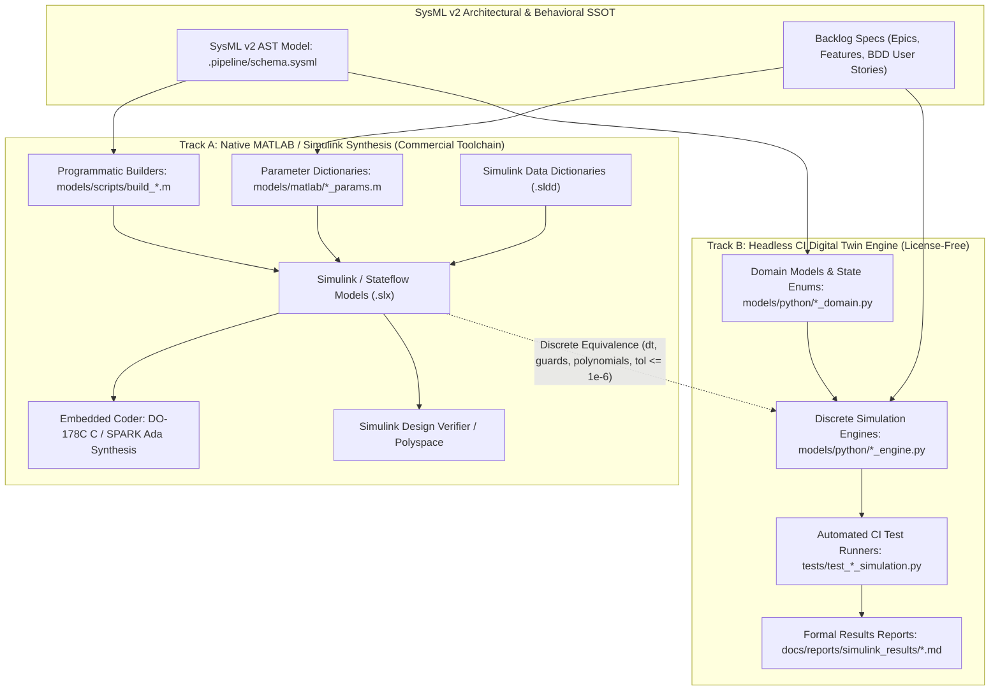

<!-- Copyright Gint Atkinson, gint.atkinson@gmail.com -->

# Rule: Dual-Track Model-Based Design (MBD) Architecture & Headless CI Verification Protocol

**ALWAYS enforce:** All control law, flight dynamics, safety statechart, and physical estimation features in the Digital Engineering Autonomous Pipeline (DEAP) MUST adhere strictly to the Dual-Track Model-Based Design (MBD) and Headless CI Verification Protocol. Every aerospace control or safety feature must deliver both native MATLAB / Simulink synthesis artifacts and a standalone, license-free digital twin execution engine for automated continuous integration.

## Scope and Normative Authority

**This file is the single normative home for Dual-Track Model-Based Design (MBD) architecture and headless continuous integration (CI) verification standards across the DEAP framework.**

Safety-critical aerospace systems governed by RTCA DO-178C / EUROCAE ED-12C and RTCA DO-331 (Model-Based Development and Verification Supplement) demand formal model synthesis, structural coverage (MC/DC), and deterministic code generation. Concurrently, high-velocity autonomous digital engineering pipelines require 100% license-free, headless test execution within containerized CI runners. This protocol formalizes the dual-track MBD execution strategy bridging DO-178C / DO-331 Model-Based Design with modern automated CI/CD pipelines.

## Dual-Track MBD Execution Architecture



## The Four Non-Negotiable Core Invariants

1. **Track A (Native MATLAB / Simulink Synthesis)**:
   - All control law, safety statechart, and physical estimation features MUST provide programmatic MATLAB model construction scripts (`models/scripts/build_*.m`), parameter dictionaries (`models/matlab/*_params.m`), and Simulink Data Dictionaries (`.sldd`).
   - Construction scripts MUST programmatically synthesize native `.slx` block diagrams and Stateflow charts using official MATLAB/Simulink APIs (`new_system`, `add_block`, `Stateflow.Data`, `Stateflow.State`, `Stateflow.Transition`).
   - The resulting block diagrams and statecharts MUST be configured for deterministic fixed-step solvers (`FixedStepDiscrete`), strict signal logging (`logsout`), and Embedded Coder DO-178C C / SPARK Ada code synthesis.

2. **Track B (Headless CI Digital Twin Engine)**:
   - All control law and safety statechart features MUST provide a standalone, license-free discrete-time execution engine (`models/python/` or C++/Rust).
   - The digital twin engine MUST execute at the exact same discrete loop rate ($dt$) and implement identical transition guards, algebraic transfer functions, polynomial blending curves, and 6-DOF vehicle kinematics.
   - The engine MUST expose strongly typed domain models, state vectors, telemetry logs, and step functions (`step(dt, inputs) -> outputs`).

3. **Zero License Blocker Invariant**:
   - Automated CI regression runners MUST execute 100% of safety, fault-injection, and control verification test cases without requiring a proprietary MathWorks desktop license or dongle.
   - Any engineer, automated pipeline agent, or headless container (e.g. GitHub Actions, GitLab CI/CD) MUST be capable of running the entire simulation verification test suite offline and validating safety invariants locally.

4. **Mathematical & Discrete Equivalence Mandate**:
   - Both Track A and Track B implementations MUST adhere to identical discrete sample times ($dt$), polynomial order, transition hierarchies, state priority rules, and floating-point tolerances ($\le 10^{-6}$).
   - Verification reports (`docs/reports/simulink_results/*.md`) MUST document end-to-end mathematical equivalence, fault-injection test scenarios, guard condition tables, and timing metrics across both execution paths.

## Deliverable Layout & Artifact Structure

Every feature containing control laws, flight guidance, physical plant estimators, or safety state machines MUST deliver the following artifact set:

```
models/
├── scripts/
│   └── build_<feature_slug>_model.m        # Track A: Programmatic Simulink/Stateflow builder
├── matlab/
│   ├── <feature_slug>_params.m            # Track A: MATLAB physical & threshold parameters
│   └── <feature_slug>_data.sldd           # Track A: Simulink Data Dictionary (when required)
└── python/
    ├── <feature_slug>_domain.py           # Track B: Strongly-typed domain state & telemetry
    └── <feature_slug>_engine.py           # Track B: Standalone 250 Hz discrete simulation engine

tests/
└── test_<feature_slug>_simulation.py      # Automated CI test suite executing Track B headless engine

docs/reports/simulink_results/
└── <FEATURE-ID>_simulation_results.md     # Formal DO-331 simulation & verification report
```

## Mathematical & Discrete Formulation Standards

All discrete-time algorithms implemented across Track A and Track B must adhere to explicit mathematical formulation standards:

1. **Fixed-Step Integration**:
   Continuous plant dynamics must be discretized using identical integration methods (Euler or 4th-Order Runge-Kutta) evaluated at uniform step size $\Delta t$:
   $$
   \mathbf{x}_{k+1} = \mathbf{x}_k + \Delta t \cdot \mathbf{f}(\mathbf{x}_k, \mathbf{u}_k)
   $$

2. **Polynomial Blending Curves**:
   Control transitions and Bumpless Transfer arbitrations (e.g. ASTM F3269-17) must evaluate identical cubic or quintic weighting polynomials:
   $$
   \begin{aligned}
   \lambda(\tau) &= 3\tau^2 - 2\tau^3, \quad \tau = \frac{t - t_{\text{trip}}}{t_{\text{switch}}} \\
   u_{\text{cmd}}(t) &= (1.0 - \lambda(\tau)) u_{\text{nominal}}(t) + \lambda(\tau) u_{\text{recovery}}(t)
   \end{aligned}
   $$

3. **Numerical Precision Threshold**:
   Differences in calculated state vectors $\mathbf{x}_{\text{Simulink}}$ and $\mathbf{x}_{\text{DigitalTwin}}$ across identical initial conditions and input vectors $\mathbf{u}(t)$ must satisfy:
   $$
   \max_k \|\mathbf{x}_{\text{Simulink}}[k] - \mathbf{x}_{\text{DigitalTwin}}[k]\|_\infty \le 10^{-6}
   $$

## DO-178C / DO-331 Compliance Mapping

| Standard Requirement | Track A (Simulink / Embedded Coder) | Track B (Headless CI Digital Twin) |
| :--- | :--- | :--- |
| **High-Level Requirement Traceability** | SysML v2 ports & requirement links in `.slx` | Traceability tags (`Realises`) in Python engine |
| **Low-Level Requirement Verification** | Stateflow truth tables & transition tests | Automated unit & parameterized CI test suites |
| **Model Coverage (MC/DC)** | Simulink Coverage / Simulink Test | Python coverage (`pytest-cov` branch analysis) |
| **Formal Property Proving** | Simulink Design Verifier (SLDV) | SMT solver / property-based hypothesis testing |
| **Target Code Generation** | Embedded Coder DO-178C C / SPARK Ada | Pure reference model for validation & oracle |
| **Continuous Regression Execution** | Triggered in licensed batch builds | Executed on every pull request & commit in CI |

## Why

Relying exclusively on proprietary desktop MBD tools creates friction in automated software development pipelines, introduces license bottlenecks in containerized CI environments, and slows agentic iteration. Conversely, relying solely on ad-hoc scripts sacrifices DO-178C / DO-331 airworthiness compliance, formal model coverage, and auto-coded embedded safety targets.

The Dual-Track MBD Verification Protocol provides the ideal synthesis: uncompromised DO-178C / DO-331 aerospace certification rigor via Track A, paired with instantaneous, 100% license-free regression testing in headless CI via Track B.
