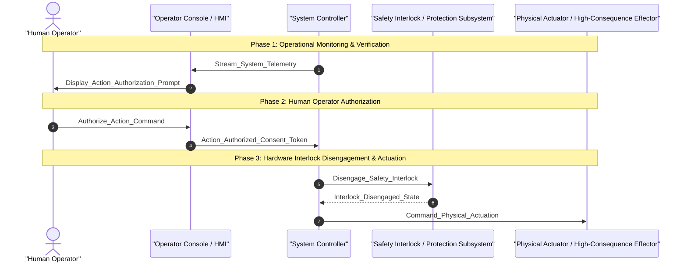

<!-- Copyright Gint Atkinson, gint.atkinson@gmail.com -->

---
name: spec-conops-engineering
description: "Synthesize hierarchical Concept of Operations (docs/conops/units/conops/) and Tactical Mission Intent (docs/conops/units/mission_intent/) specification units adhering to ISO/IEC/IEEE 29148:2018, INCOSE SE Handbook v5.0, NATO STANAG 4586, and MIL-STD-882E with pure schema contracts, zero truncation, and deterministic assembly via scripts/assemble_conops.py."
version: "1.0"
metadata:
  title: "Hierarchical ConOps & Mission Intent Engineering"
  category: specification
  risk: low
---

# Hierarchical Concept of Operations & Mission Intent Engineering (Worker ConOps)

Use this skill as the single canonical workflow for transforming high-level operational concepts, regulatory baselines, system architecture definitions, and normative research inventories into modular, machine-verifiable **Level 1B: Concept of Operations (ConOps)** and **Tactical Mission Intent** specification trees.

In accordance with [`rules/conops-mission-intent-integrity.md`](../../rules/conops-mission-intent-integrity.md), [`rules/sysml-ssot-completeness.md`](../../rules/sysml-ssot-completeness.md), and [`rules/latex-katex-integrity.md`](../../rules/latex-katex-integrity.md), ConOps and Mission Intent specifications bridge high-level operational intent with downstream structural extraction (Level 2 Epics and Features) and Model-Based Design (MBD) synthesis.

All specification units are authored as discrete, modular markdown files under `docs/conops/units/conops/` and `docs/conops/units/mission_intent/` adhering strictly to JSON Schema data contracts (`.pipeline/schemas/conops_specification_schema.json` and `.pipeline/schemas/mission_intent_specification_schema.json`) and compiled into canonical documents via `scripts/assemble_conops.py`.

> [!TIP]
> This skill enforces mathematical determinism, pure open schema contracts ($N \ge N_{\mathrm{min}}$), open multi-domain threat taxonomies, and 100% public clause citations across all operational and mission intent deliverables.

## Closed-Loop Payload Verification Gate & Anti-Complacency Rule
- **Exit code 0 is NEVER sufficient proof of success.**
- After generating or publishing any ConOps artifact or tracker issue, the agent MUST run live payload inspection (`gh issue view <ID>` or `glab issue view <ID>`) to verify markdown table alignment, LaTeX math blocks, schema citations, and link validity.
- **Optimism bias is prohibited**: agents must cite empirical output of live payload inspection before declaring completion.

---

## Execution Trigger & Pipeline Sequencing

You should invoke this skill as **Phase 0.75 (Worker ConOps - Hierarchical ConOps & Mission Intent Tree Engineer)** within the Master Orchestrator lifecycle (`skills/spec-orchestrator/SKILL.md`):
- **Preceding Phase**: Phase 0.5 (`Normative Research Worker`) has ingested domain standards, mapped public clauses, and synthesized `docs/research/RESEARCH_INVENTORY.md` with the Declared-Total Population Register.
- **Succeeding Phase**: Phase 1 (`Structural Spec Worker`) consumes the operational activities (`OA-*`), operational modes ($\Phi_{\mathrm{lifecycle}}$), and mission essential tasks (`MET-*`) defined here to allocate subsystem capabilities, Epics, and Features.

---

## Step 1: Context Ingestion & Pre-Flight Analysis

The `Worker ConOps` ingests and synthesizes the following foundational inputs:

1. **Normative Research Inventory & Standards Baseline**:
   - Ingest `docs/research/RESEARCH_INVENTORY.md` and `docs/research/FAILURE_MODE_REGISTRY.md`.
   - Extract all applicable standards: ISO/IEC/IEEE 29148:2018 (§6.4.2 ConOps & §6.4.3 OpsCon), INCOSE Systems Engineering Handbook v5.0, NATO STANAG 4586, MIL-STD-882E, JARUS SORA v2.5, RTCA DO-178C / DO-254, and SAE ARP4754A / ARP4761.
   - Map all allocated obligations (`OBL-*`) assigned to ConOps and Mission Intent.

2. **System Architecture & Structural Schemas**:
   - Ingest `.pipeline/schema.sysml` and `.pipeline/schema-digest.json` to extract system boundaries, subsystems, and architectural partitions.
   - **Mandatory AST Manifest Ingestion**: Ingest the explicit manifest of all AST `state def` prefix families with 2 or more states ($\ge 2$ states) and AST `part def` nodes with ports, actions, and constraints for Section 6.1 Stateflow synthesis hooks, Section 7 FMECA tables, and **Section 4 Super-System and Subsystem Architecture synthesis**.
   - **Mandatory AST Part Taxonomy Invariant**: Enforce automated extraction of all `part def` blocks from `schema/` and `.pipeline/schema.sysml`. Require ConOps Section 4 to synthesize formal Super-System Architecture (Air Vehicle / Primary Segment, Ground Segment, Launch / Support Segment) and Subsystem Architecture subsections for 100% of declared AST `part def` nodes (100% AST part coverage invariant).
   - Ingest domain schemas under `schema/` (OMG IDL, Protobuf, ARXML, SysML v2).

3. **Safety & Risk Baselines (3-Tier Lifecycle Integration)**:
   - Ingest Tier 1 Functional Hazard Assessment (FHA per SAE ARP4761 §3) and Operational Hazard Analysis (OHA per MIL-STD-882E Task 202) covering declared mission functions (`Propel`, `Navigate`, `Communicate`, `Sense`, `Contain`).
   - Ingest Tier 2 Functional FMECA & STPA (MIL-STD-1629A Method 101) failure modes, hazard rosters, and JARUS SORA Ground Risk Class (GRC) / Air Risk Class (ARC) profiles.
   - Extract containment boundaries, emergency failsafe states, and statutory energy reserve requirements.
   - Note: Tier 3 Piece-Part BOM FMECA (MIL-STD-1629A Method 102) is performed during detailed physical engineering (Run 3) and is not required for Run 1 concept formulation.

4. **User Operational Intent**:
   - Ingest operational purpose statements, stakeholder expectations, multi-threaded operational scenarios, and Commander's intent.

---

## Step 2: Discrete Unit Extraction & Schema Contract Mapping

The `Worker ConOps` partitions the specification space into discrete, modular units adhering to `.pipeline/schemas/conops_specification_schema.json` and `.pipeline/schemas/mission_intent_specification_schema.json`.

### 2.1 Concept of Operations Modular Units (`docs/conops/units/conops/`)

The ConOps specification tree consists of 12 canonical modular units:

| Unit Filename | Section Number & Title | JSON Schema Mapping | Mandatory Contents & Invariants |
| :--- | :--- | :--- | :--- |
| `01_METADATA_AND_OVERVIEW.md` | `## 1. Scope, System Identification & Normative Baseline` | `operational_context`, `user_classes` | System ID, domain classification, physical/legal boundaries, stakeholder roster, user classes. |
| `02_DEFICIENCIES_AND_MOTIVATION.md` | `## 2. Current Situation, Deficiency Analysis & Operational Motivation` | `deficiencies` | Predecessor baseline, technical, operational, and human deficiencies. |
| `03_PROPOSED_CAPABILITIES.md` | `## 3. Proposed Capabilities & Operational Justification (Trade-Offs)` | `proposed_capabilities` | Mission drivers, value propositions, engineering trade-off evaluations. |
| `04_USER_CLASSES_AND_STAKEHOLDERS.md` | `## 4. User Classes, Stakeholder Taxonomy & Operational Lifecycle Modes` | `operational_context` | Formal operational lifecycle stages: Phase_Startup, Phase_NominalExecution, Phase_DegradedMode, Phase_ContingencyFailsafe, Phase_SecureShutdown, Phase_MaintenanceMode; Super-System Architecture (Air Vehicle, Ground Segment, Launch System); and Subsystem Architecture subsections covering 100% of declared AST `part def` nodes. |
| `05_AIRSPACE_AND_SORA_RISK.md` | `## 5. Operational State Space, Boundary Containment & Risk Assessment` | `airspace_sora` | 4D volume mathematical formulation, Ground Risk Buffer ($R_{\mathrm{GRB}}$) equation, and SORA impact parameters table. |
| `06_UAF_OPERATIONAL_ACTIVITIES.md` | `## 6. OMG UAF Operational Activity Taxonomy` | `uaf_activities` | Open-ended UAF activity roster (`OA-01`..`OA-N`) with mandatory Gate 24 allocation tags (`/// OperationalAllocation: [OA-XX]`). |
| `07_OPTX_EXCHANGES.md` | `## 7. Operational Information Exchange (Op-Tx) Matrix` | `optx_exchanges` | Information exchange roster (`OpTx-01`..`OpTx-N`) specifying source, destination, data rates, latency limits, criticality. |
| `08_ENVIRONMENTAL_MIL_STD_810H.md` | `## 8. Operational Environments & MIL-STD-810H Environmental Stress Qualification` | `environmental_envelopes` | Ambient temperature, ingress protection (IP), electromagnetic/RF environment, spatial clearance envelopes. |
| `09_SCENARIOS_AND_TIMELINES.md` | `## 9. Multi-Threaded Operational Scenarios & System Timelines` | `scenarios` | Nominal, degraded, and contingency scenario threads with sequential execution steps and exit criteria. |
| `10_MAINTENANCE_AND_GSE_SUPPORT.md` | `## 10. Maintenance & Sustainment Concepts (O/I/D Maintenance)` | `maintenance` | Three-tier maintenance model: Organizational (O-Level), Intermediate (I-Level), Depot (D-Level). |
| `11_IMPACTS_AND_TRADE_STUDIES.md` | `## 11. Operational Impacts, System Limitations & Documented Trade Studies` | `proposed_capabilities` | Mission drivers, value propositions, engineering trade-off evaluations. |
| `12_EMERGENCY_DECISION_MATRIX.md` | `## 12. 7-Row Emergency Decision & Contingency Matrix` | `emergency_matrix` | Canonical emergency triggers (`EMG-01`..`EMG-07`) with detection mechanisms, failsafe recovery states, max response times, and HITL authority roles. |

### 2.2 Tactical Mission Intent Modular Units (`docs/conops/units/mission_intent/`)

The Tactical Mission Intent specification tree consists of 10 canonical modular units:

| Unit Filename | Section Number & Title | JSON Schema Mapping | Mandatory Contents & Invariants |
| :--- | :--- | :--- | :--- |
| `01_COMMANDERS_INTENT.md` | `## 1. Commander's Intent & Operational Objectives` | `commanders_intent` | Operational purpose, key mission tasks, and desired end state. |
| `02_MISSION_ESSENTIAL_TASK_LIST.md` | `## 2. Mission Essential Task List (METL)` | `metl_tasks` | Doctrinal task list (`MET-01`..`MET-N`) with conditions, quantitative metrics, verification methods, and Gate 24 allocation tags. |
| `03_INCOSE_MOE_MOP_MATH.md` | `## 3. Measures of Effectiveness (MoE) & Measures of Performance (MoP) Metrics` | `incose_moe_mop` | INCOSE SEH v5.0 metrics table with KaTeX mathematical formulas, Threshold and Objective performance values, and engineering units. |
| `04_MULTI_DOMAIN_THREAT_MATRIX.md` | `## 4. Multi-Domain Operational Threat & Contested Environment Matrix` | `threat_matrix` | Open multi-domain threat matrix across Kinetic, Mechanical, Environmental, EW/Cyber, Power/Thermal, Optical, and Human domains with public clause citations. |
| `05_PACE_C2_PLAN.md` | `## 5. PACE C2 Link Communications Plan` | `pace_c2_plan` | 4-tier PACE communications plan (Primary, Alternate, Contingency, Emergency) with frequency bands, bandwidth, heartbeat timeouts, and failover hysteresis. |
| `06_ROE_SAFETY_INTERLOCKS.md` | `## 6. Rules of Engagement (ROE) & Weapon/Sensor Interlocks` | `roe_interlocks` | Normative rules of engagement and logical interlock predicates (`ROE-01`..`ROE-N`). |
| `07_AIRSPACE_GEOZONES.md` | `## 7. Airspace Deconfliction & U-space Dynamic Geo-Zones` | `airspace_geozones` | Primary boundary perimeter, dynamic exclusion/keep-out zones, and horizontal/vertical separation minima. |
| `08_GO_NO_GO_MATRIX.md` | `## 8. Go/No-Go Decision Matrix` | `go_no_go_matrix` | Operational phase checks (`GNG-01`..`GNG-N`), threshold conditions, sensors/mechanisms, and deterministic Go/No-Go actions. |
| `09_BINGO_ENERGY_MATH.md` | `## 9. Bingo Energy Mathematics & Secondary Divert Protocols` | `bingo_energy_math` | Bingo energy dynamics formulation ($E_{\mathrm{bingo}}(t)$), statutory reserve ratio constraint ($\ge 20\%$), and energy parameter table. |
| `10_OPERATIONAL_ALLOCATION_TAGS.md` | `## 10. Gate 24 MissionTask Traceability Tags` | `allocation_tags` | Comprehensive listing of Gate 24 allocation tags (`/// OperationalAllocation: [MET-XX]`) for cross-model traceability. |

---

## Step 3: Standalone Unit Authoring & File System Layout

The `Worker ConOps` writes individual modular files under the dedicated unit directories:

```
docs/conops/
└── units/
    ├── conops/
    │   ├── 01_METADATA_AND_OVERVIEW.md
    │   ├── 02_DEFICIENCIES_AND_MOTIVATION.md
    │   ├── 03_PROPOSED_CAPABILITIES.md
    │   ├── 04_USER_CLASSES_AND_STAKEHOLDERS.md
    │   ├── 05_AIRSPACE_AND_SORA_RISK.md
    │   ├── 06_UAF_OPERATIONAL_ACTIVITIES.md
    │   ├── 07_OPTX_EXCHANGES.md
    │   ├── 08_ENVIRONMENTAL_MIL_STD_810H.md
    │   ├── 09_SCENARIOS_AND_TIMELINES.md
    │   ├── 10_MAINTENANCE_AND_GSE_SUPPORT.md
    │   ├── 11_IMPACTS_AND_TRADE_STUDIES.md
    │   └── 12_EMERGENCY_DECISION_MATRIX.md
    └── mission_intent/
        ├── 01_COMMANDERS_INTENT.md
        ├── 02_MISSION_ESSENTIAL_TASK_LIST.md
        ├── 03_INCOSE_MOE_MOP_MATH.md
        ├── 04_MULTI_DOMAIN_THREAT_MATRIX.md
        ├── 05_PACE_C2_PLAN.md
        ├── 06_ROE_SAFETY_INTERLOCKS.md
        ├── 07_AIRSPACE_GEOZONES.md
        ├── 08_GO_NO_GO_MATRIX.md
        ├── 09_BINGO_ENERGY_MATH.md
        └── 10_OPERATIONAL_ALLOCATION_TAGS.md
```

### Unit Authoring Invariants:
1. **Zero Unresolved Placeholder Tokens**: No unit file may contain raw placeholder tokens (e.g. `{{SYSTEM_IDENTIFIER}}`, `{{OA_01_NAME}}`). All values must be concretely resolved.
2. **Zero Empty Files**: Every unit file must contain non-empty, substantive specification content.
3. **No Header Metadata Duplication**: Individual unit files should focus purely on section markdown headings and content; master document metadata is managed during assembly.

---

## Step 4: Pure Open Schema Generation & Architectural Invariants

The `Worker ConOps` must strictly enforce the following repository rules:

### 4.1 Pure Open Schema Contract ($N \ge N_{\mathrm{min}}$)
- Per [`rules/conops-mission-intent-integrity.md`](../../rules/conops-mission-intent-integrity.md), all table schemas and list structures are open-ended collections.
- Static row ceilings, hardcoded array caps, or truncation heuristics are strictly forbidden.
- Minimum cardinality constraints ($N_{\mathrm{min}}$) must be satisfied:
  * Emergency Decision Matrix: $N \ge 7$ canonical triggers (`EMG-01` through `EMG-07`).
  * PACE C2 Plan: $N \ge 4$ tiers (`Primary`, `Alternate`, `Contingency`, `Emergency`).
  * METL Tasks: $N \ge 1$ task entries.
  * Threat Matrix: $N \ge 1$ threat entries.
  * UAF Activities: $N \ge 1$ activity entries.

### 4.2 Open Multi-Domain Threat Taxonomy
The threat matrix (`04_MULTI_DOMAIN_THREAT_MATRIX.md`) must cover multi-domain threats across all canonical operational domains:
1. **Kinetic**: Projectiles, collisions, interceptors, physical debris.
2. **Mechanical**: Structural fatigue, actuator jamming, motor bearing seizure, propeller delamination.
3. **Power / Thermal**: Battery thermal runaway, ESC over-temperature, power distribution rail collapse.
4. **Environmental**: Severe turbulence, icing, icing-induced pitot freeze, lightning strike, volcanic ash.
5. **EW / Cyber**: GNSS jamming/spoofing, RF link interception, telemetry injection, malicious firmware ingress.
6. **Optical**: Laser blinding of electro-optical sensors, camera lens saturation, optical tracking denial.
7. **Signature / Acoustic**: Acoustic emission harmonics, infrared signature, radar cross-section observability.
8. **Human Factors**: Operator fatigue, command input disparity, unauthorized override attempts.
9. **CBRN**: Chemical plumes, toxic particulate, hazardous contamination.

### 4.3 KaTeX Mathematical Rendering Integrity
Per [`rules/latex-katex-integrity.md`](../../rules/latex-katex-integrity.md):
- **Display Math Blocks**: All mathematical formulations must be placed inside dedicated display blocks using `$$ \begin{aligned} ... \end{aligned} $$` on separate newlines.
- **Pure Symbolic Math**: Do NOT embed physical unit macros (e.g. `\text{ m}`, `\text{ m/s}`, `\text{ J}`) inside LaTeX math blocks. Units must be defined in the accompanying parameter table.
- **No Table Math Delimiters**: Never use `$ ... $` or `$$ ... $$` math delimiters inside Markdown table cells. Use standard plain text and Unicode characters (e.g., `h_max m`, `deg`, `m/s`, `J`, `tau_max ms`).
- **Parameter Definitions & Engineering Units Tables**: Display equations must be immediately followed by a parameter definition table specifying symbols, values, units, and engineering descriptions.

#### Example: SORA Ground Risk Buffer Formulation (`05_AIRSPACE_AND_SORA_RISK.md`)
$$
\begin{aligned}
V_{\mathrm{4D}} &= V_{\mathrm{SpatialGeometry}} \cup V_{\mathrm{ContingencyVolume}} \cup V_{\mathrm{GRB}} \\
R_{\mathrm{GRB}} &= h_{\mathrm{max}} \cdot \tan(\theta_{\mathrm{impact}}) + v_{\mathrm{wind,max}} \cdot \sqrt{\frac{2 h_{\mathrm{max}}}{g}} + d_{\mathrm{glide,max}}
\end{aligned}
$$

| Parameter | Symbol | Value | Units | Description |
| :--- | :--- | :--- | :--- | :--- |
| Max Altitude / Ceiling | h_max | 120.0 | m | Maximum operating ceiling above reference surface |
| Impact Angle | theta_impact | 45.0 | deg | Worst-case operational trajectory impact angle |
| Max Wind Speed | v_wind_max | 15.0 | m/s | Maximum operational wind speed limit |
| Gravitational Accel | g | 9.80665 | m/s^2 | Standard gravitational acceleration constant |
| Maximum Glide Distance | d_glide_max | 50.0 | m | Maximum unpowered lateral displacement margin |
| Ground Risk Buffer Radius | R_GRB | 200.0 | m | Declared ground risk buffer containment radius |
| Terminal Velocity | v_terminal | 25.0 | m/s | Estimated unpowered descent terminal velocity |
| Impact Kinetic Energy | E_impact | 1562.5 | J | Kinetic energy at operational boundary impact |

#### Example: Bingo Energy Dynamics Formulation (`09_BINGO_ENERGY_MATH.md`)
$$
\begin{aligned}
E_{\mathrm{bingo}}(t) &= E_{\mathrm{return}}(\mathbf{p}(t), \mathbf{p}_{\mathrm{dest}}) + E_{\mathrm{divert}}(\mathbf{p}_{\mathrm{dest}}, \mathbf{p}_{\mathrm{alt}}) + E_{\mathrm{reserve}} + E_{\mathrm{contingency}} \\
E_{\mathrm{reserve}} &\ge 0.20 \cdot E_{\mathrm{capacity}}
\end{aligned}
$$

| Energy Parameter | Symbol | Value | Units | Constraint Rule |
| :--- | :--- | :--- | :--- | :--- |
| Total Storage Capacity | E_capacity | 500000.0 | J | Total nominal energy storage capacity |
| Return Transit Energy | E_return | 150000.0 | J | Energy required for primary return trajectory |
| Secondary Divert Energy | E_divert | 60000.0 | J | Energy required to divert to secondary recovery site |
| Mandatory Statutory Reserve | E_reserve | 100000.0 | J | Statutory reserve threshold (E_reserve >= 0.20 * E_capacity) |
| Contingency Buffer | E_contingency | 40000.0 | J | Dynamic operational contingency energy reserve |
| Total Bingo Threshold | E_bingo | 350000.0 | J | Critical return threshold condition |

### 4.4 Mandatory AST Subsystem Architecture Invariant in Section 4
Per ISO/IEC/IEEE 29148:2018 §6.4.2, INCOSE Systems Engineering Handbook v5.0, and the Pure Schema-Driven Compiler Invariant:
- **100% AST Part Coverage Invariant**: ConOps Section 4 must synthesize formal Super-System Architecture and dedicated Subsystem Architecture subsections for 100% of declared `part def` nodes present in the SysML AST.
- **Super-System Architecture (Section 4.7)**:
  1. Formal Operational Segments: Primary Vehicle / Cyber-Physical Platform Segment, Ground Command & Control Segment, Launch & Auxiliary Support Segment.
  2. Super-System Architectural Connectivity Diagram: A valid Mermaid diagram (`flowchart TD` or `graph TD`) depicting segment boundaries, C2 data links, payload feeds, and ground interfaces with universal quoting and header compliance.
- **Subsystem Architecture & AST Part Allocation (Section 4.8)**:
  For EVERY declared AST `part def` node $p \in \text{AST}$, Section 4 must contain a dedicated subsection (`#### 4.8.x {part.name} Subsystem Architecture`) specifying:
  1. **Functional Purpose & Scope**: Primary operational mission role derived from AST doc comments and actions.
  2. **Physical & Logical Interface / Port Allocations**: Declared input, output, and bidirectional ports (`PortDef`) and bus interconnects.
  3. **Power, Mass & Resource Envelopes**: Operating electrical power draw, mass partition budget ($m_{\mathrm{alloc}}$), and thermal operating envelopes.
  4. **Operational Role & Statechart Integration**: Lifecycle mode allocation ($\Phi_{\mathrm{lifecycle}}$) and active operational states.
  5. **Safety Invariants, Containment Interlocks & FMECA Linkage**: Watchdog interlocks, emergency trigger containment bindings (`EMG-01`..`EMG-07`), and safety criticalities.
- **Zero-Omission Rule**: Omitting any declared AST `part def` is strictly forbidden and triggers compiler validation failure during `assemble_conops.py` assembly.

### 4.5 100% Public Clause Citations
- Every threat mitigation, normative requirement, and operational task must cite authoritative public standards clauses (e.g. `ISO/IEC/IEEE 29148:2018 §6.4.2`, `IEEE Std 1558-2020 §4.5`, `JARUS SORA v2.5 Annex B §2.1`, `RTCA DO-178C §6.3.1`, `MIL-STD-882E §4.4`).
- Speculative or un-cited additions are strictly forbidden.

### 4.6 Section 5 PACE C2 Link Communications Plan Template & Schema-Driven Extraction Guidelines
Per [`rules/sysml-ssot-completeness.md`](../../rules/sysml-ssot-completeness.md) and [`rules/conops-mission-intent-integrity.md`](../../rules/conops-mission-intent-integrity.md):
- **Zero Hardcoded Synthetic Timeouts Invariant**: Agents and Worker ConOps are strictly forbidden from hardcoding synthetic timeout constants (such as `tau_loss = 5.0 s`, `tau_reacquire = 15.0 s`, `tau_escalate = 30.0 s`) or ungrounded generic protocol standards (e.g. NATO STANAG 4586) into Section 5 PACE templates and generated artifacts.
- **Parametric Schema-Driven Extraction**:
  1. All PACE communications tiers (`Primary`, `Alternate`, `Contingency`, `Emergency`) must extract link medium characteristics, frequency bands ($f_{\mathrm{band}}$), data rates ($\text{Rate}_{\mathrm{nom}}$), and heartbeat timeout thresholds ($\tau_{\mathrm{timeout},i}$) dynamically from schema definitions in `schema/` (e.g., OMG IDL, Protobuf, ARXML, SysML v2 port contracts) and SysML `state def` timing constraints.
  2. Public clause citations must reference authoritative, grounded standards declared in `docs/research/RESEARCH_INVENTORY.md` (e.g., `IEEE Std 1558-2020 §4.5`, `MIL-STD-188-220E §5.3`, `MIL-STD-882E §4.3`, `NIST SP 800-82r3 §5.2`).
- **Parametric Failover Transition Dynamics Equation**:
$$
\begin{aligned}
\Delta t_{\mathrm{loss}}(t) &= t - t_{\text{last\_valid\_rx}} \\
\mathrm{State}(t) &= \begin{cases}
\mathrm{Tier}_i & \text{if } \Delta t_{\mathrm{loss}} < \tau_{\mathrm{timeout},i} \\
\mathrm{Tier}_{i+1} & \text{if } \Delta t_{\mathrm{loss}} \ge \tau_{\mathrm{timeout},i} \quad \text{for } t \ge t_{\mathrm{fail}} + \tau_{\mathrm{hysteresis},i+1}
\end{cases}
\end{aligned}
$$

- Parameter Definitions & Engineering Units:

| Parameter | Symbol | Units | Constraint / Rule | Description |
| :--- | :--- | :--- | :--- | :--- |
| Active Link Loss Duration | Delta t_loss | s | Measured Online | Measured elapsed duration since last authenticated frame |
| Primary Heartbeat Timeout | tau_timeout_Primary | s | tau_timeout_Primary > 0 | Timeout triggering fallback to Alternate tier extracted from schema |
| Alternate Heartbeat Timeout | tau_timeout_Alternate | s | tau_timeout_Alternate > tau_timeout_Primary | Timeout triggering fallback to Contingency tier extracted from schema |
| Contingency Heartbeat Timeout | tau_timeout_Contingency | s | tau_timeout_Contingency > tau_timeout_Alternate | Timeout triggering fallback to Emergency tier extracted from schema |
| Emergency Heartbeat Timeout | tau_timeout_Emergency | s | tau_timeout_Emergency > tau_timeout_Contingency | Timeout initiating definitive failsafe sequence extracted from SysML state def |
| Re-acquisition Hysteresis Window | tau_hysteresis | s | tau_hysteresis > 0 | Continuous stable link duration required before up-tier promotion |

### 4.7 Section 10 Operational Sequence Diagram Template & Safety-Critical Actuation Invariants
Per [`rules/sysml-ssot-completeness.md`](../../rules/sysml-ssot-completeness.md) §3 and MIL-STD-882E §4.4:
- **Strict Prohibition of Autonomous High-Consequence Actuation**: Autonomous generation of irreversible physical actuation, high-energy discharge, or safety-critical effector commands without prior human operator authorization/consent is strictly prohibited across all specification tiers. Any sequence diagram attempting uncommanded or unauthorized physical actuation is immediately rejected under rule `factual-grounding-temporal-safety-violation`.
- **Mandatory Temporal Precedence of Human Consent**:
  In every Mermaid sequence diagram (`sequenceDiagram`) representing high-consequence operations or safety-critical actuation, an explicit Human-in-the-Loop (HITL) operator authorization command / consent token (e.g. `Operator ->> Console: Authorize_Action_Command`, `Console ->> Controller: Action_Authorized_Consent_Token`) MUST temporally precede any physical interlock disengagement or actuation signal (`Controller ->> SafetyInterlock: Disengage_Safety_Interlock`, `Controller ->> Actuator: Command_Physical_Actuation`).
- **Abstract Temporal Safety Invariant Rule**: High-consequence or irreversible physical actuation commands require temporal predecessor human operator consent tokens if mandated by system safety requirements.

#### Figure 10.1: Operational Sequence Diagram with Human Authorization & Safety Interlock Disengagement


- **Mermaid & KaTeX Formatting Invariants**:
  1. Sequence diagram blocks MUST declare `sequenceDiagram` as the very first line inside ```` ```mermaid ````.
  2. All participant names and notes containing special characters, hyphens, slashes, or colons must be properly enclosed in double quotes.
  3. Every Mermaid block MUST be strictly closed with matching ```` ``` ```` on a newline.
  4. Display math formulations must use `$$ \begin{aligned} ... \end{aligned} $$` on separate newlines with no bare alignment `&` outside aligned blocks.

---

## The 3-Tier Multi-Run Safety & Threat Derivation Lifecycle

Safety, threat, and hazard derivation in DEAP follows a strict three-tier, multi-run architectural lifecycle to eliminate circular dependency deadlocks between operational concept definition and physical component selection:

### Tier 1 (Run 1: Mission Intent / Concept Formulation)
- **Primary Methodologies**: Functional Hazard Assessment (FHA) under **SAE ARP4761 §3** and Operational Hazard Analysis (OHA) under **MIL-STD-882E Task 202**.
- **Derivation Mechanism**: Threats and operational hazards are derived systematically from declared **Mission Functions** (`Propel`, `Navigate`, `Communicate`, `Sense`, `Contain`) and **Operating Domains** (`Kinetic`, `Mechanical`, `Power/Thermal`, `Environmental`, `EW`, `Cyber`, `Optical`, `Signature`, `Human Factors`, `CBRN`) using standardized hazard guide words:
  * `Loss`: Complete absence or cessation of the required mission function.
  * `Degraded`: Sub-nominal capacity, reduced bandwidth, or inadequate control authority.
  * `Intermittent`: Sporadic, discontinuous, or jittery functional execution.
  * `Uncommanded`: Inadvertent, unrequested, or anomalous functional activation.
- **Resolution & Scope Rule**: Run 1 **does NOT require piece-part BOM FMECA** (which creates a fatal circular dependency deadlock before physical hardware components are architected and selected). Instead, Run 1 strictly enforces 100% complete FHA and OHA functional hazard coverage across all declared mission functions and operational threat domains.

### Tier 2 (Run 2: ConOps / Logical Architecture & SysML)
- **Primary Methodologies**: Functional Failure Mode, Effects, and Criticality Analysis (FMECA) under **MIL-STD-1629A Method 101** and System-Theoretic Process Analysis (**STPA**).
- **Derivation Mechanism**: Failure modes and safety constraints are derived from logical subsystem blocks, data bus interfaces (e.g., CAN, Ethernet, Serial), inter-subsystem control loops, and operational activity transitions (`OA-*`).
- **Focus**: Logical interface boundaries, feedback loop delays, unsafe control actions (UCAs), and loss of functional redundancy.

### Tier 3 (Run 3: Detailed Engineering & Physical BOM)
- **Primary Methodologies**: Piece-Part Hardware Failure Mode, Effects, and Criticality Analysis (FMECA) under **MIL-STD-1629A Method 102**.
- **Derivation Mechanism**: Calculates quantitative failure rates ($\lambda$) and criticality metrics ($C_r$) for specific physical hardware components, commercial-off-the-shelf (COTS) parts, electrical interconnects, and circuit components based on empirical reliability handbooks (e.g. MIL-HDBK-217F, NPRD-2016).

### Derivation-Annotation Contract (Phase 0 Safety Engineering)
All analytical content across safety engineering deliverables (`docs/safety/STPA_MATRIX.md`) and operational safety assessments is an engineering derivative of the SSOT fact base, never an un-anchored fact itself. Every derived analytical cell (System Losses, Hazards, UCAs, Loss Scenarios, Safety Constraints, FMECA, SORA) MUST carry four mandatory annotations:
1. **Input Anchors**: Precise citations of upstream SSOT document, section, and clause (or explicit silent source set declaration where product documentation is silent).
2. **Methodology Citation**: Authoritative governing methodology standard:
   - **Leveson STPA** for Losses (**L**), Hazards (**H**), Unsafe Control Actions (**UCA**), Loss Scenarios (**LS**), and Safety Constraints (**SC**).
   - **MIL-STD-1629A / SAE ARP4761** for FMECA Severity (**S**), Occurrence (**O**), Detection (**D**), and Criticality / Risk Priority Number (**RPN**).
   - **JARUS SORA v2.5** for Ground Risk Class (**GRC**), Air Risk Class (**ARC**), Specific Assurance and Integrity Level (**SAIL**), and Operational Safety Objectives (**OSO-01..24**).
   - **ASTM F3269-17** for Run-Time Assurance (RTA) Safety Net monitors and MATLAB / Simulink / Stateflow / Embedded Coder synthesis hooks.
3. **Derivation Grade**: Explicit classification of analytical provenance:
   - `Directly Evidenced`: Direct empirical evidence from ingested SSOT schemas or normative requirements.
   - `Analytically Derived`: Formally computed or deduced via domain engineering logic.
   - `Declared Assumption`: Explicit engineering assumption when upstream sources are silent.
4. **Caveat**: Mandatory where upstream product documents are silent, recording:
   - The specific derivation attempt made.
   - The silent source set identified.
   - The downstream architectural impact and verification requirement.

---

## Step 5: Deterministic Modular Assembly Engine

Once all unit files are written and verified, execute the deterministic assembly engine:

```bash
python3 scripts/assemble_conops.py --input-dir docs/conops/units/ --output-dir docs/conops/ --verify
```

and compile the master specification documents:

```bash
python3 scripts/assemble_conops.py --input-dir docs/conops/units/ --output-dir docs/conops/
```

### Assembly Engine Responsibilities:
1. **Unit Integrity Verification**: Validates that all unit markdown files exist, are non-empty, and contain zero unresolved `{{...}}` placeholder tokens.
2. **Metadata Table Injection**: Synthesizes the standard document metadata header table at lines 1–10.
3. **Table of Contents (TOC) Synthesis**: Automatically parses H2 and H3 headings and generates a verified Markdown TOC.
4. **Internal Link & Anchor Validation**: Confirms 100% of internal anchor links (`#slug`) resolve cleanly to existing headings with zero broken links.
5. **Deterministic Output Emission**: Emits `docs/conops/CONOPS.md` and `docs/conops/MISSION_INTENT.md`.

---

## Step 6: Multi-Gate Verification & Backlog Synchronization

Before completing Phase 0.75, the `Worker ConOps` must execute and pass all required parity gates:

1. **Gate 26 Verification (ConOps & Mission Intent Completeness Validator)**:
   ```bash
   python3 -m unittest tests.test_conops_and_mission_intent_validators
   ```
   - Asserts all 12 mandatory sections exist in `CONOPS.md` and all 10 mandatory sections exist in `MISSION_INTENT.md`.
   - Validates SORA Ground Risk Buffer radius calculation ($R_{\mathrm{GRB}} \ge R_{\mathrm{min}}$).
   - Validates Bingo energy statutory reserve ratio ($E_{\mathrm{reserve}} / E_{\mathrm{capacity}} \ge 0.20$).
   - Validates 7-row emergency matrix determinism (`EMG-01`..`EMG-07`).
   - Validates METL task allocations.

2. **Gate 28 & Gate 29 Verification**:
   - Verify that all ConOps-allocated obligations in `docs/research/RESEARCH_INVENTORY.md` are witnessed in `docs/conops/CONOPS.md` and `docs/conops/MISSION_INTENT.md` per `obligation_witness_validator.py` (Gate 29).
   - Verify coverage metrics per `coverage_digest_validator.py` (Gate 28).

3. **Untracked Infrastructure & Pre-Commit Check**:
   ```bash
   UNTRACKED_INFRA=$(git ls-files --others --exclude-standard docs/conops/ skills/ rules/ scripts/)
   if [ -n "$UNTRACKED_INFRA" ]; then
     git add docs/conops/ skills/ rules/ scripts/
   fi
   ```

4. **Tracker Issue Registration & Label Bootstrapping**:
   - Bootstrap tracker labels if not present:
     * GitHub: `gh label create conops --color 0e8a16 --description "Level 1B Concept of Operations & Mission Intent" --force`
     * GitLab: `glab label create --name "type::conops" --color "#0E8A16" --description "Level 1B Concept of Operations & Mission Intent"`
   - Register issues with full bodies (`--body-file docs/conops/CONOPS.md` and `--body-file docs/conops/MISSION_INTENT.md`).

5. **Commit & Return Control**:
   - Stage and commit the generated ConOps and Mission Intent artifacts:
     ```bash
     git add docs/conops/
     git commit -m "feat(conops): synthesize hierarchical Concept of Operations and Tactical Mission Intent suite"
     ```
   - Report completion and generated artifact paths back to the Master Orchestrator.
