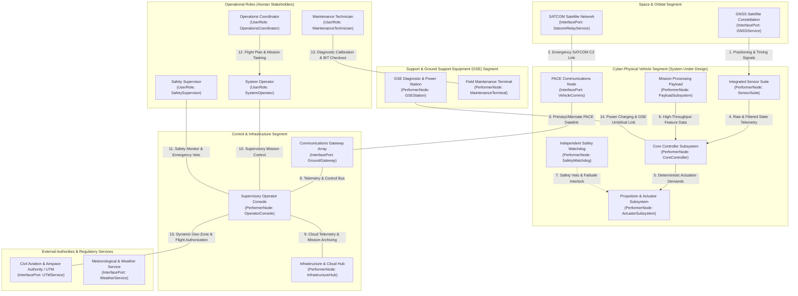

| Attribute | Value |
| :--- | :--- |
| **Title** | Scope, System Identification & Normative Baseline |
| **Version** | {{DOCUMENT_VERSION}} |
| **Date** | {{DOCUMENT_DATE}} |

# Concept of Operations (ConOps): {{SYSTEM_IDENTIFIER}}

## 1. Scope, System Identification & Normative Baseline

### 1.1 Document Metadata & Formal Governance
This Concept of Operations (ConOps) defines the operational architecture, coordinate reference systems, physical mass and resource limits, stakeholder interactions, operational environments, operational state space containment boundaries, and deterministic contingency protocols for {{SYSTEM_IDENTIFIER}}. This specification is authored in strict accordance with ISO/IEC/IEEE 29148:2018 §5.2.4 & §6.4.2, OMG Unified Architecture Framework (UAF) v2.0, INCOSE Systems Engineering Handbook v5.0, {{PRIMARY_REGULATORY_STANDARD:MIL-STD-882E}}, and MIL-STD-882E (Fixes #117, #123, #128, #121).

| Attribute | Specification Value |
| :--- | :--- |
| **System Identifier** | {{SYSTEM_IDENTIFIER}} |
| **Document Version** | {{DOCUMENT_VERSION}} |
| **Publication Date** | {{DOCUMENT_DATE}} |
| **Security Classification** | {{SECURITY_CLASSIFICATION}} |
| **Target System Realization** | {{TARGET_SYSTEM_REALIZATION}} |
| **Authoring Organization** | {{AUTHORING_ORGANIZATION}} |
| **Issue Tracking Baseline** | Fixes #117, #123, #128, #121 |
| **Metamodel Baseline** | ISO/IEC/IEEE 29148:2018 / OMG UAF v2.0 / INCOSE SEH v5.0 |

### 1.2 System Classification & Operational Purpose
- **System Identifier:** `{{SYSTEM_IDENTIFIER}}`
- **Operational Domain:** `{{OPERATIONAL_DOMAIN}}`
- **Primary Operational Mission:** {{PRIMARY_OPERATIONAL_MISSION}}
- **Core Mission Capabilities:**
{{CORE_MISSION_CAPABILITIES}}

### 1.3 System Boundary & Operational State Space
The operational system boundary encompasses all physical, logical, communications, and organizational elements required to conduct end-to-end autonomous mission operations:
- **Operational State Space Envelope:** Operational State Space $\Omega_{\mathrm{state}} \subset \mathbb{R}^n$, bounded by physical, environmental, and operational parameter limits $\mathbf{X}_{\mathrm{boundary}} = [\mathbf{x}_{\mathrm{min}}, \mathbf{x}_{\mathrm{max}}]^\top$.
- **Lateral & Spatial Operating Boundary:** Designated operational perimeter bounded within a verified parametric containment buffer ($R_{\mathrm{buffer}}$) envelope.
- **Primary Communications Envelope:** Primary command and control (C2) operational range defined by $\text{Range}_{\mathrm{max}}(\text{Link}_{\mathrm{C2}})$ from the operator control node, backed by alternate network links and contingency communication channels.
- **Normative & Governance Boundary:** Governed under ISO/IEC/IEEE 29148:2018 requirements engineering processes, OMG UAF v2.0 operational architectures, and system safety assurance baselines.

- **Operational State Space Parameter Definitions & Engineering Units:**

| Symbol / Parameter | Domain / Context | Description | Dimension / Limits | Engineering Unit | Normative / Safety Basis |
| :--- | :--- | :--- | :--- | :--- | :--- |
| Ω_state | State Space Domain | Admissible operational state space envelope (Ω_state ⊂ R^n) | Compact subset of R^n (n >= 6) | Dimensionless | {{STATE_SPACE_STANDARD:ISO/IEC/IEEE 29148:2018 §6.4.2}} |
| X_boundary | State Vector Bounds | Bounding box of admissible vehicle operational states [x_min, x_max]^T | Bounded hyper-rectangle | Mixed SI Units | {{SAFETY_BOUNDS_STANDARD:ASTM F3269-17 §6.2}} |
| x_min | State Lower Limit | Minimum permissible state vector threshold | {{STATE_VECTOR_MIN_EXPRESSION:[phi_min, lambda_min, h_min, u_min, v_min, w_min]^T}} | {{STATE_VECTOR_MIN_UNITS:rad, rad, m, m/s}} | {{STATE_SAFETY_MITIGATION:SORA Annex B M1 Mitigations}} |
| x_max | State Upper Limit | Maximum permissible state vector threshold | {{STATE_VECTOR_MAX_EXPRESSION:[phi_max, lambda_max, h_max, u_max, v_max, w_max]^T}} | {{STATE_VECTOR_MAX_UNITS:rad, rad, m/s}} | {{STATE_SAFETY_MITIGATION:SORA Annex B M1 Mitigations}} |
| R_buffer | Spatial Containment | Verified 1:1 parametric lateral containment safety buffer radius | R_buffer >= 1.0 * Distance_containment | {{CONTAINMENT_BUFFER_UNIT:m}} | {{CONTAINMENT_STANDARD:JARUS SORA v2.5 Step #2}} |
| Range_max(Link_C2) | C2 Comms Margin | Maximum certified C2 data link operational range | Range_max >= Range_nominal | km | {{C2_STANDARD:RTCA DO-362A §2.2.1}} |
| tau_containment | Emergency Response | Maximum allowable failsafe containment response time | tau_containment <= 2.0 | s | {{CONTAINMENT_RESPONSE_STANDARD:ASTM F3269-17 §7.1}} |

### 1.3.1 Parametric Coordinate Reference Frames Math
The cyber-physical state estimation, guidance, and navigation architecture is mathematically formulated across three standardized, right-handed orthogonal coordinate reference frames:

1. **Primary Global Geodetic Frame ($\mathbf{p}_{\mathrm{geodetic}}$):**
   Earth-fixed curvilinear geodetic frame referenced to the WGS-84 reference ellipsoid, defined by geodetic latitude $\phi$, geodetic longitude $\lambda$, and ellipsoidal height $h_{\mathrm{ellips}}$:

$$
\begin{aligned}
\mathbf{p}_{\mathrm{geodetic}} &= \begin{bmatrix} \phi \\ \lambda \\ h_{\mathrm{ellips}} \end{bmatrix}
\end{aligned}
$$

2. **Local Tangent Plane / Navigation Frame ($\mathbf{p}_n$ - Local NED):**
   Local Cartesian coordinate frame fixed to an arbitrary local reference origin $(\phi_0, \lambda_0, h_0)$ on the reference geoid/ellipsoid, with orthogonal axes oriented along North ($X_n$), East ($Y_n$), and Down ($Z_n$):

$$
\begin{aligned}
\mathbf{p}_n &= \begin{bmatrix} X_n \\ Y_n \\ Z_n \end{bmatrix}_{\mathrm{NED}}
\end{aligned}
$$

3. **Body-Fixed Geometric Frame ($\mathbf{p}_b$ - Body Frame):**
   Right-handed orthogonal Cartesian frame rigidly attached to the structural frame of the vehicle (vehicle chassis / locomotive body / subsea hull / spacecraft structure) with origin at the Center of Mass ($CG$). The axes comprise longitudinal axis $X_b$ (forward along vehicle nominal centerline), lateral axis $Y_b$ (starboard/right), and normal axis $Z_b$ (downward through vehicle bottom/belly, $Z_b = X_b \times Y_b$).
   - Body translational velocity vector $\mathbf{v}_b$:

$$
\begin{aligned}
\mathbf{v}_b &= \begin{bmatrix} u \\ v \\ w \end{bmatrix}^T
\end{aligned}
$$

   - Body angular rate vector $\boldsymbol{\omega}_{b/n}$:

$$
\begin{aligned}
\boldsymbol{\omega}_{b/n} &= \begin{bmatrix} p \\ q \\ r \end{bmatrix}^T
\end{aligned}
$$

4. **Kinematic Transformations & Attitude Dynamics:**
   The orientation of the Body-Fixed Frame relative to the Local NED Frame is parameterized by the Euler attitude vector $\boldsymbol{\Theta} = [\phi_{\mathrm{euler}}, \theta_{\mathrm{euler}}, \psi_{\mathrm{euler}}]^T$ via Direction Cosine Matrix $\mathbf{C}_b^n \in \mathrm{SO}(3)$:

$$
\begin{aligned}
\mathbf{v}_n &= \mathbf{C}_b^n \mathbf{v}_b \\
\dot{\mathbf{p}}_n &= \mathbf{C}_b^n \mathbf{v}_b \\
\mathbf{C}_b^n &= \begin{bmatrix}
\cos\theta \cos\psi & \sin\phi \sin\theta \cos\psi - \cos\phi \sin\psi & \cos\phi \sin\theta \cos\psi + \sin\phi \sin\psi \\
\cos\theta \sin\psi & \sin\phi \sin\theta \sin\psi + \cos\phi \cos\psi & \cos\phi \sin\theta \sin\psi - \sin\phi \cos\psi \\
-\sin\theta & \sin\phi \cos\theta & \cos\phi \cos\theta
\end{bmatrix} \\
\dot{\boldsymbol{\Theta}} &= \begin{bmatrix}
1 & \sin\phi \tan\theta & \cos\phi \tan\theta \\
0 & \cos\phi & -\sin\phi \\
0 & \sin\phi \sec\theta & \cos\phi \sec\theta
\end{bmatrix} \boldsymbol{\omega}_{b/n}
\end{aligned}
$$

- Parameter Definitions & Engineering Units:

| Symbol / Variable | Coordinate Frame | Description | Engineering Unit |
| :--- | :--- | :--- | :--- |
| phi | Global Geodetic (WGS-84) | Geodetic Latitude | rad or deg |
| lambda | Global Geodetic (WGS-84) | Geodetic Longitude | rad or deg |
| h_ellips | Global Geodetic (WGS-84) | Ellipsoidal Height above Reference Ellipsoid | m |
| X_n, Y_n, Z_n | Local Tangent Plane (NED) | North, East, Down Position Coordinates | m |
| X_b, Y_b, Z_b | Body-Fixed Frame | Longitudinal (Surge), Lateral (Sway), Normal (Heave) Axes | m |
| v_b = [u, v, w]^T | Body-Fixed Frame | Body Translational Velocity (Surge u, Sway v, Heave w) | m/s |
| omega_b/n = [p, q, r]^T | Body-Fixed Frame | Body Angular Rates (Roll p, Pitch q, Yaw r) | rad/s or deg/s |
| C_b^n | Transformation SO(3) | Direction Cosine Matrix (Body to NED) | Dimensionless |
| Theta = [phi, theta, psi]^T | Attitude Representation | Euler Angles (Roll phi, Pitch theta, Yaw psi) | rad or deg |

### 1.3.2 Parametric Subsystem Mass/Resource Budget Breakdown Table
The system architecture decomposes into six canonical Abstract System Topology (AST) structural groups. Mass allocations and power resource budgets are partitioned parametrically to maintain strict mass fraction boundaries summing to 100.0% Maximum Takeoff Weight (MTOW):

| Structural Group (AST Partition) | Allocated Subsystems & Components | Mass Fraction (% MTOW) | Mass Budget (kg) | Nominal Power Budget (W) | Peak Power Budget (W) |
| :--- | :--- | :--- | :--- | :--- | :--- |
| **{{STRUCTURE_PARTITION_LABEL:Airframe Structure}}** | Fuselage / chassis primary structure, structural spars, mounting bulkheads, enclosure/gear | {{MASS_FRACTION_AIRFRAME_PCT}}% | {{MASS_BUDGET_AIRFRAME_KG}} | {{POWER_NOMINAL_AIRFRAME_W}} | {{POWER_PEAK_AIRFRAME_W}} |
| **Avionics & Processing** | Flight control computer, redundant IMU/GNSS, air data computer, C2 transceiver, safety watchdog | {{MASS_FRACTION_AVIONICS_PCT}}% | {{MASS_BUDGET_AVIONICS_KG}} | {{POWER_NOMINAL_AVIONICS_W}} | {{POWER_PEAK_AVIONICS_W}} |
| **Propulsion & Power Distribution** | Actuators, electric motors, electronic speed controllers (ESCs), power distribution unit (PDU) | {{MASS_FRACTION_PROPULSION_PCT}}% | {{MASS_BUDGET_PROPULSION_KG}} | {{POWER_NOMINAL_PROPULSION_W}} | {{POWER_PEAK_PROPULSION_W}} |
| **Energy Storage Subsystem** | Smart battery module / fuel cell stack, Battery Management System (BMS), safety disconnect contactors | {{MASS_FRACTION_ENERGY_PCT}}% | {{MASS_BUDGET_ENERGY_KG}} | {{POWER_NOMINAL_ENERGY_W}} | {{POWER_PEAK_ENERGY_W}} |
| **Primary Mission Payload** | Multi-modal mission sensor suite, edge neural processing accelerator, payload gimbal, local storage | {{MASS_FRACTION_PAYLOAD_PCT}}% | {{MASS_BUDGET_PAYLOAD_KG}} | {{POWER_NOMINAL_PAYLOAD_W}} | {{POWER_PEAK_PAYLOAD_W}} |
| **Autonomous Failsafe Containment** | Independent safety watchdog, {{FAILSAFE_CONTAINMENT_NAME:ballistic parachute recovery / containment actuator}}, flight termination interlocks | {{MASS_FRACTION_CONTAINMENT_PCT}}% | {{MASS_BUDGET_CONTAINMENT_KG}} | {{POWER_NOMINAL_CONTAINMENT_W}} | {{POWER_PEAK_CONTAINMENT_W}} |
| **Total System Integration** | **Integrated Cyber-Physical Platform (6 AST Structural Groups)** | **100.0% MTOW** | **{{TOTAL_MTOW_KG}}** | **{{TOTAL_POWER_NOMINAL_W}}** | **{{TOTAL_POWER_PEAK_W}}** |

### 1.3.3 Master Physical Limits Table
The cyber-physical vehicle operates under bounding physical, aerodynamic/kinematic, and environmental limits:

| Parameter ID | Bounding Parameter Name | Parametric Symbol | Threshold (Boundary Limit) | Objective (Nominal Target) | Engineering Unit | Normative / Safety Basis |
| :--- | :--- | :--- | :--- | :--- | :--- | :--- |
| **PL-01** | Maximum Takeoff Weight (MTOW) | m_MTOW | <= {{MTOW_MAX_KG}} | {{MTOW_NOMINAL_KG}} | kg | Certified maximum structural takeoff mass limit |
| **PL-02** | Maximum Payload Mass Capacity | m_payload_max | >= {{PAYLOAD_MAX_KG}} | {{PAYLOAD_NOMINAL_KG}} | kg | Usable mission payload mass reserve |
| **PL-03** | Physical Dimensions (Length x Width x Height) | L_x, L_y, L_z | <= {{DIM_MAX_L_M}} x {{DIM_MAX_W_M}} x {{DIM_MAX_H_M}} | {{DIM_NOM_L_M}} x {{DIM_NOM_W_M}} x {{DIM_NOM_H_M}} | m | Spatial transport and operational clearance envelope |
| **PL-04** | Nominal Cruise Velocity | V_cruise | {{V_CRUISE_MIN_MPS}} - {{V_CRUISE_MAX_MPS}} | {{V_CRUISE_NOMINAL_MPS}} | m/s | Optimum aerodynamic / dynamic transit speed |
| **PL-05** | Maximum Permissible Operating Velocity | V_max | <= {{V_MAX_MPS}} | {{V_MAX_NOMINAL_MPS}} | m/s | Never-exceed boundary limit (V_ne) |
| **PL-06** | Minimum Controllable / Stall Velocity | V_stall | <= {{V_STALL_MAX_MPS}} | {{V_STALL_NOMINAL_MPS}} | m/s | Minimum steady state controllable velocity limit |
| **PL-07** | Maximum Operating Ceiling | h_max | <= {{CEILING_MAX_M}} | {{CEILING_NOMINAL_M}} | {{ALTITUDE_UNIT:m AGL}} | Maximum certified operational altitude |
| **PL-08** | Command & Control (C2) Datalink Range | Range_C2 | >= {{C2_RANGE_MIN_KM}} | {{C2_RANGE_NOMINAL_KM}} | km | Beyond-Line-of-Sight / Line-of-Sight C2 range margin |
| **PL-09** | Mission Operational Endurance | t_endurance | >= {{ENDURANCE_MIN_MIN}} | {{ENDURANCE_NOMINAL_MIN}} | min | Continuous nominal execution duration |
| **PL-10** | Environmental Operating Temperature Envelope | T_env | {{TEMP_MIN_DEGC}} to {{TEMP_MAX_DEGC}} | {{TEMP_NOMINAL_DEGC}} | °C | MIL-STD-810H Methods 501.7 / 502.7 climatic envelope |
| **PL-11** | Maximum Operating Wind / Gust Envelope | v_wind_max | <= {{WIND_LIMIT_MAX_MPS}} | {{WIND_LIMIT_NOMINAL_MPS}} | m/s | SORA ground risk and dynamic stability boundary |
| **PL-12** | Environmental Ingress Protection Envelope | IP_rating | >= {{INGRESS_PROTECTION_RATING}} | {{INGRESS_PROTECTION_TARGET}} | IP Code | Hermetic enclosure sealing per ISO 20653 / IEC 60529 |

### 1.4 Abstract UAF Context Diagram
The following Unified Architecture Framework (UAF) operational context diagram defines the external interfaces, performer nodes, and primary interaction channels across the Space, Cyber-Physical Vehicle, Control/Infrastructure, Support/GSE, Operational Roles, and External Authorities segments:

### 1.5 Normative Standards & Regulatory Baseline
The following normative standards and regulatory baselines govern all architectural, operational, safety, and verification artifacts within this Concept of Operations:

| Standard ID | Issuing Body | Title & Baseline Edition | Applicable Clauses & Focus Areas |
| :--- | :--- | :--- | :--- |
| ISO/IEC/IEEE 29148:2018 | ISO / IEC / IEEE | Systems and Software Engineering — Life Cycle Processes — Requirements Engineering | §5.2.4 ConOps Development Process, §6.4.2 Concept of Operations Baseline Specification, §6.4.3 Operational Concept Document Structure |
| INCOSE SEH v5.0 | INCOSE | Systems Engineering Handbook (5th Edition) | §3.3 Operational Concepts & §4.2 Requirements Engineering |
| OMG UAF v2.0 | OMG | Unified Architecture Framework Specification | Operational Domain Views (Op-Pr, Op-Tx, Op-Is) |
| MIL-STD-882E | US Department of Defense | Department of Defense Standard Practice: System Safety | §4.3 System Safety Process, Task 102 System Safety Program Plan, Task 202 Operational Hazard Analysis (OHA), Task 205 Hazard Tracking System |
| MIL-STD-810H | US Department of Defense | Environmental Engineering Considerations and Laboratory Tests | Method 501.7 High Temp, Method 502.7 Low Temp, Method 505.7 Solar Radiation, Method 506.6 Rain, Method 509.7 Salt Fog, Method 510.7 Sand/Dust, Method 514.8 Vibration, Method 516.8 Shock |
| MIL-STD-461G | US Department of Defense | Requirements for the Control of Electromagnetic Interference Characteristics of Subsystems and Equipment | CE102 Conducted Emissions, CS101/CS114/CS115/CS116 Conducted Susceptibility, RE102 Radiated Emissions, RS103 Radiated Susceptibility up to 200 V/m |
| NIST SP 800-82r3 | NIST | Guide to Operational Technology (OT) Security | §5.2 Zero-Trust OT Architecture & Device Hardening, §6.3 Real-Time Telemetry Authentication, §6.4 Cryptographic Key Management & Firmware Integrity |
{{DOMAIN_REGULATORY_STANDARDS_TABLE_ROWS}}
