| Attribute | Value |
| :--- | :--- |
| **Title** | Scope, System Identification & Normative Baseline |
| **Version** | 1.0.0 |
| **Date** | 2026-09-02 |

# Concept of Operations (ConOps): Autonomous Cyber-Physical System Archetype

## 1. Scope, System Identification & Normative Baseline

### 1.1 Document Metadata & Formal Governance
This Concept of Operations (ConOps) defines the operational architecture, stakeholder interactions, operational environments, 4D airspace containment boundaries, and deterministic contingency protocols for the Autonomous Cyber-Physical System Archetype. This specification is authored in strict accordance with ISO/IEC/IEEE 29148:2018 §5.2.4 & §6.4.2, OMG Unified Architecture Framework (UAF) v1.2/v2.0, NATO STANAG 4586 Edition 4, and JARUS SORA v2.5.

| Attribute | Specification Value |
| :--- | :--- |
| **System Identifier** | AutonomousSystemArchetype |
| **Document Version** | 1.0.0 |
| **Publication Date** | 2026-09-02 |
| **Security Classification** | Unclassified / Public Specification Baseline |
| **Target System Realization** | Multi-Mission Cyber-Physical Autonomous System |
| **Authoring Organization** | DEAP Systems Engineering & Operational Architecture Working Group |
| **Regulatory Baseline** | JARUS SORA v2.5 (Specific Category) / EASA Easy Access Rules / FAA Operational Authorizations |

### 1.2 System Classification & Operational Purpose
- **System Identifier:** `AutonomousSystemArchetype`
- **Operational Domain:** `UAF::OperationalDomain::CivilSecurityAndMonitoring`
- **Primary Operational Mission:** The system is engineered to execute autonomous, long-endurance perimeter surveillance, multi-spectral optical/thermal reconnaissance, environmental anomaly detection, real-time telemetry streaming, tactical strike/target engagement, and automated dynamic geofence containment in complex, high-reliability civil and tactical operational domains.
- **Core Mission Capabilities:**
  1. Autonomous waypoint navigation, corridor traversal, and on-station surveillance orbiting within parameterized performance envelopes.
  2. Multi-sensor data fusion combining multi-constellation satellite navigation receivers, redundant inertial measurement units (IMUs), barometric altimetry, and optical flow odometry.
  3. Real-time high-definition electro-optical / infrared (EO/IR) sensor streaming and edge neural telemetry inference.
  4. Deterministic failsafe state machine ensuring autonomous containment within the maximum containment response time threshold $\tau_{\mathrm{containment}}$ upon critical contingency detection.

### 1.3 System Boundary & Physical/Legal Envelopes
The operational system boundary encompasses all physical, logical, communications, and organizational elements required to conduct end-to-end autonomous mission operations:
- **Physical Flight Envelope:** Bounded operational volume extending from ground level ($h_{\mathrm{min}}$) up to the parametric maximum operating ceiling $h_{\mathrm{operating\_ceiling}}$.
- **Lateral Operating Boundary:** Designated operational perimeter polygon enclosed within a verified parametric Ground Risk Buffer ($R_{\mathrm{GRB}}$) containment envelope.
- **C2 RF Datalink Envelope:** Primary line-of-sight command and control (C2) operational radius defined by $\text{Range}_{\mathrm{max}}(\text{Link}_{\mathrm{C2}})$ from the Ground Control Station (GCS) node, backed by alternate network links and emergency satellite communication relays.
- **Regulatory & Jurisdictional Boundary:** Governed under JARUS SORA v2.5 Specific Category operations, civil aviation standard scenarios, and national civil aviation authority (CAA) operating waivers.

### 1.4 Operational Context Diagram
The following Unified Architecture Framework (UAF) operational context diagram defines the external interfaces, performer nodes, and primary interaction channels:

```mermaid
flowchart TB
    subgraph SpaceSegment["Space & External Positioning Segment"]
        ExternalPositioning["External Positioning Constellation<br/>(InterfacePort[GNSSConstellation])"]
        SatcomRelay["Satellite Communication Network<br/>(InterfacePort[EmergencySatcomRelay])"]
    end

    subgraph AirSegment["System Under Design (PerformerNode[AirVehicleNode])"]
        FCC["Flight Control Computer (FCC)<br/>(PerformerNode[FlightGuidanceAutopilot])"]
        SensorArray["Integrated Sensor Suite<br/>(PerformerNode[NavigationSensorArray])"]
        PayloadNode["Mission Payload System<br/>(PerformerNode[PayloadSystem])"]
        DatalinkTransceiver["PACE Datalink Transceiver<br/>(InterfacePort[C2Datalink])"]
        SafetyWatchdog["Independent Safety Watchdog<br/>(PerformerNode[FlightTerminationWatchdog])"]
    end

    subgraph GroundSegment["Control Station Segment (PerformerNode[GroundControlStation])"]
        C2Console["C2 Mission Console<br/>(PerformerNode[C2MissionConsole])"]
        AntennaArray["Antenna Tracking System<br/>(InterfacePort[DirectionalAntenna])"]
        GSEHub["Ground Support Equipment Hub<br/>(PerformerNode[GSEChargingAndDiagnostics])"]
    end

    subgraph UserSegment["Operational Human Roles"]
        RPIC["Remote Pilot in Command (RPIC)<br/>(HumanRole[SupervisoryAuthority])"]
        PO["Payload Operator (PO)<br/>(HumanRole[PayloadSpecialist])"]
        MC["Mission Commander (MC)<br/>(HumanRole[MissionCommander])"]
        MT["Maintenance Technician (MT)<br/>(HumanRole[MaintenanceTechnician])"]
        VO["Visual Observer (VO)<br/>(HumanRole[AirspaceObserver])"]
    end

    subgraph ExternalSegment["External Operational Entities"]
        UTM["U-Space / UTM Service Provider<br/>(InterfacePort[UTMService])"]
        ATM["Air Traffic Management (ATM/ATC)<br/>(InterfacePort[ATMCoordination])"]
        ERP_Entity["Emergency Services & Safety Entities<br/>(InterfacePort[ERPCoordination])"]
    end

    ExternalPositioning -->|"Positioning Broadcasts"| SensorArray
    DatalinkTransceiver ---|"Primary RF Datalink"| AntennaArray
    DatalinkTransceiver ---|"Alternate Network Link"| C2Console
    DatalinkTransceiver ---|"Emergency Satellite Link"| SatcomRelay
    AntennaArray --- C2Console
    
    RPIC ---|"Supervisory Control"| C2Console
    PO ---|"Payload Telemetry & Tasking"| C2Console
    MC -->|"Mission Authorization & ROE Release"| RPIC
    MT -->|"Pre-Flight BIT Verification"| GSEHub
    VO -->|"Airspace Advisory Link"| RPIC

    C2Console ---|"Flight Coordination API"| UTM
    RPIC ---|"Voice Coordination Link"| ATM
    MC -->|"Emergency Notification Link"| ERP_Entity
```

### 1.5 Normative Standards & Regulatory Baseline
The following normative standards and regulatory baselines govern all architectural, operational, safety, and verification artifacts within this Concept of Operations:

| Standard ID | Issuing Body | Title & Baseline Edition | Applicable Clauses & Focus Areas |
| :--- | :--- | :--- | :--- |
| ISO/IEC/IEEE 29148:2018 | ISO / IEC / IEEE | Systems and Software Engineering — Life Cycle Processes — Requirements Engineering | §5.2.4 ConOps Development, §6.4.2 Concept of Operations Baseline, §6.4.3 Operational Concept |
| OMG UAF v1.2 / v2.0 | Object Management Group (OMG) | Unified Architecture Framework (UAF) Specification | Operational Domain Models (Op-Pr, Op-Tx, Op-Is, Op-St) |
| NATO STANAG 4586 | NATO Standardization Office | Standard Interfaces of UAV Control System (UCS) for NATO UAV Interoperability | Edition 4, Annex B (Data Link Interface DLI), Command and Control Interfaces (CCI) |
| JARUS SORA v2.5 | Joint Authorities for Rulemaking on Unmanned Systems | Specific Operations Risk Assessment (SORA) Guidelines | Annex B (Ground Risk Class GRC & Buffer Formulation), Annex C (Air Risk Class ARC), Annex E (Integrity Levels) |
| MIL-STD-882E | US Department of Defense | Department of Defense Standard Practice: System Safety | §4.3 System Safety Process, Task 102 (Safety Program Plan), Task 205 (Hazard Tracking) |
| MIL-STD-810H | US Department of Defense | Environmental Engineering Considerations and Laboratory Tests | Methods 501.7, 502.7, 505.7, 506.6, 509.7, 510.7, 514.8, 521.4 (Climatic and Dynamic Environments) |
| RTCA DO-178C | RTCA / EUROCAE | Software Considerations in Airborne Systems and Equipment Certification | Section 6.3.1 (Software Safety Verification), DAL-A/B Deterministic Flight Control |
| RTCA DO-254 | RTCA / EUROCAE | Design Assurance Guidance for Airborne Electronic Hardware | Section 5.0 (Hardware Architecture Verification), Complex Electronic Hardware Assurance |
| SAE ARP4754A | SAE International | Guidelines for Development of Civil Aircraft and Systems | Section 4.0 (System Development Process), Section 5.0 (Safety Assessment Process) |
| SAE ARP4761 | SAE International | Guidelines and Methods for Conducting the Safety Assessment Process on Airborne Systems | Functional Hazard Assessment (FHA), Fault Tree Analysis (FTA), FMECA |
