| Attribute | Value |
| :--- | :--- |
| **Title** | Scope, System Identification & Normative Baseline |
| **Version** | 1.0.0 |
| **Date** | 2026-09-02 |

# Concept of Operations (ConOps): Abstract Cyber-Physical System Archetype

## 1. Scope, System Identification & Normative Baseline

### 1.1 Document Metadata & Formal Governance
This Concept of Operations (ConOps) defines the operational architecture, stakeholder interactions, operational environments, operational state space containment boundaries, and deterministic contingency protocols for the Abstract Cyber-Physical System Archetype. This specification is authored in strict accordance with ISO/IEC/IEEE 29148:2018 §5.2.4 & §6.4.2, OMG Unified Architecture Framework (UAF) v2.0, INCOSE Systems Engineering Handbook v5.0, and MIL-STD-882E.

| Attribute | Specification Value |
| :--- | :--- |
| **System Identifier** | AbstractSystemArchetype |
| **Document Version** | 1.0.0 |
| **Publication Date** | 2026-09-02 |
| **Security Classification** | Unclassified / Public Specification Baseline |
| **Target System Realization** | General Multi-Mission Cyber-Physical System |
| **Authoring Organization** | DEAP Systems Engineering & Operational Architecture Working Group |
| **Metamodel Baseline** | ISO/IEC/IEEE 29148:2018 / OMG UAF v2.0 / INCOSE SEH v5.0 |

### 1.2 System Classification & Operational Purpose
- **System Identifier:** `AbstractSystemArchetype`
- **Operational Domain:** `UAF::OperationalDomain::GeneralCyberPhysical`
- **Primary Operational Mission:** The system is engineered to execute autonomous closed-loop state trajectory execution, multi-modal sensor data acquisition, real-time telemetry processing, edge state inference, and deterministic boundary containment within complex, high-reliability cyber-physical operational environments.
- **Core Mission Capabilities:**
  1. Autonomous closed-loop state trajectory tracking, corridor execution, and stationary state holding within parameterized performance envelopes.
  2. Multi-modal sensor data fusion combining redundant state estimation sensors, environmental perception units, and reference state observers.
  3. Real-time high-throughput telemetry streaming and edge neural state inference processing.
  4. Deterministic failsafe state machine ensuring autonomous containment within the maximum containment response time threshold $\tau_{\mathrm{containment}}$ upon critical contingency detection.

### 1.3 System Boundary & Operational State Space
The operational system boundary encompasses all physical, logical, communications, and organizational elements required to conduct end-to-end autonomous mission operations:
- **Operational State Space Envelope:** Operational State Space $\Omega_{\mathrm{state}} \subset \mathbb{R}^n$, bounded by physical, environmental, and operational parameter limits $\mathbf{X}_{\mathrm{boundary}} = [\mathbf{x}_{\mathrm{min}}, \mathbf{x}_{\mathrm{max}}]^\top$.
- **Lateral & Spatial Operating Boundary:** Designated operational perimeter bounded within a verified parametric containment buffer ($R_{\mathrm{buffer}}$) envelope.
- **Primary Communications Envelope:** Primary command and control (C2) operational range defined by $\text{Range}_{\mathrm{max}}(\text{Link}_{\mathrm{C2}})$ from the operator control node, backed by alternate network links and contingency communication channels.
- **Normative & Governance Boundary:** Governed under ISO/IEC/IEEE 29148:2018 requirements engineering processes, OMG UAF v2.0 operational architectures, and system safety assurance baselines.

### 1.4 Operational Context Diagram
The following Unified Architecture Framework (UAF) operational context diagram defines the external interfaces, performer nodes, and primary interaction channels:

```mermaid
flowchart TB
    subgraph ExternalSegment["External Reference & Infrastructure Segment"]
        ExternalPositioning["External Positioning & Time Service<br/>(InterfacePort[ExternalPositioningService])"]
        ExternalDataService["External Data & Registry Service<br/>(InterfacePort[ExternalDataService])"]
    end

    subgraph SystemUnderDesign["System Under Design (PerformerNode[CoreSystemNode])"]
        CoreController["Core Controller Subsystem<br/>(PerformerNode[CoreController])"]
        SensorSuite["Integrated Sensor Suite<br/>(PerformerNode[SensorSuite])"]
        PayloadSubsystem["Mission Processing Payload<br/>(PerformerNode[PayloadSubsystem])"]
        ActuatorSubsystem["Dynamic Actuator Subsystem<br/>(PerformerNode[ActuatorSubsystem])"]
        PrimaryComms["PACE Communications Transceiver<br/>(InterfacePort[PrimaryCommunications])"]
        SafetyWatchdog["Independent Safety Watchdog<br/>(PerformerNode[SafetyWatchdog])"]
    end

    subgraph ControlSegment["Operator & Supervisory Station Segment (PerformerNode[OperatorStation])"]
        OperatorConsole["Supervisory Operator Console<br/>(PerformerNode[OperatorConsole])"]
        AntennaArray["Communications Transceiver Array<br/>(InterfacePort[TransceiverArray])"]
        SupportHub["Support Equipment & Diagnostics Hub<br/>(PerformerNode[SupportHub])"]
    end

    subgraph UserSegment["Operational Human Roles"]
        SystemOperator["System Operator<br/>(UserRole[SystemOperator])"]
        SafetySupervisor["Safety Supervisor<br/>(UserRole[SafetySupervisor])"]
        OperationsCoordinator["Operations Coordinator<br/>(UserRole[OperationsCoordinator])"]
        MaintenanceTechnician["Maintenance Technician<br/>(UserRole[MaintenanceTechnician])"]
    end

    ExternalPositioning -->|"Reference State Signals"| SensorSuite
    PrimaryComms ---|"Primary Communications Link"| AntennaArray
    PrimaryComms ---|"Alternate Network Tunnel"| OperatorConsole
    PrimaryComms ---|"Contingency Command Channel"| AntennaArray
    AntennaArray --- OperatorConsole
    
    CoreController -->|"Actuation Demands"| ActuatorSubsystem
    SensorSuite -->|"Measured State Telemetry"| CoreController
    PayloadSubsystem -->|"Processed Feature Data"| CoreController
    SafetyWatchdog -.->|"Safety Interlock & Cutoff"| ActuatorSubsystem

    SystemOperator ---|"Supervisory Control Interface"| OperatorConsole
    SafetySupervisor ---|"Safety Oversight & Veto Authority"| OperatorConsole
    OperationsCoordinator -->|"Mission Authorization & Tasking"| SystemOperator
    MaintenanceTechnician -->|"Pre-Operation Diagnostic Verification"| SupportHub

    OperatorConsole ---|"External Coordination API"| ExternalDataService
```

### 1.5 Normative Standards & Regulatory Baseline
The following normative standards and regulatory baselines govern all architectural, operational, safety, and verification artifacts within this Concept of Operations:

| Standard ID | Issuing Body | Title & Baseline Edition | Applicable Clauses & Focus Areas |
| :--- | :--- | :--- | :--- |
| ISO/IEC/IEEE 29148:2018 | ISO / IEC / IEEE | Systems and Software Engineering — Life Cycle Processes — Requirements Engineering | §5.2.4 ConOps Development, §6.4.2 Concept of Operations Baseline, §6.4.3 Operational Concept |
| OMG UAF v2.0 | Object Management Group (OMG) | Unified Architecture Framework (UAF) Specification | Operational Domain Models (Op-Pr, Op-Tx, Op-Is, Op-St) |
| INCOSE SEH v5.0 | INCOSE | Systems Engineering Handbook: A Guide for System Life Cycle Processes | §3.2 Operational Concept, §3.3 Mission Analysis, Technical Metrics |
| MIL-STD-882E | US Department of Defense | Department of Defense Standard Practice: System Safety | §4.3 System Safety Process, Task 102 (Safety Program Plan), Task 205 (Hazard Tracking) |
| MIL-STD-810H | US Department of Defense | Environmental Engineering Considerations and Laboratory Tests | Methods 501.7, 502.7, 505.7, 506.6, 509.7, 510.7, 514.8 (Climatic and Dynamic Environments) |
| IEEE Std 1558-2020 | IEEE | Standard for System Architecture and Interface Definitions | General Interface Definitions and Deterministic Interoperability Profiles |
| NIST SP 800-82r3 | NIST | Guide to Operational Technology (OT) Security | §5.2 Authenticated Telemetry, Zero-Trust Command Security |
