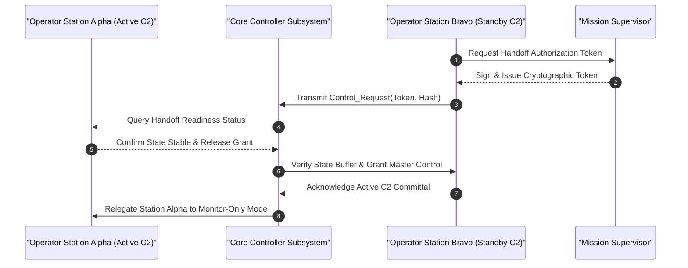

| Attribute | Value |
| :--- | :--- |
| **Title** | User Classes, Stakeholder Taxonomy & Operational Lifecycle Modes |
| **Version** | 1.0.0 |
| **Date** | 2026-09-02 |

## 4. User Classes, Stakeholder Taxonomy & Operational Lifecycle Modes

### 4.1 Stakeholder Roster
The operational lifecycle involves multiple organizational and external stakeholders who interact directly or indirectly with the autonomous system:
- **System Governance & Safety Authorities:** Regulatory and certification bodies responsible for issuing operational authorizations, validating safety cases, and monitoring compliance.
- **Operational Safety Authority & Supervisors:** Operational authorities governing corridor allocations, approving dynamic boundary activations, and coordinating emergency deconfliction.
- **System Owner & Operations Management:** Organizational or enterprise entities directing mission requirements, operating policies, and resource allocation.
- **Support & Logistics Organization:** Maintenance facilities, supply chain managers, and calibration laboratories.

### 4.2 User Class Taxonomy
In accordance with ISO/IEC/IEEE 29148:2018 §5.2.4 and the specification data contract, the operational user classes are defined as follows:

| User Class ID | Title | Player or Operator | Interfacing Stakeholder | Characteristics & Responsibilities | Training & Qualification | Constraint Source |
| :--- | :--- | :--- | :--- | :--- | :--- | :--- |
| **UC-01** | System Operator (SO) | Direct Operator | Operational Safety Authority / Operations Lead | Holds primary operational responsibility for system supervision, trajectory oversight, boundary deconfliction, and manual failsafe override initiation. | Certified System Operator with Type Qualification and Supervisory Control Certification | ISO/IEC/IEEE 29148:2018 §5.2.4 |
| **UC-02** | Payload / Data Specialist (PS) | Direct Operator | Operations Center / Analytics Team | Responsible for multi-modal sensor tasking, tracking zone definition, real-time feature identification, and data stream management. | Certified Sensor Payload Specialist & Data Acquisition Qualification | ISO/IEC/IEEE 29148:2018 §5.2.4 |
| **UC-03** | Mission Supervisor (MS) | Supervisor / Player | Executive Authority / Operations Director | Establishes operational rules, authorizes mission execution and abort commands, manages multi-system allocations, and coordinates external interfaces. | Senior Operations Supervisor Qualification & System Safety Management Certification | MIL-STD-882E Task 102 |
| **UC-04** | Maintenance Technician (MT) | Support Operator | Maintenance Depot / Quality Assurance Office | Conducts Organizational (O-Level) pre-operation inspections, resource module replacements, structural integrity checks, sensor calibration, and modular LRU swaps. | Certified Maintenance Technician / Field Hardware Specialist | ISO/IEC/IEEE 29148:2018 §5.2.4 |
| **UC-05** | Safety Monitor (SM) | Field Support | Local Environment Monitoring Staff | Maintains continuous monitoring of surrounding operational boundaries to detect environmental anomalies and non-cooperative entities within the operational state space. | Certified Safety Observer Training & Operational Communication Protocol Qualification | MIL-STD-882E §4.3 |

### 4.3 Skill Prerequisites & Minimum Qualifications
1. **System Operator (SO):** Minimum accredited supervisory operational hours ($t_{\mathrm{operational\_hours}} \ge t_{\mathrm{req}}$); validated proficiency in emergency decision matrix (`EMG-01`..`EMG-07`) execution under simulated degraded state conditions.
2. **Payload / Data Specialist (PS):** Validated proficiency in multi-modal sensor data interpretation, tracking locks, coordinate extraction, and secure data dissemination protocols.
3. **Maintenance Technician (MT):** Formal electro-mechanical certification, electronic diagnostic inspection qualification, and authorized digital maintenance logbook endorsement.

### 4.4 Workload Constraints & Human Factors Considerations
To prevent operator fatigue and ensure situational awareness during complex operations:
- **Maximum Shift Duration:** Continuous supervisory console time is bounded by $t_{\mathrm{shift}} \le t_{\mathrm{shift\_max}}$ with a mandatory rest interval $t_{\mathrm{rest}} \ge t_{\mathrm{rest\_min}}$.
- **Cognitive Workload Threshold:** Systems shall be engineered to maintain NASA-Task Load Index (TLX) composite scores below $\text{TLX}_{\mathrm{nominal\_max}}$ during nominal operations and below $\text{TLX}_{\mathrm{degraded\_max}}$ during degraded or contingency operational phases.
- **Decoupled Operator Architecture:** Primary system safety oversight (`UC-01`) and sensor payload analysis (`UC-02`) are decoupled across distinct physical workstations to prevent operational task interference.

### 4.5 Authority Handoff Chains & Control Transfer Protocols
Handoff of command and control authority between Operator Stations (e.g., Station Alpha to Station Bravo) or between human supervisory and autonomous control modes follows a strict cryptographic 4-way handshake with handoff completion time bounded by $t_{\mathrm{handoff}} \le \tau_{\mathrm{handoff\_max}}$:
1. **Initiation:** Receiving station (Station Bravo) transmits an encrypted Control Request Token over the authenticated communication channel.
2. **Authorization:** Relinquishing station (Station Alpha) and Mission Supervisor authenticate the token and transmit an explicit Control Handoff Grant.
3. **Verification:** Station Bravo executes cross-telemetry alignment, confirms identical state parameter buffer state, and transmits Acknowledgment.
4. **Commit:** Core Controller transfers primary C2 authority to Station Bravo and transitions Station Alpha to Monitor-Only mode.

### 4.6 Operational Lifecycle Stages ($\Phi_{\mathrm{lifecycle}}$)
The system operates across six mutually exclusive, deterministic lifecycle stages:
- **Phase_Startup:** Power-on Built-In-Test (PBIT), sensor alignment, state estimator initialization, cryptographic key verification, and pre-operation interlock validation.
- **Phase_NominalExecution:** Autonomous mission start, transit along designated state corridors, operational state monitoring, payload processing, and real-time telemetry streaming.
- **Phase_DegradedMode:** Non-critical sensor failover, reversion to dead reckoning upon reference signal loss, PACE datalink fallback switch, and degraded parameter limits.
- **Phase_ContingencyFailsafe:** Autonomous execution of Return-to-Base (RTB), transition to secondary emergency recovery location, or controlled state containment.
- **Phase_SecureShutdown:** Autonomous precision arrival, controlled deceleration to stop, actuator lock, cryptographic memory zeroization, and diagnostic log archival.
- **Phase_MaintenanceMode:** Diagnostic telemetry offload, actuator calibration, firmware updating, and structural/hardware inspection.
