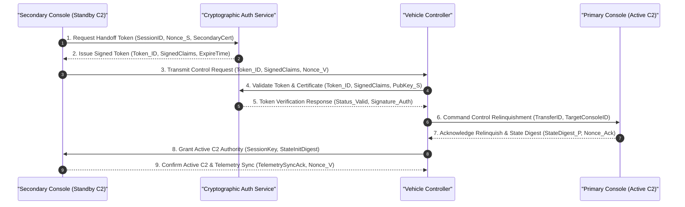

<!-- Copyright Gint Atkinson, gint.atkinson@gmail.com -->
<!-- Reference Fixes: #120, #119 -->

| Attribute | Value |
| :--- | :--- |
| **Title** | User Classes, Stakeholder Taxonomy & Operational Lifecycle Modes |
| **Version** | 1.0.0 |
| **Date** | 2026-09-02 |
| **Traceability References** | Fixes #120, #119 |

## 4. User Classes, Stakeholder Taxonomy & Operational Lifecycle Modes

### 4.1 Stakeholder Roster
The operational lifecycle involves multiple organizational and external stakeholders who interact directly or indirectly with the autonomous system:
- **System Governance & Safety Authorities:** Regulatory and certification bodies responsible for issuing operational authorizations, validating safety cases, and monitoring compliance.
- **Operational Safety Authority & Supervisors:** Operational authorities governing corridor allocations, approving dynamic boundary activations, and coordinating emergency deconfliction.
- **System Owner & Operations Management:** Organizational or enterprise entities directing mission requirements, operating policies, and resource allocation.
- **Support & Logistics Organization:** Maintenance facilities, supply chain managers, and calibration laboratories.

### 4.2 User Class Taxonomy
In accordance with ISO/IEC/IEEE 29148:2018 §5.2.4 and the specification data contract, the operational user classes are defined as follows:

| User Class ID | Title | Player or Operator | Interfacing Stakeholder | Characteristics & Responsibilities | Training & Qualification | Constraint Source |
| :--- | :--- | :--- | :--- | :--- | :--- | :--- |
| **UC-01** | System Operator (SO) | Direct Operator | Operational Safety Authority / Operations Lead | Holds primary operational responsibility for system supervision, trajectory oversight, boundary deconfliction, and manual failsafe override initiation. | Certified System Operator with Type Qualification and Supervisory Control Certification | ISO/IEC/IEEE 29148:2018 §5.2.4 |
| **UC-02** | Payload / Data Specialist (PS) | Direct Operator | Operations Center / Analytics Team | Responsible for multi-modal sensor tasking, tracking zone definition, real-time feature identification, and data stream management. | Certified Sensor Payload Specialist & Data Acquisition Qualification | ISO/IEC/IEEE 29148:2018 §5.2.4 |
| **UC-03** | Mission Supervisor (MS) | Supervisor / Player | Executive Authority / Operations Director | Establishes operational rules, authorizes mission execution and abort commands, manages multi-system allocations, and coordinates external interfaces. | Senior Operations Supervisor Qualification & System Safety Management Certification | MIL-STD-882E Task 102 |
| **UC-04** | Maintenance Technician (MT) | Support Operator | Maintenance Depot / Quality Assurance Office | Conducts Organizational (O-Level) pre-operation inspections, resource module replacements, structural integrity checks, sensor calibration, and modular LRU swaps. | Certified Maintenance Technician / Field Hardware Specialist | ISO/IEC/IEEE 29148:2018 §5.2.4 |
| **UC-05** | Safety Monitor (SM) | Field Support | Local Environment Monitoring Staff | Maintains continuous monitoring of surrounding operational boundaries to detect environmental anomalies and non-cooperative entities within the operational state space. | Certified Safety Observer Training & Operational Communication Protocol Qualification | MIL-STD-882E §4.3 |

### 4.3 Skill Prerequisites & Minimum Qualifications
1. **System Operator (SO):** Minimum accredited supervisory operational hours ($t_{\text{operational\_hours}} \ge t_{\mathrm{req}}$); validated proficiency in emergency decision matrix (`EMG-01`..`EMG-07`) execution under simulated degraded state conditions.
2. **Payload / Data Specialist (PS):** Validated proficiency in multi-modal sensor data interpretation, tracking locks, coordinate extraction, and secure data dissemination protocols.
3. **Maintenance Technician (MT):** Formal electro-mechanical certification, electronic diagnostic inspection qualification, and authorized digital maintenance logbook endorsement.
4. **Mission Supervisor (MS):** Advanced certification in autonomous systems operations, mission risk management, and formal command authorization protocols.
5. **Safety Monitor (SM):** Certified perimeter safety observer qualification and emergency communication protocols training.

### 4.4 Workload Constraints & Human Factors Considerations
In accordance with ISO/IEC/IEEE 29148:2018 §5.2.4, MIL-STD-882E §4.3, and MIL-STD-1472H, human supervisory operators must maintain continuous situational awareness without being subjected to cognitive saturation or excessive task loading during nominal, degraded, or emergency operational phases (Fixes #120, #119).

The system adopts the NASA Task Load Index (NASA-TLX) 6-dimensional workload assessment model to quantify operator cognitive workload across six validated dimensions: Mental Demand ($D_1$), Physical Demand ($D_2$), Temporal Demand ($D_3$), Performance ($D_4$), Effort ($D_5$), and Frustration ($D_6$). The overall weighted composite workload score $\text{TLX}_{\mathrm{composite}}$ is mathematically defined as:

$$
\begin{aligned}
\text{TLX}_{\mathrm{composite}} &= \sum_{i=1}^{6} w_i \cdot S_i \\
\sum_{i=1}^{6} w_i &= 1.0
\end{aligned}
$$

- Parameter Definitions & Engineering Units:
- TLX_composite: Overall weighted composite cognitive workload score on a [0, 100] scale.
- w_i: Normalized weighting coefficient for dimension i, where the sum of all w_i equals 1.0.
- S_i: Raw subjective workload rating score for dimension i on a scale of [0, 100].
- TLX_nominal_max: Maximum allowable composite workload under nominal operations (TLX_nominal_max <= 35).
- TLX_contingency_max: Maximum allowable composite workload under degraded or contingency operations (TLX_contingency_max <= 55).

The Quantitative 6-Dimensional NASA-TLX Cognitive Workload Matrix Table is defined below:

| Dimension ID | Dimension Name | Description & Evaluation Focus | Weight (w_i) | Nominal Threshold | Contingency Threshold | Scale Range |
| :--- | :--- | :--- | :--- | :--- | :--- | :--- |
| **TLX-01** | Mental Demand | Cognitive processing, decision making, calculating, searching, and remembering required during operational supervision | {{TLX_WEIGHT_MD:0.25}} | Score <= 35 | Score <= 55 | 0 - 100 |
| **TLX-02** | Physical Demand | Physical actions required at the console, including control input manipulation, interface navigation, and peripheral device operation | {{TLX_WEIGHT_PD:0.10}} | Score <= 35 | Score <= 55 | 0 - 100 |
| **TLX-03** | Temporal Demand | Time pressure experienced due to task pacing, telemetry update rates, and time-critical operational decision windows | {{TLX_WEIGHT_TD:0.20}} | Score <= 35 | Score <= 55 | 0 - 100 |
| **TLX-04** | Performance | Perceived operator success in achieving mission objectives, maintaining corridor compliance, and fulfilling task standards | {{TLX_WEIGHT_OP:0.15}} | Score <= 35 | Score <= 55 | 0 - 100 |
| **TLX-05** | Effort | Total mental and physical exertion required to maintain the required level of operational performance | {{TLX_WEIGHT_EF:0.15}} | Score <= 35 | Score <= 55 | 0 - 100 |
| **TLX-06** | Frustration | Level of insecurity, discouragement, irritation, stress, or annoyance experienced during system interaction | {{TLX_WEIGHT_FR:0.15}} | Score <= 35 | Score <= 55 | 0 - 100 |
| **Composite** | Overall Weighted TLX | Weighted aggregate cognitive workload index across all operational tasks and supervisory duties | 1.00 | Score <= 35 | Score <= 55 | 0 - 100 |

- **Decoupled Workstation Architecture:** Primary system safety oversight (`UC-01`) and sensor payload analysis (`UC-02`) are decoupled across distinct physical workstations to prevent operational task interference and excessive cognitive loading.
- **Dynamic Task Shedding:** Under high workload conditions ($S_i > 55$ or $\text{TLX}_{\mathrm{composite}} > 35$), non-critical background administrative tasks are automatically deferred by the supervisory interface.

### 4.4.1 Operational Shift Rotation Protocol
To mitigate operator fatigue, sustain continuous situational vigilance, and prevent human performance degradation during extended operations, the system enforces a strict operational shift rotation protocol (Fixes #120, #119):

$$
\begin{aligned}
t_{\mathrm{shift}} &\le t_{\text{shift\_max}} \\
t_{\mathrm{rest}} &\ge t_{\text{rest\_min}} \\
t_{\mathrm{daily}} &\le t_{\text{daily\_max}}
\end{aligned}
$$

- Parameter Definitions & Engineering Units:
- t_shift: Continuous supervisory console duty duration per shift (hr).
- t_shift_max: Maximum permissible continuous console duty time (t_shift <= 4.0 hr).
- t_rest: Mandatory rest break duration between consecutive console shifts (min).
- t_rest_min: Minimum mandatory rest break interval (t_rest >= 30.0 min).
- t_daily: Cumulative console operational duty duration within a rolling 24-hour cycle (hr).
- t_daily_max: Maximum cumulative daily console duty limit (t_daily_max <= 8.0 hr).

| Parameter Name | Symbol | Standard Bound | Units | Operational Rule / Constraint |
| :--- | :--- | :--- | :--- | :--- |
| Continuous Console Duty | t_shift | <= {{MAX_SHIFT_HOURS:4.0}} | hr | Maximum uninterrupted supervisory console session per operator (t_shift <= 4.0 hr) |
| Minimum Rest Interval | t_rest | >= {{MIN_REST_MINUTES:30.0}} | min | Mandatory non-operational rest interval between active shifts (t_rest >= 30.0 min) |
| Cumulative Daily Limit | t_daily_max | <= {{MAX_DAILY_HOURS:8.0}} | hr | Maximum cumulative console duty within any rolling 24-hour cycle (t_daily_max <= 8.0 hr) |
| Shift Handover Overlap | t_overlap | >= {{MIN_OVERLAP_MINUTES:15.0}} | min | Mandatory cross-briefing and state synchronization window prior to C2 transfer |

The shift rotation protocol incorporates the following mandatory operational rules:
1. **Continuous Console Duty Limit ($t_{\mathrm{shift}} \le 4.0\text{ hr}$):** No operator shall remain on active supervisory console duty for longer than 4.0 continuous hours without a mandatory rest break.
2. **Minimum Rest Interval ($t_{\mathrm{rest}} \ge 30.0\text{ min}$):** Between consecutive supervisory console shifts, operators must take a minimum non-operational rest interval of at least 30.0 minutes.
3. **Cumulative Daily Duty Cap ($t_{\text{daily\_max}} \le 8.0\text{ hr}$):** Total active supervisory console time for an individual operator within any rolling 24-hour window shall not exceed 8.0 hours.
4. **Mandatory Shift Handover Overlap ($t_{\mathrm{overlap}} \ge 15.0\text{ min}$):** Incoming and outgoing operators must participate in a structured handover briefing covering current system state, trajectory corridors, environmental conditions, and resource reserves before transferring control authority.
5. **Fatigue-Triggered Reassignment:** If an operator exhibits elevated NASA-TLX scores exceeding nominal limits (Score > 35) or experiences continuous high-workload degraded mode management, the Mission Supervisor is empowered to mandate an immediate relief rotation.

### 4.5 Authority Handoff Chains & Control Transfer Protocols
Handoff of command and control (C2) authority between Operator Stations (e.g., PrimaryConsole to SecondaryConsole) or between human supervisory stations and autonomous execution modes follows a strict cryptographic 4-way handshake with handoff completion time bounded by $t_{\mathrm{handoff}} \le \tau_{\text{handoff\_max}}$ (Fixes #120, #119).

The handoff workflow comprises four key operational phases:
1. **Initiation:** The standby station (SecondaryConsole) initiates a transfer request by obtaining a cryptographically signed authorization token from the CryptographicAuthService.
2. **Validation:** The vehicle controller (VehicleController) verifies the cryptographic signature, token timestamp, and authorization scope against public key infrastructure (PKI) certificates.
3. **State Alignment & Relinquishment:** The active station (PrimaryConsole) acknowledges the transfer order, synchronizes the current telemetry and command state digest, and transitions to monitor-only mode.
4. **Commit & Active Control:** VehicleController binds the new session key, grants master C2 authority to SecondaryConsole, and confirms bidirectional heartbeat connectivity.

### 4.5.1 Abstract Cryptographic 4-Way Control Handoff Sequence Diagram
The interaction between the four primary architectural entities (`PrimaryConsole`, `VehicleController`, `SecondaryConsole`, `CryptographicAuthService`) across the 9 cryptographic token steps is formalized below:

The 9 discrete cryptographic token steps are defined as follows:
1. **Step 1 (Token Request):** `SecondaryConsole` transmits a handoff token request containing its unique identity (`SecondaryID`), session nonce (`Nonce_S`), and digital certificate (`SecondaryCert`) to `CryptographicAuthService`.
2. **Step 2 (Token Issue):** `CryptographicAuthService` validates permissions and issues a signed, time-stamped authorization token (`Token_ID`, `SignedClaims`, `ExpireTime`) back to `SecondaryConsole`.
3. **Step 3 (Control Transfer Request):** `SecondaryConsole` transmits the signed authorization token and a fresh session nonce (`Nonce_V`) to `VehicleController`.
4. **Step 4 (Validation Request):** `VehicleController` queries `CryptographicAuthService` to verify the digital signature, token validity period, and authorization scope against `PubKey_S`.
5. **Step 5 (Validation Confirmation):** `CryptographicAuthService` confirms cryptographic validity and returns `Status_Valid` with authentication signature `Signature_Auth` to `VehicleController`.
6. **Step 6 (Relinquish Command):** `VehicleController` issues a formal command to `PrimaryConsole` to relinquish active control authority (`Relinquish_C2_Command(TransferID, TargetConsoleID)`).
7. **Step 7 (Relinquish Acknowledgment):** `PrimaryConsole` returns an acknowledgment containing the latest telemetry state digest (`StateDigest_P`) and transitions to monitor-only state.
8. **Step 8 (C2 Grant):** `VehicleController` transmits `C2_Authority_Grant` with newly negotiated cryptographic session keys (`SessionKey`) and state initialization parameters to `SecondaryConsole`.
9. **Step 9 (Confirmation & Committal):** `SecondaryConsole` transmits `Confirm_Active_C2` with telemetry synchronization confirmation (`TelemetrySyncAck`), committing active C2 authority.

### 4.5.2 Timeout & Rejection Protocol
To guarantee deterministic execution and prevent command deadlocks during control transfer, the handoff protocol incorporates bounded timeout recovery and explicit rejection safety criteria (Fixes #120, #119):

$$
\begin{aligned}
\tau_{\mathrm{handoff}} &\le \tau_{\mathrm{timeout}} = 5.0 \\
t_{\mathrm{RTT}} &\le \tau_{\text{RTT\_max}} \\
P_{\mathrm{loss}} &\le P_{\text{loss\_max}}
\end{aligned}
$$

- Parameter Definitions & Engineering Units:
- tau_handoff: Total elapsed duration of the 4-way cryptographic handoff sequence (s).
- tau_timeout: Maximum allowable timeout window before automatic abort (tau_timeout = 5.0 s).
- t_RTT: Round-trip transport latency between SecondaryConsole and VehicleController (ms).
- tau_RTT_max: Maximum permissible round-trip time for C2 authority transfer (tau_RTT_max = 100.0 ms).
- P_loss: Measured packet loss rate on the candidate control channel (%).
- P_loss_max: Maximum permissible packet loss rate threshold (P_loss_max = 1.0%).

#### Bounded Timeout Recovery (tau_timeout = 5.0 s)
The timeout recovery mechanism guarantees bounded execution time and fail-safe state preservation:
1. **Watchdog Timer Activation:** `VehicleController` initializes a dedicated hardware watchdog timer with deadline $\tau_{\mathrm{timeout}} = {{HANDOFF_TIMEOUT_SEC:5.0}}\text{ s}$ upon receipt of the initial transfer request (Step 3).
2. **Deterministic Abort:** If the full 9-step handoff sequence fails to complete within $\tau_{\mathrm{timeout}} = 5.0\text{ s}$, `VehicleController` unconditionally aborts the transaction and drops pending session tokens.
3. **Safe State Retention / Reversion:** Active C2 authority remains locked at `PrimaryConsole`. If `PrimaryConsole` has already entered a disconnected or unresponsive state, `VehicleController` immediately transitions to `Contingency_LostLinkFallback` (trigger `EMG-01`).
4. **Session Zeroization & Alerting:** All ephemeral session keys, authorization tokens, and staging buffers associated with the failed transfer are cryptographically zeroized, and timeout alert notifications are dispatched to both consoles.

#### Deterministic Rejection Safety Criteria
The system deterministically rejects control handoff requests upon meeting any of the four safety criteria specified below:

| Rejection Criterion ID | Rejection Trigger Condition | Detection & Verification Mechanism | Deterministic System Action |
| :--- | :--- | :--- | :--- |
| **REJ-01** | Cryptographic Token Invalidation | Digital signature verification failure, expired token validity timestamp (t_current > t_expire), or revoked authorization certificate | Immediate transaction reject; security audit event logged; C2 retained at PrimaryConsole |
| **REJ-02** | Telemetry / State Desynchronization | State parameter buffer discrepancy Delta_s > Delta_s_threshold between PrimaryConsole and SecondaryConsole | Immediate transaction reject; state re-synchronization alert dispatched; C2 retained at PrimaryConsole |
| **REJ-03** | Active Contingency / Emergency State | Vehicle actively executing emergency response procedures (EMG-01 through EMG-07) or operating in degraded containment mode | Interlock inhibition of handoff; transfer rejected; autonomous containment state machine takes precedence |
| **REJ-04** | Datalink Quality & Latency Degradation | Candidate control link exceeds round-trip latency bound (t_RTT > tau_RTT_max) or packet loss threshold (P_loss > P_loss_max) | Immediate transaction reject; link quality alert dispatched; C2 retained at PrimaryConsole |

### 4.6 Operational Lifecycle Stages ($\Phi_{\mathrm{lifecycle}}$)
The system operates across six mutually exclusive, deterministic lifecycle stages:
- **Phase_Startup:** Power-on Built-In-Test (PBIT), sensor alignment, state estimator initialization, cryptographic key verification, and pre-operation interlock validation.
- **Phase_NominalExecution:** Autonomous mission start, transit along designated state corridors, operational state monitoring, payload processing, and real-time telemetry streaming.
- **Phase_DegradedMode:** Non-critical sensor failover, reversion to dead reckoning upon reference signal loss, PACE datalink fallback switch, and degraded parameter limits.
- **Phase_ContingencyFailsafe:** Autonomous execution of Return-to-Base (RTB), transition to secondary emergency recovery location, or controlled state containment.
- **Phase_SecureShutdown:** Autonomous precision arrival, controlled deceleration to stop, actuator lock, cryptographic memory zeroization, and diagnostic log archival.
- **Phase_MaintenanceMode:** Diagnostic telemetry offload, actuator calibration, firmware updating, and structural/hardware inspection.
