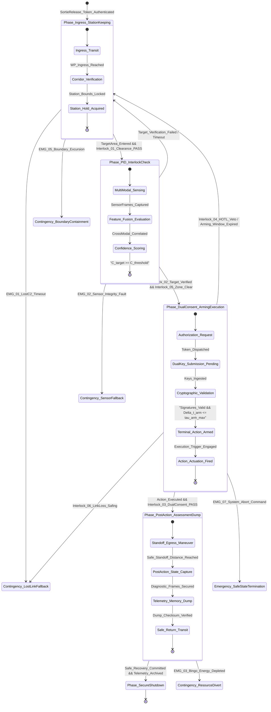

| Attribute | Value |
| :--- | :--- |
| **Title** | Multi-Threaded Operational Scenarios & System Timelines |
| **Version** | 1.0.0 |
| **Date** | 2026-09-02 |

## 9. Multi-Threaded Operational Scenarios & System Timelines

In accordance with ISO/IEC/IEEE 29148:2018 §6.4.2, OMG Unified Architecture Framework (UAF) v2.0 Operational Processes (Op-Pr), and MIL-STD-882E §4.3, this section specifies the multi-threaded operational scenarios, dynamic timelines, and deterministic decision gates governing the system lifecycle. All scenarios maintain 100% traceability to allocated operational activities (`OA-01`..`OA-08`), operational information exchanges (`OpTx-01`..`OpTx-08`), emergency containment triggers (`EMG-01`..`EMG-07`), and {{INTERLOCK_POLICY_NAME:Rules of Engagement (ROE)}} (`{{INTERLOCK_01_TAG:ROE-01}}`..`{{INTERLOCK_06_TAG:ROE-06}}`).

### 9.1 Scenario SCN-01: Nominal Lifecycle Thread
Scenario `SCN-01` describes an end-to-end nominal operational mission lifecycle from pre-operation staging through autonomous state trajectory execution, on-station mission processing, precision recovery, and controlled shutdown.

| Step Number | Elapsed Time (T+) | Stimulus / Trigger | Actor / Performer | Action Executed | Telemetry Stream | Decision Gate | Exception Branch | Exit Criterion |
| :--- | :--- | :--- | :--- | :--- | :--- | :--- | :--- | :--- |
| **1** | T0 + Delta_t0 | Operator energizes Operator Station and connects primary energy module | Maintenance Technician / Core Controller / Safety Watchdog | Executes automated Pre-Operation Built-In-Test (PBIT) suite per OA-01; verifies sensor biases, actuator end-stops, cryptographic root of trust, and battery state-of-charge (SoC) | OpTx-01, OpTx-06 (PBIT Status: 100% PASS; Sensor biases <= epsilon_bias_max; SoC >= SoC_launch_min; Bus Voltage nominal; Link SNR >= SNR_min) | Gate GNG-01: PBIT 100% PASS & Pre-Operation Interlocks Verified | If PBIT fails or SoC < SoC_launch_min, abort startup; latch diagnostic fault code and transition to Phase_MaintenanceMode | PBIT verification flag logged; Pre-Operation interlocks green; Root-of-trust validated |
| **2** | T0 + Delta_t1 | Operations Coordinator issues authenticated Sortie Release Token and mission profile | System Operator / Supervisory Operator Console | Ingests cryptographic mission plan, validates digital signatures, uploads waypoints and dynamic containment polygon to Core Controller via OpTx-07, arms system | OpTx-06, OpTx-07 (Controller Mode: Armed_Standby; Waypoints Loaded: N_wp; Containment Polygon Active: R_buffer declared; Checksum: MATCH) | Gate GNG-02: Mission Plan Checksum Match & Environmental Bounds Green | If signature invalid or perimeter outside allowable envelope, reject mission plan; remain in Phase_Startup | Cryptographic mission token verified; System armed in Armed_Standby; Supervisor gives execution clearance |
| **3** | T0 + Delta_t2 | System Operator depresses Dual-Action Execution Switch on Operator Console | Core Controller / Dynamic Actuator Subsystem | Initiates autonomous launch sequence per OA-02; commands actuators to transition profile, accelerates to nominal velocity v_nominal along ingress corridor | OpTx-01, OpTx-02, OpTx-06 (Speed: v_nominal; Trajectory Error e_track <= epsilon_track_max; Attitude rates nominal; Power draw nominal) | Gate GNG-03: Launch Corridor Clearance & Dynamic Stability Verified | If trajectory deviation e_track > epsilon_track_max or actuator fault detected, abort launch; transition to Contingency_BoundaryContainment / EMG-05 | Nominal operating speed v_nominal achieved; Ingress transition complete; Stable closed-loop tracking established |
| **4** | T0 + Delta_t3 | System reaches waypoint corridor boundary WP_ingress | Core Controller / Guidance Subsystem | Traverses multi-dimensional corridor towards operational station; continuously evaluates 4D state space boundaries and environmental limits per OA-05 | OpTx-01, OpTx-02, OpTx-06 (Cross-Track Error: e_xtrack <= epsilon_xtrack_max; Altitude/Position nominal; Wind/Disturbance <= Disturbance_limit) | Gate GNG-04: Corridor Containment & C2 Health Bounds Verified | If GNSS degraded or C2 SNR < SNR_min, execute PACE link failover per EMG-01 / EMG-02; divert to Contingency_DeadReckoning if unrecovered | Waypoint corridor traversed; System arrives at designated operational station perimeter |
| **5** | T0 + Delta_t4 | System crosses station boundary perimeter WP_station | Core Controller / Sensor Suite / Edge Processing Node | Transitions to operational station pattern; activates multi-modal payload data acquisition and edge neural inference per OA-03 and OA-04 | OpTx-04, OpTx-05, OpTx-06 (Payload Mode: ACTIVE_PROCESSING; Telemetry Stream: 100% nominal; Feature vectors emitted; Downlink rate nominal) | Gate GNG-05: Payload Health & Energy Reserve R(t) > R_bingo(t) Green | If payload sensor fault occurs or R(t) <= R_bingo(t), terminate on-station operations; initiate immediate egress per OA-06 / EMG-03 | Operational mission objectives satisfied; Sensor data streams verified; Continuous station keeping maintained |
| **6** | T0 + Delta_t5 | Primary operational objectives completed or Bingo energy threshold R_bingo reached | Core Controller / Guidance Core / Power & Resource Subsystem | Calculates optimal return trajectory corridor; stows payload into secure transit configuration; initiates nominal egress transit per OA-02 and OA-06 | OpTx-01, OpTx-02, OpTx-06 (Mode: Nominal_Egress_Transit; Distance to Base: d_base; Remaining Resource: R_current >= R_bingo; Payload: STOWED) | Gate GNG-06: Return Trajectory Clearance & Residual Energy Margin Verified | If headwind disturbance causes R_current < R_return + R_reserve, trigger secondary divert protocol to alternate landing site LZ-DIVERT-ALPHA per EMG-03 | Egress corridor entered; Standoff transit underway; Return trajectory checklist green |
| **7** | T0 + Delta_t6 | System arrives at primary recovery location boundary WP_recovery | Guidance Subsystem / Dynamic Actuator Subsystem / Recovery Beacon | Acquires precision recovery reference beacon, aligns vehicle axes, executes controlled deceleration profile to zero velocity, reaches safe rest at recovery node | OpTx-01, OpTx-02, OpTx-06 (Velocity: v_rest; Terminal alignment error: delta_pos <= epsilon_land; Actuator Power: ISOLATED; Structural loads nominal) | Gate GNG-07: Safe Recovery Alignment & Ground Sensor Confirmation | If recovery beacon lost or terminal misalignment exceeds epsilon_land_max, initiate automated go-around maneuver if energy permits, else execute precautionary stop per EMG-06 | Vehicle at rest (v_rest = 0.0); Actuators de-energized; Recovery interlocks committed |
| **8** | T0 + Delta_t7 | System at rest confirmation signal from ground sensors and internal IMU | Core Controller / Security Partition / Maintenance Technician | Executes post-operation secure shutdown per OA-08; offloads encrypted blackbox logs and high-bandwidth telemetry dump; zeroizes session crypto keys; enters safe power-down state | OpTx-06 (Mode: Phase_SecureShutdown; Telemetry Dump: 100% Complete; Crypto State: ZEROIZED; Hardware Safe Lock: ENGAGED) | Gate GNG-08: Telemetry Integrity Checksum & Cryptographic Zeroization Verified | If diagnostic log transfer interrupted or memory fault detected, latch fault flag on non-volatile indicator; require manual diagnostic tether | Blackbox logs secured; System fully de-energized; System ready for post-operation turnaround or maintenance |

---

### 9.2 Scenario SCN-02: High-Throughput State Tracking & Target Processing
Scenario `SCN-02` details the multi-threaded execution when real-time sensor processing detects a high-priority state feature, triggering high-resolution sensor payload tasking, centroid lock, coordinated standoff tracking, and telemetry streaming.

| Step Number | Elapsed Time (T+) | Stimulus / Trigger | Actor / Performer | Action Executed | Telemetry Stream | Decision Gate | Exception Branch | Exit Criterion |
| :--- | :--- | :--- | :--- | :--- | :--- | :--- | :--- | :--- |
| **1** | T0 + Delta_t1 | Anomaly signature or state feature detected by wide-angle sensor sweep | Sensor Suite Array / Edge Processing Node | Executes real-time edge neural inference model per OA-03; computes confidence score C_detect; extracts state coordinates p_target and bounding geometry | OpTx-04, OpTx-05 (Inference Confidence: C_detect >= C_detect_threshold; Target Coordinates: p_target; Bounding Box: [x, y, z, theta]; Frame Timestamp: t_stamp) | Gate GNG-T1: Detection Confidence C_detect >= C_detect_threshold & Coordinate Validity Verified | If confidence C_detect < C_detect_threshold or false-positive filter triggers, reject candidate detection; resume wide-angle sweep | Feature classification verified; Target Track ID assigned; Internal event emitted via OpTx-05 |
| **2** | T0 + Delta_t2 | Target Track ID and coordinate demand received over internal bus (OpTx-05) | Payload Actuator Subsystem / Edge Processing Node | Slews narrow-field high-resolution sensor payload to target coordinate vector p_target; closes optical/state centroid tracking loop at frequency f_track | OpTx-01, OpTx-05, OpTx-06 (Payload Gimbal Angles: [theta_az, theta_el]; Centroid Tracking Error: e_track <= epsilon_track_max; Tracking Mode: Centroid Lock Active) | Gate GNG-T2: Centroid Lock Stability & Gimbal Limit Margin Verified | If payload reaches mechanical end-stop or centroid lock lost for duration tau_lost, command Core Controller to adjust system heading | Narrow-field sensor locked on target; Centroid tracking stabilized within tracking window |
| **3** | T0 + Delta_t3 | Stable centroid lock maintained for duration tau_lock_stable | Edge Processing Node / Payload Specialist / Operator Station | Triggers multi-spectral high-fidelity coordinate extraction per OA-03; computes Target Location Error (TLE); packages precision metadata and streams high-rate telemetry to console via OpTx-05/OpTx-06 | OpTx-05, OpTx-06 (Target Range: d_target; TLE: e_TLE <= epsilon_TLE_max; High-Rate Stream Active: Throughput_stream; Target Metadata Tagged) | Gate GNG-T3: Target Location Error Bound e_TLE <= epsilon_TLE_max Verified | If TLE exceeds threshold epsilon_TLE_max due to sensor jitter, execute multi-frame filtering; alert operator if geometry remains degraded | Precision target state coordinates extracted; Telemetry stream verified on operator console; Operator notified |
| **4** | T0 + Delta_t4 | Mission Supervisor commands persistent target tracking from Operator Console | System Operator / Core Controller / Guidance Subsystem | Ingests supervisory tracking command via OpTx-07; computes dynamic standoff trajectory (coordinated standoff pattern of radius R_orbit centered on p_target) per OA-02 | OpTx-01, OpTx-02, OpTx-06 (Guidance Mode: Standoff_Tracking_Orbit; Orbit Radius: R_orbit +/- delta_R; Standoff Distance >= R_standoff_min; Sensor Lock: MAINTAINED) | Gate GNG-T4: Dynamic Standoff Boundary & Collision Margin Verified | If standoff orbit intersects keep-out zone or geofence boundary, clamp orbit geometry to allowable corridor and notify operator | Coordinated standoff orbit established; Continuous 360-degree high-throughput sensor tracking maintained |
| **5** | T0 + Delta_t5 | Continuous high-throughput data stream active over Primary Communications link | PACE Communications Modem / Supervisory Operator Console | Dynamically optimizes channel bandwidth allocation per OpTx-06; pipes high-resolution state stream to downstream analytical processing pipelines | OpTx-06 (Downlink Throughput: Throughput_stream >= Throughput_min; Packet Loss Rate <= 0.1%; Link Latency <= tau_latency_max; Data Quality: 100%) | Gate GNG-T5: Datalink Quality of Service (QoS) & Buffer Integrity Maintained | If link bandwidth degrades below threshold, trigger adaptive compression and throttle non-critical background telemetry | Downstream analytical systems receive synchronized telemetry stream; Target tracking dataset compiled |
| **6** | T0 + Delta_t6 | Mission Supervisor issues tracking termination command upon objective completion | Mission Supervisor / Core Controller / Payload Actuator Subsystem | Releases centroid tracking lock; stows payload to boresight reference position; re-engages nominal corridor navigation per OA-02; updates Bingo energy reserve | OpTx-01, OpTx-02, OpTx-06 (Mode: Nominal_Corridor_Navigation; Payload Mode: BORESIGHT_STOWED; Heading: WP_next; Residual Energy: R(t) >= R_bingo(t)) | Gate GNG-T6: Boresight Stow Verification & Corridor Resumption Clearance | If payload fails to stow or gimbal jam detected, lock actuator power and report degraded payload state; proceed with vehicle transit | Payload safely stowed; Nominal trajectory tracking resumed; Target engagement logged to non-volatile memory |

---

### 9.3 Scenario SCN-03: Degraded C2 Lost-Link & Autonomous Fallback Return
Scenario `SCN-03` defines the autonomous handling of primary communications failure, execution of PACE failover hierarchy, and fallback to deterministic lost-link return protocols.

| Step Number | Elapsed Time (T+) | Stimulus / Trigger | Actor / Performer | Action Executed | Telemetry Stream | Decision Gate | Exception Branch | Exit Criterion |
| :--- | :--- | :--- | :--- | :--- | :--- | :--- | :--- | :--- |
| **1** | T0 + Delta_t1 | Localized RF interference, jamming, or shadowing degrades Primary Point-to-Point datalink | PACE Communications Modem / Core Controller | Detects Primary link SNR dropping below SNR_threshold; detects consecutive lost heartbeat frames; starts Primary lost-link timer t_loss_primary | OpTx-06 (Primary Link Status: DEGRADED / TIMEOUT; Heartbeat Loss: t_loss >= tau_heartbeat_timeout_Primary; Active PACE Tier: Primary) | Gate GNG-C1: Primary Link Timeout Invariant tau_heartbeat_timeout_Primary Exceeded | If link SNR recovers before timeout expiration, reset lost-link timer; maintain Primary link | Primary datalink timeout declared; PACE automated failover sequence initiated |
| **2** | T0 + Delta_t2 | Primary link timeout threshold tau_heartbeat_timeout_Primary breached | PACE Datalink Router / Operator Console | Reroutes bidirectional C2 telemetry and control packets to Alternate encrypted network tunnel per CAP-03.2; initiates handshake verification | OpTx-06, OpTx-07 (Active Medium: Alternate_Network; Handshake Status: ESTABLISHED; Link Latency <= tau_C2_max; Downlink Bitrate nominal) | Gate GNG-C2: Alternate Network Cryptographic Handshake Verified | If Alternate handshake fails within tau_handshake_max, immediately fall through to Contingency narrowband channel | Alternate network tunnel active; Bidirectional supervisory control restored; Event logged |
| **3** | T0 + Delta_t3 | Environmental/infrastructure outage causes Alternate Network link failure | PACE Datalink Router / Core Controller | Detects loss of Alternate channel; falls back to Contingency robust narrowband RF command channel per CAP-03.3; throttles high-bandwidth payload data to preserve essential C2 bandwidth | OpTx-06 (Active Medium: Contingency_RF; Essential C2 Link: ACTIVE; Payload Stream: THROTTLED; Downlink: Essential State Telemetry Only) | Gate GNG-C3: Contingency Channel Essential Packet Flow Verified | If Contingency RF channel fails to initialize within tau_contingency_init, arm autonomous lost-link watchdog | Essential command link operational; Vehicle controllable via narrowband discrete commands |
| **4** | T0 + Delta_t4 | Complete signal loss across all PACE communication tiers exceeding total timeout tau_heartbeat_timeout_Contingency | Hardware Safety Watchdog / Deterministic Failsafe State Machine | Triggers canonical emergency event EMG-01 (Communications Timeout); latches failsafe mode Contingency_LostLinkFallback; enters autonomous holding pattern for duration tau_hold per OA-07 | OpTx-06 (Mode: Contingency_LostLinkFallback; Failsafe State: ACTIVE; Lost-Link Hold Timer: t_hold / tau_hold; Emergency Beacon: TRANSMITTING) | Gate GNG-C4: Total Lost-Link Timeout tau_heartbeat_timeout_Contingency Latch Confirmed | If C2 link reconnects on any tier during hold duration tau_hold, require authenticated operator re-link command to resume mission | Autonomous holding pattern established within safe corridor; Emergency beacon active; Hold timer running |
| **5** | T0 + Delta_t5 | Lost-link hold timer t_hold reaches maximum holding duration tau_hold without link recovery | Core Controller / Guidance Core / Power & Resource Subsystem | Evaluates remaining energy against Bingo return model; calculates autonomous deconfliction return trajectory along pre-surveyed clearance corridor to Primary Recovery Base | OpTx-01, OpTx-02, OpTx-06 (Mode: Autonomous_RTB_Transit; Heading: Direct Primary Recovery Base; Velocity: v_nominal; Trajectory: Verified Clearance Corridor) | Gate GNG-C5: Return Trajectory Deconfliction & Bingo Energy R(t) >= R_return Verified | If calculated energy R(t) < R_return, divert to nearest secondary recovery site LZ-DIVERT-ALPHA per EMG-03 | Autonomous return trajectory engaged; 100% boundary containment maintained along return corridor |
| **6** | T0 + Delta_t6 | System arrives at primary recovery base coordinates | Guidance Subsystem / Dynamic Actuator Subsystem / Ground Sensors | Acquires autonomous local recovery reference; executes precision alignment and deceleration; commits safe stop; isolates actuator power and latches failsafe lock | OpTx-06 (Location: Primary Recovery Base; Velocity: v_rest; Failsafe Lock: ENGAGED; Actuators: DE-ENERGIZED; System State: SAFE) | Gate GNG-C6: Zero-Velocity Rest State & Safe Power Isolation Confirmed | If terminal area obstructed, execute autonomous go-around to secondary recovery zone if energy permits, else execute controlled soft containment stop | Vehicle secured at base; All systems in safe un-powered state; Emergency event logged for post-operation maintenance |

---

### 9.4 Scenario SCN-04: Dynamic Geofence Boundary Divert
Scenario `SCN-04` covers the handling of dynamic environmental stress and unexpected keep-out zone insertion exceeding nominal limits, requiring closed-loop Bingo energy calculation and secondary divert execution.

| Step Number | Elapsed Time (T+) | Stimulus / Trigger | Actor / Performer | Action Executed | Telemetry Stream | Decision Gate | Exception Branch | Exit Criterion |
| :--- | :--- | :--- | :--- | :--- | :--- | :--- | :--- | :--- |
| **1** | T0 + Delta_t1 | External Data Service pushes dynamic keep-out zone update (OpTx-03) or severe localized environmental disturbance detected | Sensor Suite / External Data Service / Safety Watchdog | Ingests new dynamic geofence exclusion polygon Z_exclusion via OpTx-03 per OA-05; detects that current trajectory intersects newly declared keep-out boundary within distance d_proximity <= d_warning_buffer | OpTx-01, OpTx-03, OpTx-06 (Geofence Warning: ACTIVE; Distance to Keep-Out: d_proximity <= d_warning_buffer; Dynamic Exclusion Polygon: [p_poly1..p_polyN]) | Gate GNG-D1: Dynamic Geofence Warning Threshold d_proximity <= d_warning_buffer Breached | If updated exclusion zone is outside operational trajectory envelope, acknowledge update without altering trajectory plan | Dynamic geofence warning raised; Visual/acoustic alert transmitted to Operator Console; Divert evaluation triggered |
| **2** | T0 + Delta_t2 | Proximity warning triggers closed-loop trajectory recalculation | Power & Resource Subsystem / Guidance Subsystem | Evaluates available energy R(t) against revised reroute trajectory and adverse disturbance headwind; determines that rerouting around exclusion zone exceeds nominal return energy margin (R_current <= R_bingo) | OpTx-01, OpTx-06 (Resource SoC: R_current; Bingo Threshold: R_bingo; Energy Deficit Margin: Delta_E_deficit; Return Feasibility: INSUFFICIENT_FOR_PRIMARY) | Gate GNG-D2: Bingo Energy Condition R(t) <= R_bingo(t) Declared | If energy recalculation confirms sufficient margin (R_current > R_bingo + Delta_E_margin), execute nominal dynamic corridor re-routing around exclusion zone | Secondary divert protocol triggered; Candidate secondary recovery sites queried |
| **3** | T0 + Delta_t3 | Secondary divert protocol triggered per EMG-03 / EMG-05 | Core Controller / Guidance Core / System Operator | Queries pre-surveyed secondary divert database; evaluates wind-assisted descent path; selects optimal Secondary Divert Site LZ-DIVERT-ALPHA; computes deconflicted transit corridor | OpTx-06, OpTx-07 (Selected Divert Site: LZ-DIVERT-ALPHA; Divert Distance: d_divert; Required Energy: E_divert <= R_current - R_reserve; Terrain Clearance: VALID) | Gate GNG-D3: Divert Site Reachability & Statutory Reserve Ratio R_reserve >= 0.20 * R_capacity Verified | If candidate site unreachable, evaluate tertiary emergency containment site LZ-DIVERT-BETA; if none reachable, command immediate emergency stop per EMG-06 | Secondary divert waypoint loaded; Terrain and dynamic state clearance validated |
| **4** | T0 + Delta_t4 | Operator Console presents secondary divert trajectory to Mission Supervisor and Safety Supervisor | Mission Supervisor / System Operator / Core Controller | Operators submit authenticated divert execution command via OpTx-07; Core Controller transitions mode to Contingency_SecondaryDivert; initiates high-rate bank/turnaway maneuver into divert corridor | OpTx-01, OpTx-02, OpTx-06 (Controller Mode: Contingency_SecondaryDivert; Heading: Divert_Bearing; Lateral Separation to Exclusion Zone: d_sep >= d_containment_margin) | Gate GNG-D4: Authenticated Divert Command Signature Verified & Trajectory Alignment Confirmed | If operator fails to respond within timeout tau_supervisory_timeout, Core Controller autonomously commits secondary divert trajectory under HOTL authority | Vehicle aligned with secondary divert corridor; Dynamic exclusion boundary safely avoided |
| **5** | T0 + Delta_t5 | Vehicle transits secondary corridor towards LZ-DIVERT-ALPHA | Core Controller / Guidance Subsystem / Sensor Suite | Maintains energy-conserving speed profile v_optimal_glide per OA-02; continuously monitors proximity to terrain and geofence boundaries per OA-05; prepares recovery subsystems | OpTx-01, OpTx-02, OpTx-06 (Distance to LZ-DIVERT-ALPHA: d_lz; Speed: v_optimal_glide; SoC: R_current >= R_reserve; Boundary Status: INSIDE_CORRIDOR) | Gate GNG-D5: Approach Corridor Stability & Energy Reserve Preservation Verified | If unexpected obstacle detected in approach corridor, execute dynamic go-around or lateral obstacle avoidance within containment buffer | System enters terminal approach funnel of Secondary Divert Site LZ-DIVERT-ALPHA |
| **6** | T0 + Delta_t6 | System reaches terminal recovery proximity above LZ-DIVERT-ALPHA | Guidance Subsystem / Dynamic Actuator Subsystem / Ground Recovery Team | Executes precision deceleration, comes to safe rest at LZ-DIVERT-ALPHA with residual reserve energy R_residual >= 0.20 * R_capacity; latches safe state; broadcasts coordinates to recovery team | OpTx-06 (Location: LZ-DIVERT-ALPHA; Velocity: v_rest; Residual Reserve SoC >= 20.0%; System State: SAFE_CONTAINED; Recovery Beacon: ACTIVE) | Gate GNG-D6: Safe Stop Confirmed & Statutory Energy Reserve Ratio Maintained | If hard landing occurs, trigger structural accelerometer watchdog; log impact telemetry and deploy emergency locator beacon | Vehicle safely contained at secondary site; Zero geofence breaches; Recovery team dispatched |

---

### 9.5 Scenario SCN-05: Controlled Safety Interlock Action
Scenario `SCN-05` defines the formal multi-phase verification and execution of a controlled safety interlock and high-consequence action governed by MIL-STD-882E §4.4, {{INTERLOCK_01_TAG:ROE-01}} through {{INTERLOCK_06_TAG:ROE-06}}, multi-modal {{TARGET_VERIFICATION_PHRASE:positive identification}}, dual-consent cryptographic authorization, deterministic terminal execution, and post-action telemetry dump.

#### 9.5.1 Safety Interlock State Machine & Deterministic Transitions
The following Stateflow-compatible Mermaid state machine defines the deterministic phase transitions, guard conditions, and contingency branches governing Scenario `SCN-05`:

#### 9.5.2 Phase 1: Ingress & Station Keeping Execution Verification
Phase 1 verifies safe transit through designated operational corridors, environmental boundary monitoring, and establishment of a stable standoff station keeping orbit around the target area.

| Step Number | Elapsed Time (T+) | Stimulus / Trigger | Actor / Performer | Action Executed | Telemetry Stream | Decision Gate / Interlock Check | Exception Branch | Exit Criterion |
| :--- | :--- | :--- | :--- | :--- | :--- | :--- | :--- | :--- |
| **1** | T0 + Delta_t_p1_1 | High-consequence mission sortie authorization token verified; system enters ingress corridor | Guidance Subsystem / Core Controller | Navigates along secure ingress corridor per OA-02; maintains velocity v_nominal; checks dynamic clearance envelope | OpTx-01, OpTx-02, OpTx-06 (State: Nominal; Velocity: v_nominal; Cross-Track Error: e_track <= epsilon_track_max; Ingress Status: ACTIVE) | Gate GNG-P1.1 / {{INTERLOCK_01_TAG:ROE-01}}: Clearance Distance d_clearance >= d_min_clearance & Envelope Valid | If obstacle detected or boundary margin breached, execute immediate evasive maneuver per EMG-05 / EMG-06 | Waypoint corridor traversed; System arrives at operational target area boundary |
| **2** | T0 + Delta_t_p1_2 | System crosses operational engagement zone boundary WP_target_zone | Core Controller / Payload Actuator Subsystem | Un-stows multi-spectral sensor suite; commands gimbal to designated forward surveillance angle [theta_az0, theta_el0] | OpTx-01, OpTx-04, OpTx-06 (Payload Mode: DEPLOYED; Gimbal Angle: [theta_az0, theta_el0]; Payload Health: 100% PASS) | Gate GNG-P1.2: Payload Mechanical Limit & Gimbal Health Verified | If gimbal fails to deploy or reports sensor bias fault, lock gimbal in safe position and report degraded payload state | Sensor payload un-stowed; Multi-modal data feeds active |
| **3** | T0 + Delta_t_p1_3 | System reaches standoff station holding coordinates | Core Controller / Guidance Subsystem | Establishes stable standoff holding pattern (Radius = R_standoff); maintains continuous line-of-sight to target zone | OpTx-01, OpTx-02, OpTx-06 (Mode: Standoff_Station_Hold; Orbit Radius: R_standoff +/- delta_R; Speed: v_loiter; Attitude rates nominal) | Gate GNG-P1.3 / {{INTERLOCK_05_TAG:ROE-05}}: Standoff Distance to Protected Zone d_protected >= R_CDA_min Verified | If station orbit intersects dynamic exclusion buffer, expand orbit radius to satisfy R_CDA_min | Standoff orbit stabilized; Line-of-sight tracking locked; Station keeping verified |
| **4** | T0 + Delta_t_p1_4 | Station holding maintained for duration tau_station_check | Safety Watchdog / PACE Communications Transceiver | Assesses C2 link quality and environmental stability per OA-04 and OA-05; verifies link SNR and heartbeat margins | OpTx-06 (Primary SNR >= SNR_min; Heartbeat Age <= 0.2 s; Disturbance <= Disturbance_limit; Resource SoC >= SoC_mission_min) | Gate GNG-P1.4 / {{INTERLOCK_04_TAG:ROE-04}}: Operator Heartbeat Active & HOTL Veto Disarmed | If C2 link SNR < SNR_min or heartbeat timeout expires, safing interlock triggers; transition to Contingency_LostLinkFallback per {{INTERLOCK_06_TAG:ROE-06}} / EMG-01 | Ingress and station keeping phase exit criteria verified; System ready for positive identification phase |

#### 9.5.3 Phase 2: Positive Identification & Interlock Check Execution Verification
Phase 2 executes multi-modal sensor fusion, edge neural state classification, precision target coordinate extraction, and protected boundary clearance exclusion verification.

| Step Number | Elapsed Time (T+) | Stimulus / Trigger | Actor / Performer | Action Executed | Telemetry Stream | Decision Gate / Interlock Check | Exception Branch | Exit Criterion |
| :--- | :--- | :--- | :--- | :--- | :--- | :--- | :--- | :--- |
| **1** | T0 + Delta_t_p2_1 | Sensor payload detects target feature candidate within field of regard | Sensor Suite Array / Edge Processing Node | Acquires synchronized multi-modal sensor frames (EO optical, IR thermal, RF signature); timestamps frames with microsecond precision | OpTx-04, OpTx-05 (Sensor Frames Captured: Mode_A + Mode_B; Frame Sync Disparity <= 1.0 ms; Optical Quality: 100%) | Gate GNG-P2.1: Multi-Modal Sensor Frame Synchronization & Integrity Verified | If sensor frame dropout occurs, drop incomplete candidate frame; re-acquire in next sampling cycle | Synchronized multi-modal sensor dataset delivered to Edge Processing Node |
| **2** | T0 + Delta_t_p2_2 | Synchronized multi-modal frames received on internal payload bus | Edge Processing Node | Runs real-time sensor fusion and neural classification algorithms per OA-03; computes multi-modal confidence score C_target; extracts 3D coordinate vector p_target | OpTx-05, OpTx-06 (Target Confidence: C_target; Target Coordinates: p_target; Target Dimensions: [L, W, H]; Target Class: Validated) | Gate GNG-P2.2 / {{INTERLOCK_02_TAG:ROE-02}}: Multi-Modal Target Verification Score C_target >= C_threshold (C_target >= 0.95) Confirmed | If C_target < C_threshold, reject positive target verification; maintain standoff orbit and continue sensor sweep | Positive target verification confirmed; Target state locked with confidence exceeding normative threshold |
| **3** | T0 + Delta_t_p2_3 | Positive identification confirmed by Edge Processing Node | Guidance Subsystem / Sensor Fusion Engine | Calculates covariance matrix and Target Location Error (TLE); computes geodetic spatial uncertainty ellipsoid | OpTx-05, OpTx-06 (TLE Metric: e_TLE <= epsilon_TLE_max; Range: d_target; Covariance Trace: trace(P) <= sigma_P_max) | Gate GNG-P2.3: Target Location Error Bound e_TLE <= epsilon_TLE_max Verified | If e_TLE > epsilon_TLE_max due to sensor distance or geometry, execute tighter orbit maneuver to reduce range | Target 3D coordinates validated within strict spatial error bound |
| **4** | T0 + Delta_t_p2_4 | Precision coordinates p_target locked in Guidance Core | Core Controller / Safety Watchdog | Performs automated spatial boundary calculation against all declared protected zones Z_protected and non-participant exclusion zones | OpTx-01, OpTx-06 (Distance to Nearest Protected Zone: d_cda >= R_CDA_min; Boundary Status: INSIDE_ALLOWED_ZONE; Protected Zone Risk: ZERO) | Gate GNG-P2.4 / {{INTERLOCK_05_TAG:ROE-05}}: Minimum Standoff Separation d_cda >= R_CDA_min Verified | If target location is within R_CDA_min of any protected structure, interlock inhibits arming; action permanently blocked per {{INTERLOCK_05_TAG:ROE-05}} | Positive target verification and interlock check complete; Verification report packaged for dual-consent operator review |

#### 9.5.4 Phase 3: Dual-Consent Arming & Execution Verification
Phase 3 enforces the two-person cryptographic authorization rule, rolling arming time-window constraints, terminal guidance trajectory tracking, and controlled action commitment.

| Step Number | Elapsed Time (T+) | Stimulus / Trigger | Actor / Performer | Action Executed | Telemetry Stream | Decision Gate / Interlock Check | Exception Branch | Exit Criterion |
| :--- | :--- | :--- | :--- | :--- | :--- | :--- | :--- | :--- |
| **1** | T0 + Delta_t_p3_1 | Core Controller packages target verification telemetry and interlock status; transmits to Operator Console | Core Controller / Mission Supervisor / Safety Supervisor | Supervisory console displays high-resolution target verification stream, coordinate confidence, and safety zone clearance to Mission Supervisor and Safety Supervisor | OpTx-06 (Target Review Screen: ACTIVE; Interlock Status: ALL_GREEN; Consent Request: PENDING_DUAL_KEY) | Gate GNG-P3.1: Operator Situational Awareness Confirmation & Consent Prompt Ready | If either supervisor rejects target visual confirmation, supervisor asserts manual veto; returns system to station hold per {{INTERLOCK_04_TAG:ROE-04}} | Both supervisors presented with independent authorization token prompts |
| **2** | T0 + Delta_t_p3_2 | Mission Supervisor submits Key_A and Safety Supervisor submits Key_B on independent secure consoles | Mission Supervisor / Safety Supervisor / Core Controller Security Partition | Transmits cryptographic signature tokens Key_A and Key_B via OpTx-07; Security Partition verifies digital signatures, timestamp delta \|t_A - t_B\| <= Delta_t_arm_window, and boundary containment status | OpTx-06, OpTx-07 (Key_A Status: VALID; Key_B Status: VALID; Timestamp Disparity: \|t_A - t_B\| <= Delta_t_arm_window; Arming Gate: COMMITTED) | Gate GNG-P3.2 / {{INTERLOCK_03_TAG:ROE-03}}: Dual-Consent Cryptographic Signature Verification PASS | If either key invalid or timestamp delta \|t_A - t_B\| > Delta_t_arm_window, reject arming request; latch security lock | Dual-consent authorization validated; System transitions to Terminal_Action_Armed mode |
| **3** | T0 + Delta_t_p3_3 | System armed in Terminal_Action_Armed; terminal execution sequence initiates | Core Controller / Guidance Subsystem / Safety Watchdog | Computes and executes terminal guidance trajectory; closes guidance loop at f_control; monitors cross-track error and HOTL veto discrete line | OpTx-01, OpTx-02, OpTx-06 (Terminal Mode: ACTIVE_ARMED; Cross-Track Error: e_terminal <= epsilon_terminal_max; HOTL Veto: CLEAR) | Gate GNG-P3.3 / {{INTERLOCK_04_TAG:ROE-04}}: Terminal Tracking Error Bound & Continuous HOTL Heartbeat Active | If cross-track error e_terminal > epsilon_terminal_max or operator asserts HOTL abort switch, instantly disarm payload and abort trajectory | Terminal trajectory criteria satisfied; System reaches designated terminal actuation point |
| **4** | T0 + Delta_t_p3_4 | System reaches terminal execution trigger point within release window Delta_t_release | Core Controller / Actuator Subsystem / Safety Watchdog | Issues authenticated actuation command signal to payload actuator bus; delivers controlled action; commands immediate transition to safe post-action egress profile | OpTx-02, OpTx-06, OpTx-08 (Actuator Command: FIRED; Release Timestamp: t_release; Execution State: SUCCESS; Payload State: EXHAUSTED_SAFED) | Gate GNG-P3.4: Action Firing Confirmation & Actuator Power Safing | If actuator command fails to execute within Delta_t_release, command immediate disarm, power isolation, and egress climb | Controlled action committed; Actuator power de-energized; System transitions to safe egress trajectory |

#### 9.5.5 Phase 4: Post-Action Assessment & Telemetry Dump Execution Verification
Phase 4 executes the immediate safe standoff egress maneuver, captures multi-spectral post-action assessment data, offloads high-bandwidth telemetry dumps, and verifies residual Bingo energy for safe recovery.

| Step Number | Elapsed Time (T+) | Stimulus / Trigger | Actor / Performer | Action Executed | Telemetry Stream | Decision Gate / Interlock Check | Exception Branch | Exit Criterion |
| :--- | :--- | :--- | :--- | :--- | :--- | :--- | :--- | :--- |
| **1** | T0 + Delta_t_p4_1 | Controlled action execution confirmed by payload discrete sensor | Core Controller / Guidance Subsystem | Commands maximum allowable rate climb/turnaway along pre-cleared egress corridor; establishes safe standoff distance d_standoff >= R_standoff_safe | OpTx-01, OpTx-02, OpTx-06 (Mode: Safe_Egress_Maneuver; Egress Speed: v_egress; Standoff Distance: d_standoff >= R_standoff_safe; Boundary: INSIDE) | Gate GNG-P4.1: Safe Standoff Separation & Corridor Clearance Verified | If egress corridor obstructed, divert to secondary deconflicted escape heading | Safe standoff distance achieved; Egress corridor established; System clear of terminal action area |
| **2** | T0 + Delta_t_p4_2 | System stabilized in post-action standoff orbit | Sensor Suite / Edge Processing Node | Captures post-action high-resolution multi-spectral imagery and sensor telemetry of action site; computes post-action state transition metrics per OA-03 | OpTx-04, OpTx-05, OpTx-06 (Post-Action Assessment: COMPLETE; Feature Changes Detected: True; Sensor Imagery Streamed; Assessment Confidence >= 0.90) | Gate GNG-P4.2: Post-Action Sensor Image Capture & Quality Verification | If sensor field of view obscured by particulate/dust, hold standoff orbit for duration tau_clear | Comprehensive post-action assessment dataset recorded; Visual confirmation streamed to operator console |
| **3** | T0 + Delta_t_p4_3 | Post-action assessment data compiled in non-volatile flash memory | PACE Communications Transceiver / Security Partition / Operator Console | Initiates high-bandwidth cryptographic telemetry dump via OpTx-06; offloads full-rate raw sensor logs, interlock timestamps, and guidance history | OpTx-06 (Telemetry Dump Status: IN_PROGRESS / 100% COMPLETE; Offload Throughput: Throughput_dump; Checksum: MATCH) | Gate GNG-P4.3: Telemetry Offload Checksum Match & Zeroization Flag Verified | If datalink bandwidth throttled, prioritize cryptographic audit log over raw video frames; queue remaining frames for ground tether | Full execution telemetry offloaded to ground station; Cryptographic audit trail archived |
| **4** | T0 + Delta_t_p4_4 | Telemetry dump verified; Mission Supervisor issues return transit order | Power & Resource Subsystem / Core Controller / Guidance Core | Calculates residual energy R(t); confirms R(t) >= R_bingo(t); engages nominal return-to-base corridor navigation per OA-02 and OA-06 | OpTx-01, OpTx-02, OpTx-06 (Mode: Autonomous_RTB_Transit; Heading: Base_Bearing; Residual Energy: R(t) >= R_bingo(t); Payload: SAFED_STOWED) | Gate GNG-P4.4 / {{INTERLOCK_06_TAG:ROE-06}}: Residual Energy R(t) >= R_bingo(t) & Base Recovery Route Green | If residual energy R(t) < R_bingo(t) due to extended station time, initiate divert to Secondary Recovery Site LZ-DIVERT-ALPHA per EMG-03 | System safely in transit to recovery location; Post-action audit logs secured; SCN-05 thread completed |
