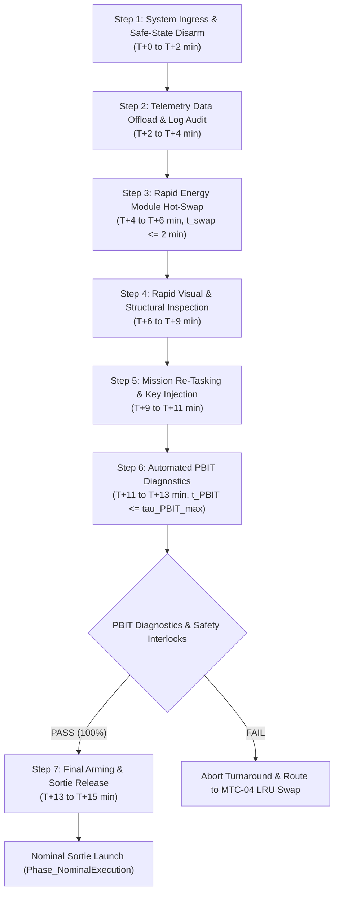

| Attribute | Value |
| :--- | :--- |
| **Title** | Maintenance & Support Equipment (SE) Concepts |
| **Version** | 1.0.0 |
| **Date** | 2026-09-03 |
| **Traceability References** | Fixes #124, #140, #141 |

## 10. Maintenance & Support Equipment (SE) Concepts

### 10.1 Three-Tier Maintenance Model (O-Level, I-Level, D-Level)
The maintenance and sustainment concept is structured into three discrete, formalized tiers adhering to systems engineering maintenance standards (ISO/IEC/IEEE 29148:2018 §5.2.4, INCOSE SEH v5.0 §3.2, MIL-HDBK-470A, and MIL-STD-882E §4.3) (Fixes #124, #140, #141):

| O-Level (Organizational) | I-Level (Intermediate) | D-Level (Depot / Factory) |
| :--- | :--- | :--- |
| Pre/Post-operation inspection | Sensor alignment & calibration | Structural non-destructive inspection |
| Rapid resource module hot-swap | Actuator component replacement & testing | Motor & actuator overhaul & balancing |
| Fastener torque verification | Firmware configuration & security rollover | Complete controller re-certification |
| Visual structural integrity check | Modular LRU swap (t <= tau_swap_LRU) | Full environmental stress screening |

1. **Organizational-Level (O-Level) Maintenance:**
   - **Scope & Location:** Executed directly at the operating base or field staging area by certified Maintenance Technicians (`UC-04`).
   - **Activities:**
     - Pre-operation visual structural walkaround checking enclosure integrity and sensor cleanliness.
     - Automated power-on Built-In-Test (PBIT) diagnostics executed via the operator terminal in $t_{\mathrm{PBIT}} \le \tau_{\text{PBIT\_max}}$.
     - Rapid tool-less resource module swapping using keyed, hot-swappable smart battery modules ($t_{\text{swap}} \le \tau_{\text{swap\_battery}}$).
     - Fastener torque verification using calibrated digital torque drivers matching specified limits $\tau_{\mathrm{torque}} \pm \Delta \tau_{\mathrm{torque}}$.
     - Post-operation data log offloading and system cleaning.

2. **Intermediate-Level (I-Level) Maintenance:**
   - **Scope & Location:** Conducted at regional maintenance shelters or field workshops equipped with intermediate diagnostic tooling.
   - **Activities:**
     - Replacement of Line Replaceable Units (LRUs) including controllers, RF transceivers, speed controllers, and sensor payloads (modular replacement time $t_{\text{LRU\_swap}} \le \tau_{\text{swap\_LRU}}$).
     - Multi-axis sensor alignment and calibration using field calibration fixtures.
     - Actuator dynamic load testing, potentiometer calibration, and linkage rigging.
     - Firmware updates and cryptographic security key rollover following formal configuration management procedures.

3. **Depot-Level (D-Level) Maintenance:**
   - **Scope & Location:** Performed exclusively at the centralized factory manufacturing facility or certified depot repair overhaul center.
   - **Activities:**
     - Deep structural non-destructive inspection (NDI) utilizing phased-array ultrasonic testing to detect internal delamination or micro-cracking.
     - Actuator motor bearing replacement, rewinding, and dynamic balancing.
     - Complete electronic circuit board-level repair, soldering inspection, and environmental stress screening (ESS).
     - Complete system recalibration, certification testing, and factory acceptance testing.

#### 10.1.1 Formal Maintenance Task Cards (MTC-01 through MTC-05)
In accordance with ISO/IEC/IEEE 29148:2018 §5.2.4 and MIL-STD-882E §4.3, all lifecycle servicing, turnaround, inspection, overhaul, and quarantine actions are governed by formal Maintenance Task Cards (MTC) (Fixes #124, #140, #141):

| Task Card ID | Task Card Title & Scope | Maintenance Tier | Execution Trigger & Interval | Target SLA Duration | Required Qualifications & Tooling | Sign-Off Authority & Verification Protocol | Public Clause Citation |
| :--- | :--- | :--- | :--- | :--- | :--- | :--- | :--- |
| **MTC-01** | Pre-Sortie / Pre-Operation Inspection | O-Level (Organizational) | Prior to each operational sortie launch (T0 - Delta_t_pre) | t_insp <= 10 min | Certified Maintenance Technician (UC-04); Field Tool Kit (FTK-01) | Maintenance Technician sign-off on SE-02; PBIT 100% PASS verification | ISO/IEC/IEEE 29148:2018 §5.2.4 |
| **MTC-01A** | Rapid Sortie Turnaround (15-min SLA) | O-Level (Organizational) | Consecutive operational sorties during active deployment | t_turnaround <= {{RAPID_TURNAROUND_SLA_MIN}} min | Maintenance Technician (UC-04); Resource Hub (SE-01); Terminal (SE-02) | Dual-Technician sign-off; BMS state-of-charge check; Sortie Release Token | INCOSE SEH v5.0 §3.2 |
| **MTC-02** | Scheduled 50-Hour Phase Check | I-Level (Intermediate) | Cumulative runtime reaching {{PHASE_CHECK_INTERVAL_HOURS}} operating hours (+/- 5 hr) | t_phase <= 120 min | Senior Maintenance Specialist; Test Box (SE-04); Alignment Rig (SE-05) | Intermediate Maintenance Certificate; Diagnostic calibration record | ISO/IEC/IEEE 29148:2018 §6.4.2 |
| **MTC-03** | 100-Hour Major Overhaul | D-Level (Depot / Factory) | Cumulative runtime reaching {{OVERHAUL_INTERVAL_HOURS}} operating hours (+/- 10 hr) | t_overhaul <= 24 hr | Factory Depot Engineering Team; Phased-Array NDI; ESS Test Chamber | Factory Recertification Certificate; NDI structural inspection dossier | MIL-STD-1629A Method 101 |
| **MTC-04** | Unscheduled Field LRU Swap | I-Level / O-Level Workshop | On-condition upon diagnostic BIT failure or anomaly alert | t_swap <= tau_swap_LRU (2 to 10 min) | Field Maintenance Technician; Field Spares Kit (FSK-01); Test Box (SE-04) | Automated bus discovery PASS; Configuration hash verification log | MIL-HDBK-470A §4.3 |
| **MTC-05** | Post-Incident Blackbox Quarantine | I-Level / Safety Authority | Mandatory after any emergency containment state (EMG-01..07) | t_quarantine <= {{BLACKBOX_QUARANTINE_SLA_MIN}} min | System Safety Officer; Data Terminal (SE-02); Tamper-Sealed Kit | Safety Officer Incident Audit Record; Non-volatile cryptographic dump | MIL-STD-882E Task 205 |

#### 10.1.2 Rapid Sortie Turnaround Workflow & 7-Step Protocol
To achieve sustained high-tempo operational availability ($N_{\mathrm{sorties}} \ge N_{\mathrm{target}}$), the system enforces a strict 15-minute Service Level Agreement (SLA) rapid turnaround protocol ($t_{\text{turnaround}} \le \tau_{\text{turnaround\_max}} = {{RAPID_TURNAROUND_SLA_MIN}}\text{ min}$) executed through the following 7-step sequence (Fixes #124, #140):

1. **Step 1: System Recovery & Ingress Safe-Area Positioning ($T_0 + 0\text{ min}$ to $T_0 + 2\text{ min}$):**
   - System completes recovery alignment and transitions to `Phase_SecureShutdown`.
   - Maintenance Technician attaches ESD grounding strap and verifies high-voltage bus de-energization.
   - Safety exclusion perimeter is established around the staging platform.
2. **Step 2: Telemetry Data Offload & Non-Volatile Log Dump ($T_0 + 2\text{ min}$ to $T_0 + 4\text{ min}$):**
   - High-speed diagnostic interface connects to the Field Control Terminal (`SE-02`).
   - Non-volatile system telemetry, sensor logs, and watchdog audit traces are offloaded and cryptographically hashed.
   - Automated fault-scan algorithm verifies zero recorded unmitigated anomaly flags during the preceding sortie.
3. **Step 3: Rapid Tool-less Energy / Battery Module Hot-Swap ($T_0 + 4\text{ min}$ to $T_0 + 6\text{ min}$):**
   - Maintenance Technician disengages the primary quick-release retention latches.
   - Depleted smart energy module is withdrawn and transferred to the Multi-Bay Charging Hub (`SE-01`).
   - Fully charged, balanced smart energy module ($\text{SoC} \ge 95\%$) is inserted along keyed guide rails until positive mechanical latch engagement is confirmed ($t_{\text{swap}} \le \tau_{\text{swap\_battery}} = {{SWAP_TIME_BATTERY_MAX_MIN}}\text{ min}$).
4. **Step 4: Rapid Visual Inspection & Mechanical Check ($T_0 + 6\text{ min}$ to $T_0 + 9\text{ min}$):**
   - 360-degree walkaround visual inspection verifying enclosure integrity, lens cleanliness, seal compression, and fastener tightness.
   - Actuator control linkages and mechanical interfaces checked for zero foreign object debris (FOD) and nominal play.
5. **Step 5: Mission Re-Tasking & Cryptographic Plan Injection ($T_0 + 9\text{ min}$ to $T_0 + 11\text{ min}$):**
   - Next-phase operational mission plan, geofence boundary parameters, and Bingo energy thresholds are uploaded via `SE-02`.
   - Authenticated Sortie Release Token and mission encryption keys are injected into the core guidance controller.
6. **Step 6: Automated Power-On Built-In-Test (PBIT) Diagnostics ($T_0 + 11\text{ min}$ to $T_0 + 13\text{ min}$):**
   - Automated PBIT initiated via operator terminal ($t_{\mathrm{PBIT}} \le \tau_{\text{PBIT\_max}}$).
   - Verifies multi-channel sensor parity, actuator sweep response, C2 communication link margins, and safety watchdog health.
   - All pre-operation go/no-go gates (`GNG-01` through `GNG-05`) must evaluate strictly to `TRUE`.
7. **Step 7: Final Arming, Crew Clear & Sortie Release ($T_0 + 13\text{ min}$ to $T_0 + 15\text{ min}$):**
   - Diagnostic umbilical disconnected; weather-sealed port covers secured.
   - Maintenance Technician confirms all interlocks green, signs electronic sortie authorization, and clears launch area.
   - System transitions to `Phase_NominalExecution` within the 15-minute SLA envelope ($t_{\mathrm{turnaround}} \le {{RAPID_TURNAROUND_SLA_MIN}}\text{ min}$).

#### 10.1.3 Tool-less Modular Line Replaceable Unit (LRU) Replacement Procedures
To guarantee rapid unscheduled field repair capability (`MTC-04`), primary subsystems are architected as tool-less modular Line Replaceable Units (LRUs) with strict replacement time bounds ($t_{\text{swap}} \le \tau_{\text{swap\_LRU}}$) (Fixes #140, #141):

| LRU Designation | Subsystem Nomenclature | Modular Interface & Latching Type | Max Swap Time | Tooling Requirement | Post-Swap Verification Protocol |
| :--- | :--- | :--- | :--- | :--- | :--- |
| **LRU-01: Core Guidance Computer** | Core Processing & Guidance Module | Ruggedized ZIF Cam-Lock Backplane | t_swap <= {{SWAP_TIME_FC_MAX_MIN}} min | Tool-less (Manual Cam Lever) | Automated Firmware Hash & PBIT |
| **LRU-02: Battery / Energy Module** | Smart Modular Energy Pack | Polarized Keyed Blind-Mate Rail | t_swap <= {{SWAP_TIME_BATTERY_MAX_MIN}} min | Tool-less (Spring Detent Latch) | BMS Bus Handshake & SoC Telemetry |
| **LRU-03: Primary Sensor Payload** | Multi-Modal Sensor Subsystem | Kinematic Mount with Bayonet Collar | t_swap <= {{SWAP_TIME_PAYLOAD_MAX_MIN}} min | Tool-less (Quick-Disconnect Ring) | Bus Enumeration & Boresight Check |
| **LRU-04: Actuator / Motor Assembly** | Dynamic Actuator Module | Precision Index Dowel & Bayonet Ring | t_swap <= {{SWAP_TIME_ACTUATOR_MAX_MIN}} min | Tool-less (Positive-Stop Clamp) | Actuator Sweep & Dynamic Response |

1. **Core Guidance Computer Module Replacement ($t_{\text{swap}} \le \tau_{\text{swap\_FC}} = {{SWAP_TIME_FC_MAX_MIN}}\text{ min}$):**
   - **Step 1 (De-Energize & Access):** Verify system de-energization; rotate quarter-turn captive quick-release avionics bay fasteners to open access hatch.
   - **Step 2 (Ejection):** Actuate the zero-insertion-force (ZIF) cam-lock lever to decouple the guidance computer module from the ruggedized backplane connector.
   - **Step 3 (Insertion & Latching):** Slide the replacement guidance computer module into keyed card guide rails; depress ZIF cam-lock lever until fully seated and mechanical retention locks engage.
   - **Step 4 (Verification):** Close avionics bay hatch; energize system; confirm automated firmware cryptographic hash match and backplane bus discovery in $t \le 60\text{ s}$.
2. **Battery / Energy Module Replacement ($t_{\text{swap}} \le \tau_{\text{swap\_battery}} = {{SWAP_TIME_BATTERY_MAX_MIN}}\text{ min}$):**
   - **Step 1 (Release):** Depress dual spring-loaded mechanical retention latch tabs on the energy compartment bulkhead.
   - **Step 2 (Extraction):** Slide the depleted module along low-friction guide rails; blind-mate high-current power connector disconnects with arc-suppression.
   - **Step 3 (Insertion):** Insert replacement smart energy module along polarized keyways until blind-mate connectors engage and spring latches click into locked detents.
   - **Step 4 (Verification):** BMS digital bus handshakes automatically with Core Controller; verify state-of-charge ($\text{SoC} \ge 95\%$) and cell balance on terminal display.
3. **Primary Sensor Payload Replacement ($t_{\text{swap}} \le \tau_{\text{swap\_payload}} = {{SWAP_TIME_PAYLOAD_MAX_MIN}}\text{ min}$):**
   - **Step 1 (Unlock):** Rotate quick-disconnect mechanical payload locking collar counter-clockwise by $45^\circ$; release blind-mate high-speed data umbilical.
   - **Step 2 (Demount):** Disengage payload chassis from kinematic mounting pins and withdraw unit.
   - **Step 3 (Mount Replacement):** Seat replacement sensor payload onto precision kinematic locating dowels; rotate locking collar clockwise by $45^\circ$ until primary detent clicks.
   - **Step 4 (Verification):** Re-engage blind-mate umbilical; execute automated sensor enumeration test and optical/inertial boresight calibration check via `SE-05` in $t \le 180\text{ s}$.
4. **Actuator / Motor Assembly Replacement ($t_{\text{swap}} \le \tau_{\text{swap\_actuator}} = {{SWAP_TIME_ACTUATOR_MAX_MIN}}\text{ min}$):**
   - **Step 1 (Interface Release):** Release quick-release mechanical clamp ring securing the actuator housing to structural mounting interface.
   - **Step 2 (Harness Disconnect):** Disconnect hermetic circular blind-mate power and feedback harness using single-twist quick-break coupling.
   - **Step 3 (Extraction & Insertion):** Withdraw faulted actuator module; align replacement matched actuator module with structural alignment keyway; seat into place.
   - **Step 4 (Locking & Harness Reconnect):** Re-couple circular harness until positive click; tighten mechanical clamp ring to positive mechanical stop.
   - **Step 5 (Verification):** Initiate automated actuator range-of-motion sweep, backlash calibration, and closed-loop step response verification via `SE-04`.

### 10.2 Support Equipment (SE) Taxonomy
The Support Equipment (SE) suite provides all electrical, mechanical, diagnostic, and calibration interfaces required for operational staging, rapid turnaround, and field sustainment (Fixes #124, #141):

| SE Identifier | SE Nomenclature | Functional Purpose & Capabilities | Operating Constraints & Ratings | Public Standard Baseline |
| :--- | :--- | :--- | :--- | :--- |
| **SE-01** | Multi-Bay Intelligent Resource Management Hub | Simultaneously balances, conditions, and charges multiple smart resource modules at charge rate {{BATTERY_CHARGE_C_RATE}}; incorporates fire-suppressed containment chamber, thermal runaway isolation, and CAN/SMBus state-of-health logging. | Input: Multi-source 100-240 VAC / 12-28 VDC; Charge Time: {{BATTERY_CHARGE_TIME_HOURS}}h; Rating: {{INGRESS_PROTECTION_RATING}}; Operating Temp: [{{OPERATING_TEMPERATURE_MIN_C}}°C, {{OPERATING_TEMPERATURE_MAX_C}}°C] | IEC 62133-2 / UN 38.3 |
| **SE-02** | Ruggedized Field Control Terminal | Dual-screen daylight-readable (>= {{TERMINAL_DISPLAY_LUMINANCE_NITS}} nits) field terminal executing supervisory control, telemetry display, diagnostic PBIT execution, and cryptographic mission plan injection. | Operating Temp: [{{OPERATING_TEMPERATURE_MIN_C}}°C, {{OPERATING_TEMPERATURE_MAX_C}}°C]; Battery Life: {{SUPPORT_EQUIPMENT_BATTERY_HOURS}}h; Rating: {{INGRESS_PROTECTION_RATING}}; MIL-STD-810H Shock/Vibration | MIL-STD-810H / NIST SP 800-82r3 |
| **SE-03** | Telescoping Antenna Transceiver Mast | Deployable pneumatic/mechanical mast with multi-axis motorized tracking positioner for high-gain directional PACE communication links and mesh relay nodes. | Mast Height: {{MAST_HEIGHT_M}} m; Deployment Time: t_deploy; Disturbance Limit: v_dist_mast; Azimuth: 360 deg Continuous Span | MIL-STD-810H / IEEE Std 1558-2020 |
| **SE-04** | Environmental Diagnostic Test Unit | Precision diagnostic pressure, temperature, and environmental sensor test unit used to verify sensor calibration, telemetry bus ports, and enclosure seal integrity. | Accuracy: +/- epsilon_diag; Operating Range: [p_min, p_max]; Portable ruggedized chassis; Battery powered | ISO/IEC 17025 / MIL-STD-810H |
| **SE-05** | Precision Sensor Alignment Rig | Optical collimator and reference alignment fixture for zeroing payload sensor axes and optical boresights against the physical reference frame. | Angular Precision: epsilon_align (<= {{SENSOR_ALIGNMENT_TOLERANCE_MRAD}} mrad); Field-portable kinematic mounting frame | ISO/IEC 17025 §7.6 / IEEE Std 1558-2020 |
| **SE-06** | Automated Calibration & Metrology Bench | Stationary/shelter calibration standard for dynamic actuator torque calibration, multi-axis inertial sensor turntable characterization, and RF spectrum validation. | Metrology Standard Traceability: ISO/IEC 17025; Torque Accuracy: +/- epsilon_torque; Inertial Slew Precision: epsilon_slew | ISO/IEC 17025:2017 / NIST Traceable |

#### 10.2.1 ISO/IEC 17025 Support Equipment Calibration Matrix
In accordance with ISO/IEC 17025:2017 §6.5 (Metrological Traceability) and ISO/IEC/IEEE 29148:2018 §5.2.4, all support equipment, diagnostic test boxes, torque limiters, and alignment fixtures maintain unbroken traceability to national metrological standards (Fixes #124, #141):

| Equipment ID | Equipment Nomenclature | Parameter / Physical Quantity Measured | Calibration Interval | Reference Standards Baseline | Allowable Tolerance Limits | Recalibration Triggers |
| :--- | :--- | :--- | :--- | :--- | :--- | :--- |
| **SE-01** | Multi-Bay Resource Management Hub | Voltage, Current, Temperature, Balancing Delta | 12 Months | NIST Traceable Multi-Meter / ISO/IEC 17025 Cal Standard | Delta_V <= +/- 0.01 V; Delta_I <= +/- 0.05 A; Delta_T <= +/- 1.0 degC | Cell over-voltage anomaly, charger firmware update, or annual expiration |
| **SE-02** | Ruggedized Field Control Terminal | Clock Synchronization, RF Power, Display Luminance | 12 Months | UTC (NIST) Time Standard / IEEE Std 1588 PTP / IEEE 802.3 | Time Skew Delta_t <= 1.0 ms; RF Output Power <= +/- 0.5 dBm | RTC battery replacement, system OS re-image, or time drift alarm |
| **SE-03** | Antenna Transceiver Mast & Tracker | Azimuth/Elevation Pointing Angle, Slew Rate | 6 Months | Optical Theodolite / Calibrated Digital Inclinometer | Angular Error Delta_theta <= 0.1 deg; Slew Rate Error <= 2.0% | Mast physical drop/shock, motor gear backlash alert, or semi-annual schedule |
| **SE-04** | Environmental Diagnostic Test Unit | Pressure, Temperature, Flow Rate, Seal Leak Rate | 6 Months | Deadweight Tester / Primary Temperature & Pressure Standard | Delta_p <= +/- 0.1 hPa; Delta_T <= +/- 0.2 degC; Leak Rate <= 0.01 sccm | Pressure transducer zero drift > limit, physical shock, or semi-annual schedule |
| **SE-05** | Precision Sensor Alignment Rig | Optical Collimation Angle, Kinematic Pin Alignment | 12 Months | NIST Optical Autocollimator / Granite Master Surface | Optical Alignment Delta_phi <= 0.05 mrad; Pin Orthogonality <= 0.01 mm | Physical drop/shock > 5g, fixture frame deformation, or annual schedule |
| **SE-06** | Automated Calibration & Metrology Bench | Torque, Inertial Angular Rate, Acceleration Scale Factor | 12 Months | Primary National Metrology Standards / ISO/IEC 17025 Lab | Torque Delta_tau <= +/- 0.1% FS; Rate Error <= 0.01 deg/s | Load cell zero-offset breach, annual lab audit, or hardware component replacement |
| **FTK-01** | Digital Torque Limiter Suite | Mechanical Fastener Torque (tau_torque) | 6 Months | ISO 6789-1:2017 / NIST Torque Standard | Delta_tau <= +/- 4.0% of setting | Mechanical drop, torque overload trip > 120% FS, or semi-annual cycle |

1. **Metrological Traceability Invariant:** Every calibration measurement must trace to an unbroken chain of comparisons back to National Metrology Institutes (e.g., NIST, PTB, NPL) with documented measurement uncertainties per ISO/IEC 17025:2017 §6.5.
2. **Tamper-Evident Certification Labeling:** Calibrated GSE units display physical tamper-evident inspection seals recording: Calibration Date, Calibration Certificate Number, Calibration Expiration Date, and Certifying Laboratory ID.
3. **Out-of-Tolerance Quarantine Protocol:** Any Support Equipment item exceeding allowable tolerance limits, sustaining physical impact shock, or with expired certification is immediately tagged with a physical lockout tag ("QUARANTINED - DO NOT USE") and isolated from operational service.

### 10.3 Calibration Fixtures & Sensor Alignment Rigs
- **Multi-Axis Inertial Calibration Fixture:** Used during I-Level calibration to verify gyroscopic scale factors, accelerometer bias drift, and thermal compensation polynomials over $[T_{\text{op\_min}}, T_{\text{op\_max}}]$.
- **Magnetic & Heading Calibration Base:** Non-magnetic designated field fixture utilized to calibrate soft-iron and hard-iron magnetometer compensation vectors.
- **Optical & Payload Boresight Target Board:** Precision retro-reflective collimator array positioned at standardized optical distance $d_{\mathrm{boresight}}$ to verify angular alignment between primary sensor boresights and vehicle reference frame.

### 10.4 Ruggedized Transit Cases & Environmental Storage
- All system elements are enclosed in high-impact transit cases with pressure equalization valves and custom closed-cell foam inserts.
- Built-in humidity indicator cards and desiccant ports ensure relative humidity inside storage containers remains below $\text{RH}_{\text{storage\_max}}$ during transport.
- Cases incorporate shock-attenuating elastomeric corner bumpers certified to MIL-STD-810H Method 516.8 (Transit Drop).

### 10.5 Field Maintenance Tooling & Spares Provisioning
- **Standard Field Tool Kit (FTK-01):** Includes calibrated digital torque limiters ($\tau_{\mathrm{min}}$ to $\tau_{\mathrm{max}}$), ESD-grounding wrist straps, connector pin extraction tools, optical lens cleaning kits, and diagnostic bus analyzer dongles.
- **Authorized Field Spares Kit (FSK-01):** Pre-packaged spares allocation supporting the operational endurance window $t_{\text{spares\_endurance}}$ of autonomous operations (includes matched mechanical components, motor sets, sensor probes, replacement seals, and spare fasteners).
- **Consumable Management:** Hermetically sealed replacement O-rings, desiccant cartridges, conformal seal grease, and fastener sets packaged in serialized tamper-evident bags with expiration date tracking.
