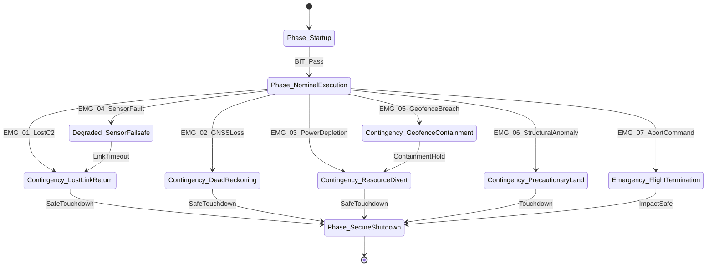

| Attribute | Value |
| :--- | :--- |
| **Title** | 7-Row Emergency Decision & Contingency Matrix |
| **Version** | 1.0.0 |
| **Date** | 2026-09-02 |

## 12. 7-Row Emergency Decision & Contingency Matrix

In accordance with MIL-STD-882E §4.3 and safety-critical deterministic control requirements, the system incorporates a 7-Row Emergency Decision & Contingency Matrix. The deterministic failsafe state machine provides autonomous containment timing guarantees ($t_{\mathrm{resp}} \le \tau_{\mathrm{deadline}}$) across all canonical contingency triggers.

| Trigger ID | Contingency Trigger Event | Anomaly Detection Mechanism | Automated Containment Action | Primary Failsafe State | Max Response Time | HITL Authority Role |
| :--- | :--- | :--- | :--- | :--- | :--- | :--- |
| EMG-01 | Communications Timeout | Heartbeat loss duration Delta_t_loss > tau_heartbeat_timeout across active communication tiers | Switches to autonomous lost-link hold pattern (tau_hold); if link unrecovered, initiates autonomous Return-to-Base (RTB) trajectory | `Contingency_LostLinkFallback` | t_resp <= tau_deadline_C2 | Supervisory / Manual Override via Emergency Link |
| EMG-02 | Sensor Integrity Fault | State estimation error / cross-channel disparity Delta_s > Delta_s_threshold lasting Delta_t > tau_fault_persist | Isolates faulty sensor channel via voting logic; switches to dead-reckoning state estimation; sets speed to v_degraded | `Contingency_SensorFallback` | t_resp <= tau_deadline_sensor | Supervisory / Command Hold or Divert |
| EMG-03 | Critical Resource Depletion | Measured energy/resource level R(t) <= R_threshold(t) | Re-distributes power bus; throttles non-essential payloads; executes optimal resource-conserving transit to nearest divert site | `Contingency_ResourceDivert` | t_resp <= tau_deadline_resource | Informed / Automated Advisory |
| EMG-04 | Controller Processing Fault | Hardware watchdog timeout or control loop task deadline breach exceeding tau_deadline_task | Triggers failover to redundant backup controller; isolates faulted software partition; logs diagnostic fault signature | `Degraded_ControllerFailsafe` | t_resp <= tau_deadline_controller | Supervisory / Precautionary Recovery Order |
| EMG-05 | Operational Boundary Excursion | State estimator indicates vehicle proximity d_boundary <= d_containment_margin to hard state containment boundary | Commands immediate autonomous maximum-rate boundary reversal maneuver (180 deg turnaround); applies emergency deceleration | `Contingency_BoundaryContainment` | t_resp <= tau_deadline_boundary | Supervisory / Manual Override Authority |
| EMG-06 | Collision/Interference Hazard | Proximity sensor detects external entity or hazard breaching separation envelope (D_hazard <= D_margin) | Executes immediate autonomous multi-axis evasive trajectory away from hazard vector; maintains separation minima | `Contingency_EvasiveManeuver` | t_resp <= tau_deadline_hazard | Supervisory / Override to Divert |
| EMG-07 | Structural/Actuator Failure | Multi-axis vibration a_vib > a_vib_limit, actuator stall, or dedicated encrypted abort discrete signal received | Instantly isolates actuator power; deploys autonomous containment mechanism; activates emergency locator beacon | `Emergency_SafeStateTermination` | t_resp <= tau_deadline_abort | Initiator (Dual-Consent Authenticated Command) |

### 12.1 Failsafe State Transition Semantics & Timing Guarantees
The emergency decision logic executes within a dedicated, hard real-time safety watchdog running on an isolated hardware partition. The state machine operates under the following deterministic transition invariants:
1. **Priority Arbitration:** In the event of concurrent multiple anomaly triggers, higher-priority states strictly override lower-priority states:

$$
\begin{aligned}
P_{\mathrm{EMG-07}} > P_{\mathrm{EMG-03}} > P_{\mathrm{EMG-05}} > P_{\mathrm{EMG-06}} > P_{\mathrm{EMG-04}} > P_{\mathrm{EMG-02}} > P_{\mathrm{EMG-01}}
\end{aligned}
$$

2. **Deterministic Response Timing ($t_{\mathrm{resp}} \le \tau_{\mathrm{deadline}}$):** From initial sensor anomaly threshold crossing to containment command issuance on the actuator bus, the maximum propagation latency is guaranteed to remain strictly bounded by $t_{\mathrm{resp}} \le \tau_{\mathrm{deadline}}$ across all seven canonical triggers (with emergency termination executing within $t_{\text{resp}} \le \tau_{\text{deadline\_abort}}$).
3. **Fail-Safe Retention:** Once a critical emergency state (`Emergency_SafeStateTermination` or `Contingency_ResourceDivert`) is triggered, the state machine is non-reentrant and locks until a physical post-operation ground reset and authorized Maintenance Technician clearance are performed.

### 12.2 Deterministic Emergency Statechart & State Machine

### 12.3 Degraded Modes & Fallback Hierarchy
- **Tier 1 (Nominal Execution):** Full multi-sensor fusion, dual-channel C2 links, and nominal envelope margins.
- **Tier 2 (Degraded Sensor Mode):** Single-sensor failure activates secondary observer and dead reckoning.
- **Tier 3 (Contingency Link Mode):** Loss of primary C2 link triggers autonomous hold and return-to-base sequence.
- **Tier 4 (Emergency Containment Mode):** Unrecoverable fault triggers {{TIER4_CONTAINMENT_DESC:ballistic parachute deploy or instant motor cutoff}}.

### 12.4 Human-in-the-Loop (HITL) Authority & Override Protocols
- **Supervisory Authority:** Operator retains positive manual override capability via independent emergency link.
- **Dual-Consent Authentication:** Critical flight termination (`EMG-07`) requires two-operator verified consent keys.
- **Interlock Inhibit:** Flight computer rejects manual commands that violate dynamic geofence containment limits.

### 12.5 Autonomous Divert & Secondary Recovery Protocols
- **Primary Recovery:** Designated nominal landing site or recovery zone.
- **Secondary Divert Sites:** Pre-surveyed alternate recovery coordinates evaluated dynamically against Bingo energy.
- **Terrain Clearance:** All emergency divert trajectories maintain minimum statutory altitude separation.

### 12.6 Post-Emergency Containment, Latching & Reset Procedures
- **Safety Lockout:** Emergency shutdown latches all actuators and high-voltage buses in de-energized safe states.
- **Non-Volatile Blackbox Offload:** Diagnostic fault logs, sensor telemetry, and watchdog stack traces are securely written to non-volatile flash.
- **Authorized Ground Clearance:** Physical inspection and signed maintenance clearance required before clearing failsafe lock.
