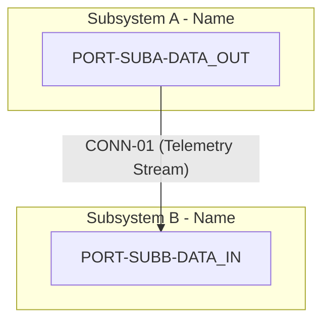

<!-- Copyright Gint Atkinson, gint.atkinson@gmail.com -->

---
name: spec-icd-engineering
description: "Transforms SysML v2 AST ports, connections, and item flows into Level 1C Logical Interface Specifications: ICD_01_SYSTEM_INTERFACE_MATRIX.md and ICD_02_MASTER_SIGNAL_DICTIONARY.md."
compatibility: "Requires issue tracker CLI and git. Works with modern agentic development environments."
metadata:
  title: "Logical Interface Specification & ICD Engineering (Worker ICD)"
  risk: medium
  source: custom
  version: "1.0"
---

# Logical Interface Specification & ICD Engineering (Worker ICD)

Use this as the single canonical workflow for transforming formal SysML v2 Abstract Syntax Tree (AST) port definitions, item flows, connections, and normative interface schemas into rigorous, machine-verifiable **Level 1C: Logical Interface Specifications & Signal Flow Dictionaries**.

In accordance with [`rules/sysml-ssot-completeness.md`](rules/sysml-ssot-completeness.md) and [`docs/architecture/blueprints/DEAP_LOGICAL_INTERFACE_SPECIFICATION_BLUEPRINT.md`](https://github.com/gintatkinson/DEAP01-spec-core/blob/main/docs/architecture/blueprints/DEAP_LOGICAL_INTERFACE_SPECIFICATION_BLUEPRINT.md), SysML v2 is the 100% Single Source of Truth (SSOT) for all architectural subsystem boundaries, directional interface ports, logical connections, and conveyed data item flows. Heuristic prose interpretation or ad-hoc interface assumptions without formal AST backing are strictly forbidden.

Level 1C operates as an immutable architectural bridge between high-level operational concepts (Level 1B CONOPS and STPA Hazard Analyses) and downstream agile specifications (Level 2 Epics, Features, BDD User Stories, and UML Use Cases). It eliminates interface ambiguity, untracked coupling, and type mismatches before software code generation or Model-Based Design (MBD) synthesis in the Primary Tier-1 Commercial Toolchain Context (**MATLAB / Simulink / Stateflow / Embedded Coder** for DO-178C C / SPARK Ada generation).

> [!TIP]
> This skill operates in the spirit of the `andrej-karpathy` methodology: focus deeply on the fundamentals, enforce exhaustive structural rigor, eliminate interface ambiguity, and instrument all deliverables flawlessly into project tracking systems.

## Closed-Loop Payload Verification Gate & Anti-Complacency Rule
- **Exit code 0 is NEVER sufficient proof of success.**
- After generating or publishing any ICD artifact or tracker issue, the agent MUST run live payload inspection (`gh issue view <ID>` or `glab issue view <ID>`) to verify markdown table alignment, Mermaid syntax headers, schema citations, and link validity.
- **Optimism bias is prohibited**: agents must cite empirical output of live payload inspection before declaring completion.

---

## Execution Trigger & Pipeline Sequencing

You should invoke this skill as **Phase 1.5 (Worker ICD - Logical Interface Engineer)** within the Master Orchestrator lifecycle (`skills/spec-orchestrator/SKILL.md`):
- **Preceding Phase**: Phase 1 (Structural Spec Worker) has extracted Epics and Features from SysML `package`, `part def`, and `item def` AST nodes.
- **Succeeding Phases**: Phase 2 (Behavioral Spec Worker) and Phase 3 (System Interaction Spec Worker) consume the logical ports (`PORT-*`) and signal dictionary entries (`SIG-*`) defined here to parameterize BDD User Stories, UML Sequence Lifelines, and Stateflow transitions.

---

## Step 1: Context Ingestion (SysML v2 AST, Digest & Safety Concept)

1. **Ingest Canonical SysML v2 Model & Cryptographic Digest**:
   - Ingest `.pipeline/schema.sysml` and `.pipeline/schema-digest.json`.
   - Verify SHA-256 integrity hash against `.pipeline/schema-digest.json` per [`rules/sysml-ssot-completeness.md`](rules/sysml-ssot-completeness.md).

2. **AST Query & Entity Extraction**:
   Scan and parse the SysML v2 AST to identify all formal interface elements:
   - **`part def`**: Subsystems and structural components forming the system boundary partitions.
   - **`port def` / `port`**: Directional ports (`in`, `out`, `inout`) declared on subsystem boundaries with port typing (Command, Telemetry, Data, Event).
   - **`interface def` / `interface`**: Formal interface block contracts declaring provided/required capabilities and service signatures.
   - **`connection` / `connect`**: Directed topological links binding source output ports to destination input ports.
   - **`flow` / `item flow`**: Typed information flows conveying discrete data payloads across connection bindings.
   - **`item def`**: Data structure definitions, field types, numeric bounds, resolution, and valid domain intervals.
   - **`constraint def` / `assert constraint`**: Interface timing constraints ($\tau_{\mathrm{latency}}$ bounds, update frequencies $f_{\mathrm{rate}}$, failsafe invariant assertions).

3. **Ingest Level 1B Safety & Operational Concept (When Available)**:
   - Ingest `docs/safety/STPA_MATRIX.md` (or STPA analysis tables) and `CONOPS.md` to map identified safety hazards (`**H-1**`, `**SC-01**`, `**UCA-1**`) and fail-safe default values directly to their respective logical signals.
   - Preserves 100% traceability without violating AST structural boundaries.

---

## Step 2: AST Extraction & Logical Interface Synthesis

The Worker ICD synthesizes two primary Level 1C engineering artifacts in `docs/interfaces/`:
1. `docs/interfaces/ICD_01_SYSTEM_INTERFACE_MATRIX.md`
2. `docs/interfaces/ICD_02_MASTER_SIGNAL_DICTIONARY.md`

### 2.1 Subsystem Topological Graph & Port Roster Extraction (`ICD_01`)

1. **Subsystem Registry & Port Allocation**:
   - For every subsystem $s_i \in \mathcal{S}$ (`part def` at system boundary level), extract all declared input ports $\mathcal{P}_i^{\mathrm{in}}$ and output ports $\mathcal{P}_i^{\mathrm{out}}$.
   - Construct unique, hierarchical port identifiers: `PORT-<SUBSYS>-<NAME>`.
   - Classify each port into standard categories: `DataPort`, `CommandPort`, `TelemetryPort`, or `EventPort`.
   - Record port direction (`IN`, `OUT`, `INOUT`), multiplicity (e.g. `1`, `4`), and logical protocol profile (`PeriodicStream`, `AsyncEvent`, `RealTimeSync`).

2. **Connection Binding Matrix & Topological Graph**:
   - For every SysML `connection` node $c = \langle p_{\mathrm{src}}, p_{\mathrm{dst}}, \Sigma_{i \to j}, \tau_{\mathrm{latency}} \rangle$, extract the source port reference, destination port reference, maximum allowable latency bound $\tau_{\mathrm{latency}}$, and reliability requirement.
   - Synthesize the global subsystem topological connectivity flowchart using Mermaid `flowchart TD`.
   - Synthesize the canonical $N^2$ Subsystem Interface Matrix:
     - Subsystems $s_1, s_2, \dots, s_N$ occupy the main diagonal.
     - Transmitting subsystems output along rows.
     - Receiving subsystems input along columns.
     - Off-diagonal cells contain connection identifiers (`CONN-XX`) and transmitted signal counts.

### 2.2 Master Signal Dictionary Synthesis (`ICD_02`)

1. **Item Flow Projection & Signal Registration**:
   - For every discrete data field and leaf node conveyed across an item flow, synthesize a canonical `ItemFlowNode` record.
   - Assign a globally unique, hierarchical Signal ID: `SIG-<SRC_SUBSYS>-<DST_SUBSYS>-<NNN>` (zero-padded 3-digit index, e.g. `SIG-SEN-CTL-001`).
   - Format Signal Name in canonical `UpperCamelCase` (e.g. `PrimarySensorSignal`, `ActuatorCommandSignal`).
   - Bind foreign key references to declared Source Port (`PORT-*`) and Destination Port (`PORT-*`) in `ICD_01`.

2. **Interface Contract Attributes (10 Canonical Columns)**:
   Every signal entry in `ICD_02` must specify all ten mandatory columns:
   - **Signal ID**: `SIG-<SRC>-<DST>-<NNN>`
   - **Signal Name**: UpperCamelCase canonical name
   - **Source Port**: Foreign key reference to declared `PORT-*` in `ICD_01`
   - **Dest Port**: Foreign key reference to declared `PORT-*` in `ICD_01`
   - **Data Type**: Standard primitive or composite type (`Float64`, `Float32`, `Int32`, `UInt32`, `Bool`, `Enum`, `Record`, `Vector3D`)
   - **SI Units**: Normalized SI units in plain text / Unicode (`m`, `m/s`, `m/s^2`, `rad`, `rad/s`, `Pa`, `K`, `V`, `A`, `W`, `Hz`, `dimensionless`)
   - **Valid Range**: Mathematical domain interval `[min, max]` or discrete enumeration literal set
   - **Update Rate**: Periodic rate in plain text `f Hz` (e.g. `50 Hz`, `100 Hz`) or aperiodic timing bound `Aperiodic [tau_min, tau_max] ms`
   - **Safe Default Value**: Deterministic value during cold initialization, link loss, sensor fault, or emergency failsafe state (e.g. `0.0`, `false`, `DISARMED`, `101325.0`)
   - **Schema Citation**: Exact provenance pointer to Level 0 source model (`schema/extracted/sensor.yang#L45` or `models/system.sysml#L120`)

3. **Safety Criticality & STPA Invariants**:
   - Identify all safety-critical signals impacting flight safety, system state machines, or hazard mitigation.
   - Cross-reference applicable hazard identifiers (`**H-1**`, `**SC-01**`) and define mathematical safety invariants under dedicated display math blocks.

---

## Step 3: Standardized Level 1C Markdown Artifact Structures

All Level 1C documents are stored under `docs/interfaces/` and MUST begin at lines 1–10 with a native CommonMark two-column Metadata Table per `rules/specification-metadata-integrity.md`.

### 3.1 Metadata Table Specification (Mandatory for all ICD files)

Every generated ICD document MUST open with the following exact table structure:

```markdown
| Attribute | Specification Detail |
| :--- | :--- |
| **Issue ID** | #[IssueID] |
| **Title** | [Document Title] |
| **Type** | icd |
| **Interface Level** | Level 1C Logical Interface |
| **Generation Mode** | subagent |
| **Specification Source** | [schema/...](../../schema/...) |
```

> [!WARNING]
> Raw `--- ... ---` YAML frontmatter blocks are strictly forbidden in specification markdown files. All metadata must reside in the native CommonMark 2-column table at lines 1–10.

---

### 3.2 `ICD_01_SYSTEM_INTERFACE_MATRIX.md` Template Structure

````markdown
| Attribute | Specification Detail |
| :--- | :--- |
| **Issue ID** | #[IssueID] |
| **Title** | System Interface Matrix & Topological Connectivity |
| **Type** | icd |
| **Interface Level** | Level 1C Logical Interface |
| **Generation Mode** | subagent |
| **Specification Source** | `schema/model.sysml` |

# Level 1C: System Interface Matrix & Topological Connectivity

## 1. Executive Summary & Interface Scope
[High-level description of subsystem boundaries, partitioning architecture, and interface lifecycle context derived from SysML v2 AST.]

## 2. Subsystem Topological Connectivity Graph


## 3. Canonical N² Subsystem Interface Matrix
| Subsystem | 1. Subsystem A | 2. Subsystem B | 3. Subsystem C |
| :--- | :--- | :--- | :--- |
| **1. Subsystem A** | **[ Subsystem A ]** | CONN-01 (12 Signals) | — |
| **2. Subsystem B** | — | **[ Subsystem B ]** | CONN-02 (6 Signals) |
| **3. Subsystem C** | CONN-03 (4 Signals) | — | **[ Subsystem C ]** |

## 4. Port Definition Roster Table
| Port ID | Subsystem | Port Name | Direction | Port Type | Multiplicity | Protocol Profile |
| :--- | :--- | :--- | :--- | :--- | :--- | :--- |
| `PORT-SUBA-DATA_OUT` | SubsystemA | TelemetryDataOut | OUT | DataPort | 1 | PeriodicStream |
| `PORT-SUBB-DATA_IN` | SubsystemB | TelemetryDataIn | IN | DataPort | 1 | PeriodicStream |

## 5. Connection Binding Roster Table
| Connection ID | Source Port | Dest Port | Flow Behavior | Latency Max ms | Reliability Req | Item Flows Conveyed |
| :--- | :--- | :--- | :--- | :--- | :--- | :--- |
| `CONN-01` | `PORT-SUBA-DATA_OUT` | `PORT-SUBB-DATA_IN` | Continuous Stream | 10.0 | High | TelemetryStatePacket |

## 6. Source References
Structural Schema: `schema/model.sysml`
Normative Specification: [Normative Document Link](link-to-specification)
````

---

### 3.3 `ICD_02_MASTER_SIGNAL_DICTIONARY.md` Template Structure

````markdown
| Attribute | Specification Detail |
| :--- | :--- |
| **Issue ID** | #[IssueID] |
| **Title** | Master Signal Flow Dictionary & Safety Invariants |
| **Type** | icd |
| **Interface Level** | Level 1C Logical Interface |
| **Generation Mode** | subagent |
| **Specification Source** | `schema/model.sysml` |

# Level 1C: Master Signal Flow Dictionary & Safety Invariants

## 1. Executive Summary & Signal Flow Overview
[Overview of signal allocation, data typing standards, SI unit conventions, and fail-safe default policies.]

## 2. Master Signal Flow Dictionary Table
| Signal ID | Signal Name | Source Port | Dest Port | Data Type | SI Units | Valid Range | Update Rate | Safe Default Value | Schema Citation |
| :--- | :--- | :--- | :--- | :--- | :--- | :--- | :--- | :--- | :--- |
| `SIG-SUBA-SUBB-001` | PrimaryVelocity | `PORT-SUBA-DATA_OUT` | `PORT-SUBB-DATA_IN` | Float32 | m/s | [0.0, 150.0] | 100 Hz | 0.0 | `schema/model.sysml#L45` |
| `SIG-SUBA-SUBB-002` | PitchAngle | `PORT-SUBA-DATA_OUT` | `PORT-SUBB-DATA_IN` | Float32 | rad | [-1.57079, 1.57079] | 100 Hz | 0.0 | `schema/model.sysml#L58` |
| `SIG-SUBA-SUBB-003` | ArmCommand | `PORT-SUBA-CMD_OUT` | `PORT-SUBB-CMD_IN` | Bool | dimensionless | [false, true] | Aperiodic [10, 500] ms | false | `schema/model.sysml#L80` |

## 3. Mathematical Formulations & Safety Invariants (When Applicable)
$$
\begin{aligned}
\tau_{\mathrm{transport}} &\le \tau_{\mathrm{latency,max}} \\
\Delta v_{\mathrm{signal}} &\le a_{\mathrm{limit}} \cdot \Delta t
\end{aligned}
$$

- Parameter Definitions & Engineering Units:
- $\tau_{\mathrm{transport}}$: End-to-end signal transport latency from source port to destination port.
- $\tau_{\mathrm{latency,max}}$: Maximum allowable transport latency threshold (e.g. 10.0 ms).
- $\Delta v_{\mathrm{signal}}$: Maximum rate of change between consecutive signal samples.
- $a_{\mathrm{limit}}$: Physical acceleration or saturation limit (e.g. 25.0 m/s^2).
- $\Delta t$: Nominal sampling period corresponding to the signal update frequency ($1 / f$).

## 4. Safety-Critical Signal Allocation & STPA Hazard Mapping
| Signal ID | Safety Criticality | Hazard Ref | Safety Constraint | Failsafe Action |
| :--- | :--- | :--- | :--- | :--- |
| `SIG-SUBA-SUBB-001` | High (DAL-A) | **H-1** | Velocity must not exceed aerodynamic limit | Revert to safe default (0.0 m/s) and engage emergency deceleration |
| `SIG-SUBA-SUBB-003` | Critical (DAL-A) | **H-3** | Inadvertent arming prohibited | Assert safe default (false) on link interruption |

## 5. Source References
Structural Schema: `schema/model.sysml`
Normative Specification: [Normative Document Link](link-to-specification)
````

---

## Step 4: Strict Architectural Invariants & Formatting Rules

The Worker ICD must strictly enforce the following repository invariants:

### 4.1 100% Pure Schema AST Derivation Mandate
- All port definitions, item flows, and connections must derive directly from the parsed SysML v2 AST (`port def`, `connection`, `item flow`, `item def`, `interface def`).
- Zero hallucination of undeclared ports or unmapped signals is permitted.

### 4.2 Strict Logical Abstraction Invariants
To maintain pure platform independence and prevent premature hardware coupling:
- **ZERO Physical Connectors**: Strictly prohibit references to physical connectors or plug types (e.g., `MIL-DTL-38999`, `RJ45`, `USB-C`, `DB9`).
- **ZERO ECAD Pinouts**: Strictly prohibit references to PCB pin numbers, FPGA ball grid array (BGA) mappings, or microcontroller GPIO pin assignments.
- **ZERO Wire Harness Drawings**: Strictly prohibit references to wire gauges (AWG), harness bundle numbers, terminal lugs, or shielding drawings.
- **ZERO Transport Byte Framing**: Strictly prohibit transport-layer serialization details (e.g., CAN 11-bit/29-bit identifiers, ARINC 429 32-bit word label encodings, Ethernet MAC addresses, UART start/stop bits). All signals must remain logical entities defined by data types, physical SI units, valid ranges, update rates, and safe default states.

### 4.3 LaTeX & KaTeX Mathematical Rendering Integrity
Per [`rules/latex-katex-integrity.md`](rules/latex-katex-integrity.md):
- **Pure Symbolic Display Math**: All display math blocks must use `$$ \begin{aligned} ... \end{aligned} $$` on dedicated newlines expressing pure symbolic relations only.
- **Prohibition of Embedded Physical Unit Macros**: Embedding physical unit macros (e.g. `\text{ ms}`, `\text{ kg}`, `\text{ m/s}`, `\text{ Hz}`) inside display math equations is strictly prohibited.
- **Mandatory "Parameter Definitions & Engineering Units" Section**: All physical values, numerical limits, constants, and engineering units must be defined in the accompanying prose or list immediately following the display math block.
- **Markdown Table Math Prohibition**: Strictly prohibit `$ ... $` and `$$ ... $$` math delimiters inside Markdown table headers, delimiter rows, and data cells. Use plain text and standard Unicode characters (e.g. `f Hz`, `tau_max ms`, `[min, max]`, `ΔV`, `λ`, `°C`, `≥`, `≤`).
- **Markdown Table Column Count Consistency**: Maintain exact 1:1 column count match between header rows and delimiter rows across all tables.
- **No Unescaped Underscores**: Unescaped underscores inside `\text{}` blocks are forbidden (use hyphenated text `\text{latency-max}` or subscripts `\tau_{\mathrm{latency,max}}`).

### 4.4 Mermaid Diagram Integrity
Per [`rules/platform-independence.md`](rules/platform-independence.md):
- The first non-comment line inside EVERY Mermaid code fence (` ```mermaid `) MUST declare a valid diagram header (`flowchart TD`, `classDiagram`, `stateDiagram-v2`, `sequenceDiagram`).
- Every Mermaid block must be strictly closed with ```` ``` ```` on a new line.
- Enclose node labels and transitions containing slashes, colons, parentheses, brackets, or comparisons in double quotes.
- Unquoted `<` and `>` characters are strictly forbidden across all diagram types.

---

## Step 5: Parity Verification Gate 23 & Backlog Synchronization

1. **Mandatory Local Verification Gate (Gate 23 - ICDCompletenessValidator)**:
   Before committing or creating tracker issues, the Worker ICD MUST run local verification checks:
   ```bash
   python3 skills/spec-orchestrator/parity_auditor/src/parity_auditor/validators/icd_completeness_validator.py
   ```
   and the model coverage verifier:
   ```bash
   ./skills/spec-orchestrator/scripts/verify_model_coverage.py --spec-only --allow-missing-specs
   ```
   - Asserts 100% port connection parity (zero dangling ports: $\mathcal{D}_{\mathrm{port}} = \emptyset$).
   - Asserts 100% signal dictionary coverage of schema interface leaves ($\Omega_{\mathrm{coverage}} = 1.0$).
   - Asserts valid port foreign keys, non-empty SI units, bounded valid ranges, and explicit safe default values.
   - If verification fails, parse error findings, repair the generated ICD files, and re-run until passing with exit code 0.

2. **Untracked Infrastructure Pre-Commit Check**:
   Check for untracked pipeline infrastructure files before committing:
   ```bash
   UNTRACKED_INFRA=$(git ls-files --others --exclude-standard .pipeline/ skills/ rules/ scripts/)
   if [ -n "$UNTRACKED_INFRA" ]; then
     git add .pipeline/ skills/ rules/ scripts/
   fi
   ```

3. **Tracker Label Bootstrapping**:
   Verify the `icd` label exists in the configured tracker provider (GitHub or GitLab):
   - GitHub: `gh label create icd --color 1d76db --description "Level 1C Logical Interface Specification" --force`
   - GitLab: `glab label create --name "type::icd" --color "#1D76DB" --description "Level 1C Logical Interface Specification"`

4. **Duplicate Detection & Idempotent Issue Registration**:
   - Query active tracker provider to check if an issue with an identical title already exists. If found, skip creation and reuse the existing Issue ID.
   - Register the ICD issues using deterministic title extraction:
     ```bash
     TITLE=$(awk -F'|' '/**Title**/ {print $3}' docs/interfaces/ICD_01_SYSTEM_INTERFACE_MATRIX.md | xargs)
     gh issue create --title "$TITLE" --body-file docs/interfaces/ICD_01_SYSTEM_INTERFACE_MATRIX.md --label "icd"
     ```
     *(or equivalent `glab issue create` for GitLab environments)*
   - Immediately inject the resolved live Issue ID back into the metadata table line of the local markdown file:
     ```bash
     gh issue edit <ID> --body-file docs/interfaces/ICD_01_SYSTEM_INTERFACE_MATRIX.md
     ```
   - Execute post-creation verification check:
     ```bash
     gh issue view <ID> --json body | python3 -c "import sys,json; b=json.load(sys.stdin)['body']; assert 'Source References' in b or 'References' in b, 'Body is a stub'"
     ```

5. **Commit & Return Control**:
   - Stage and commit the generated ICD artifacts (`docs/interfaces/`):
     ```bash
     git add docs/interfaces/
     git commit -m "feat(icd): synthesize Level 1C logical interface matrix and master signal dictionary"
     git push
     ```
   - Report completion and generated Issue IDs/URLs back to the Master Orchestrator.
