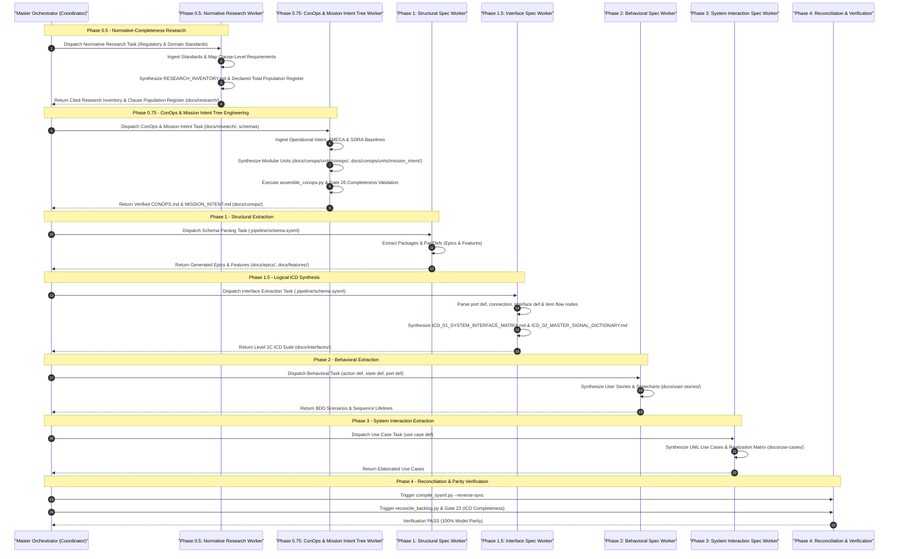

<!-- Copyright Gint Atkinson, gint.atkinson@gmail.com -->

---
name: spec-orchestrator
description: "Orchestrates end-to-end multi-agent protocol specification engineering. Use when you need to transform a protocol standard (IETF, 3GPP, IEEE, CAMARA) into a complete GitHub-tracked Agile backlog of Epics, Features, User Stories, and Use Cases."
compatibility: "Requires gh CLI and git. Works with Claude Code, Gemini CLI, Cursor, Copilot, Cascade."
metadata:
  title: "Autonomous Specification Orchestrator (Master Command)"
  category: orchestration
  risk: medium
  source: custom
  version: "2.0"
---

# Autonomous Specification Orchestrator (Master Command)

This skill enables you to act as the **Master Orchestrator Agent**. You are responsible for executing an end-to-end "Digital Engineering Pipeline" that systematically transforms a protocol standard (e.g., IETF, 3GPP, IEEE, CAMARA) into a deterministic GitHub repository matrix using UML OOA/OOD methodologies.

You will accomplish this by coordinating the sequential execution of specialized Worker skills across all specification phases (Phases 0.5, 0.75, 1, 1.5, 2, and 3).

> [!NOTE]
> This orchestrator handles **specification generation** (Phases 1-5). For **feature implementation**, use the separate `feature-driven-implementation` skill which provides subagent-driven TDD execution discipline.

## Error Recovery & Mandatory Adversarial Audit

If any phase, worker, compiler, or validation gate fails during orchestration (worker error, schema parsing fault, GitHub/GitLab API failure, parity auditor failure, or gate rejection):

1. **Strict Prohibition of Ad-Hoc Triage & CLI Dumps**:
   - The coordinator MUST NOT perform ad-hoc triage, speculative manual patching, or uncurated raw CLI dumps into the chat context.
   - The coordinator is strictly locked from attempting ad-hoc direct writes to bypass failures.

2. **Mandatory Adversarial Audit Subagent Dispatch**:
   - The coordinator MUST immediately dispatch a fresh, context-isolated subagent with Role `Adversarial Code Auditor` (TypeName: `adversarial_auditor`) adopting `skills/adversarial-code-auditor/SKILL.md` (instructed to execute `view_file` on `skills/adversarial-code-auditor/SKILL.md` as its very first step).
   - The adversarial auditor subagent performs systematic root cause investigation:
     * **5 Whys Analysis**: Drills down through 5 Whys of causality to isolate the exact structural, behavioral, or compiler flaw.
     * **4-Pillar Correctness Audit**: Audits the failure across the 4 pillars (Memory Safety, Resource Lifecycle, Concurrency, Test Integrity / Semantic Traceability).
     * **Offline Mermaid Syntax Verification**: Validates all generated architectural / sequence diagrams against the offline syntax gate (Check 7 offline syntax gate per `rules/platform-independence.md`) before filing.
     * **7-Section Defect Report**: Formats the finding strictly according to the canonical 7-section defect report skeleton (`## 1. Context and References`, `## 2. Root Cause Analysis (5 Whys)`, `## 3. Correctness Analysis`, `## 4. UML Diagrams`, `## 5. Affected Callers / Downstream Impact`, `## 6. Proposed Correction`, `## 7. Relationship to Existing Issues`, terminating with `## Audit Source`).
   - **Automated Defect Publication**: The subagent publishes the verified 7-section defect report to the issue tracker:
     * **GitHub**: `gh issue create --repo [REPO] --title "[AUDIT] [file.ext]: [description]" --label "bug" --body-file [payload_path]`
     * **GitLab**: `glab issue create --repo [REPO] --title "[AUDIT] [file.ext]: [description]" --label "type::bug" --description "$(< [payload_path])"` (or via direct GitLab REST API v4 in CI/offline environments).

3. **Remediation Dispatch via Debug Protocol (TDD RED-GREEN Fix)**:
   - Once the defect issue is registered on the tracker, the coordinator MUST dispatch a context-isolated subagent with Role `Micro-Task Implementer` (TypeName: `code_modifier_worker`) adopting `skills/debug-protocol/SKILL.md` to execute the systematic 8-step bug loop.
   - The subagent follows the strict TDD RED-GREEN-REFACTOR cycle:
     * **RED**: Write an isolated, failing regression test capturing the exact defect invariant. Run it and verify it fails with the expected error.
     * **GREEN**: Implement the minimal, surgical fix to make the test pass.
     * **REFACTOR / VERIFY**: Run full test suites and validation gates to confirm zero regressions.
   - Once verified, the subagent updates the issue and marks it `Fixed / Resolved` (e.g. `status:fixed-resolved` label on GitHub or `status::fixed-resolved` on GitLab). Issue closure is strictly reserved for Product Owner review (`.pipeline/constitution.md:161`).

4. **Invariants & Escalation**:
   - **Never skip a validation gate.** If a gate cannot be satisfied, the pipeline remains halted until systematically resolved and verified.
   - **Automated Upstream Reporting**: If the failure is due to a pipeline tooling bug in `DEAP01-spec-core` (linter, reconciler, or parser), file an upstream defect report (`gh issue create --repo gintatkinson/DEAP01-spec-core --title "Tooling Bug: [Command] failed" --body-file [payload_path] --label "bug"`) and escalate to the human operator with the issue URL.

## Pre-Flight Git Repository Verification
Before performing any orchestration steps, the agent MUST run `git ls-files` on:
1. `.pipeline/constitution.md`
2. `skills/`
3. `rules/`
4. `scripts/`

If any of these verification checks fail (i.e. the files are untracked or missing), the agent MUST halt and instruct the operator to add, commit, and push them first:
```bash
git add .pipeline/ skills/ rules/ scripts/ app_flutter/
git commit -m "chore: bootstrap pipeline infrastructure"
git push
```

## Pre-Flight Checklist
Before beginning orchestration, verify you have:
1. The target specification identifier (e.g., RFC 8345, 3GPP TS 23.501).
2. The path(s) to the associated structural schemas (e.g., `*.sysml`, `*.yang`, `*.yaml`, `*.proto`, `*.arxml`, `*.idl`).
3. *(Optional)* A project constitution at `.pipeline/constitution.md`. If present, read it and apply platform/domain constraints to all worker dispatches.
4. The SysML v2 SSOT completeness and bidirectional synchronization rules in `rules/sysml-ssot-completeness.md` and `docs/architecture/blueprints/SYSML_SSOT_BIDIRECTIONAL_SYNCHRONIZATION_ARCHITECTURE.md`.
5. The Standardized Operator Usage Prompt Catalog in `docs/OPERATOR_PROMPT_CATALOG.md`.
6. Applicable regulatory, safety, and domain standards for Phase 0.5 Normative-Completeness Research (e.g., ISO/IEC/IEEE 29148, NATO STANAG 4586, RTCA DO-178C / DO-254, SAE ARP4754A / ARP4761, MIL-STD-882E, JARUS SORA v2.5, ASTM F3269-17 / F3411-22a, RTCA DO-365B).

## Item-Level Subagent Context Isolation

To prevent context drift, contamination, and confirmation bias, **every individual specification item (Epic, Feature, User Story, and Use Case) MUST be processed by a new, fresh subagent with an isolated context.**

- **Mandatory Subagent Dispatch for Specification Phases**: The Master Orchestrator (Coordinator) MUST dispatch Phase Worker subagents (TypeName: `self`) for Phase 0.5, Phase 0.75, Phase 1, Phase 1.5, Phase 2, and Phase 3:
  * Phase 0.5: `Normative Research Worker`
  * Phase 0.75: `ConOps & Mission Intent Tree Worker (Worker ConOps)`
  * Phase 1: `Structural Spec Worker`
  * Phase 1.5: `Interface Spec Worker (Worker ICD)`
  * Phase 2: `Behavioral Spec Worker`
  * Phase 3: `System Interaction Spec Worker`
- **Coordinator Direct Writing Lock**: The Coordinator is strictly forbidden from directly performing schema parsing, drafting, or issue uploads in its main conversation context. All such operations must be delegated to the Worker subagents.

When executing a phase, the worker agent must follow this lifecycle:
1. **Decomposition**: Parse the input schema or specification text to identify the distinct list of items to be created.
2. **Subagent Dispatch**: For each identified item, invoke a fresh subagent with its own clean context. Pass only:
   - The relevant schema node(s) or specification paragraph(s) for that item.
   - The specific skill instructions (e.g., Feature, User Story, or Use Case template guidelines).
   - Core project rules and the constitution.
   - **The authoritative upstream locators verbatim.** Any schema or normative
     specification URL passed for retrieval MUST appear unchanged in the item's
     `Source References` block. Do not rewrite it to a path under this
     repository: those artefacts are external, and a self-referential locator
     breaks the traceability the reference exists to provide. Stated in
     `rules/document-references.md`; enforced offline by
     `source_reference_validator.py` (issues #322, #320).
   - **All Mermaid syntax constraints are defined in `rules/platform-independence.md` and MUST be observed in full** — pass that file to the subagent rather than a paraphrase of it. A subagent that is never shown the constraints cannot comply with them, and a local subset drifts from the normative home (issue #289). This covers, among others, empty class bodies written on one line, curly braces and colons in class member lines, colons in note strings, stereotypes on relationship lines, unquoted relationship labels, and semicolons in `Note` and message text.
   - **Mandatory Mermaid Diagram Header Rule**: The very first non-comment line inside EVERY Mermaid code fence (```` ```mermaid ````) MUST declare a valid diagram type header (e.g. classDiagram, graph TD, flowchart TD, sequenceDiagram, stateDiagram-v2). Omitting the header and beginning directly with relationships or member lines is strictly forbidden.
   - **Mermaid State Diagram Escaping**: Unquoted `<` and `>` characters are strictly forbidden in Mermaid labels and transition descriptions. State transitions containing comparison operators, brackets, or guards MUST enclose the label in double quotes (e.g. `ActiveCounting --> ActiveCounting: "incrementCounter [value < maxBound] / updateValue"`).
   - **The title namespacing constraint defined in `rules/tracker-source-of-truth.md` MUST be observed** — pass that file to the subagent rather than a paraphrase of it. Each subagent drafts in isolation and never sees the other items in the run, so a schema node name that recurs across modules yields the same title twice and neither subagent can detect it (issue #317). The rule lives in `rules/` and is referenced here rather than restated, per `rules/platform-independence.md` § *Normative home & enforcement*; a local subset drifts from the normative home (issue #289).
   - **SysML v2 Model-as-SSOT Completeness**: All derivations MUST be AST-driven from formal SysML v2 declarations (structural `part def`/`item def`, behavioral `action def`/`state def`/`port def`, and interaction `use case def` blocks) per `rules/sysml-ssot-completeness.md`. Heuristic prose interpretation without formal AST backing is strictly prohibited.
   - Do **NOT** pass the history of other items generated in the same run.
3. **Drafting**: The subagent drafts only the target markdown file for that single item. It MUST open that file with the YAML frontmatter block defined by the item's own template in the worker skill — including `generation_mode: "subagent"`. That key is the only machine-readable evidence that this mandate was honoured: `_validate_subagent_isolation` in `skills/spec-orchestrator/parity_auditor/src/parity_auditor/validators/uml.py` rejects every Epic, Feature, User Story and Use Case that lacks it. Take the frontmatter from the template, never from a tracker issue body — `skills/spec-orchestrator/scripts/reconcile_backlog.py` renders frontmatter as a `| Metadata | Value |` table when it publishes to the tracker during Phase 4, and that table is a tracker-side rendering, never a substitute for the frontmatter block in the local file. Markdown tables are not otherwise restricted; the pipeline generates them itself, so a blanket prohibition would outlaw its own canonical output (issue #278).
4. **Registration**: The worker agent aggregates the outputs, links them, and registers them sequentially in the issue tracker. All spec issues (Epics, Features, User Stories, Use Cases) MUST be created with their full body contents (via `--body-file <local-md-file>` and immediate post-creation verification) during Phases 1, 2, and 3. An immediate post-creation verification check must be run (e.g., `gh issue view <ID> --json body`) to ensure the tracker body is not a stub and is fully populated at the time of creation.

## Closed-Loop Payload Verification Gate & Anti-Complacency Rule
- **Exit code 0 is NEVER sufficient proof of success.**
- After modifying or publishing any GitHub issue or document, the agent MUST run `gh issue view <ID>` or `gh api` to fetch the live published payload and inspect links, Mermaid headers, and syntax.
- **Optimism bias is prohibited**: agents must cite empirical output of live payload inspection before declaring completion.

> This section sits **after** § *Item-Level Subagent Context Isolation* deliberately. It
> was originally inserted between that heading and its body, which split the isolation
> section in two: everything from the dispatch lifecycle onward — the `generation_mode`
> marker, the title-namespacing constraint, the Mermaid and source-locator payload rules —
> fell outside the section as the gates measure it. `test_governed_documents_are_discoverable_issue317`,
> `test_drafting_dispatch_passes_the_namespacing_constraint_issue317` and
> `test_drafting_step_names_the_frontmatter_marker_issue278` all read that section by
> heading and went red. Do not re-insert a `##` heading between the isolation heading and
> the end of its numbered lifecycle.

## Parallel Dispatch Convention

Phases marked with **`[P]`** may be dispatched in parallel when:
- The runtime supports parallel subagent dispatch (Claude Code, Gemini CLI)
- There are no data dependencies between the parallel phases
- Each parallel worker operates on independent schema modules

Phases NOT marked `[P]` are strictly sequential — the validation gate of phase N must pass before phase N+1 begins.

> **Single-agent runtimes (Cascade/Windsurf/Devin):** Ignore `[P]` markers and execute all phases sequentially. Even in single-agent environments, item-level subagent isolation must be simulated by manually resetting/clearing prior context (e.g., providing explicit instructions to ignore previous items and focus only on the current target's schema/text) for each item drafted.

## Multi-Agent Orchestration Lifecycle



## Phase 0: Pre-Flight / Pre-computation
1. **SysML v2 Ingestion & AST Digest**: Ingest input schemas (OMG IDL, AUTOSAR ARXML, Protobuf, OpenAPI, or native SysML v2) using `sysmlv2_ingest.py` to produce canonical `.pipeline/schema.sysml` and `.pipeline/schema-digest.json`. This generates formal AST nodes (`package`, `part def`, `item def`, `action def`, `state def`, `port def`, `requirement def`, and `use case def`) establishing the 100% Single Source of Truth for Phases 1–3 per `rules/sysml-ssot-completeness.md`.
2. **YANG Compilation (conditional)**: If `.yang` files are present in the schema directory, run the YANG-to-LUI compiler to generate the UI layout:
   ```bash
   python3 scripts/compile_yang.py --input schema/model.yang --output app_flutter/assets/logical-layout.json
   ```
   The compiler extracts hierarchy from `container`/`list` nesting, attributes from `leaf` definitions with type/range/enum constraints, and merges them into `logical-layout.json`. Detailed mapping reference is in `docs/operations/yang-compiler-guide.md`.

3. **Layout Manifest Constraints**: `logical-layout.json` is the authority every Feature's Logical UI bindings resolve against, so the manifest itself is validated before the bindings that cite it. Enforced offline by `parity_auditor/validators/logical_ui_validator.py`; stated here rather than in a worker skill because the manifest is produced in this phase and no worker owns it. All three were enforced and documented nowhere before issue #304.
   - **Layout Manifest Must Exist**: the manifest MUST be present at `.pipeline/logical-ui/logical-layout.json` or, failing that, at `<flutter_dir>/assets/logical-layout.json`. Absent, every binding in every Feature is unresolvable, so the run reports the missing manifest once instead of reporting each Feature as invalid.
   - **Layout Manifest Must Parse**: the manifest MUST be well-formed JSON. A manifest that does not parse is reported as such, not treated as an empty layout — an empty layout would report every binding as naming a component that is not instantiated, which points at the Features instead of at the file that is actually broken.
   - **Tabbed Containers Accept Only Tabular Children**: a `TabbedContainer` node MUST declare a `children` list, and every child MUST be a `TableView`, `PropertyGrid` or `DensityTable`. Tabs present a set of comparable records; a non-tabular child in a tab strip has no meaningful rendering.
   - **Features Directory Must Exist**: the configured `backlog_directories.features` path MUST exist. There is nothing to validate bindings for otherwise, and a silent pass would be indistinguishable from a fully-bound backlog.

## Phase 0.5: Normative-Completeness Research Step (Worker Research)
1. **Trigger / Dispatch**: The Coordinator MUST invoke a fresh subagent (TypeName: `self`, Role: `Normative Research Worker`) with the target domain/protocol requirements, applicable regulatory standards list, and standard template paths (`skills/spec-orchestrator/resources/RESEARCH_INVENTORY_CANONICAL_TEMPLATE.md`), appending the keyword `PROCEED` to authorize execution.
2. **Normative Research Protocol**:
   - **Standards Identification & Ingestion**: Systematically identify, ingest, and catalog all applicable regulatory, safety, and domain standards governing the target domain (e.g. ISO/IEC/IEEE 29148, NATO STANAG 4586, RTCA DO-178C / DO-254, SAE ARP4754A / ARP4761, MIL-STD-882E, JARUS SORA v2.5, ASTM F3269-17 / F3411-22a, RTCA DO-365B).
   - **Clause-Level Extraction & Mapping**: Perform rigorous clause-level extraction to map mandatory requirements, safety constraints, hazard mitigations, operational rules, METL tasks, and control patterns directly to specific public clauses (e.g. `ISO/IEC/IEEE 29148:2018 §6.4.2`, `RTCA DO-178C §6.3.1`, `STANAG 4586 Annex B §2.1`).
   - **Mandatory Output Artifacts**:
     * **Cited Research Inventory** (`docs/research/RESEARCH_INVENTORY.md`): Synthesize a comprehensive research inventory document based on `skills/spec-orchestrator/resources/RESEARCH_INVENTORY_CANONICAL_TEMPLATE.md` (or template in `skills/spec-orchestrator/resources/`), capturing document metadata, issuing bodies, full standard titles, revision baselines, and formal references.
     * **Declared-Total Population Register**: Catalog all applicable normative obligations, safety constraints, METL tasks, and control patterns with formal public clause citations in a structured, queryable register within `docs/research/RESEARCH_INVENTORY.md`.
3. **Traceability Rule & Prohibition of Un-Cited Additions**:
   - **Strict Traceability Mandate**: Every added obligation, hazard, control action, or catalog entry MUST carry a public clause citation; un-cited additions are strictly prohibited.
   - **Prohibition of Un-Cited Additions**: Un-cited or speculative additions lacking verifiable clause citations are strictly prohibited across all specification deliverables.
4. **Wait & Verify**: The Coordinator waits for the subagent to report completion, reads its final report, and:
   a. Verifies that `docs/research/RESEARCH_INVENTORY.md` exists and is fully populated with zero placeholder tokens.
   b. Performs a sampling audit (`view_file`) on `docs/research/RESEARCH_INVENTORY.md` to confirm all cited standards, clauses, and population register entries conform to the mandatory traceability rule.
5. **Validation Gate**: Verify that `docs/research/RESEARCH_INVENTORY.md` is committed and contains a complete Declared-Total Population Register with 100% public clause citations. Once this validation passes, **execute Phase 0.75 immediately without pausing for user approval.**

## Phase 0.75: Hierarchical ConOps & Mission Intent Tree Engineering (Worker ConOps)
1. **Trigger / Dispatch**: The Coordinator MUST invoke a fresh subagent (TypeName: `self`, Role: `ConOps & Mission Intent Tree Worker`) with the `spec-conops-engineering` skill and paths to input schemas (`schema/`, `.pipeline/schema.sysml`), `docs/research/RESEARCH_INVENTORY.md`, FMECA failure modes, SORA risk classes, and user operational intent, appending the keyword `PROCEED` to authorize execution.
2. **Execution**: The `ConOps & Mission Intent Tree Worker` subagent ingests operational intent, system architecture, FMECA failure modes, SORA risk profiles, and `docs/research/RESEARCH_INVENTORY.md`. It extracts discrete units adhering to `.pipeline/schemas/conops_specification_schema.json` (12 canonical units under `docs/conops/units/conops/`) and `.pipeline/schemas/mission_intent_specification_schema.json` (10 canonical units under `docs/conops/units/mission_intent/`). It enforces pure open schema generation ($N \ge N_{\mathrm{min}}$) with zero static row caps, open multi-domain threat taxonomy (Kinetic, Mechanical, Environmental, EW/Cyber, Power/Thermal, Optical, Human), KaTeX math formulas, and 100% public clause citations. It executes deterministic modular assembly via `python3 scripts/assemble_conops.py --input-dir docs/conops/units/ --output-dir docs/conops/`, validating unit integrity, TOC generation, and internal links. Registers the ConOps suite under the `conops` issue label using `./skills/spec-orchestrator/scripts/create_issue.sh`, runs immediate verification checks to confirm the tracker body is fully populated, and commits/pushes the changes.
3. **Wait & Verify**: The Coordinator waits for the subagent to report completion, reads its final report, and:
   a. Query the `git diff` to identify the generated file paths in `docs/conops/units/` and `docs/conops/`.
   b. Run a file read check (`view_file`) on the compiled specification markdown files (`docs/conops/CONOPS.md` and `docs/conops/MISSION_INTENT.md`) to verify formatting compliance (such as KaTeX math blocks, 4D volume / SORA parameters, emergency decision matrix, METL task roster, MoE/MoP formulas, PACE C2 plan, and Bingo energy dynamics).
   c. Run the ConOps assembly verification and completeness validator locally:
      ```bash
      python3 scripts/assemble_conops.py --input-dir docs/conops/units/ --output-dir docs/conops/ --verify
      python3 -m unittest tests.test_conops_and_mission_intent_validators
      ```
4. **Validation Gate**: Runs `parity_auditor/validators/conops_completeness_validator.py` (Gate 26), ensuring 100% ConOps and Mission Intent section completeness, SORA Ground Risk Buffer calculation validity, 20% statutory Bingo energy reserve compliance, 7-row emergency decision matrix determinism, and verified Gate 24 operational allocation tags. Verify that ConOps-allocated obligations are witnessed in `RESEARCH_INVENTORY.md` (Gate 28 and Gate 29). Verify that ConOps and Mission Intent issues are created in GitHub/GitLab with fully populated bodies. Once this validation passes, **execute Phase 1 immediately without pausing for user approval.**

## Phase 1: Structural Extraction (Worker A)
1. **Trigger / Dispatch**: The Coordinator MUST invoke a fresh subagent (TypeName: `self`, Role: `Structural Spec Worker`) with the `schema-specification-engineering` skill and the path to the target structural schema files, appending the keyword `PROCEED` to authorize execution.
2. **Execution**: The `Structural Spec Worker` subagent parses the SysML v2 AST model (`.pipeline/schema.sysml`) and raw schemas to identify all Epics (from subsystem `package`s) and Features (from `part def` and `item def` nodes). It dispatches a fresh context-isolated subagent for each Feature/Epic to draft its specification. Before committing, pushing, or creating issues, it MUST execute the local validation check (`./skills/spec-orchestrator/scripts/verify_model_coverage.py --spec-only --allow-missing-specs`) and fix all reported errors until the linter passes with exit code 0. It registers Features first using `./skills/spec-orchestrator/scripts/create_issue.sh "<local-md-file>" "feature" "<Extract_Title_From_YAML_Metadata>"`, runs an immediate verification check (`gh issue view <ID> --json body`) to ensure the tracker is fully populated, then injects their Issue IDs into the Epic checklists, registers Epics using `./skills/spec-orchestrator/scripts/create_issue.sh "<local-md-file>" "epic" "<Extract_Title_From_YAML_Metadata>"`, verifies their bodies immediately, and commits/pushes the changes.
3. **Wait & Verify**: The Coordinator waits for the subagent to report completion, reads its final report, and:
   a. Query the `git diff` to identify the generated file paths.
   b. Run a file read check (`view_file`) on a random sample (at least 1-2 files) of the newly generated files to verify formatting compliance (such as BDD syntax, UML diagrams format).
   c. Run the linter locally over the newly added files to double-check that the validation gate is fully satisfied:
      ```bash
      ./skills/spec-orchestrator/scripts/verify_model_coverage.py --spec-only
      ```
4. **Validation Gate**: You MUST wait for the Phase 1 execution to fully complete. The agent must successfully create all Feature issues FIRST, capture their IDs, inject them into the Epic markdown, and then create the Epic issue. Query GitHub (`gh issue list --limit 1000 --state all --json number,title,state,labels`) to verify the new Epics and Features exist and are properly interlinked. Once this validation passes, **execute Phase 1.5 immediately without pausing for user approval.**

## Phase 1.5: Interface Extraction & Logical ICD Engineering (Worker ICD)
1. **Trigger / Dispatch**: The Coordinator MUST invoke a fresh subagent (TypeName: `self`, Role: `Interface Spec Worker`) with the `spec-icd-engineering` skill and `.pipeline/schema.sysml`, appending the keyword `PROCEED` to authorize execution.
2. **Execution**: The `Interface Spec Worker` subagent parses AST `port def`, `connection`, `interface def`, and `item flow` nodes from `.pipeline/schema.sysml`. Generates `docs/interfaces/ICD_01_SYSTEM_INTERFACE_MATRIX.md` (Topological graph and N² Matrix) and `docs/interfaces/ICD_02_MASTER_SIGNAL_DICTIONARY.md` (Signal Dictionary). Registers the ICD suite under the `icd` issue label using `./skills/spec-orchestrator/scripts/create_issue.sh "<local-md-file>" "icd" "<Extract_Title_From_YAML_Metadata>"`, runs immediate verification check (`gh issue view <ID> --json body`) to ensure its body is fully populated in the tracker, and commits/pushes the changes.
3. **Wait & Verify**: The Coordinator waits for the subagent to report completion, reads its final report, and:
   a. Query the `git diff` to identify the generated file paths in `docs/interfaces/`.
   b. Run a file read check (`view_file`) on the newly generated ICD markdown files (`docs/interfaces/ICD_01_SYSTEM_INTERFACE_MATRIX.md` and `docs/interfaces/ICD_02_MASTER_SIGNAL_DICTIONARY.md`) to verify formatting compliance (such as Mermaid diagrams, N² Matrix, and Signal Flow tables).
   c. Run the ICD completeness validator locally:
      ```bash
      python3 skills/spec-orchestrator/parity_auditor/src/parity_auditor/validators/icd_completeness_validator.py
      ```
4. **Validation Gate**: Runs `parity_auditor/validators/icd_completeness_validator.py` (Gate 23) ensuring 100% port contract parity, zero dangling ports, and registers the ICD suite under the `icd` issue label. Verify that the ICD issues have been created in GitHub and that all port interfaces and signals are fully accounted for. Once this validation passes, **execute Phase 2 immediately without pausing for user approval.**

## Phase 2 `[P]`: Behavioral Extraction - User Stories (Worker B)
1. **Trigger / Dispatch**: The Coordinator MUST invoke a fresh subagent (TypeName: `self`, Role: `Behavioral Spec Worker`) with the `spec-user-story-engineering` skill and the text/path of the target specification document, appending the keyword `PROCEED` to authorize execution.
2. **Execution**: The `Behavioral Spec Worker` subagent parses the SysML v2 AST model (`action def`, `state def`, and `port def` nodes) and operational scenarios to identify required User Stories (including calculations and transitions). It dispatches a fresh context-isolated subagent for each User Story to write its specification file. Before committing, pushing, or creating issues, it MUST execute the local validation check (`./skills/spec-orchestrator/scripts/verify_model_coverage.py --spec-only --allow-missing-specs`) and fix all reported errors until the linter passes with exit code 0. The subagent registers the User Stories in the tracker using `./skills/spec-orchestrator/scripts/create_issue.sh "<local-md-file>" "user-story" "<Extract_Title_From_YAML_Metadata>"`, runs immediate verification check (`gh issue view <ID> --json body`) to ensure their bodies are fully populated in the tracker, and commits/pushes the changes.
3. **Wait & Verify**: The Coordinator waits for the subagent to report completion, reads its final report, and:
   a. Query the `git diff` to identify the generated file paths.
   b. Run a file read check (`view_file`) on a random sample (at least 1-2 files) of the newly generated files to verify formatting compliance (such as BDD syntax, UML diagrams format).
   c. Run the linter locally over the newly added files to double-check that the validation gate is fully satisfied:
      ```bash
      ./skills/spec-orchestrator/scripts/verify_model_coverage.py --spec-only
      ```
4. **Validation Gate**: Verify that the `user-story` issues have been created in GitHub and that their tasklists successfully render the intersecting `#IssueID`s generated during Phase 1. Once this validation passes, **execute Phase 3 immediately without pausing for user approval.**

## Phase 3: System Interaction Extraction - UML Use Cases (Worker C)
1. **Trigger / Dispatch**: The Coordinator MUST invoke a fresh subagent (TypeName: `self`, Role: `System Interaction Spec Worker`) with the `spec-usecase-engineering` skill and the text/path of the target specification document, appending the keyword `PROCEED` to authorize execution.
2. **Execution**: The `System Interaction Spec Worker` subagent performs AST-driven derivation directly from formal `use case def` blocks in the SysML v2 model (`.pipeline/schema.sysml`), extracting `subject` (`part def`), typed `actor` ports, `objective`, and `include`/`extend` relationships. It verifies and maintains 100% parity with the SysML v2 `use case def` package, strictly forbidding heuristic prose interpretation per `rules/sysml-ssot-completeness.md`. Any newly elaborated Use Cases or workflow refinements MUST be synchronized back into the SysML v2 model to maintain zero model drift. It dispatches a fresh context-isolated subagent for each Use Case. Before committing, pushing, or creating issues, it MUST execute the local validation check (`./skills/spec-orchestrator/scripts/verify_model_coverage.py --spec-only --allow-missing-specs`) and fix all reported errors until the linter passes with exit code 0. The subagent registers the completed Use Cases in the tracker using `./skills/spec-orchestrator/scripts/create_issue.sh "<local-md-file>" "use-case" "<Extract_Title_From_YAML_Metadata>"`, runs immediate verification check (`gh issue view <ID> --json body`) to ensure their bodies are fully populated in the tracker, cross-links them to stories and features, and commits/pushes the changes.
3. **Wait & Verify**: The Coordinator waits for the subagent to report completion, reads its final report, and:
   a. Query the `git diff` to identify the generated file paths.
   b. Run a file read check (`view_file`) on a random sample (at least 1-2 files) of the newly generated files to verify formatting compliance (such as BDD syntax, UML diagrams format).
   c. Run the linter locally over the newly added files to double-check that the validation gate is fully satisfied:
      ```bash
      ./skills/spec-orchestrator/scripts/verify_model_coverage.py --spec-only
      ```
4. **Validation Gate**: Verify that the `use-case` issues have been created in GitHub and that the Realization Matrix successfully links back to User Stories and Features. Once this validation passes, **execute Phase 4 immediately without pausing for user approval.**

> **Phase 3 is NOT parallel-capable (issue #328).** It was previously marked `[P]`
> on the claim that *"Worker C will find the User Story issues as soon as Worker B
> creates them."* That claim is false. `gh issue list` is a one-shot query: it neither
> blocks nor polls, so dispatching both workers simultaneously lets Worker C read the
> tracker before Worker B has finished writing to it. The result is a Use Case whose
> Realization Matrix silently omits User Stories that did not exist at query time —
> a time-of-check-to-time-of-use race with no synchronisation barrier.
>
> Phase 3 consumes Phase 2's output, so it carries a hard data dependency and is
> strictly sequential under the rule stated above: Phase 2's validation gate must pass
> before Phase 3 begins. Marking it `[P]` did not make it concurrent-safe; it removed
> the barrier that made it correct.
>
> Phase 2 remains `[P]`-eligible with respect to Phase 1, whose Feature issues already
> exist by the time it runs. Parallelism is available where the dependency is genuinely
> absent — not asserted where it is inconvenient.

## Phase 4: Reconciliation & Automated Verification (Worker D & Coverage Check)
1. **Trigger Automated Closed-Loop Reverse Synchronization**: Run the reverse compilation engine to extract newly elaborated markdown components, state transitions, port contracts, and STPA/FMECA safety constraints into the SysML v2 SSOT:
   ```bash
   python3 scripts/compile_sysml.py --reverse-sync
   ```
   This step parses all markdown specifications (`docs/epics`, `docs/features`, `docs/user-stories`, `docs/use-cases`), performs semantic AST delta-merging into `.pipeline/schema.sysml`, and recomputes the SHA-256 integrity hash in `.pipeline/schema-digest.json` per [`rules/sysml-ssot-completeness.md`](rules/sysml-ssot-completeness.md).
2. **Trigger Backlog Reconciliation**: Run the automated backlog reconciliation script:
   ```bash
   ./scripts/reconcile_backlog.py
   ```

   *Multi-Provider & GitLab Usage Guidelines:*
   - **GitLab Reconciliation**: When reconciling against a GitLab project (or in GitLab CI/CD), supply `--provider gitlab`:
     ```bash
     ./scripts/reconcile_backlog.py --provider gitlab
     ```
   - **Self-Hosted / SCIF GitLab Routing**: For custom GitLab instances or air-gapped SCIF environments, optionally specify `--gitlab-url` and `--project`:
     ```bash
     ./scripts/reconcile_backlog.py --provider gitlab --gitlab-url https://gitlab.internal.defense.gov --project uas-group/uas-infrastructure-safety
     ```
   - **Environment Variables**: Provider detection automatically selects GitLab if `GITLAB_CI` or `CI_SERVER_URL` is set, resolving authentication from `GITLAB_TOKEN`, `GL_TOKEN`, or `CI_JOB_TOKEN`.
3. **Trigger Model Coverage & 23-Gate Parity Lock Verification**: Run the automated UML compliance and coverage linter tool:
   ```bash
   ./skills/spec-orchestrator/scripts/verify_model_coverage.py [schema_dir] [features_dir] --spec-only
   ```
   If `schema_dir` and `features_dir` are omitted, the script defaults to `$SCHEMA_DIR` / `$FEATURES_DIR` environment variables, or `<repo_root>/schema` (or the configured schema directory) and `<repo_root>/docs/features`.

   > [!WARNING]
   > The `--spec-only` flag is mandatory during specification phases to prevent the verifier from checking implementation coverage (i.e. verifying that features are implemented in codebase source directories such as `app_flutter/` or `web_react/`).
4. **Execution**: 
   - The reverse compilation engine parses frontmatter, Mermaid class/state/use-case diagrams, Given-When-Then action signatures, and STPA/FMECA tables, synchronizing any newly discovered states, ports, or constraints back into the SysML v2 AST.
   - The backlog script parses frontmatter using PyYAML to prevent block erasure, performs dependency issue hallucination checks, queries tracker issues (via GitHub CLI or GitLab REST API v4), syncs checkbox states in local markdown, and marks completed Epics, User Stories, and Use Cases as `Fixed / Resolved` by applying the `status:fixed-resolved` (GitHub) or `status::fixed-resolved` (GitLab) label with an evidence comment. It leaves them open: `.pipeline/constitution.md:161` reserves `Closed` for Product Owner validation (#309).
     > [!IMPORTANT]
     > **Canonical Source of Truth & Phase 4 Scope**: The tracker is the canonical source of truth and must remain fully populated at all times during the specification lifecycle. Phase 4 backlog reconciliation is a secondary verification gate (syncing checkbox lists, cross-links, and marking completed items `Fixed / Resolved`), rather than a deferred publisher of primary issue bodies. Do not defer the publishing of primary issue bodies to Phase 4.
   - The coverage linter parses raw schemas and SysML v2 AST models, builds class/sequence/use-case diagram symbol tables from Mermaid blocks, verifies 100% schema coverage across all 23 verification gates (including Gate 23 ICD completeness verification), and validates OMG UML 2.5.1 metamodel conformance and cross-view semantic rules.
5. **Validation Gate**: All scripts must execute successfully with exit code 0. Ensure that all completed tasks have been correctly updated/synced to GitHub or GitLab, all UML diagrams are validated as fully compliant, all 23 parity gates pass, and the overall model coverage is verified at exactly 100%. Once this validation passes, **execute Phase 5 immediately without pausing for user approval.**

## Phase 5: Final Reporting
1. Summarize the end-to-end pipeline execution for the user.
2. Provide direct links to the generated Epics, Features, User Stories, and Use Case tracking matrices.
3. Declare the protocol module "Fully Specification-Engineered and Verified."

