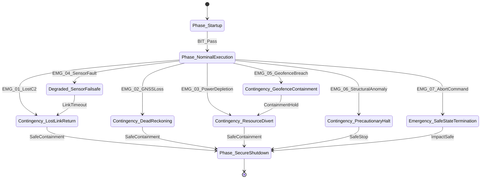

| Attribute | Value |
| :--- | :--- |
| **Title** | Concept of Operations (ConOps): {{SYSTEM_IDENTIFIER}} |
| **Version** | {{DOCUMENT_VERSION}} |
| **Date** | {{DOCUMENT_DATE}} |

# Concept of Operations (ConOps): {{SYSTEM_IDENTIFIER}}

## Table of Contents
- [1. Scope & System Identification](#1-scope--system-identification)
- [2. Current Situation & Deficiency Analysis (Predecessors)](#2-current-situation--deficiency-analysis-predecessors)
- [3. Proposed Capabilities & Trade-Offs (Pugh Decision Matrix)](#3-proposed-capabilities--trade-offs-pugh-decision-matrix)
- [4. Operational User Classes, Stakeholder Community & Systems Architecture](#4-operational-user-classes-stakeholder-community--systems-architecture)
- [5. Operational State Space & SORA 4D Volume Risk Assessment](#5-operational-state-space--sora-4d-volume-risk-assessment)
- [6. OMG UAF Operational Activity Taxonomy](#6-omg-uaf-operational-activity-taxonomy)
- [7. Operational Information Exchange (Op-Tx) Matrix](#7-operational-information-exchange-op-tx-matrix)
- [8. Operational Environments & MIL-STD-810H](#8-operational-environments--mil-std-810h)
- [9. Multi-Threaded Operational Scenarios & Timelines](#9-multi-threaded-operational-scenarios--timelines)
- [10. Maintenance & Sustainment Concepts (O/I/D Maintenance)](#10-maintenance--sustainment-concepts-oid-maintenance)
- [11. Operational Impacts, Limitations & Trade Studies](#11-operational-impacts-limitations--trade-studies)
- [12. 7-Row Emergency Decision & Contingency Matrix](#12-7-row-emergency-decision--contingency-matrix)

## 1. Scope & System Identification
- **System Identifier:** `{{SYSTEM_IDENTIFIER}}`
- **Operational Domain:** `{{OPERATIONAL_DOMAIN}}`
- **Operational Boundaries:** {{OPERATIONAL_BOUNDARIES}}
- **Stakeholder Roster:** {{STAKEHOLDER_ROSTER}}

## 2. Current Situation & Deficiency Analysis (Predecessors)
- **Current Operational Baseline:** {{CURRENT_OPERATIONAL_BASELINE}}
- **Operational Deficiencies:** {{OPERATIONAL_DEFICIENCIES}}

## 3. Proposed Capabilities & Trade-Offs (Pugh Decision Matrix)
- **Mission Drivers & Value Proposition:** {{MISSION_DRIVERS_AND_VALUE_PROPOSITION}}
- **Trade-Off Analysis:** {{TRADE_OFF_ANALYSIS}}

### 3.1 Pugh Decision Matrix & Architectural Sensitivity Analysis
$$
\begin{aligned}
S_j(w) &= \sum_{i=1}^{M} w_i \cdot c_{ij} \\
\sum_{i=1}^{M} w_i &= 1.0 \\
\frac{\partial S_j}{\partial w_i} &= c_{ij}
\end{aligned}
$$

| Evaluation Criterion | Weight (w_i) | Baseline (Datum) | Candidate Architecture A | Candidate Architecture B | Candidate Architecture C |
| :--- | :--- | :--- | :--- | :--- | :--- |
| Operational Reliability | {{WEIGHT_CRIT_1}} | 0 (Datum) | {{SCORE_A_1}} | {{SCORE_B_1}} | {{SCORE_C_1}} |
| Containment Response Latency | {{WEIGHT_CRIT_2}} | 0 (Datum) | {{SCORE_A_2}} | {{SCORE_B_2}} | {{SCORE_C_2}} |
| Lifecycle Maintenance Cost | {{WEIGHT_CRIT_3}} | 0 (Datum) | {{SCORE_A_3}} | {{SCORE_B_3}} | {{SCORE_C_3}} |
| **Weighted Total Score S_j(w)** | **1.00** | **0.00** | **{{WEIGHTED_SCORE_A}}** | **{{WEIGHTED_SCORE_B}}** | **{{WEIGHTED_SCORE_C}}** |

## 4. Operational User Classes, Stakeholder Community & Systems Architecture
- **User Classes & Stakeholder Taxonomy:** {{USER_CLASSES_AND_STAKEHOLDERS}}
- **Operational Lifecycle Modes across $\Phi_{\mathrm{lifecycle}}$:**
- **Phase_Startup:** {{PHASE_STARTUP_DESCRIPTION}}
- **Phase_NominalExecution:** {{PHASE_NOMINAL_EXECUTION_DESCRIPTION}}
- **Phase_DegradedMode:** {{PHASE_DEGRADED_MODE_DESCRIPTION}}
- **Phase_ContingencyFailsafe:** {{PHASE_CONTINGENCY_FAILSAFE_DESCRIPTION}}
- **Phase_SecureShutdown:** {{PHASE_SECURE_SHUTDOWN_DESCRIPTION}}
- **Phase_MaintenanceMode:** {{PHASE_MAINTENANCE_MODE_DESCRIPTION}}

### 4.7 Super-System Architecture
{{SUPER_SYSTEM_ARCHITECTURE}}

### 4.8 Subsystem Architecture
{{SUBSYSTEM_ARCHITECTURE_SECTION}}

## 5. Operational State Space & SORA 4D Volume Risk Assessment
$$
\begin{aligned}
V_{\mathrm{4D}} &= V_{\mathrm{SpatialGeometry}} \cup V_{\mathrm{ContingencyVolume}} \cup V_{\mathrm{GRB}} \\
R_{\mathrm{GRB}} &= h_{\mathrm{max}} \cdot \tan(\theta_{\mathrm{impact}}) + v_{\mathrm{wind,max}} \cdot \sqrt{\frac{2 h_{\mathrm{max}}}{g}} + d_{\mathrm{glide,max}}
\end{aligned}
$$

| Parameter | Symbol | Value | Units | Description |
| :--- | :--- | :--- | :--- | :--- |
| Max Altitude / Ceiling | h_max | {{H_MAX_M}} | m | Maximum operating ceiling above reference surface |
| Impact Angle | theta_impact | {{THETA_IMPACT_DEG}} | deg | Worst-case operational trajectory impact angle |
| Max Wind Speed | v_wind_max | {{V_WIND_MAX_MPS}} | m/s | Maximum operational wind speed limit |
| Gravitational Accel | g | {{G_ACCEL_MPS2}} | m/s^2 | Standard gravitational acceleration constant |
| Maximum Glide Distance | d_glide_max | {{D_GLIDE_MAX_M}} | m | Maximum unpowered lateral displacement margin |
| Ground Risk Buffer Radius | R_GRB | {{R_GRB_METERS}} | m | Declared ground risk buffer containment radius |
| Terminal Velocity | v_terminal | {{V_TERMINAL_MPS}} | m/s | Estimated unpowered descent terminal velocity |
| Impact Kinetic Energy | E_impact | {{E_IMPACT_JOULES}} | J | Kinetic energy at operational boundary impact |

## 6. OMG UAF Operational Activity Taxonomy
| Activity ID | Activity Name | Description | Gate 24 Allocation Tag |
| :--- | :--- | :--- | :--- |
| OA-01 | {{OA_ACTIVITY_NAME}} | {{OA_DESCRIPTION}} | `/// OperationalAllocation: [OA-01]` |

## 7. Operational Information Exchange (Op-Tx) Matrix
| Exchange ID | Source Node | Destination Node | Information Item | Data Rate | Max Latency | Criticality |
| :--- | :--- | :--- | :--- | :--- | :--- | :--- |
| OpTx-01 | {{OPTX_SOURCE_NODE}} | {{OPTX_DEST_NODE}} | {{OPTX_INFO_ITEM}} | {{OPTX_DATA_RATE}} | {{OPTX_MAX_LATENCY}} | {{OPTX_CRITICALITY}} |

## 8. Operational Environments & MIL-STD-810H
- **Ambient Temperature:** {{AMBIENT_TEMPERATURE_RANGE}}
- **Environmental Ingress:** {{ENVIRONMENTAL_INGRESS_RATING}}
- **Electromagnetic / RF Environment:** {{RF_ENVIRONMENT_CONSTRAINTS}}
- **Physical Spatial Constraints:** {{PHYSICAL_SPATIAL_CONSTRAINTS}}

## 9. Multi-Threaded Operational Scenarios & Timelines
- **Scenario 1 (Nominal Execution):** {{SCENARIO_NOMINAL_THREAD}}
- **Scenario 2 (Degraded Mode & Mitigation):** {{SCENARIO_DEGRADED_THREAD}}
- **Scenario 3 (Contingency Recovery):** {{SCENARIO_CONTINGENCY_THREAD}}

## 10. Maintenance & Sustainment Concepts (O/I/D Maintenance)
| Maintenance Level | Primary Facility | Scope of Work | Personnel Qualification | Authorized Spares / LRUs |
| :--- | :--- | :--- | :--- | :--- |
| O-Level (Organizational) | {{O_LEVEL_FACILITY}} | {{O_LEVEL_SCOPE}} | {{O_LEVEL_PERSONNEL}} | {{O_LEVEL_SPARES}} |
| I-Level (Intermediate) | {{I_LEVEL_FACILITY}} | {{I_LEVEL_SCOPE}} | {{I_LEVEL_PERSONNEL}} | {{I_LEVEL_SPARES}} |
| D-Level (Depot) | {{D_LEVEL_FACILITY}} | {{D_LEVEL_SCOPE}} | {{D_LEVEL_PERSONNEL}} | {{D_LEVEL_SPARES}} |

- **O-Level (Organizational):** {{O_LEVEL_MAINTENANCE_DESCRIPTION}}
- **I-Level (Intermediate):** {{I_LEVEL_MAINTENANCE_DESCRIPTION}}
- **D-Level (Depot):** {{D_LEVEL_MAINTENANCE_DESCRIPTION}}

## 11. Operational Impacts, Limitations & Trade Studies
- **Operational Impacts:** {{OPERATIONAL_IMPACTS}}
- **System Limitations:** {{SYSTEM_LIMITATIONS}}
- **Documented Trade Studies:** {{DOCUMENTED_TRADE_STUDIES}}

## 12. 7-Row Emergency Decision & Contingency Matrix
| Trigger ID | Contingency Trigger | Detection Mechanism | Automated Containment Action | Failsafe State | Max Response Time | HITL Role |
| :--- | :--- | :--- | :--- | :--- | :--- | :--- |
| `EMG-01` | {{EMG_TRIGGER_NAME}} | {{EMG_DETECTION_MECHANISM}} | {{EMG_CONTAINMENT_ACTION}} | `{{EMG_FAILSAFE_STATE}}` | {{EMG_MAX_RESPONSE_TIME}} | {{EMG_HITL_ROLE}} |
| `EMG-02` | {{EMG_TRIGGER_NAME}} | {{EMG_DETECTION_MECHANISM}} | {{EMG_CONTAINMENT_ACTION}} | `{{EMG_FAILSAFE_STATE}}` | {{EMG_MAX_RESPONSE_TIME}} | {{EMG_HITL_ROLE}} |
| `EMG-03` | {{EMG_TRIGGER_NAME}} | {{EMG_DETECTION_MECHANISM}} | {{EMG_CONTAINMENT_ACTION}} | `{{EMG_FAILSAFE_STATE}}` | {{EMG_MAX_RESPONSE_TIME}} | {{EMG_HITL_ROLE}} |
| `EMG-04` | {{EMG_TRIGGER_NAME}} | {{EMG_DETECTION_MECHANISM}} | {{EMG_CONTAINMENT_ACTION}} | `{{EMG_FAILSAFE_STATE}}` | {{EMG_MAX_RESPONSE_TIME}} | {{EMG_HITL_ROLE}} |
| `EMG-05` | {{EMG_TRIGGER_NAME}} | {{EMG_DETECTION_MECHANISM}} | {{EMG_CONTAINMENT_ACTION}} | `{{EMG_FAILSAFE_STATE}}` | {{EMG_MAX_RESPONSE_TIME}} | {{EMG_HITL_ROLE}} |
| `EMG-06` | {{EMG_TRIGGER_NAME}} | {{EMG_DETECTION_MECHANISM}} | {{EMG_CONTAINMENT_ACTION}} | `{{EMG_FAILSAFE_STATE}}` | {{EMG_MAX_RESPONSE_TIME}} | {{EMG_HITL_ROLE}} |
| `EMG-07` | {{EMG_TRIGGER_NAME}} | {{EMG_DETECTION_MECHANISM}} | {{EMG_CONTAINMENT_ACTION}} | `{{EMG_FAILSAFE_STATE}}` | {{EMG_MAX_RESPONSE_TIME}} | {{EMG_HITL_ROLE}} |

### 12.1 Failsafe State Transition Semantics & Timing Guarantees
$$
\begin{aligned}
P_{\mathrm{EMG-07}} > P_{\mathrm{EMG-03}} > P_{\mathrm{EMG-05}} > P_{\mathrm{EMG-06}} > P_{\mathrm{EMG-04}} > P_{\mathrm{EMG-02}} > P_{\mathrm{EMG-01}}
\end{aligned}
$$

- **Priority Invariant:** Higher priority contingency triggers preempt lower priority states unconditionally.
- **Deterministic Timing:** Maximum detection-to-actuation latency $t_{\mathrm{resp}} \le \tau_{\mathrm{deadline}}$ across all triggers.
- **Fail-Safe Retention:** Non-reentrant emergency containment locks until authorized manual ground reset.

### 12.2 Deterministic Emergency Statechart & State Machine

### 12.3 Degraded Modes & Fallback Hierarchy
- **Tier 1 (Nominal Execution):** Full multi-sensor fusion, dual-channel C2 links, and nominal envelope margins.
- **Tier 2 (Degraded Sensor Mode):** Single-sensor failure activates secondary observer and dead reckoning.
- **Tier 3 (Contingency Link Mode):** Loss of primary C2 link triggers autonomous hold and return sequence.
- **Tier 4 (Emergency Containment Mode):** Unrecoverable fault triggers ballistic containment deploy or instant power cutoff.

### 12.4 Human-in-the-Loop (HITL) Authority & Override Protocols
- **Supervisory Authority:** Operator retains positive manual override capability via independent emergency link.
- **Dual-Consent Authentication:** Critical emergency termination (`EMG-07`) requires two-operator verified consent keys.
- **Interlock Inhibit:** Safety computer rejects manual commands that violate dynamic geofence containment limits.

### 12.5 Autonomous Divert & Secondary Recovery Protocols
- **Primary Recovery:** Designated nominal operational site or recovery zone.
- **Secondary Divert Sites:** Pre-surveyed alternate recovery coordinates evaluated dynamically against Bingo energy.
- **Terrain Clearance:** All emergency divert trajectories maintain minimum statutory boundary separation.

### 12.6 Post-Emergency Containment, Latching & Reset Procedures
- **Safety Lockout:** Emergency shutdown latches all actuators and high-voltage buses in de-energized safe states.
- **Non-Volatile Blackbox Offload:** Diagnostic fault logs, sensor telemetry, and watchdog stack traces are securely written to non-volatile flash.
- **Authorized Ground Clearance:** Physical inspection and signed maintenance clearance required before clearing failsafe lock.
