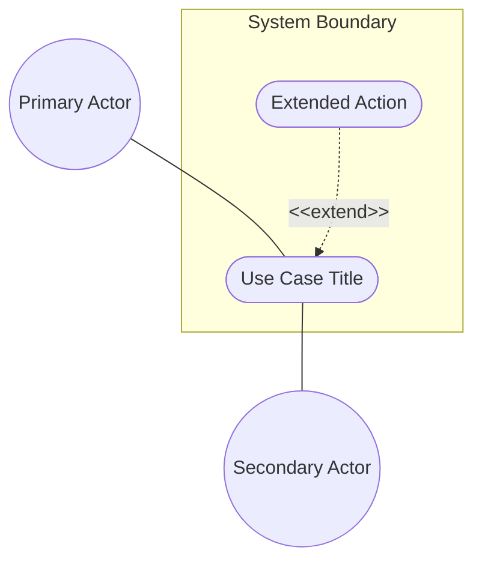
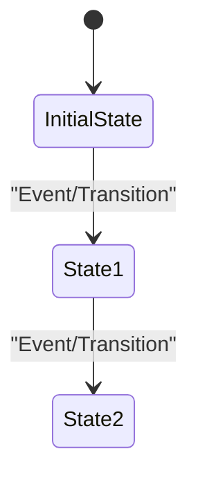

<!-- Copyright Gint Atkinson, gint.atkinson@gmail.com -->

---
name: spec-usecase-engineering
description: "Extracts formal UML System Use Cases derived directly from SysML v2 use case def AST nodes and normative specification documents using OOA/OOD methodology. Use when you need to derive Actors, Preconditions, Main Success Scenarios, and Realization Matrices linking Use Cases to User Stories and Features."
compatibility: "Requires issue tracker CLI and git. Works with modern agentic development environments."
metadata:
  title: "Specification Use Case Engineering (System Interaction)"
  category: architecture
  risk: low
  source: custom
  version: "2.0"
---

# Specification Use Case Engineering (System Interaction)

This skill enables a sub-agent to autonomously derive formal, UML OOA/OOD compliant System Use Cases (e.g., Alistair Cockburn style) directly from canonical SysML v2 `use case def` AST nodes and normative specification documents. In accordance with [`rules/sysml-ssot-completeness.md`](rules/sysml-ssot-completeness.md), SysML v2 is the 100% Single Source of Truth (SSOT). Heuristic prose interpretation without formal AST backing is strictly forbidden.

These Use Cases represent overarching system behavior, operational objectives, and state transitions, and they map down to granular User Stories and Features while feeding downstream Model-Based Design (MBD) and verification in the Primary Tier-1 Commercial Toolchain Context (MATLAB / Simulink / Stateflow / Embedded Coder).

## Execution Trigger
You should invoke this skill ONLY after the behavioral User Stories have been extracted using the `spec-user-story-engineering` skill.

## Step 1: Context Ingestion (SysML v2 AST & Normative Specs)
1. Ingest the canonical SysML v2 model (`.pipeline/schema.sysml`) and `.pipeline/schema-digest.json`.
2. Extract all formal `use case def` AST nodes within the SysML v2 packages, identifying:
   - `subject`: The subsystem or component (`part def`) realizing the use case.
   - `actor`: Primary initiating actors and secondary participating actors bound to typed ports.
   - `objective`: Operational goals, preconditions, and success criteria.
   - `include` / `extend`: Formal relationships connecting modular or conditional sub-use-cases.
3. Ingest the target normative specification document (specifically architectural chapters, deployment scenarios, and operational considerations) to enrich verbatim context without violating formal AST structural boundaries.

## Step 2: Isolated Use Case Modeling (Subagent Dispatch Loop)

1. **AST-Driven Use Case Identification:** Scan the SysML v2 model `use case def` blocks and structural schemas to identify all required System Use Cases (including mandatory behavioral triggers). **1:1 Container/Use Case Def Mapping Mandate:** Each distinct SysML `use case def` (or schema `container`/`choice`/`case`) MUST be extracted into its own separate Use Case file. Do NOT consolidate multiple use cases or containers into a single Use Case file. Compile the list of target Use Cases to be engineered.
2. **Dispatch Use Case Subagent:** For each identified Use Case, invoke a **new, fresh subagent with an isolated context**. Pass ONLY the specific `use case def` AST node, associated system interaction text, relevant User Stories, Feature specs, and the Use Case template. The subagent must have no visibility or knowledge of other Use Cases.
3. **Execution within Subagent Context:**
   - **Compliance Table Mandate:** Before writing the file, you MUST output a structured compliance table checking for system boundary subgraphs, external actors, and complete realization matrices.
   - **Formal AST-Driven Use Case Modeling:** Model a formal Use Case following standard UML Object-Oriented Analysis and Design (OOA/OOD) formats derived directly from SysML v2:
     - **Primary & Secondary Actors:** Derived from `actor` declarations on the SysML `use case def`, bound to typed ports/interfaces.
     - **Preconditions:** The exact state the system/objects must be in before the Use Case begins (mapped to `objective` preconditions and component `state def` states).
     - **Trigger:** The specific event or message that initiates the Use Case (mapped to port input flows).
     - **Main Success Scenario (Basic Flow):** The sequential, step-by-step object interactions that lead to a successful outcome. Steps must be clear and numbered.
     - **Alternate/Exception Flows:** Variations in state, error conditions, or alternative paths.
       - *Constraint-to-Flow Parity*: For each Use Case, identify all features referenced in the `Realization Matrix`. Read the `Validation & Constraints` sections of those features and count the total number of validation/negative constraints. You MUST generate a dedicated Alternate/Exception flow for **every single** validation constraint defined across those features.
       - *Minimum Floor*: If the total count of constraints across all referenced features is less than 2, you must still generate at least 2 Alternate/Exception flows as a minimum floor.
       - *Branching Point*: Each flow MUST explicitly identify which step of the Main Success Scenario it branches from.
       - *Flow Requirements*: Each flow must contain at least 2 numbered steps of system/actor interaction.
       - *Guarantees*: State the resulting state changes, rollback operations, or notifications.
     - **Postconditions (Success/Failure Guarantee):** The final guaranteed state of the system/objects. Define both a Success Guarantee and a Failure/Abort Guarantee.
     - **UML Diagrams**: Every Use Case MUST include:
       - *UML Use Case Diagram*: Illustrate system boundary, actors, relationships, and linkages. Group all use case nodes inside system boundary, place actors outside. Use case nodes must be stadium/oval shapes. Actor links must be undirected associations. Dotted/dashed arrows must use correct, parsable syntax.
       - *UML State Machine Diagram*: Show transition logic from preconditions to final postconditions.
       - Only UML diagrams are allowed.
    - **The Realization Matrix (User Story/Feature Linking):**
      - Determine which User Stories and Features are required to fulfill this specific System Use Case.
      - Construct a `## Realization Matrix` containing a markdown tasklist of these intersecting links referencing BOTH the Issue ID and the absolute URL. **CRITICAL: You MUST resolve the unique, specific Issue ID for EACH individual User Story and Feature. Do NOT use a single generic ID for all entries.**
      - **Issue ID Resolution Procedure:**
        1. *Feature Issue IDs*: Inspect the `Issue ID` row in the metadata table in the target `docs/features/feat-XX-name.md` file or query `gh issue list`.
        2. *User Story Issue IDs*: Inspect the `Issue ID` row in the metadata table in `docs/user-stories/us-XX-name.md` or query `gh issue list`.
        3. *Epic Issue IDs*: Inspect the `Issue ID` row in the metadata table in `docs/epics/epic-XX-name.md` or query `gh issue list`.
        4. *Prohibited Defaulting*: Using a single generic ID (e.g. `#0`, `#44`, `#N/A`, `#[StoryID]`) across multiple Realization Matrix entries is strictly prohibited. Each entry MUST reference its actual resolved Issue ID.
      - Every checklist item in the matrix MUST include a concise parenthetical justification explaining the semantic linkage.
   - **Tandem Elaboration & Zero Model Drift:** If during elaboration of alternate/exception flows or realization matrices, new interaction paths or structural dependencies are discovered, they MUST be reflected back into the SysML v2 model (`.pipeline/schema.sysml`) to preserve 100% bidirectional parity per `rules/sysml-ssot-completeness.md`.
    - **Formatting of Alphanumeric Identifiers & Math Expressions**: Ensure all requirement references, hazard tags, and SORA SAIL codes use standard bold text (`**SC-01**`, `**H-1**`, `**OSO-11**`) rather than inline LaTeX math mode (`$SC-01$`). Non-mathematical alphanumeric tokens must NEVER be wrapped in `$...$` math delimiters per `rules/latex-katex-integrity.md`.
    - **Pure Symbolic Mathematical Separation Rule**: When operational scenarios, safety boundaries, performance requirements, or system invariants involve mathematical equations:
      - Display math blocks (`$$ \begin{aligned} ... \end{aligned} $$`) MUST express **pure symbolic equations only**.
      - Strictly prohibit embedding physical unit macros (`\text{ ms}`, `\text{ kg}`, `\text{ m/s}`, etc.) inside display math equations.
      - Mandate that all physical values, numerical limits, operational constants, and engineering units are defined in the accompanying "Where and Operational Parameters:" text section immediately following the equation block.
      - Strictly prohibit dangling operators (such as `/` with no denominator) and unescaped underscores inside `\text{}` (mandating `\text{yaw-disturbance}` or structured subscripts like `\Delta v_{\text{yaw,dist}}`).
      - Multi-line aligned equations MUST use `\begin{aligned} ... \end{aligned}` inside `$$` delimiters on dedicated lines.
    - **Markdown Generation:** Write the Use Case as a local markdown file (e.g., `docs/use-cases/uc-01-register-core-entity.md`).
4. **Return Control:** The subagent completes the task and returns control to the worker agent.

## Step 4: Markdown Generation
Create a new file in `docs/use-cases/uc-[XX]-[name].md` (zero-padded, dash-separated, e.g., `uc-01-register-core-entity.md`).
> **Unified Slugification Mandate:** When generating filenames from titles (e.g., `uc-29-fiber-cable-and-strand-inventory.md`), you MUST preserve all stop-words (like 'and', 'the', 'of', etc.) consistently. Do NOT strip stop-words when converting titles to lowercase hyphen-separated slugs.

Format strictly:

````markdown
| Attribute | Specification Detail |
| :--- | :--- |
| **Issue ID** | #[IssueID] |
| **Title** | [Use Case Title] |
| **Type** | use-case |
| **Parent Epic** | #[EpicIssueID] - [Epic Title](../epics/epic-XX-name.md) |
| **Schema Containers** | `[SchemaContainerPath]` |
| **Generation Mode** | subagent |
| **Specification Source** | [schema/...](../../schema/...) |

# Use Case: [Title]

## Parent Epic
- [ ] #[EpicIssueID] - [Epic Title](../epics/epic-XX-name.md) (semantic linkage justification)

## 1. Actors
- **Primary Actor:** [Actor Name]
- **Secondary Actors:** [Actor Names]

## 2. Preconditions
- [Object/System State Precondition 1]
- [Object/System State Precondition 2]

## 3. Trigger
[The event or message that initiates the Use Case]

## 4. Main Success Scenario (Basic Flow)
1. [Actor] does [Action]
2. [System/Object] responds by [Action/State Change]
3. [Step 3...]

## 5. Alternate and Exception Flows
- **5a. [Condition] (Branches from Basic Flow step [X]):**
  1. [System/Object] does [Action]
  2. [System/Object] transitions to [State] and returns to step [Y] of the Main Success Scenario.
- **5b. [Exception] (Branches from Basic Flow step [X]):**
  1. [System/Object] detects [Error]
  2. [System/Object] aborts the transaction, rolls back [State], and notifies [Actor].

## 6. Postconditions (Guarantees)
- **Success Guarantee:** [Final Object/System State on success]
- **Failure Guarantee:** [Final Object/System State on failure/abort/rollback]

## UML Diagrams
### Use Case Diagram


### State Machine Diagram


## 7. Operational Context
[Verbatim deployment scenarios quoted from the specification]

### Mathematical Formulations & Safety Invariants (When Applicable)
$$
\begin{aligned}
T_{reaction} &\le T_{max,allowed} \\
D_{separation} &\ge D_{min,safe}
\end{aligned}
$$

Where and Operational Parameters:
- $T_{reaction}$: System reaction and failover response time.
- $T_{max,allowed}$: Maximum allowable latency limit (e.g. 50 ms).
- $D_{separation}$: Separation distance between vehicles.
- $D_{min,safe}$: Minimum required safety perimeter distance (e.g. 500 m).

## 8. Realization Matrix
### Required User Stories
- [ ] #[SpecificStoryIssueID] - [User Story Title](../user-stories/us-XX-name.md) (semantic linkage justification)
### Required Features
- [ ] #[SpecificFeatureIssueID] - [Feature Title](../features/feat-XX-name.md) (semantic linkage justification)

## Source References
Structural Schema: [Target Schema File](link-to-schema)
Normative Specification: [Normative Specification](link-to-specification)
````

> [!WARNING]
> **Mermaid Block Closing Constraints & Code Fence Integrity:**
> - Every Mermaid diagram MUST be strictly closed with ```` ``` ```` on a new line. Leaking Mermaid blocks (e.g. having headings like `##` inside an unclosed diagram) or stray/unclosed code fences will fail downstream validation checks.
> - Ensure there are no stray backticks or unmatched code fences in the document.
> - **All Mermaid syntax constraints are defined in `rules/platform-independence.md` and MUST be observed in full** — including the prohibition on semicolons in `Note` and message text, colons in class members and note strings, stereotypes on relationship lines, and curly braces in class member lines. Do not maintain a local subset here; subsets drift (issue #289).
> - **Universal Angle Bracket Escaping**: Unquoted `<` and `>` characters are strictly forbidden across ALL diagram types (graph TD, flowchart TD, sequenceDiagram, stateDiagram-v2). Transitions, labels, or guards containing comparison operators, brackets, or guards MUST enclose the label in double quotes.
> - **Use Case Node Label Quoting**: Mandate double quotes around graph TD/flowchart TD node labels containing slashes, colons, parentheses, or brackets (e.g. `Node["Save/Restore (Local DB)"]`).
> - **Subgraph Title Quoting**: Mandate double quotes around subgraph titles with spaces or hyphens (e.g. `subgraph "System Boundary"`).


> **Container Traceability:** Every Use Case MUST declare its schema container in the `Schema Containers` metadata attribute (e.g., `SystemModelDefinitions::AssembleAndVerifySubsystem`). Multi-container Use Cases are forbidden.


## Step 5: Zero-Fault Backlog Synchronization
1. **Mandatory Local Validation Gate:** Before committing, pushing, or creating issues in the backlog, the subagent MUST execute the local validation check:
   ```bash
   ./skills/spec-orchestrator/scripts/verify_model_coverage.py --spec-only --allow-missing-specs
   ```
   If the linter fails (returns a non-zero exit code), the subagent MUST parse the errors, fix all generated Use Case markdown files, and re-run the linter until it passes with exit code 0.
   Before committing the generated markdown files, the agent MUST run a check for untracked pipeline infrastructure files. If untracked files are found in `.pipeline/`, `skills/`, `rules/`, or `scripts/`, they must be staged and committed alongside the markdown files using `git add` to prevent remote divergence:
   ```bash
   UNTRACKED_INFRA=$(git ls-files --others --exclude-standard .pipeline/ skills/ rules/ scripts/)
   if [ -n "$UNTRACKED_INFRA" ]; then
     git add .pipeline/ skills/ rules/ scripts/
   fi
   ```
   Once the linter passes, commit and push the Markdown files to the remote repository.
2. Verify the `use-case` label exists in the tracker repository, bootstrapping it if necessary.
3. **Duplicate Detection:** Before creating, query the active tracker provider for all existing use case issues to check if an issue with an identical or semantically equivalent title already exists. If found, skip creation and reuse the existing Issue ID.
4. Register the Use Case issue natively with the active tracker provider.
   - **Crucial Verification & Body Synchronization:**
     1. Backlog issues MUST be registered using the deterministic title extraction step:
        ```bash
        TITLE=$(awk -F'|' '/**Title**/ {print $3}' <local-md-file> | xargs)
        gh issue create --title "$TITLE" --body-file <local-md-file>
        ```
        (to ensure they start with the full markdown content, including diagrams and references).
     2. Immediately after placeholder resolution (when the live issue ID is injected back into the file), the subagent MUST execute `gh issue edit <ID> --body-file <local-md-file>` to sync the resolved ID body.
     3. The subagent MUST run a post-creation verification check:
        `gh issue view <ID> --json body | python3 -c "import sys,json; b=json.load(sys.stdin)['body']; assert 'Source References' in b or 'References' in b, 'Body is a stub'"`
        and retry/halt if this verification fails.
5. Verify the creation and return the generated issue URLs/IDs to the Orchestrator or User.
