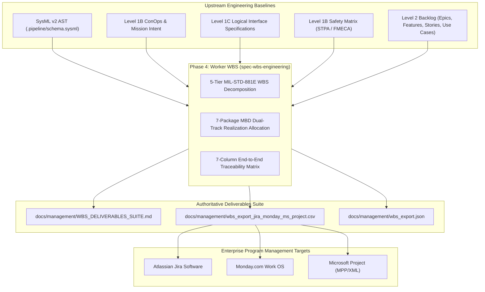
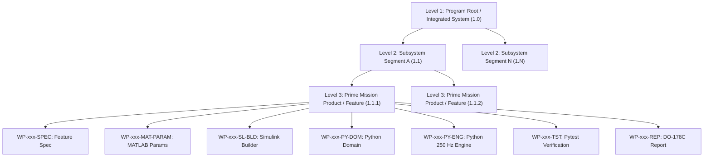
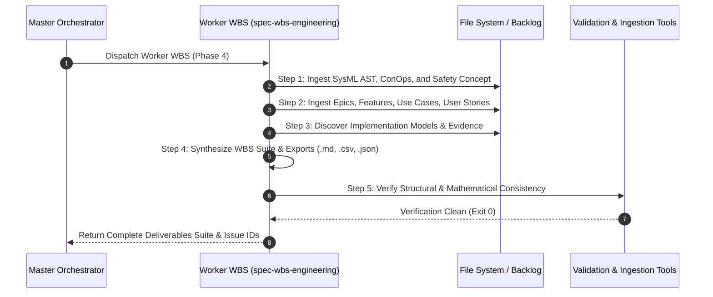

<!-- Copyright Gint Atkinson, gint.atkinson@gmail.com -->

---
name: spec-wbs-engineering
description: "Synthesizes MIL-STD-881E Work Breakdown Structures (WBS), Technical Realization Registers, and Enterprise Project Management Exports (Jira, Monday.com, MS Project CSV and JSON AST) from SysML AST, ConOps, Safety Matrices, and Agile Backlog items."
compatibility: "Requires issue tracker CLI and git. Works with modern agentic development environments."
metadata:
  title: "Work Breakdown Structure & Enterprise Realization Engineering (Worker WBS)"
  risk: medium
  source: custom
  version: "1.0"
---

# Work Breakdown Structure & Enterprise Realization Engineering (Worker WBS)

Use this skill as the single canonical workflow for transforming formal SysML v2 Abstract Syntax Trees (AST), Level 1B Concept of Operations (ConOps), Level 1C Logical Interface Specifications (ICD), Level 1B Safety Matrices (STPA / FMECA), and Level 2 Agile Backlog items (Epics, Features, BDD User Stories, Use Cases) into an authoritative, machine-verifiable **Level 4: Work Breakdown Structure (WBS), Technical Realization Register, and Multi-Platform Enterprise Project Management Export Suite**.

In accordance with **MIL-STD-881E** (Work Breakdown Structures for Defense Materiel Items), **INCOSE Systems Engineering Handbook v5.0**, [`rules/dual-track-mbd-verification.md`](../../rules/dual-track-mbd-verification.md), [`rules/sysml-ssot-completeness.md`](../../rules/sysml-ssot-completeness.md), and [`rules/tracker-source-of-truth.md`](../../rules/tracker-source-of-truth.md), the Work Breakdown Structure represents the product-oriented family tree division of hardware, software, services, data, and facilities resulting from systems engineering efforts.

Level 4 WBS & Enterprise Realization acts as the authoritative programmatic and technical execution bridge connecting abstract Model-Based Systems Engineering (MBSE) models with downstream software engineering deliverables, agile tracking issues, and enterprise program management toolchains. All control law, safety statechart, and physical estimation work packages integrate directly into the Primary Tier-1 Commercial Toolchain Context (**MATLAB / Simulink / Stateflow / Embedded Coder** for DO-178C C / SPARK Ada generation) paired with standalone 250 Hz deterministic Python digital twin simulation engines for license-free headless continuous integration (CI).

> [!TIP]
> This skill operates in the spirit of the `andrej-karpathy` methodology: focus deeply on the fundamentals, enforce exhaustive structural rigor, eliminate ambiguity across deliverables, and instrument all realization artifacts flawlessly into enterprise tracking systems.

---

## Closed-Loop Payload Verification Gate & Anti-Complacency Rule
- **Exit code 0 is NEVER sufficient proof of success.**
- After generating or publishing any WBS deliverable, enterprise export (`.csv` / `.json`), or tracker issue, the agent MUST run live payload inspection (`gh issue view <ID>` or `glab issue view <ID>`, or programmatic AST verification) to verify markdown table alignment, CSV header consistency, JSON schema validation, and cross-reference integrity.
- **Optimism bias is prohibited**: agents must cite empirical output of live payload inspection before declaring completion.

---

## Execution Trigger & Pipeline Sequencing

You should invoke this skill as **Phase 4 (Worker WBS - Work Breakdown Structure & Enterprise Realization Engineer)** within the Master Orchestrator lifecycle (`skills/spec-orchestrator/SKILL.md`):
- **Preceding Phases**:
  - Phase 0.5: `Normative Research Worker` (Ingests standards and creates Declared-Total Population Register)
  - Phase 0.75: `Worker ConOps` (Synthesizes Level 1B Hierarchical ConOps and Mission Intent trees)
  - Phase 1: `Structural Spec Worker` (Extracts Level 2 Epics and Features from SysML AST)
  - Phase 1.5: `Interface Spec Worker (Worker ICD)` (Synthesizes Level 1C Logical Interface Matrix and Signal Dictionary)
  - Phase 2: `Behavioral Spec Worker` (Generates Level 2 BDD User Stories)
  - Phase 3: `System Interaction Spec Worker` (Generates Level 2 UML Use Cases and Sequence Diagrams)
  - Implementation Phase: Dual-Track MBD synthesis and Pytest verification suites
- **Succeeding Phases**:
  - Enterprise Program Management Ingestion (Jira Software, Monday.com, Microsoft Project)
  - Earned Value Management System (EVMS) Cost/Schedule Baseline Tracking
  - Milestone Verification Gate Audits (SRR, PDR, CDR, TRR)



---

## 5-Tier WBS Decomposition Hierarchy

Adhering to **MIL-STD-881E** and **INCOSE SE Handbook v5.0**, the Worker WBS structures all engineering activities into an unambiguous 5-tier product-oriented decomposition hierarchy:



### Tier Definitions & Numerical Indexing

1. **Level 1: Program Root / Integrated System (`1.0`)**:
   - The top-level integrated product system boundary representing the complete mission solution.
   - Example: `1.0 Autonomous Digital Engineering Platform`.

2. **Level 2: Subsystem Segment Packages (`1.1` to `1.N`)**:
   - Major system segments, architectural packages, and functional subsystem partitions derived from SysML v2 `package` and `part def` subsystems.
   - Example: `1.1 Navigation & Guidance Subsystem`, `1.2 Flight Control Subsystem`, `1.3 Power & Propulsion Subsystem`.

3. **Level 3: Prime Mission Products / Domain Features (`1.1.1`, `1.1.2`, ...)**:
   - Independently testable functional capabilities and primary mission deliverables derived from Level 2 Features (`docs/features/feat-*.md`).
   - Example: `1.1.1 Inertial State Estimation & Sensor Fusion`, `1.1.2 Trajectory Waypoint Guidance`.

4. **Level 4/5: 7 Concrete Work Packages per Feature**:
   Every Level 3 Feature decomposes into exactly seven concrete, verifiable Work Packages (WPs) implementing the Dual-Track Model-Based Design (MBD) protocol per [`rules/dual-track-mbd-verification.md`](../../rules/dual-track-mbd-verification.md):

| Work Package Code | Deliverable Category | Target File Path | Primary Toolchain / Engine | Description & Quality Invariant |
| :--- | :--- | :--- | :--- | :--- |
| `WP-xxx-SPEC` | Feature Specification | `docs/features/feat-xxx-*.md` | Abstract Markdown / SysML AST | Authoritative functional definition, Given-When-Then BDD acceptance criteria, LUMI bindings, and SysML AST mapping. |
| `WP-xxx-MAT-PARAM` | MATLAB Plant Parameters | `models/matlab/*_params.m`, `*.sldd` | MATLAB / Simulink Data Dictionary | Physical plant constants, aerodynamic coefficients, sensor noise variances, and filter thresholds. |
| `WP-xxx-SL-BLD` | Simulink Model Synthesizer | `models/scripts/build_*_model.m`, `*.slx` | MATLAB / Stateflow / Embedded Coder | Programmatic builder script synthesizing native Simulink block diagrams and Stateflow charts configured for Embedded Coder DO-178C C / SPARK Ada synthesis. |
| `WP-xxx-PY-DOM` | Python Typed Domain Model | `models/python/*_domain.py` | Python 3.10+ Dataclasses & Enums | Strongly-typed domain state vectors, telemetry logs, commands, and enumerated state definitions. |
| `WP-xxx-PY-ENG` | Python 250 Hz Deterministic Engine | `models/python/*_engine.py` | Standalone Python Simulation Engine | License-free discrete-time simulation engine executing at dt = 0.004 s (250 Hz) with identical transition guards and algebraic dynamics. |
| `WP-xxx-TST` | Pytest Verification Suite | `tests/test_feat_*_simulation.py` | Pytest / Headless CI Runner | Automated headless CI test suite validating safety invariants, nominal control response, fault injections, and bounding envelope conditions. |
| `WP-xxx-REP` | Formal Simulation Results Report | `docs/reports/simulink_results/*_simulation_results.md` | DO-178C / DO-331 Verification | Formal simulation verification report documenting mathematical equivalence (error <= 1e-6), Monte Carlo dispersion results, and structural test evidence. |

---

## 7-Column End-to-End Traceability Matrix Schema

To satisfy **DO-178C Section 5.5**, **DO-331 Section MB.6.3**, and **CMMI Level 3 Requirements Management (REQM)**, the Worker WBS synthesizes the canonical 7-Column End-to-End Traceability Matrix:

```markdown
| SysML Component | Feature Spec | User Stories | MATLAB / Simulink Plant | Python 250 Hz Engine | Verification Suite | Simulation Evidence |
| :--- | :--- | :--- | :--- | :--- | :--- | :--- |
| `SysSSOT::NavSubsys` | [Feat-01](docs/features/feat-01-nav.md) | [US-01](docs/user-stories/us-01.md), [US-02](docs/user-stories/us-02.md) | `models/scripts/build_nav_model.m` | `models/python/nav_engine.py` | `tests/test_feat_01_nav.py` | [Nav Sim Report](docs/reports/simulink_results/FEAT-01_results.md) |
```

### Traceability Column Definitions & Verification Rules

1. **SysML Component**: Fully-qualified SysML v2 AST identifier (`<Package>::<Subsystem>::<Component>`) representing the structural Single Source of Truth (SSOT).
2. **Feature Spec**: Workspace-relative link to the Level 2 Feature specification (`docs/features/feat-*.md`).
3. **User Stories**: Comma-separated list of Level 2 BDD User Story specifications (`docs/user-stories/us-*.md`) realizing the feature.
4. **MATLAB / Simulink Plant**: Workspace-relative link to Track A programmatic builder (`models/scripts/build_*.m`) and parameter files (`models/matlab/*_params.m`).
5. **Python 250 Hz Engine**: Workspace-relative link to Track B standalone discrete digital twin engine (`models/python/*_engine.py`).
6. **Verification Suite**: Workspace-relative link to automated headless Pytest CI test harness (`tests/test_feat_*.py`).
7. **Simulation Evidence**: Workspace-relative link to formal DO-178C / DO-331 simulation results report (`docs/reports/simulink_results/*.md`).

### Mathematical & Discrete Equivalence Formulation

All work packages adhering to the dual-track strategy must maintain mathematical equivalence between continuous Simulink models and discrete Python engines:

$$
\begin{aligned}
\mathbf{x}_{k+1} &= \mathbf{x}_k + \Delta t \cdot \mathbf{f}(\mathbf{x}_k, \mathbf{u}_k) \\
\epsilon_{\mathrm{equiv}} &= \max_k \|\mathbf{x}_{\mathrm{Simulink}}[k] - \mathbf{x}_{\mathrm{DigitalTwin}}[k]\|_\infty \le 10^{-6}
\end{aligned}
$$

- Parameter Definitions & Engineering Units:
- $\mathbf{x}_k$: System state vector evaluated at discrete time step $k$.
- $\mathbf{u}_k$: System control input vector at discrete time step $k$.
- $\Delta t$: Discrete simulation sampling period ($\Delta t = 0.004\text{ s}$ for 250 Hz loop execution).
- $\mathbf{f}(\mathbf{x}_k, \mathbf{u}_k)$: Continuous or discrete state transition vector field.
- $\epsilon_{\mathrm{equiv}}$: Maximum state vector error between Track A and Track B implementations across identical initial conditions.

---

## Multi-Platform Enterprise Project Management Export & Import Rules

To support heterogeneous enterprise engineering environments, the Worker WBS generates synchronized exports for **Atlassian Jira Software**, **Monday.com Work OS**, and **Microsoft Project (MS Project)**.

### 1. Multi-Platform CSV Schema (`wbs_export_jira_monday_ms_project.csv`)

The export CSV file utilizes a unified, multi-platform column schema that maps directly to all three enterprise project management tools:

| Column Header | Data Type | Jira Software Field Mapping | Monday.com Field Mapping | MS Project Field Mapping | Description / Example |
| :--- | :--- | :--- | :--- | :--- | :--- |
| `WBS Code` | String | Custom Field: `WBS Code` | Text Column: `WBS Code` | `WBS` / `Outline Number` | Hierarchical numerical index (e.g., `1.1.1.4`). |
| `Task Name` | String | `Summary` | `Item Name` | `Task Name` | Concise deliverable title (e.g., `[WP-01-PY-ENG] Python 250 Hz Engine`). |
| `WBS Level` | Integer | Custom Field: `WBS Level` | Numbers Column: `Level` | `Outline Level` | Numeric hierarchy depth (1 to 5). |
| `Issue Type` | String | `Issue Type` (`Epic`, `Task`, `Sub-task`) | Type / Group Classification | Task Type / Milestone | Standard tracking issue taxonomy. |
| `Parent WBS` | String | `Parent` / `Epic Link` | Parent Item / Subitem link | `Predecessors` / Parent | WBS code of immediate parent node (e.g., `1.1.1`). |
| `Status` | String | `Status` | `Status` Column | `% Complete` / Status | `To Do`, `In Progress`, `Done`, `Fixed / Resolved`. |
| `Assignee` | String | `Assignee` | `Owner` / People Column | `Resource Names` | Responsible agent or engineering lead. |
| `Duration Days` | Float | `Original Estimate` (converted to hours) | Timeline / Numbers Column | `Duration` (e.g., `5d`) | Estimated engineering duration in standard working days. |
| `Dependencies` | String | `Issue Links (Blocks/Depends)` | Dependency Column | `Predecessors` (ID list) | Comma-separated list of predecessor WBS codes. |
| `Labels` | String | `Labels` (space or comma-delimited) | Tags Column | Text Column: `Tags` | Standard classification tags (e.g., `wbs,mbd,do-178c`). |
| `Artifact Path` | String | Custom Field: `Artifact URL` | Link Column: `Artifact` | Text Column: `Text1` | Workspace-relative path to concrete source or spec file. |
| `SysML Anchor` | String | Custom Field: `SysML SSOT` | Text Column: `SysML Anchor` | Text Column: `Text2` | Fully qualified SysML v2 AST component path. |
| `Toolchain Context` | String | Custom Field: `Toolchain` | Dropdown: `Toolchain` | Text Column: `Text3` | `MATLAB / Simulink` or `Python / Pytest`. |

### 2. Hierarchical JSON AST Schema (`wbs_export.json`)

The Worker WBS generates a machine-readable, fully resolved JSON Abstract Syntax Tree conforming to the following JSON schema:

```json
{
  "$schema": "https://json-schema.org/draft/2020-12/schema",
  "title": "WBS_Enterprise_Realization_AST",
  "type": "object",
  "required": ["metadata", "wbs_tree", "traceability_matrix"],
  "properties": {
    "metadata": {
      "type": "object",
      "required": ["program_title", "standard", "generated_at", "total_work_packages"],
      "properties": {
        "program_title": { "type": "string" },
        "standard": { "type": "string", "enum": ["MIL-STD-881E"] },
        "generated_at": { "type": "string", "format": "date-time" },
        "total_work_packages": { "type": "integer", "minimum": 1 }
      }
    },
    "wbs_tree": {
      "type": "object",
      "required": ["wbs_code", "name", "level", "children"],
      "properties": {
        "wbs_code": { "type": "string" },
        "name": { "type": "string" },
        "level": { "type": "integer", "enum": [1] },
        "children": {
          "type": "array",
          "items": { "$ref": "#/$defs/wbs_node" }
        }
      }
    },
    "traceability_matrix": {
      "type": "array",
      "items": {
        "type": "object",
        "required": [
          "sysml_component",
          "feature_spec",
          "user_stories",
          "matlab_simulink_plant",
          "python_250hz_engine",
          "verification_suite",
          "simulation_evidence"
        ],
        "properties": {
          "sysml_component": { "type": "string" },
          "feature_spec": { "type": "string" },
          "user_stories": { "type": "array", "items": { "type": "string" } },
          "matlab_simulink_plant": { "type": "string" },
          "python_250hz_engine": { "type": "string" },
          "verification_suite": { "type": "string" },
          "simulation_evidence": { "type": "string" }
        }
      }
    }
  },
  "$defs": {
    "wbs_node": {
      "type": "object",
      "required": ["wbs_code", "name", "level"],
      "properties": {
        "wbs_code": { "type": "string" },
        "name": { "type": "string" },
        "level": { "type": "integer", "minimum": 2, "maximum": 5 },
        "wp_type": { "type": "string" },
        "artifact_path": { "type": "string" },
        "sysml_anchor": { "type": "string" },
        "toolchain_context": { "type": "string" },
        "dependencies": { "type": "array", "items": { "type": "string" } },
        "children": {
          "type": "array",
          "items": { "$ref": "#/$defs/wbs_node" }
        }
      }
    }
  }
}
```

---

## Step-by-Step Execution Workflow



### Step 1: Ingest System Root, ConOps, and Safety Baselines
1. Ingest `.pipeline/schema.sysml` and `.pipeline/schema-digest.json` to establish the root system boundary (`1.0`) and Level 2 subsystem packages (`1.1` to `1.N`).
2. Ingest `docs/conops/CONOPS.md` and `docs/conops/MISSION_INTENT.md` to map high-level operational lifecycle stages and mission essential tasks.
3. Ingest `docs/safety/STPA_MATRIX.md` to identify safety constraints and fault tolerance invariants allocated to each subsystem.

### Step 2: Ingest Epics, Features, Use Cases, and User Stories
1. Scan `docs/epics/` to extract Level 2 Subsystem packages and their associated backlog issue IDs.
2. Scan `docs/features/` to extract all Level 3 Domain Features, acceptance criteria, and SysML container paths.
3. Scan `docs/user-stories/` and `docs/use-cases/` to establish requirement-to-story realization mappings.

### Step 3: Discover Implementation Models & Verification Evidence
1. Scan `models/matlab/` and `models/scripts/` for Track A MATLAB parameters and Simulink builder scripts.
2. Scan `models/python/` for Track B strongly-typed domain models and 250 Hz simulation engines.
3. Scan `tests/` for automated Pytest verification suites.
4. Scan `docs/reports/simulink_results/` for formal DO-178C / DO-331 verification evidence reports.

### Step 4: Synthesize Deliverables Suite
Generate the three canonical Level 4 engineering deliverables:
1. `docs/management/WBS_DELIVERABLES_SUITE.md`:
   - Prepend native CommonMark 2-column Metadata Table per `rules/specification-metadata-integrity.md`.
   - Document complete 5-tier WBS hierarchy in formatted markdown outline with work package descriptions.
   - Embed complete 7-Column End-to-End Traceability Matrix.
2. `docs/management/wbs_export_jira_monday_ms_project.csv`:
   - Generate RFC 4180 compliant CSV export with proper escaping and exact 13-column schema.
3. `docs/management/wbs_export.json`:
   - Generate validated JSON AST matching the formal schema.

### Step 5: Verify Structural & Mathematical Consistency
1. Assert 100% Feature Coverage: Every Level 3 Feature MUST contain all 7 concrete work packages.
2. Assert 0 Orphaned Work Packages: Every work package must link to an existing file or a documented scheduled task.
3. Assert Directed Acyclic Graph (DAG) Integrity: Predecessor dependency links in CSV and JSON must form a valid DAG with zero cyclical deadlocks.
4. Assert Discrete Equivalence Invariant: Mathematical error between Simulink and Python twins must satisfy $\epsilon_{\mathrm{equiv}} \le 10^{-6}$.

---

## Standardized Level 4 Markdown Artifact Structure

All Level 4 WBS suite documents reside in `docs/management/` and MUST begin at lines 1–10 with a native CommonMark two-column Metadata Table per `rules/specification-metadata-integrity.md`.

```markdown
| Attribute | Specification Detail |
| :--- | :--- |
| **Issue ID** | #[IssueID] |
| **Title** | Work Breakdown Structure & Enterprise Realization Suite |
| **Type** | management |
| **Management Level** | Level 4 Enterprise Realization |
| **Standard Baseline** | MIL-STD-881E / INCOSE SEH v5.0 |
| **Generation Mode** | subagent |
| **Specification Source** | [schema/model.sysml](../../schema/model.sysml) |

# Level 4: Work Breakdown Structure & Enterprise Realization Suite

## 1. Executive Summary & Program Baseline
[High-level overview of system boundary, MIL-STD-881E decomposition, and realization strategy.]

## 2. 5-Tier WBS Hierarchical Breakdown Outline
### 1.0 System Root
#### 1.1 Subsystem Segment A
##### 1.1.1 Feature 1
- `WP-01-SPEC`: Feature Specification (`docs/features/feat-01.md`)
- `WP-01-MAT-PARAM`: MATLAB Parameters (`models/matlab/feat_01_params.m`)
- `WP-01-SL-BLD`: Simulink Builder (`models/scripts/build_feat_01_model.m`)
- `WP-01-PY-DOM`: Python Domain Model (`models/python/feat_01_domain.py`)
- `WP-01-PY-ENG`: Python 250 Hz Engine (`models/python/feat_01_engine.py`)
- `WP-01-TST`: Pytest Verification (`tests/test_feat_01.py`)
- `WP-01-REP`: DO-178C Results Report (`docs/reports/simulink_results/FEAT-01_results.md`)

## 3. 7-Column End-to-End Traceability Matrix
| SysML Component | Feature Spec | User Stories | MATLAB / Simulink Plant | Python 250 Hz Engine | Verification Suite | Simulation Evidence |
| :--- | :--- | :--- | :--- | :--- | :--- | :--- |
| `SysSSOT::SubsystemA` | [Feat-01](docs/features/feat-01.md) | [US-01](docs/user-stories/us-01.md) | `models/scripts/build_feat_01_model.m` | `models/python/feat_01_engine.py` | `tests/test_feat_01.py` | [Report](docs/reports/simulink_results/FEAT-01_results.md) |

## 4. Multi-Platform Enterprise Export Summary
- **CSV Export**: `docs/management/wbs_export_jira_monday_ms_project.csv`
- **JSON AST Export**: `docs/management/wbs_export.json`

## 5. Source References
Structural Schema: `schema/model.sysml`
Normative Specification: [MIL-STD-881E Standard Reference](https://quicksearch.dla.mil/qsDocDetails.aspx?ident_number=205346)
```

---

## Strict Architectural Invariants & Formatting Rules

The Worker WBS must strictly enforce the following repository invariants:

### 1. Pure Schema AST Derivation Mandate
- All subsystem boundaries, segment codes, and feature allocations must derive directly from the parsed SysML v2 AST (`package`, `part def`, `item def`).
- Zero hallucination of undeclared subsystems or unallocated features is permitted.

### 2. Zero Unicode Em Dash Invariant (`\u2014`)
- Strictly prohibit Unicode em dashes (`\u2014`) across all generated markdown, CSV, JSON, and test files.
- Use standard ASCII double hyphens `--` or single hyphens `-` for prose dashes and ranges.

### 3. LaTeX & KaTeX Mathematical Rendering Integrity
Per [`rules/latex-katex-integrity.md`](../../rules/latex-katex-integrity.md):
- **Pure Symbolic Display Math**: All display math blocks must use `$$ \begin{aligned} ... \end{aligned} $$` on dedicated newlines expressing pure symbolic relations only.
- **Prohibition of Embedded Physical Unit Macros**: Embedding physical unit macros (e.g. `\text{ ms}`, `\text{ kg}`, `\text{ m/s}`, `\text{ Hz}`) inside display math equations is strictly prohibited.
- **Mandatory "Parameter Definitions & Engineering Units" Section**: All physical values, numerical limits, constants, and engineering units must be defined in the accompanying text immediately following the display math block.
- **Markdown Table Math Prohibition**: Strictly prohibit `$ ... $` and `$$ ... $$` math delimiters inside Markdown table headers, delimiter rows, and data cells. Use plain text and standard Unicode characters (e.g. `dt = 0.004 s`, `tol <= 1e-6`, `Δt`, `λ`, `≥`, `≤`).

### 4. Mermaid Diagram Integrity
Per [`rules/platform-independence.md`](../../rules/platform-independence.md):
- The first non-comment line inside EVERY Mermaid code fence (` ```mermaid `) MUST declare a valid diagram header (`flowchart TD`, `classDiagram`, `stateDiagram-v2`, `sequenceDiagram`).
- Every Mermaid block must be strictly closed with ```` ``` ```` on a new line.
- Enclose node labels and transitions containing slashes, colons, parentheses, brackets, or comparisons in double quotes.
- Unquoted `<` and `>` characters are strictly forbidden across all diagram types.

---

## Local Validation & Backlog Synchronization

1. **Mandatory Local Validation Check**:
   Before committing, pushing, or registering tracker issues, the Worker WBS MUST execute local repository verification:
   ```bash
   python3 tests/test_no_emdash_integrity.py
   python3 -m unittest discover -s tests -p "test_*.py"
   ```

2. **Untracked Infrastructure Pre-Commit Check**:
   Check for untracked pipeline infrastructure files before committing:
   ```bash
   UNTRACKED_INFRA=$(git ls-files --others --exclude-standard .pipeline/ skills/ rules/ scripts/)
   if [ -n "$UNTRACKED_INFRA" ]; then
     git add .pipeline/ skills/ rules/ scripts/
   fi
   ```

3. **Tracker Label Bootstrapping**:
   Verify the `wbs` label exists in the configured tracker provider:
   - GitHub: `gh label create wbs --color 0e8a16 --description "Level 4 Work Breakdown Structure & Enterprise Realization" --force`
   - GitLab: `glab label create --name "type::wbs" --color "#0E8A16" --description "Level 4 Work Breakdown Structure & Enterprise Realization"`

4. **Idempotent Issue Registration**:
   - Query the active tracker provider to check if a WBS suite issue already exists. If found, skip creation and reuse the existing Issue ID.
   - Register the WBS issue using deterministic title extraction:
     ```bash
     TITLE=$(awk -F'|' '/**Title**/ {print $3}' docs/management/WBS_DELIVERABLES_SUITE.md | xargs)
     gh issue create --title "$TITLE" --body-file docs/management/WBS_DELIVERABLES_SUITE.md --label "wbs"
     ```
   - Immediately inject the resolved live Issue ID back into the metadata table line of the local markdown file.

5. **Commit & Push**:
   - Stage and commit generated artifacts:
     ```bash
     git add skills/spec-wbs-engineering/ docs/management/
     git commit -m "feat(wbs): synthesize Level 4 Work Breakdown Structure and Enterprise Realization suite"
     git push
     ```
   - Report completion and generated artifact links back to the Master Orchestrator.
