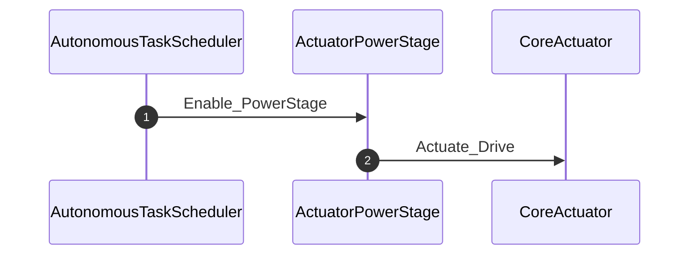

# Actuator Control Use Case

## Autonomous Actuation Sequence

```mermaid
sequenceDiagram
    autonumber
    participant Scheduler as AutonomousTaskScheduler
    participant PowerStage as ActuatorPowerStage
    participant Actuator as CoreActuator

    Scheduler ->> PowerStage: Enable_PowerStage
    PowerStage ->> Actuator: Actuate_Drive
```
