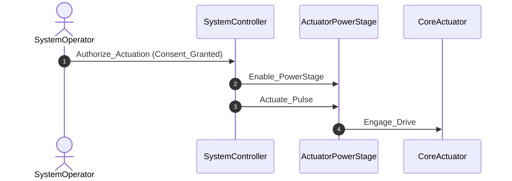

# Actuator Control Use Case

## Human Authorized Actuation Sequence

```mermaid
sequenceDiagram
    autonumber
    actor Operator as SystemOperator
    participant Controller as SystemController
    participant PowerStage as ActuatorPowerStage
    participant Actuator as CoreActuator

    Operator ->> Controller: Authorize_Actuation (Consent_Granted)
    Controller ->> PowerStage: Enable_PowerStage
    Controller ->> PowerStage: Actuate_Pulse
    PowerStage ->> Actuator: Engage_Drive
```
